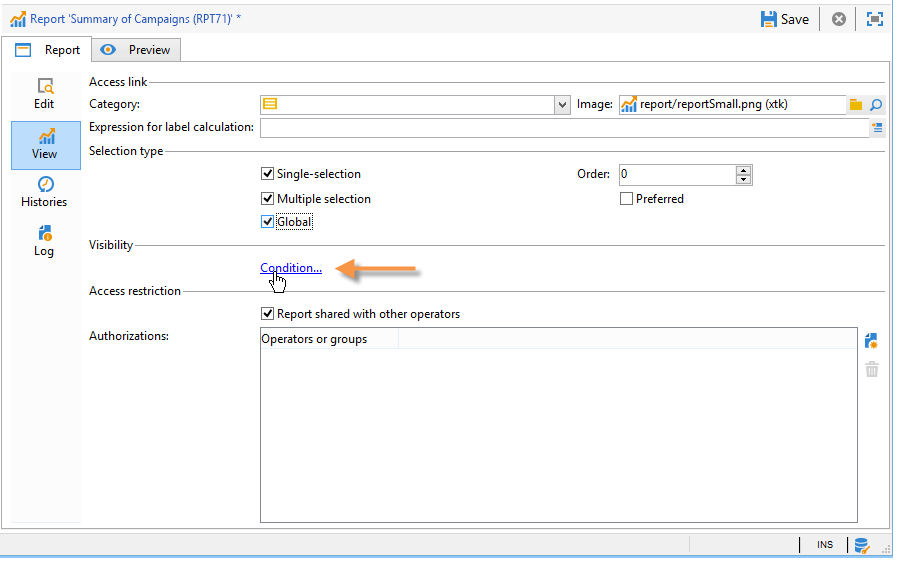
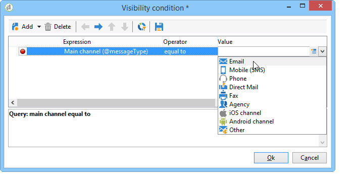
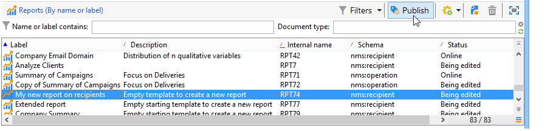

# 設定報告存取權{#configuring-access-to-the-report}

## 報表顯示內容 {#report-display-context}

使用在Adobe Campaign平台中定義報告的顯示內容 **[!UICONTROL Display]** 標籤。 對報告的存取權取決於其選擇型別、顯示條件和存取授權。

### 選取類型 {#selection-type}

報表的存取權可限制在特定內容或優惠方案空間，例如，傳送、收件者、選定的收件者等。 此存取權設定於 **[!UICONTROL Selection type]** 部分 **[!UICONTROL Display]** 標籤。

* **[!UICONTROL Single selection]** ：只有在選取特定實體時，才能存取報表。
* **[!UICONTROL Multiple selection]** ：選取數個實體時，可存取報表。
* **[!UICONTROL Global]** ：報表可透過以下連結中的可用報表清單存取： **[!UICONTROL Reports]** 標籤。

### 顯示順序 {#display-sequence}

此 **[!UICONTROL Sequence]** 欄位可讓您輸入數值，指定報表在清單中的顯示順序。

依預設，報表會依相關性顯示：在此欄位中輸入的值可讓您從相關的最高（最高值）排序至最低（最低值）的報表。

您可以根據需求選取要使用的比例：1到10、0到100、-10到10等。

### 顯示條件 {#display-conditions}

您也可以透過查詢來設定報表顯示的條件。

在以下範例中，如果主要行銷活動頻道為電子郵件，則會顯示報表。

這表示如果行銷活動的主要頻道是直接郵件，則行銷活動報表中將不會提供該報表。

### 存取授權 {#access-authorization}

此報告可與其他操作者共用。

若要讓報表可供存取，請選取 **[!UICONTROL Report shared with other operators]** 選項。 如果未選取此選項，則只有建立報告的操作員才能存取報告。

您也可以透過授權視窗，與特定的操作員或操作員群組共用該報表。

### 定義篩選選項 {#defining-the-filtering-options}

此 **[!UICONTROL Reports]** 索引標籤會顯示平台中所有可用的報告，且已連線的運運算元具有存取許可權。

預設會依相關性排序，但您可以套用其他型別的篩選器：字母順序、年齡等。

您也可以根據報告類別來篩選顯示：

若要定義報表的類別，請透過 **[!UICONTROL Display]** 標籤，如下所示：

您可以在此處輸入新類別，並將其新增至可用類別清單。 相符的列舉會自動更新。

## 建立指向報告的連結 {#creating-a-link-to-a-report-}

報表可透過樹狀結構的特定節點（例如清單、收件者、傳遞等）供存取。 要執行此操作，只需建立相關報告的連結，並指定您想使其可用的實體。

例如，我們將建立報表連結，使其可透過收件者清單存取。

1. 按一下 **[!UICONTROL New]** 並選取 **[!UICONTROL Create a link to an existing report]** 在報告建立精靈中。

   

1. 使用下拉式清單選取您要建立連結的報告。 在此範例中，我們將選取 **依國家/地區劃分** 報告。

   

1. 輸入標籤並選取結構描述。 在此範例中，我們將選取收件者清單表格。

   

   這表示可透過任何收件者清單存取報告，且統計資料將會涉及所選清單中的收件者。

1. 儲存並顯示您的報告。
1. 輸入連結索引鍵。 在此情況下，&#39;資料夾&#39;連結的外部索引鍵。

   

1. 發佈您的報告。
1. 前往您的其中一個收件者清單，然後按一下 **[!UICONTROL Reports]** 連結：您剛建立的報告可供存取。

   

## 報告預覽 {#preview-of-the-report}

發佈報表之前，請確定報表是否正確顯示在 **[!UICONTROL Preview]** 標籤。

若要顯示報表預覽，請選取 **[!UICONTROL Global]** 或 **[!UICONTROL Selection]** 選項。

這兩個選項是根據報表的顯示設定來選取。 如果顯示設定為 **[!UICONTROL Global]**，您必須選取 **[!UICONTROL Global]** 預覽選項。 如果顯示設定為 **[!UICONTROL Single selection]** 或 **[!UICONTROL Multiple selection]**，則 **[!UICONTROL Selection]** 必須選取預覽選項。

有關詳細資訊，請參閱 [報表顯示內容](#report-display-context).

特定設定可讓您控制錯誤。 此 **_uuid** 可在報表的URL中找到設定。 您可以新增 **&amp;預覽** 或 **&amp;_debug** 設定。

若要進一步瞭解這些設定，請參閱 **定義網頁表單屬性** 部分 [網路表單](../../web/using/about-web-forms.md) 章節。

## 發佈報表 {#publishing-the-report}

發佈報表是必要的，以便與其他運運算元共用報表並在可用報表清單中顯示它們(也請參閱 [報表顯示內容](#report-display-context))。 每次變更報表時，都必須再次執行此作業。

1. 按一下以開啟發佈精靈 **[!UICONTROL Publish]** （在工具列中）。

   

1. 按一下 **[!UICONTROL Start]** 以發佈。

   

1. 按一下 **[!UICONTROL Enlarge]** 圖示以在網頁瀏覽器中開啟報表。
