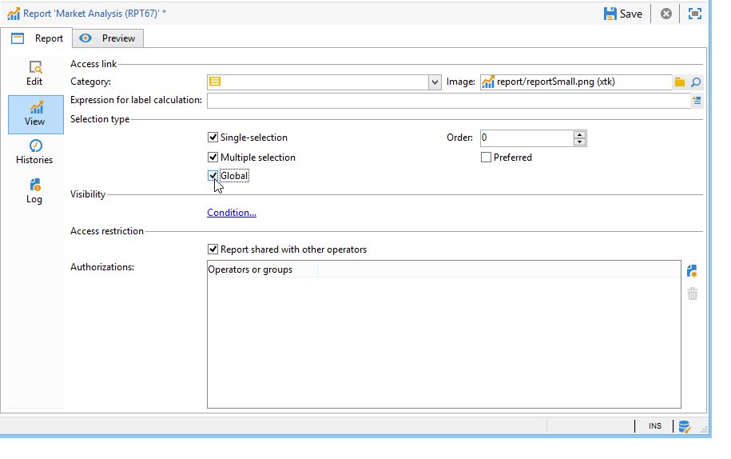

# 設定報表存取權{#configuring-access-to-the-report}

## 報表顯示內容 {#report-display-context}

使用&#x200B;**[!UICONTROL Display]**&#x200B;標籤，定義Adobe Campaign平台中報表的顯示內容。 報表的存取取決於其選擇類型、顯示條件和存取授權。

### 選擇類型 {#selection-type}

報表的存取權限可限於特定內容或選件空間，例如傳送、收件者、收件者選擇等。 此訪問在&#x200B;**[!UICONTROL Display]**&#x200B;頁簽的&#x200B;**[!UICONTROL Selection type]**&#x200B;部分中配置。

* **[!UICONTROL Single selection]** :只有選取特定實體時，才可存取報表。
* **[!UICONTROL Multiple selection]** :選取多個實體時，即可存取報告。
* **[!UICONTROL Global]** :報表可透過索引標籤中可用報表的清單來 **[!UICONTROL Reports]** 存取。

### 顯示順序 {#display-sequence}

**[!UICONTROL Sequence]**&#x200B;欄位可讓您輸入數值，指定清單中報表的顯示順序。

依預設，報表會依關聯性顯示：在此欄位中輸入的值可讓您將報表從最高（最高）值排序至最低（最小）相關值。

您可以根據需求選取要使用的規模：1至10、0至100、-10至10等

### 顯示條件 {#display-conditions}

您也可以透過查詢來限制報表的顯示。

在下列範例中，如果主要促銷活動管道是電子郵件，則會顯示報表。

這表示，如果促銷活動的主要管道是直接郵件，則促銷活動報表中將無法使用該報表。

### 訪問授權 {#access-authorization}

報表可與其他運算子共用。

若要讓報表可供存取，請選取&#x200B;**[!UICONTROL Report shared with other operators]**&#x200B;選項。 如果未選取此選項，則只有建立報表的運算子才能存取報表。

報告還可以與通過授權窗口添加的特定操作員或操作員組共用。

### 定義篩選選項 {#defining-the-filtering-options}

**[!UICONTROL Reports]**&#x200B;索引標籤會顯示平台中所有可用的報表，且已連線運算子對其具有存取權限。

依預設，它們會依關聯性排序，但您可以套用其他類型的篩選器：按字母順序，按年齡等

您也可以根據報表類別來篩選顯示畫面：

若要定義報表的類別，請透過&#x200B;**[!UICONTROL Display]**&#x200B;標籤選取，如下所示：

您可以在此處輸入新類別，並將其新增至可用類別清單。 匹配的枚舉會自動更新。

## 建立報表連結 {#creating-a-link-to-a-report-}

您可以透過樹狀結構的特定節點（例如清單、收件者、傳送等）存取報表。 要執行此操作，只需建立相關報表的連結，並指定您要讓其可用的實體。

例如，我們將建立報表連結，以便透過收件者清單存取。

1. 按一下&#x200B;**[!UICONTROL New]**&#x200B;並在報表建立精靈中選取&#x200B;**[!UICONTROL Create a link to an existing report]**。

   

1. 使用下拉式清單選取您要建立連結的報表。 在此範例中，我們將選取「**依國家/地區劃分**」報表。

   

1. 輸入標籤並選擇架構。 在此範例中，我們將選取收件者清單表格。

   

   這表示報表可透過任何收件者清單存取，而統計資料將與所選清單中的收件者有關。

1. 儲存和顯示您的報表。
1. 輸入連結鍵。 在這種情況下，「資料夾」連結的外鍵。

   

1. 發佈您的報表。
1. 前往其中一個收件者清單，然後按一下&#x200B;**[!UICONTROL Reports]**&#x200B;連結：您可以存取您剛建立的報表。

   

## 報表預覽 {#preview-of-the-report}

發佈報表之前，請確定報表正確顯示在&#x200B;**[!UICONTROL Preview]**&#x200B;標籤中。

若要顯示報表的預覽，請選取&#x200B;**[!UICONTROL Global]**&#x200B;或&#x200B;**[!UICONTROL Selection]**&#x200B;選項。

系統會根據報表的顯示設定選取這兩個選項。 如果顯示設定為&#x200B;**[!UICONTROL Global]**，則需要選擇&#x200B;**[!UICONTROL Global]**&#x200B;預覽選項。 如果顯示設定為&#x200B;**[!UICONTROL Single selection]**&#x200B;或&#x200B;**[!UICONTROL Multiple selection]**，則必須選擇&#x200B;**[!UICONTROL Selection]**&#x200B;預覽選項。

如需詳細資訊，請參閱[報表顯示內容](#report-display-context)。

特定設定可讓您控制錯誤。 在報表的URL中找到&#x200B;**_uuid**&#x200B;設定。 您可以新增&#x200B;**&amp;_preview**&#x200B;或&#x200B;**&amp;_debug**&#x200B;設定。

若要深入了解這些設定，請參閱[Web表單](../../web/using/about-web-forms.md)章節的&#x200B;**定義Web表單屬性**&#x200B;區段。

## 發佈報表 {#publishing-the-report}

必須發佈報表，才能與其他運算子共用，並在可用報表清單中顯示這些報表（另請參閱[報表顯示內容](#report-display-context)）。 每次變更報表時，都必須再次執行此操作。

1. 按一下工具列中的&#x200B;**[!UICONTROL Publish]**&#x200B;以開啟發佈精靈。

   

1. 按一下&#x200B;**[!UICONTROL Start]**&#x200B;以發佈。

   

1. 按一下&#x200B;**[!UICONTROL Enlarge]**&#x200B;圖示，在網頁瀏覽器中開啟報表。
