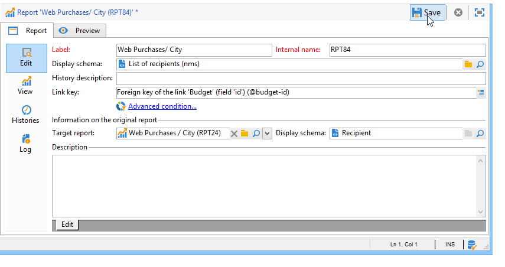

# 設定報表存取權{#configuring-access-to-the-report}

## 報表顯示內容{#report-display-context}

使用&#x200B;**[!UICONTROL Display]**&#x200B;標籤定義Adobe Campaign平台中報表的顯示內容。 報表的存取權視其選擇類型、顯示條件及存取授權而定。

### 選擇類型{#selection-type}

對報表的存取權限可限定為特定內容或選件空間，例如傳送、收件者、選擇的收件者等。 此訪問在&#x200B;**[!UICONTROL Display]**&#x200B;頁籤的&#x200B;**[!UICONTROL Selection type]**&#x200B;部分中配置。

* **[!UICONTROL Single selection]** :只有在選取特定實體時，才可存取報表。
* **[!UICONTROL Multiple selection]** :選取數個實體時，即可存取報表。
* **[!UICONTROL Global]** :報表可透過標籤中可用報表的清單存 **[!UICONTROL Reports]** 取。

### 顯示序列{#display-sequence}

**[!UICONTROL Sequence]**&#x200B;欄位可讓您輸入數值，指定清單中報表的顯示順序。

依預設，報表會依相關性顯示：在此欄位中輸入的值可讓您將報表從最高（最高值）排序至最小（最小值）相關。

您可以根據需求選擇要使用的比例：1到10、0到100、-10到10等。

### 顯示條件{#display-conditions}

您也可以透過查詢來限制報表的顯示。

在下列範例中，如果主要促銷活動渠道是電子郵件，則會顯示報表。

這表示如果促銷活動的主渠道是直接郵件，則促銷活動報表中將無法使用報表。

### 訪問授權{#access-authorization}

報表可與其他運算子共用。

若要讓報表可存取，請選取&#x200B;**[!UICONTROL Report shared with other operators]**&#x200B;選項。 如果未選取此選項，則只有建立報表的運算子才能存取報表。

您也可以將報表共用給透過授權視窗新增的特定運算元或運算元群組。

### 定義篩選選項{#defining-the-filtering-options}

**[!UICONTROL Reports]**&#x200B;標籤會顯示平台中所有可用的報表，且連線的運算子具有存取權。

依預設，這些篩選依相關性排序，但您可以套用其他類型的篩選：字母順序，依年齡等

您也可以根據報表類別篩選顯示：

要定義報表的類別，請通過&#x200B;**[!UICONTROL Display]**&#x200B;頁籤選擇它，如下所示：

您可以在此處輸入新類別，並將其添加到可用類別的清單中。 匹配枚舉會自動更新。

## 建立報表{#creating-a-link-to-a-report-}的連結

可讓報表透過樹狀結構的特定節點存取，例如清單、收件者、傳送等。 若要這麼做，只需建立相關報表的連結，並指定要提供該報表的實體。

例如，我們將建立報表的連結，以便透過收件者清單加以存取。

1. 按一下&#x200B;**[!UICONTROL New]**&#x200B;並在報告建立嚮導中選擇&#x200B;**[!UICONTROL Create a link to an existing report]**。

   

1. 選擇您要建立使用下拉式清單之連結的報表。 在此範例中，我們將選取「依國家／地區劃分」報表。****

   

1. 輸入標籤並選擇方案。 在此範例中，我們將選取收件者清單表格。

   

   這表示報表可透過任何收件者清單存取，而統計資料將與選定清單中的收件者有關。

1. 儲存和顯示報表。
1. 輸入連結鍵。 在此情況下，「資料夾」連結的外鍵。

   

1. 發佈您的報表。
1. 前往其中一個收件者清單，然後按一下&#x200B;**[!UICONTROL Reports]**&#x200B;連結：您剛建立的報表可供存取。

   

## 預覽報表{#preview-of-the-report}

發佈報表之前，請確定報表已正確顯示在&#x200B;**[!UICONTROL Preview]**&#x200B;標籤中。

若要顯示報表的預覽，請選取&#x200B;**[!UICONTROL Global]**&#x200B;或&#x200B;**[!UICONTROL Selection]**&#x200B;選項。

這兩個選項會根據報表的顯示設定而選取。 如果顯示設定為&#x200B;**[!UICONTROL Global]**，則需要選擇&#x200B;**[!UICONTROL Global]**&#x200B;預覽選項。 如果顯示設定為&#x200B;**[!UICONTROL Single selection]**&#x200B;或&#x200B;**[!UICONTROL Multiple selection]**，則必須選擇&#x200B;**[!UICONTROL Selection]**&#x200B;預覽選項。

如需詳細資訊，請參閱[報表顯示內容](#report-display-context)。

特定設定可讓您控制錯誤。 **_uuid**&#x200B;設定位於報表的URL中。 您可以新增&#x200B;**&amp;_preview**&#x200B;或&#x200B;**&amp;_debug**&#x200B;設定。

要進一步瞭解這些設定，請參閱[Web表單](../../web/using/about-web-forms.md)一章的&#x200B;**定義Web表單屬性**&#x200B;一節。

## 發佈報表{#publishing-the-report}

發佈報表是必備的，以便與其他運算子共用並顯示在可用報表清單中（亦請參閱[報表顯示內容](#report-display-context)）。 每次變更報表時，都必須重新執行此操作。

1. 按一下工具列中的&#x200B;**[!UICONTROL Publish]**，以開啟發佈精靈。

   

1. 按一下&#x200B;**[!UICONTROL Start]**&#x200B;以發佈。

   

1. 按一下&#x200B;**[!UICONTROL Enlarge]**&#x200B;圖示，在Web瀏覽器中開啟報表。

