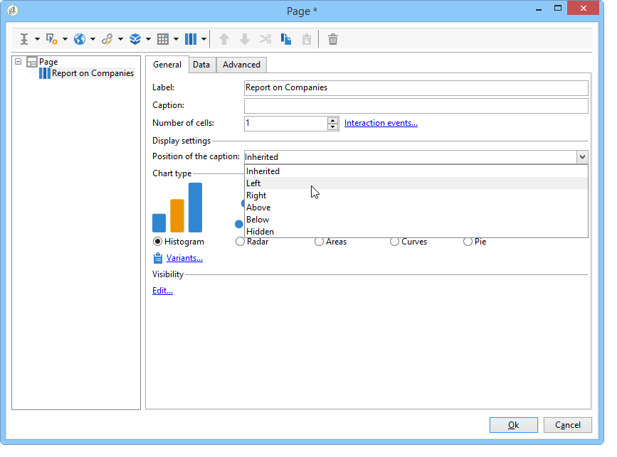
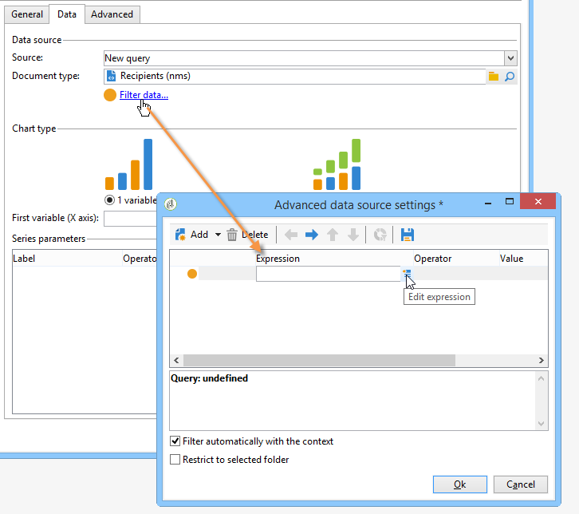
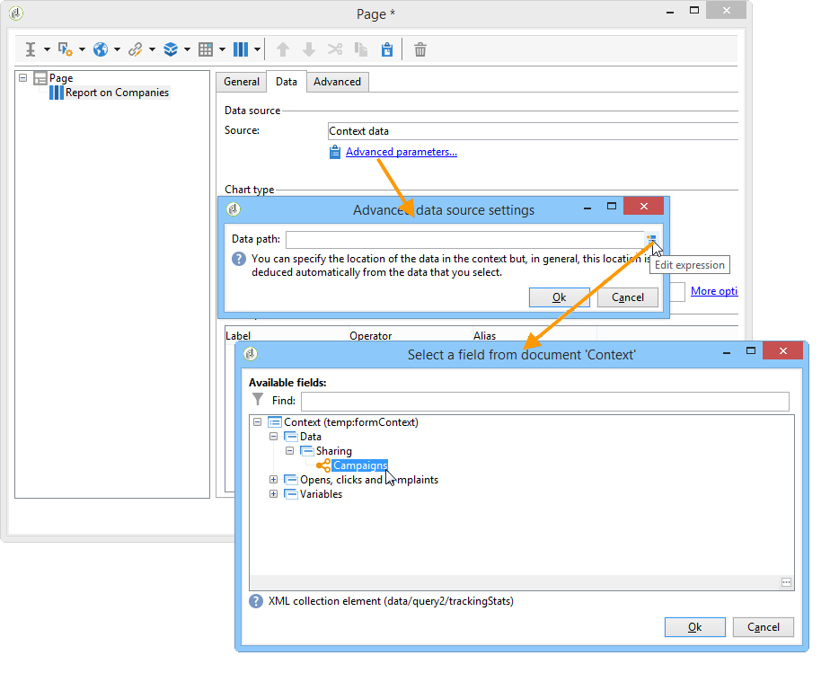
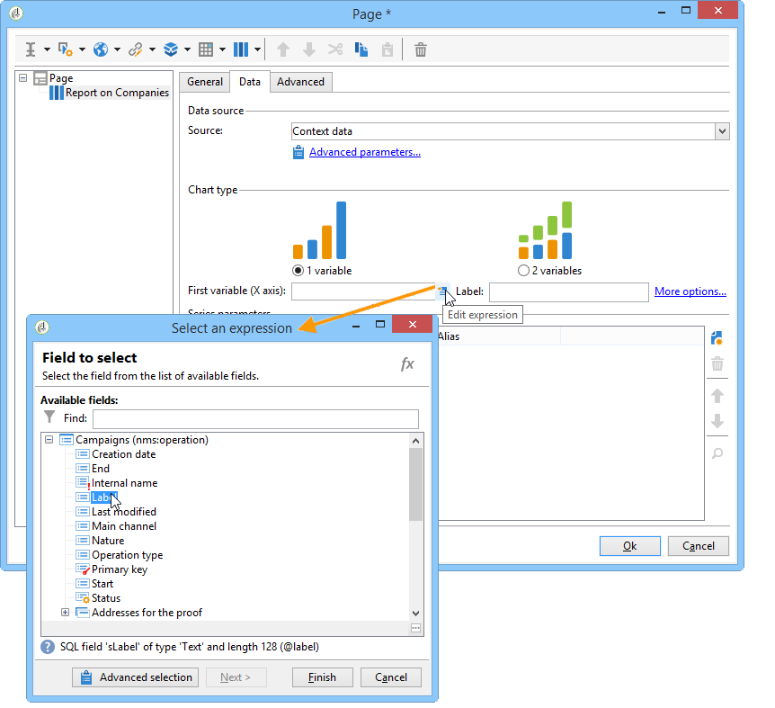
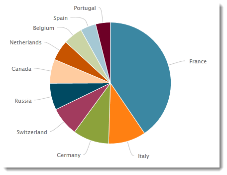
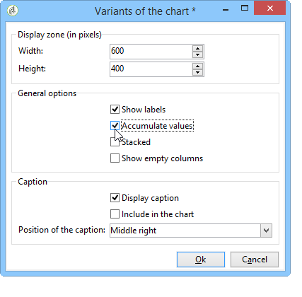

# 建立圖表{#creating-a-chart}

資料庫中的資料也可以收集並顯示在圖表中。 Adobe Campaign提供一組圖形化表示法。 其設定詳述如下。

圖表會透過右鍵功能表或工具列，直接插入報表頁面中。

## 建立步驟 {#creation-steps}

若要在報表中建立圖表，請套用下列步驟：

1. 編輯您要顯示圖表的頁面，並在工具列上選取圖表型別。

   

1. 輸入名稱和標題。 如有必要，您可以使用下拉式清單來變更註解的位置。

   

1. 按一下&#x200B;**[!UICONTROL Data]**&#x200B;索引標籤以定義資料來源和要計算的序列。

   要顯示在圖表中的統計資料可以根據查詢或內容資料進行計算，也就是目前頁面的輸入轉變所提供的資料（如需詳細資訊，請參閱[使用內容資料](../../reporting/using/using-the-context.md#using-context-data)）。

   * 按一下&#x200B;**[!UICONTROL Filter data...]**&#x200B;連結以定義資料庫中資料的篩選准則。

     

   * 若要使用內容資料，請從&#x200B;**[!UICONTROL Source]**&#x200B;下拉式清單中選取&#x200B;**[!UICONTROL Context data]**，然後按一下&#x200B;**[!UICONTROL Advanced settings...]**&#x200B;連結。 然後選取統計資料會關注的資料。

     

     然後，您就可以存取內容資料，以定義要在圖表中顯示的值：

     

## 圖表型別和變體 {#chart-types-and-variants}

Adobe Campaign提供各種圖形表示型別。 其詳情如下。

圖表型別插入頁面時會加以選取。

您也可以透過圖表中&#x200B;**[!UICONTROL General]**&#x200B;索引標籤的&#x200B;**[!UICONTROL Chart type]**&#x200B;區段進行更改。

變體取決於所選的圖表型別。 已透過&#x200B;**[!UICONTROL Variants...]**&#x200B;連結選取它們。

### 劃分：圓形圖 {#breakdown--pie-charts}

此型別的圖形表示可讓您顯示所測量元素的概觀。

圓餅圖只能讓您分析一個變數。

**[!UICONTROL Variants]**&#x200B;連結可讓您個人化圖表的整體呈現。

圓形圖可讓您在適當的欄位中輸入內半徑的值。

例如：

0.00追蹤完整的圓形。

0.40追蹤半徑為40%的圓。

1.00隻追蹤圓圈的外部。

### 演變：曲線和區域 {#evolution--curves-and-areas}

此型別的圖形表示可讓您及時瞭解一或多個量測的演變。

### 比較：長條圖 {#comparison--histograms}

長條圖可讓您比較一或多個變數的值。

對於這些型別的圖表，**[!UICONTROL Variants]**&#x200B;視窗中提供下列選項：

核取&#x200B;**[!UICONTROL Display caption]**&#x200B;選項以顯示圖表的標題，並選擇其位置：

在適當的情況下，您可以將值棧疊在一起。

如有必要，您可以反轉值顯示順序。 若要這麼做，請選取&#x200B;**[!UICONTROL Reverse stacking]**&#x200B;選項。

### 轉換：漏斗 {#conversion--funnel}

此型別的圖表可讓您追蹤測量元素的交談率。

## 與圖表的互動 {#interaction-with-the-chart}

您可以定義使用者按一下圖表時的動作。 開啟&#x200B;**[!UICONTROL Interaction events]**&#x200B;視窗並選取您要執行的動作。

可能的互動型別及其設定在[此區段](../../web/using/static-elements-in-a-web-form.md#inserting-html-content)中詳細說明。

## 計算統計資料 {#calculating-statistics}

圖表可讓您顯示所收集資料的統計資料。

這些統計資料是透過&#x200B;**[!UICONTROL Data]**&#x200B;索引標籤的&#x200B;**[!UICONTROL Series parameters]**&#x200B;區段定義的。

若要建立新的統計資料，請按一下&#x200B;**[!UICONTROL Add]**&#x200B;圖示並設定適當的視窗。 可用的計算型別詳述如下。

如需詳細資訊，請參閱[本章節](../../reporting/using/using-the-descriptive-analysis-wizard.md#statistics-calculation)。
