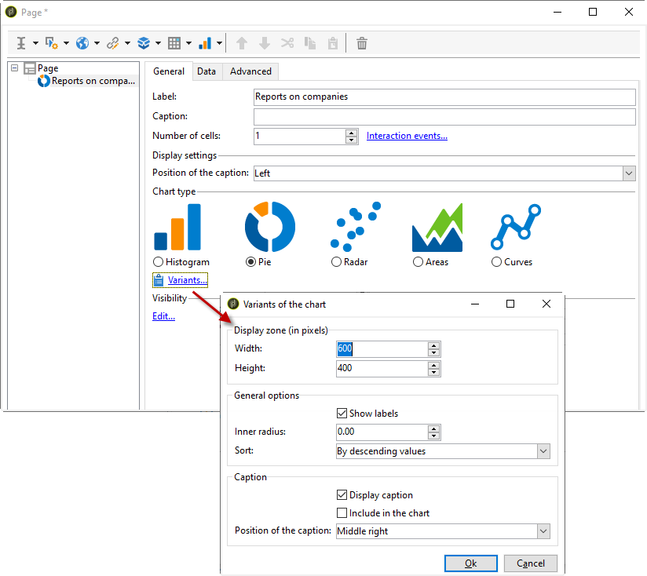

# 建立圖表{#creating-a-chart}

資料庫中的資料也可以收集並顯示在圖表中。 Adobe Campaign提供一組圖形表示法。 其配置詳細如下。

圖表會透過按一下滑鼠右鍵功能表或工具列直接插入報表頁面。

## 建立步驟 {#creation-steps}

若要在報表中建立圖表，請套用下列步驟：

1. 編輯要顯示圖表的頁面，並在工具列上選擇圖表類型。

   

1. 輸入名稱和標題。 如有必要，您可以使用下拉式清單變更標題的位置。

   

1. 按一下 **[!UICONTROL Data]** 標籤以定義資料來源和要計算的系列。

   圖表中顯示的統計資料可根據查詢或上下文資料計算，即目前頁面的傳入轉場所提供的資料(如需詳細資訊，請參閱「使用上下文資料 」)。

   * 按一下鏈 **[!UICONTROL Filter data...]** 接以定義資料庫中資料的篩選條件。

      

   * 若要使用內容相關資料，請選取此選項，然後按一下 **[!UICONTROL Advanced settings...]** 連結。 然後選擇統計資料將涉及的資料。

      

      然後，您就可以存取上下文資料來定義要顯示在圖表中的值：

      

## 圖表類型和變體 {#chart-types-and-variants}

Adobe Campaign提供各種類型的圖形表示法。 詳細說明如下。

將圖表類型插入頁面時，將選擇它。

您也可以透過圖表中標 **[!UICONTROL Chart type]** 簽的區段 **[!UICONTROL General]** 來變更它。

變數取決於所選的圖表類型。 它們會透過連結 **[!UICONTROL Variants...]** 選取。

### 劃分：圓形圖 {#breakdown--pie-charts}

這種圖形表示方式可讓您顯示測量元素的概述。

圓形圖僅可讓您分析一個變數。

此連 **[!UICONTROL Variants]** 結可讓您個人化圖表的整體呈現。

圓形圖可讓您在適當欄位中輸入內半徑的值。

例如：

0.00追蹤整個圓圈。

0.40會追蹤半徑為40%的圓。

1.00隻追蹤圓圈外部。

### 進化：曲線和區域 {#evolution--curves-and-areas}

這種圖形表示方式可讓您瞭解一或多個測量隨時間的演變。

### 比較：直方圖 {#comparison--histograms}

直方圖可讓您比較一或多個變數的值。

對於這些類型的圖表，窗口中提供了以下選 **[!UICONTROL Variants]** 項：

勾選選 **[!UICONTROL Display caption]** 選項以顯示圖表標題並選擇其位置：

您可以視需要將值堆疊在一起。

如有必要，您可以反轉值顯示順序。 若要這麼做，請選取 **[!UICONTROL Reverse stacking]** 選項。

### 轉換：漏斗 {#conversion--funnel}

此類型的圖表可讓您追蹤測量元素的對話率。

### 進度：儀表 {#progress--gauge}

此類型的圖表可讓您顯示值與定義目標相比的進度。 在以下示例中，黑色撥號顯示成功發送(76)的傳送數，其目標是100個傳送。 量規分為三個範圍，分別對應於特定狀態。

這些元素是在設定圖表時定義的。

* 該 **[!UICONTROL Value]** 欄位由圖表中的黑色撥號表示。 它代表您要計算其進度的元素。 要表示的值必須已保存，才能使用。
* 欄位 **[!UICONTROL Goal]** 代表要達到的最大值。
* 使用欄 **[!UICONTROL Other mark]** 位，您可以新增第二個指標至圖表。
* 欄位 **[!UICONTROL Display range]** 可讓您指定計算報表之間的值。
* 欄位 **[!UICONTROL Value ranges]** 可讓您將狀態（無、壞、可接受、良好）歸因於一組值，以更好地說明進度。

在區 **[!UICONTROL Display settings]** 段中， **[!UICONTROL Change appearance...]** 可讓您設定圖表的顯示方式。

選 **[!UICONTROL Display the value below the gauge]** 項可讓您在圖表下方顯示值進度。

欄 **[!UICONTROL Aperture ratio]** 位必須介於0和1之間，可讓您在較完整的圓形中編輯報表的孔徑。 在上述範例中，值0.50對應於半圓。

欄位 **[!UICONTROL Width]** 可讓您編輯圖表大小。

## 與圖表互動 {#interaction-with-the-chart}

您可以定義使用者按一下圖表時的動作。 開啟視 **[!UICONTROL Interaction events]** 窗並選取您要執行的動作。

本節將詳細介紹可能的交互類型及其 [配置](../../web/using/static-elements-in-a-web-form.md#inserting-html-content)。

## 計算統計資訊 {#calculating-statistics}

圖表可讓您顯示所收集資料的統計資料。

這些統計資料是透過標籤 **[!UICONTROL Series parameters]** 的區段來 **[!UICONTROL Data]** 定義。

若要建立新的統計資料，請按一下 **[!UICONTROL Add]** 圖示並設定適當的視窗。 可用的計算類型如下所述。

如需詳細資訊，請參閱[本小節](../../reporting/using/using-the-descriptive-analysis-wizard.md#statistics-calculation)。
