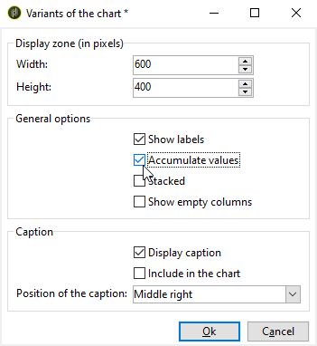

# 建立圖表{#creating-a-chart}

資料庫中的資料也可以收集並顯示在圖表中。 Adobe Campaign提供一組圖形表示法。 其設定於下文詳細說明。

圖表會透過滑鼠右鍵功能表或工具列，直接插入報表頁面中。

## 建立步驟{#creation-steps}

若要在報表中建立圖表，請套用下列步驟：

1. 編輯要顯示圖表的頁面，並在工具列上選取圖表類型。

   

1. 輸入名稱和註解。 如有必要，您可以使用下拉式清單來變更註解的位置。

   

1. 按一下&#x200B;**[!UICONTROL Data]**&#x200B;標籤以定義要計算的資料源和系列。

   要顯示在圖表中的統計資料可以根據查詢或上下文資料，即當前頁的入站轉變所提供的資料（有關詳細資訊，請參閱[使用上下文資料](../../reporting/using/using-the-context.md#using-context-data)）。

   * 按一下&#x200B;**[!UICONTROL Filter data...]**&#x200B;連結以定義資料庫中資料的篩選條件。

      

   * 若要使用內容資料，請選取此選項，然後按一下&#x200B;**[!UICONTROL Advanced settings...]**&#x200B;連結。 然後選擇統計資料將涉及的資料。

      

      接著，您將能存取內容資料，以定義要顯示在圖表中的值：

      

## 圖表類型和變體{#chart-types-and-variants}

Adobe Campaign提供各種類型的圖形表示法。 下文詳細說明。

將圖表類型插入頁面時將選中它。

您也可以透過圖表中&#x200B;**[!UICONTROL General]**&#x200B;標籤的&#x200B;**[!UICONTROL Chart type]**&#x200B;區段加以變更。

變體取決於所選圖表類型。 可透過&#x200B;**[!UICONTROL Variants...]**&#x200B;連結選取。

### 劃分：圓形圖{#breakdown--pie-charts}

這種圖形表示方式可讓您顯示測量元素的概觀。

圓形圖僅允許您分析一個變數。

**[!UICONTROL Variants]**&#x200B;連結可讓您個人化圖表的整體呈現。

圓形圖可讓您在適當欄位中輸入內半徑的值。

例如：

0.00追蹤整個圓圈。

0.40跟蹤半徑為40%的圓。

1.00隻追蹤圓圈外部。

### 進化：曲線和區域{#evolution--curves-and-areas}

此類型的圖形表示可讓您及時了解一個或多個測量的演化。

### 比較：直方圖{#comparison--histograms}

色階分佈圖可讓您比較一或多個變數的值。

對於這些類型的圖表，**[!UICONTROL Variants]**&#x200B;窗口提供了以下選項：

核取&#x200B;**[!UICONTROL Display caption]**&#x200B;選項以顯示圖表標題並選擇其位置：

您可以視需要將值堆疊在一起。

如有必要，您可以反轉值顯示順序。 要執行此操作，請選取&#x200B;**[!UICONTROL Reverse stacking]**&#x200B;選項。

### 轉換：漏斗{#conversion--funnel}

此類型的圖表可讓您追蹤測量元素的對話率。

### 進度：儀表{#progress--gauge}

此類型的圖表可讓您顯示值與定義目標相比的進度。 在以下範例中，黑色撥號顯示成功傳送(76)的次數，超出100個傳送的目標。 量規被分成三個範圍，這些範圍對應於特定狀態。

設定圖表時會定義這些元素。

* **[!UICONTROL Value]**&#x200B;欄位由圖表中的黑色撥號表示。 它代表您要計算其進度的元素。 必須已保存要表示的值才能使用。
* **[!UICONTROL Goal]**&#x200B;欄位表示要達到的最大值。
* 使用&#x200B;**[!UICONTROL Other mark]**&#x200B;欄位，您可以新增第二個指標至圖表。
* **[!UICONTROL Display range]**&#x200B;欄位可讓您指定計算報表的值。
* **[!UICONTROL Value ranges]**&#x200B;欄位可讓您將狀態（無、壞、可接受、良好）歸因於一組值，以更好地說明進度。

在&#x200B;**[!UICONTROL Display settings]**&#x200B;區段中， **[!UICONTROL Change appearance...]**&#x200B;可讓您設定圖表的顯示方式。

**[!UICONTROL Display the value below the gauge]**&#x200B;選項可讓您在圖表下方顯示值進度。

**[!UICONTROL Aperture ratio]**&#x200B;欄位必須介於0和1之間，可讓您以或多或少的完整圓形編輯報表的孔徑。 在上例中，值0.50對應於半圓。

**[!UICONTROL Width]**&#x200B;欄位可讓您編輯圖表大小。

## 與圖表{#interaction-with-the-chart}的交互

您可以在使用者點按圖表時定義動作。 開啟&#x200B;**[!UICONTROL Interaction events]**&#x200B;視窗，並選取您要執行的動作。

[本節](../../web/using/static-elements-in-a-web-form.md#inserting-html-content)中詳細說明了可能的交互類型及其配置。

## 計算統計資料{#calculating-statistics}

圖表可讓您顯示所收集資料的統計資料。

這些統計資料是透過&#x200B;**[!UICONTROL Data]**&#x200B;標籤的&#x200B;**[!UICONTROL Series parameters]**&#x200B;區段來定義。

若要建立新的統計資料，請按一下&#x200B;**[!UICONTROL Add]**&#x200B;圖示並設定適當的視窗。 可用的計算類型詳見下文。

如需詳細資訊，請參閱[本章節](../../reporting/using/using-the-descriptive-analysis-wizard.md#statistics-calculation)。
