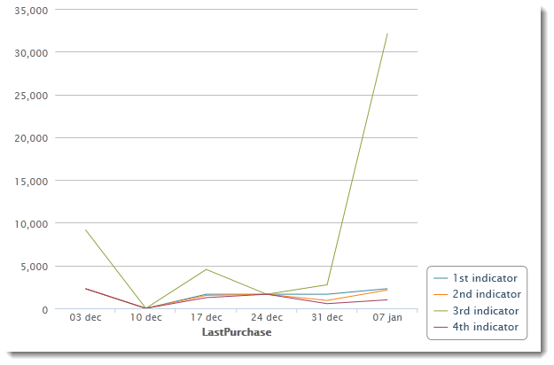

# 建立圖表{#creating-a-chart}

資料庫中的資料也可以收集並顯示在圖表中。 Adobe Campaign提供一組圖形表示。 其配置詳見下文。

圖表通過按一下右鍵菜單或工具欄直接插入報表頁。

## 建立步驟 {#creation-steps}

要在報表中建立圖表，請應用以下步驟：

1. 編輯要顯示圖表的頁面，然後在工具欄上選擇圖表類型。

   

1. 輸入名稱和標題。 如有必要，可以使用下拉清單更改標題的位置。

   

1. 按一下 **[!UICONTROL Data]** 頁籤，以定義要計算的資料源和系列。

   可以根據查詢或上下文資料計算圖表中顯示的統計資訊，即當前頁的入站轉換提供的資料(有關詳細資訊，請參閱 [使用上下文資料](../../reporting/using/using-the-context.md#using-context-data))。

   * 按一下 **[!UICONTROL Filter data...]** 連結，以定義資料庫中資料的篩選條件。

      

   * 要使用上下文資料，請選擇 **[!UICONTROL Context data]** 從 **[!UICONTROL Source]** 按一下 **[!UICONTROL Advanced settings...]** 的子菜單。 然後選擇統計資訊將關注的資料。

      

      然後，您將能夠訪問上下文資料以定義要顯示在圖表中的值：

      

## 圖表類型和變型 {#chart-types-and-variants}

Adobe Campaign提供各種形式的圖形表示。 詳見下文。

將圖表類型插入頁面時，將選擇該圖表類型。

也可以通過 **[!UICONTROL Chart type]** 的下界 **[!UICONTROL General]** 的子菜單。

變型取決於所選圖表類型。 通過 **[!UICONTROL Variants...]** 的子菜單。

### 細目：餅圖 {#breakdown--pie-charts}

通過這種類型的圖形表示法，可以顯示測量元素的概述。

餅圖僅允許您分析一個變數。

的 **[!UICONTROL Variants]** 連結允許您個性化圖表的整體呈現。

餅圖允許您在相應欄位中輸入內半徑的值。

例如：

0.00跟蹤整個圓。

0.40跟蹤半徑為40%的圓。

1.00隻跟蹤圓圈外。

### 進化：曲線和區域 {#evolution--curves-and-areas}

通過這種類型的圖形表示，您可以及時瞭解一個或多個測量的演化。

### 比較：直方圖 {#comparison--histograms}

直方圖使您能夠比較一個或多個變數的值。

對於這些類型的圖表，在 **[!UICONTROL Variants]** 窗口：

檢查 **[!UICONTROL Display caption]** 選項，在圖表中顯示標題並選擇其位置：

適當時，可將值堆疊在一起。

如有必要，可以反轉值顯示順序。 要執行此操作，請選擇 **[!UICONTROL Reverse stacking]** 的雙曲餘切值。

### 轉換：漏斗 {#conversion--funnel}

通過此類型的圖表，可以跟蹤測量元素的會話率。

## 與圖表交互 {#interaction-with-the-chart}

當用戶按一下圖表時，可以定義操作。 開啟 **[!UICONTROL Interaction events]** ，然後選擇要執行的操作。

有關可能的交互類型及其配置的詳細資訊，請參見 [此部分](../../web/using/static-elements-in-a-web-form.md#inserting-html-content)。

## 計算統計 {#calculating-statistics}

圖表允許您顯示有關所收集資料的統計資訊。

這些統計資訊通過 **[!UICONTROL Series parameters]** 的下界 **[!UICONTROL Data]** 頁籤。

要建立新統計資訊，請按一下 **[!UICONTROL Add]** 表徵圖並配置相應的窗口。 可用的計算類型詳見下文。

如需詳細資訊，請參閱[本章節](../../reporting/using/using-the-descriptive-analysis-wizard.md#statistics-calculation)。
