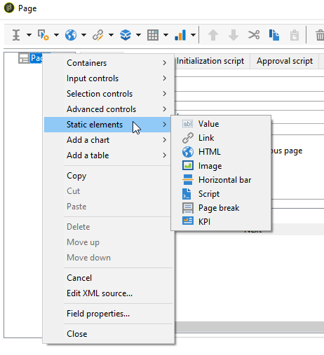
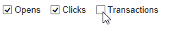

# 建立新報吿{#creating-a-new-report}

若要建立報表，請套用下列步驟：

1. 開啟Adobe Campaign Explorer並從&#x200B;**[!UICONTROL Administration > Configuration]**&#x200B;節點，然後選取&#x200B;**[!UICONTROL Reports]**&#x200B;資料夾。
1. 按一下報表清單上方的&#x200B;**[!UICONTROL New]**&#x200B;按鈕。
1. 選取 **[!UICONTROL Create a new report from a template]** 並按一下 **[!UICONTROL Next]**。

   

1. 在下拉式清單中選取報表範本。

   * **[!UICONTROL Extended report]**&#x200B;可讓您建立使用圖表設定的報告。
   * **[!UICONTROL Qualitative distribution]**&#x200B;報表可讓您根據所有資料型別（公司名稱、電子郵件網域等）建立統計資料。
   * **[!UICONTROL Quantitative distribution]**&#x200B;報表可讓您建立可測量或計算的資料統計資料（發票金額、收件者年齡等）。

   如需這些報告範本的詳細資訊，請參閱[本節](../../reporting/using/about-descriptive-analysis.md)。

1. 在對應欄位中輸入報表名稱及其說明。 指定要套用報告的&#x200B;**[!UICONTROL schema]**。

   

1. 儲存此報表。

## 為圖表建模 {#modelizing-the-chart}

儲存報告後，應會顯示此訊息。 您現在可以建置報告的圖表。

建立報表的圖表由一系列活動組成。

活動會使用以箭頭表示的轉變來連結。

若要根據報表的性質與內容來建置報表，您必須識別有用的元素，並將其邏輯順序模型化。

1. 使用&#x200B;**[!UICONTROL Start]**&#x200B;活動具體化要執行以建置報告的第一個程式。 每個報表只能使用其中一個活動。

   如果圖表包含回圈，則必須使用。

1. 新增一或多個&#x200B;**[!UICONTROL Query]**&#x200B;活動，以收集有助於建立報表的資料。 您可以透過資料庫架構上的查詢直接收集資料，或透過匯入的清單或現有的Cube收集資料。

   如需詳細資訊，請參閱[收集資料以分析](../../reporting/using/collecting-data-to-analyze.md)。

   此資料會根據頁面設定顯示在報表中（或不顯示）。

1. 放置一或多個&#x200B;**[!UICONTROL Page]**&#x200B;活動以定義所收集資料的圖形表示。 您可以插入表格、圖表、輸入欄位，以及設定一或多個頁面或頁面元素的顯示條件。 顯示的內容可完全設定。

   如需詳細資訊，請參閱[靜態元素](#static-elements)。

1. 使用&#x200B;**[!UICONTROL Test]**&#x200B;活動定義顯示或存取資料的條件。

   如需詳細資訊，請參閱[條件頁面顯示](../../reporting/using/defining-a-conditional-content.md#conditioning-page-display)。

1. 如有必要，請透過&#x200B;**[!UICONTROL Script]**&#x200B;活動新增個人化指令碼，例如計算報表名稱、篩選特定內容中結果的顯示等。

   如需詳細資訊，請參閱[指令碼活動](../../reporting/using/advanced-functionalities.md#script-activity)。

1. 最後，為了更輕鬆閱讀複雜報表，您可以插入一或多個&#x200B;**[!UICONTROL Jump]**&#x200B;型別活動。 這可讓您從一個活動移至另一個活動，而不需在報表上實體化轉變。 **[!UICONTROL Jump]**&#x200B;活動也可用來顯示其他報告。

   有關詳細資訊，請參閱[跳轉活動](../../reporting/using/advanced-functionalities.md#jump-activity)。

您無法同時執行多個分支。 這表示以此方式建置的報表無法運作：

不過，您可以放置多個分支。 將只執行其中一項：

## 建立頁面 {#creating-a-page}

內容是透過圖表中的活動進行設定。 如需詳細資訊，請參閱[模型化圖表](#modelizing-the-chart)。

若要設定活動，請按兩下其圖示。

顯示的內容定義於&#x200B;**頁面**&#x200B;型別活動中。

報表可包含一或多個頁面。 頁面是透過專用的編輯器建立的，可讓您以樹狀結構插入輸入欄位、選取欄位、靜態元素、圖表或表格。 容器可協助您定義版面。 如需詳細資訊，請參閱[元素配置](../../reporting/using/element-layout.md)。

若要將元件新增至頁面，請使用工具列左上角的圖示。

您也可以以滑鼠右鍵按一下要新增元件的節點，然後從清單中選取它。

>[!CAUTION]
>
>如果報表預計要以Excel格式匯出，建議您不要使用複雜的HTML格式。 如需詳細資訊，請參閱[匯出報表](../../reporting/using/actions-on-reports.md#exporting-a-report)。

**[!UICONTROL Page]**&#x200B;可以包含下列元素：

* 長條圖、圓餅圖、曲線型別&#x200B;**[!UICONTROL charts]**&#x200B;等
* 樞紐分析；具有群組的清單，或劃分&#x200B;**[!UICONTROL tables]**。
* 文字或數字型別&#x200B;**[!UICONTROL Input controls]**。
* 下拉式清單、核取方塊、選項按鈕、多重選擇、日期或矩陣型別&#x200B;**[!UICONTROL Selection controls]**。
* 連結編輯器、常數、資料夾選擇型別&#x200B;**[!UICONTROL Advanced controls]**。
* 值、連結、HTML、影像等。**[!UICONTROL Static elements]**。
* **[!UICONTROL Containers]**&#x200B;可讓您控制元件配置。

頁面及其元件的設定模式在[本節](../../web/using/about-web-forms.md)中有詳細說明。

工具列可讓您新增或移除控制項，以及組織控制項在報表頁面中的順序。

### 靜態元素 {#static-elements}

靜態元素可讓您在報表中顯示使用者不會互動的資訊，例如圖形元素或指令碼。 如需詳細資訊，請參閱[本節](../../web/using/static-elements-in-a-web-form.md#inserting-html-content)。

### 篩選報告中的資訊 {#filtering-information-in-a-report}

輸入和選取控制項可讓您篩選報表中顯示的資訊。 如需實作這類篩選的詳細資訊，請參閱查詢中的[篩選選項](../../reporting/using/collecting-data-to-analyze.md#filtering-options-in-the-queries)。

若要進一步瞭解如何建立及設定輸入欄位和選取欄位，請參閱[本節](../../web/using/about-web-forms.md)。

您可以將一或多個輸入控制項整合至報表。 此型別的控制項可讓您根據輸入的值篩選顯示的資訊。

您也可以將一或多個選取範圍控制項整合至報表。 此型別的控制項可讓您根據選取的值篩選報表中包含的資訊，例如：

* 透過選項按鈕或核取方塊：

  

* 透過下拉式清單：

  

* 透過行事曆：

  

最後，您可以將一或多個進階控制項整合至報表中。 此控制項型別可讓您插入連結、常數或選取資料夾。

您可以在此處篩選報告中的資料，以僅顯示包含在樹狀結構其中一個資料夾中的資訊：

