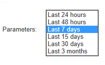

# 建立新報表{#creating-a-new-report}

若要建立報表，請套用下列步驟：

1. 開啟「Adobe Campaign Explorer」並從節點中 **[!UICONTROL Administration > Configuration]** ，然後選取資料 **[!UICONTROL Reports]** 夾。
1. 按一下 **[!UICONTROL New]** 報表清單上方的按鈕。
1. 選擇 **[!UICONTROL Create a new report from a template]** 並按一下 **[!UICONTROL Next]**。

   

1. 在下拉式清單中選取報表範本。

   * 可 **[!UICONTROL Extended report]** 讓您建立使用圖表設定的報表。
   * 報 **[!UICONTROL Qualitative distribution]** 表可讓您根據所有資料類型（公司名稱、電子郵件網域等）建立統計資料。
   * 報 **[!UICONTROL Quantitative distribution]** 表可讓您建立可測量或計算的資料統計資料（發票金額、收件者年齡等）。
   如需這些報表範本的詳細資訊，請參閱 [本節](../../reporting/using/about-descriptive-analysis.md)。

1. 在對應欄位中輸入報表名稱及其說明。 指定 **[!UICONTROL schema]** 要套用報表的位置。

   

1. 儲存此報表。

## 建模圖表 {#modelizing-the-chart}

儲存報表後，應顯示此項。 您現在可以建立報表的圖表。

建立報告的圖表由一系列活動組成。

活動使用轉場連結，由箭頭表示。

若要建立報表，請視其性質和內容而定，您必須識別有用的元素並建立其邏輯順序的模型。

1. 使用「開始」活動來具體化要執行的建立報表的第一個流程。 每個報表只能使用其中一個活動。

   如果圖表包含回圈，則此為必填項目。

1. 新增一或多個「查詢」活動，以收集對建立報表有用的資料。 可以通過資料庫方案上的查詢或通過導入清單或現有多維資料集直接收集資料。

   有關詳情，請參閱收 [集資料以分析](../../reporting/using/collecting-data-to-analyze.md)。

   此資料會依頁面設定而顯示（或不顯示）在報表中。

1. 放置一或多個「頁面」活動，以定義所收集資料的圖形表示。 您可以插入表格、圖表、輸入欄位，並設定一或多個頁面或頁面元素的顯示條件。 所顯示的內容可完全設定。

   For more on this, refer to [Static elements](#static-elements).

1. 使用「測試」活動來定義顯示或存取資料的條件。

   For more on this, refer to [Conditioning page display](../../reporting/using/defining-a-conditional-content.md#conditioning-page-display).

1. 如有必要，請透過「指令碼」活動新增個人化指令碼，例如計算報表名稱，以篩選結果在特定內容中的顯示，等等。

   For more on this, refer to [Script activity](../../reporting/using/advanced-functionalities.md#script-activity).

1. 最後，您可插入一或多個「跳轉」類型活動，以方便閱讀複雜報表。 這可讓您從一個活動移至另一個活動，而不須在報表上實體化轉場。 「跳轉」也可用來顯示其他報表。

   For more on this, refer to [Jump activity](../../reporting/using/advanced-functionalities.md#jump-activity).

不能同時執行多個分支。 這表示，以此建立的報表將無法運作：

不過，您可放置數個分支。 只會執行其中一項：

## 建立頁面 {#creating-a-page}

內容是透過置入圖表中的活動來設定。 有關詳細資訊，請參 [閱建模圖表](#modelizing-the-chart)。

若要設定活動，請連按兩下其圖示。

顯示的內容在「頁面類型」 **活動中** 定義。

報表可以包含一或多個頁面。 頁面是透過專用的編輯器建立的，可讓您在樹狀結構中插入輸入欄位、選擇欄位、靜態元素、圖表或表格。 容器可協助您定義版面。 For more on this, refer to [Element layout](../../reporting/using/element-layout.md).

若要將元件新增至頁面，請使用工具列左上方區段中的圖示。

您也可以按一下右鍵要添加元件的節點，然後從清單中選擇該元件。

>[!CAUTION]
>
>如果報表的匯出目的地是Excel格式，建議不要使用複雜的HTML格式。 有關此的詳細資訊，請參 [閱匯出報表](../../reporting/using/actions-on-reports.md#exporting-a-report)。

A **[!UICONTROL Page]** 可包含下列元素：

* 橫條、圓形、曲線 **[!UICONTROL charts]**&#x200B;類型等。
* 樞紐；含群組的清單或劃分 **[!UICONTROL tables]**。
* 文字或數字類型 **[!UICONTROL Input controls]**。
* 下拉式清單、核取方塊、選項按鈕、多選項、日期或矩陣類型 **[!UICONTROL Selection controls]**。
* 連結編輯器、常數、資料夾選擇類 **[!UICONTROL Advanced controls]**&#x200B;型。
* 值、連結、HTML、影像等 **[!UICONTROL Static elements]**。
* **[!UICONTROL Containers]** 可讓您控制元件配置。

本節將詳細介紹頁面及其元件的配 [置模式](../../web/using/about-web-forms.md)。

工具列可讓您新增或移除控制項，並在報表頁面中組織其順序。

### 靜態元素 {#static-elements}

靜態元素可讓您在報表中顯示資訊，例如使用者不會與之互動的圖形元素或指令碼。 Refer to [this section](../../web/using/static-elements-in-a-web-form.md#inserting-html-content) for more information.

### 篩選報表中的資訊 {#filtering-information-in-a-report}

輸入和選擇控制項可讓您篩選報表中顯示的資訊。 如需實作此類型篩選的詳細資訊，請參閱查 [詢中的篩選選項](../../reporting/using/collecting-data-to-analyze.md#filtering-options-in-the-queries)。

若要進一步瞭解如何建立和設定輸入欄位和選擇欄位，請參 [閱本節](../../web/using/about-web-forms.md)。

您可將一或多個輸入控制項整合至報表。 此類型的控制項可讓您根據輸入的值來篩選顯示的資訊。

您也可以將一或多個選擇控制項整合至報表中。 此類型的控制項可讓您根據選取的值，篩選報表中包含的資訊，例如：

* 通過單選按鈕或複選框：

   

* 透過下拉式清單：

   

* 透過日曆：

   

最後，您可將一或多個進階控制項整合至報表中。 此類控制項可讓您插入連結、常數或選取資料夾。

您可以在此處篩選報表中的資料，只顯示樹狀結構其中一個資料夾中所包含的資訊：

