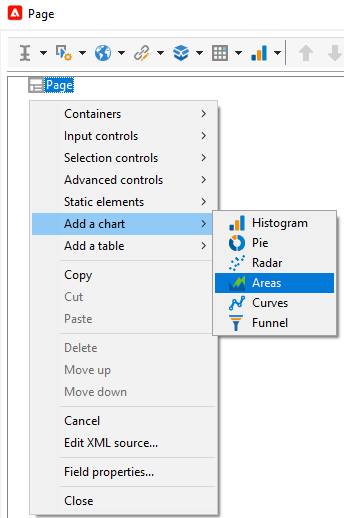

# 建立新報吿{#creating-a-new-report}

若要建立報表，請套用下列步驟：

1. 開啟Adobe Campaign Explorer，然後從 **[!UICONTROL Administration > Configuration]** 節點，然後選取 **[!UICONTROL Reports]** 檔案夾。
1. 按一下 **[!UICONTROL New]** 按鈕。
1. 選取 **[!UICONTROL Create a new report from a template]** 並按一下 **[!UICONTROL Next]**。

   

1. 在下拉式清單中選取報表範本。

   * 此 **[!UICONTROL Extended report]** 可讓您建立使用圖表設定的報表。
   * 此 **[!UICONTROL Qualitative distribution]** 報表可讓您根據所有資料類型（公司名稱、電子郵件網域等）建立統計資料。
   * 此 **[!UICONTROL Quantitative distribution]** 報表可讓您建立可測量或計算的資料統計資料（發票金額、收件者年齡等）。

   如需這些報表範本的詳細資訊，請參閱 [本節](../../reporting/using/about-descriptive-analysis.md).

1. 在對應欄位中輸入報表名稱及其說明。 指定 **[!UICONTROL schema]** 將套用報表的位置。

   

1. 儲存此報表。

## 為圖表建模 {#modelizing-the-chart}

儲存報表後，應會顯示此訊息。 您現在可以建立報表的圖表。

報告的建立圖由一系列活動組成。

活動會使用轉變來連結，由箭頭表示。

若要建立報表，請根據報表的性質和內容，識別有用的元素並建立其邏輯順序的模型。

1. 使用 **[!UICONTROL Start]** 實體化要建立報表的第一個程式的活動。 每個報表只能使用其中一個活動。

   如果圖表包含回圈，則此為必要項目。

1. 新增一或多個 **[!UICONTROL Query]** 活動來收集對建立報表有用的資料。 可以直接通過資料庫架構上的查詢或通過導入的清單或現有多維資料集收集資料。

   有關詳細資訊，請參閱 [收集資料以進行分析](../../reporting/using/collecting-data-to-analyze.md).

   此資料會根據頁面設定顯示在報表中（或不顯示）。

1. 放置一或多個 **[!UICONTROL Page]** 活動來定義所收集資料的圖形表示。 您可以插入表、圖表、輸入欄位和條件，以顯示一個或多個頁面或頁面的元素。 顯示的內容可完全配置。

   有關詳細資訊，請參閱 [靜態元素](#static-elements).

1. 使用 **[!UICONTROL Test]** 活動，定義顯示或存取資料的條件。

   有關詳細資訊，請參閱 [調整頁面顯示](../../reporting/using/defining-a-conditional-content.md#conditioning-page-display).

1. 如有需要，請透過 **[!UICONTROL Script]** 活動，例如計算報表名稱，以篩選特定內容中結果的顯示，等等。

   有關詳細資訊，請參閱 [指令碼活動](../../reporting/using/advanced-functionalities.md#script-activity).

1. 最後，為了更輕鬆閱讀複雜報表，您可以插入一或多個 **[!UICONTROL Jump]** 類型活動。 這可讓您從一個活動移至另一個活動，而不會實體化報表上的轉變。 此 **[!UICONTROL Jump]** 活動也可用來顯示其他報表。

   有關詳細資訊，請參閱 [跳轉活動](../../reporting/using/advanced-functionalities.md#jump-activity).

您不能同時執行數個分支。 這表示像這樣建立的報表將無法運作：

不過，您可以放置數個分支。 只會執行其中一個：

## 建立頁面 {#creating-a-page}

內容是透過放在圖表中的活動來設定。 有關詳細資訊，請參閱 [建模圖表](#modelizing-the-chart).

若要設定活動，請連按兩下其圖示。

顯示的內容定義於 **頁面** 類型活動。

報表可包含一或多個頁面。 頁面是透過專用編輯器建立，可讓您在樹狀結構中插入輸入欄位、選取欄位、靜態元素、圖表或表格。 容器可協助您定義版面。 有關詳細資訊，請參閱 [元素版面](../../reporting/using/element-layout.md).

若要將元件新增至頁面，請使用工具列左上角的圖示。

您也可以以滑鼠右鍵按一下您要新增元件的節點，然後從清單中選取元件。

>[!CAUTION]
>
>如果報表以Excel格式匯出，建議不要使用複雜的HTML格式。 有關詳細資訊，請參閱 [匯出報表](../../reporting/using/actions-on-reports.md#exporting-a-report).

A **[!UICONTROL Page]** 可包含下列元素：

* 長條圖，圓形圖，曲線類型 **[!UICONTROL charts]**、等
* 樞紐；包含群組的清單，或劃分 **[!UICONTROL tables]**.
* 文本或數字類型 **[!UICONTROL Input controls]**.
* 下拉式清單、核取方塊、選項按鈕、多選項、日期或矩陣類型 **[!UICONTROL Selection controls]**.
* 連結編輯器，常數，資料夾選擇類型 **[!UICONTROL Advanced controls]**.
* 值、連結、HTML、影像等 **[!UICONTROL Static elements]**.
* **[!UICONTROL Containers]** 可讓您控制元件配置。

頁面及其元件的設定模式在 [本節](../../web/using/about-web-forms.md).

工具列可讓您新增或移除控制項，以及在報表頁面中組織其順序。

### 靜態元素 {#static-elements}

靜態元素可讓您在報表中顯示使用者不會與之互動的資訊，例如圖形元素或指令碼。 請參閱 [本節](../../web/using/static-elements-in-a-web-form.md#inserting-html-content) 以取得更多資訊。

### 篩選報表中的資訊 {#filtering-information-in-a-report}

輸入和選取控制項可讓您篩選報表中顯示的資訊。 如需實作此類型篩選的詳細資訊，請參閱 [篩選查詢中的選項](../../reporting/using/collecting-data-to-analyze.md#filtering-options-in-the-queries).

若要進一步了解如何建立和設定輸入欄位和選取欄位，請參閱 [本節](../../web/using/about-web-forms.md).

您可以將一或多個輸入控制項整合至您的報表。 此類型的控制項可讓您根據輸入的值篩選顯示的資訊。

您也可以將一或多個選取控制項整合至您的報表中。 此類型的控制可讓您根據選取的值來篩選報表中包含的資訊，例如：

* 通過單選按鈕或複選框：

   

* 透過下拉式清單：

   

* 通過日曆：

   

最後，您可以將一或多個進階控制項整合至您的報表中。 此類控制項可讓您插入連結、常數或選取資料夾。

在此，您可以篩選報表中的資料，以僅顯示樹狀結構其中一個資料夾中所包含的資訊：

