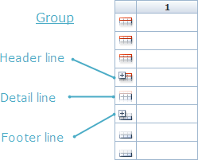
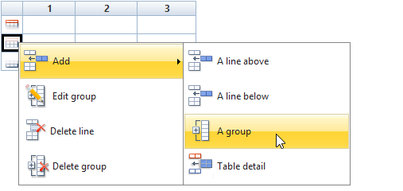
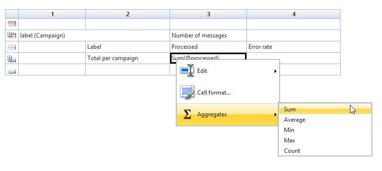
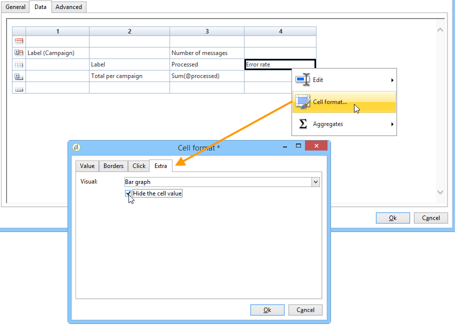

# 建立表格{#creating-a-table}


您可以新增表格至報表以顯示資料。 這可以是根據立方體測量建立的樞紐分析表、具有群組的清單或包含劃分值的表格。


## 建立包含群組的清單 {#creating-a-list-with-group}

**[!UICONTROL List with group]**&#x200B;型別表格可讓您將表格中的資料分組，並產生其統計資料。 例如，您可以建立資料的總計和小計。 每個群組都有自己的頁首、詳細資訊和頁尾行。

>[!CAUTION]
>
>包含資料表的&#x200B;**[!UICONTROL Page]**&#x200B;活動前面必須有&#x200B;**[!UICONTROL Query]**&#x200B;或&#x200B;**[!UICONTROL Script]**&#x200B;活動，才能收集要在報表中分析的資料。 有關這些活動的詳細資訊，請參閱[收集資料以分析](../../reporting/using/collecting-data-to-analyze.md)和[編寫活動指令碼](../../reporting/using/advanced-functionalities.md#script-activity)。

### 操作原則 {#operating-principle}

您可能需要一次分析多個資料類別。 具有群組的清單可讓您合併資料，並在相同表格內建立不同資料群組的統計資料。 若要這麼做，您可以在表格中建立群組。

在以下範例中，群組會顯示資料庫中的所有行銷活動、傳送，以及每個傳送和每個行銷活動傳送的訊息數。

它可讓您列出行銷活動(**[!UICONTROL Label (Campaign)]**、連結至行銷活動的傳遞清單(**[!UICONTROL Label]**)，並讓您計算每次傳遞傳送的訊息數(**[!UICONTROL Processed)]**)，然後再為每個行銷活動加總訊息(**[!UICONTROL Sum(@processed)]**)。


### 實施步驟 {#implementation-steps}

此處提供完整實作範例： [使用案例：建立具有群組清單](#use-case--create-a-report-with-a-group-list)的報告。

請注意下列步驟以建立「具有群組的清單」型別表格：

1. 移至報告圖表並放置&#x200B;**[!UICONTROL Query]**&#x200B;活動。 請參考[收集資料以分析](../../reporting/using/collecting-data-to-analyze.md)。
1. 填寫來源表格，並選取統計資料會關注的表格欄位。
1. 將&#x200B;**[!UICONTROL Page]**&#x200B;活動放入圖表中。 如需詳細資訊，請參閱[靜態元素](../../reporting/using/creating-a-new-report.md#static-elements)。
1. 在頁面中插入&#x200B;**[!UICONTROL List with group]**&#x200B;型別表格。
1. 指定資料路徑，或查詢中選取做為資料來源的表格。

   如果您稍後要復原來源表格中的欄位，並將它們插入表格的儲存格中，則必須執行此步驟。

1. 建立表格及其內容。
1. 在「**[!UICONTROL Preview]**」標籤中顯示最終完成的報告。 之後，您可以發佈報表，並視需要將其匯出為不同的格式。 如需詳細資訊，請參閱[匯出報表](../../reporting/using/actions-on-reports.md#exporting-a-report)。

### 新增行和欄 {#adding-lines-and-columns}

依預設，**[!UICONTROL List with group]**&#x200B;型別表格包含頁首、詳細資訊行和頁尾行。

群組本身包含頁首、詳細資訊和頁尾行。

* **標題行**：此行可讓您為資料表的資料行指定標題。

  

* **明細行**：此行包含統計值。

  

* **頁尾行**：此行可讓您顯示總計值。

  

您可以視需要新增行和欄。

群組可放置在表格的任何一行上，並包含其自己的頁首、詳細資訊和頁尾行。



**行與欄**：若要新增或刪除行或欄，請移至現有的行或欄，然後使用滑鼠右鍵功能表。


您新增的直線性質取決於游標的位置。 例如，若要新增標頭行，請將游標放在標頭上，然後按一下&#x200B;**[!UICONTROL Add > A line above/below]**。


欄的寬度可以透過&#x200B;**[!UICONTROL Column format]**&#x200B;專案來修改。

**群組**：若要新增群組，請移至一行，然後在下拉式功能表中選取相符的專案。



### 定義儲存格內容 {#defining-cell-content}

若要編輯表格的儲存格並定義其內容和格式，請移至儲存格並使用滑鼠右鍵選單。

使用&#x200B;**[!UICONTROL Expression]**&#x200B;功能表專案來選取要顯示的值。


* 若要將要分析的值直接插入表格中，請在可用欄位中選取它們。

  可用欄位清單與報告建構圖表中表格前面的查詢內容一致。

  

* 輸入儲存格的標籤，例如標題一。

  要執行此操作，請使用與將欄位插入資料庫相同的程式，但不要選取運算式。 在&#x200B;**[!UICONTROL Label]**&#x200B;欄位中輸入標籤。 它將顯示為原樣。

* 計算彙總（平均值、總和等） 並在儲存格中顯示。

  若要這麼做，請使用&#x200B;**[!UICONTROL Aggregates]**&#x200B;功能表專案，並選取所需的行銷活動。

  

### 定義儲存格格式 {#defining-cell-format}


若要定義儲存格格式，**[!UICONTROL Cell format...]**&#x200B;功能表可讓您存取所選儲存格可用的所有格式選項。

這些選項可讓您個人化報表的最終呈現，並使其更容易讀取資訊。

將資料匯出至Excel時使用&#x200B;**[!UICONTROL Carriage return]**&#x200B;欄位：選取&#x200B;**[!UICONTROL Yes]**&#x200B;值以強制歸位。 匯出時會保留此值。 如需詳細資訊，請參閱[匯出報表](../../reporting/using/actions-on-reports.md#exporting-a-report)。

**[!UICONTROL Cell format]**&#x200B;視窗可讓您存取下列標籤：

* **[!UICONTROL Value]**&#x200B;索引標籤
* **[!UICONTROL Borders]**&#x200B;索引標籤
* **[!UICONTROL Click]**&#x200B;索引標籤
* **[!UICONTROL Extra]**&#x200B;索引標籤

**[!UICONTROL Value]**&#x200B;索引標籤可讓您變更字型和各種值屬性，或根據其性質定義格式。


格式變更資料顯示：例如，**[!UICONTROL Number]**、**[!UICONTROL Monetary]**&#x200B;和&#x200B;**[!UICONTROL Percentage]**&#x200B;格式可讓您對齊右邊的數字並顯示小數點。

如何設定貨幣格式的範例：您可以指定值的表示貨幣、選擇是否要分隔千分，並以紅色顯示負值。 貨幣符號的位置取決於其設定檔中定義的運運算元語言。


日期的設定範例：您可以選擇是否顯示時間。


**框線**&#x200B;索引標籤可讓您將框線新增至表格中的行和欄。 將大型報表匯出至Excel時，在儲存格中新增框線可能會導致效能問題。


如有必要，您可以在表格範本(**[!UICONTROL Administration > Configuration > Form rendering]** )中定義框線。

在此案例中，您的語法如下：

在Web標籤中：

```
 .tabular td {
 border: solid 1px #000000;
 }
```

在Excel標籤中：

```
 <style name="odd" fillColor="#fdfdfd">
  <border>
   <borderTop value="solid 0.05pt #000000" />
   <borderBottom value="solid 0.05pt #000000" />
   <borderLeft value="solid 0.05pt #000000" />
   <borderRight value="solid 0.05pt #000000" />
  </border>
 </style> 
 
 <style name="even" fillColor="#f7f8fa">
  <border>
   <borderTop value="solid 0.05pt #000000" />
   <borderBottom value="solid 0.05pt #000000" />
   <borderLeft value="solid 0.05pt #000000" />
   <borderRight value="solid 0.05pt #000000" />
  </border>
 </style> 
```

**[!UICONTROL Click]**&#x200B;索引標籤可讓您定義使用者按一下儲存格或表格內容時的動作。

在下列範例中，按一下儲存格中的值可讓您顯示報表的第二頁：其中會包含儲存格中傳送的相關資訊。


**額外**&#x200B;索引標籤可讓您將視覺效果連結至您的資料，例如彩色標籤或值列。 表格在圖表中顯示為圖例時，會使用彩色標籤。 如需詳細資訊，請參閱實作範例： [步驟5 — 建立第二個頁面](#step-5---create-the-second-page)


## 使用案例：建立具有群組清單的報告 {#use-case--create-a-report-with-a-group-list}

在此範例中，我們將建立兩頁報告：第一個頁面將包含清單和每個行銷活動的傳遞總數，以及傳送的訊息數。 傳遞名稱將是可點按的連結，可讓您進入報表的第二頁，以使用表格和圖表檢視所選傳遞的每封電子郵件網域傳遞明細。 在第二個頁面，表格會作為圖表的圖例。


### 步驟1 — 建立報表 {#step-1---create-a-report}

建立與行銷活動結構描述&#x200B;**[!UICONTROL Campaigns (nms)]**&#x200B;有關的新報告。


按一下&#x200B;**[!UICONTROL Save]**&#x200B;以建立報告。

移至圖表，新增用於設計報表內容的第一個元件：第一個查詢和第一個頁面。


### 步驟2 — 建立第一個查詢 {#step-2---create-the-first-query}

第一個查詢可讓您收集連結至每個行銷活動的傳送。 目標是顯示連結至每個行銷活動之各種Adobe Campaign資料庫傳遞的相關報告。

連按兩下第一個查詢以進行編輯，然後套用下列步驟進行設定：

1. 從變更套用查詢來源的結構描述開始：選取&#x200B;**[!UICONTROL Deliveries (nms)]**&#x200B;結構描述。
1. 按一下&#x200B;**[!UICONTROL Edit query]**&#x200B;連結並顯示進階欄位。

   

1. 選取下列欄位：

   * 傳遞標籤，
   * 傳遞的主要索引鍵，
   * 行銷活動標籤，
   * 已處理傳遞的指標，
   * Campaign連結的外部索引鍵，
   * 錯誤率指示器。

   

   將別名連結至每個欄位：建議您這麼做，以便於從表格選取要新增至報表第一頁的資料。

   在此範例中，我們將使用下列別名：

   * 標籤： **@label**
   * 主索引鍵： **@deliveryId**
   * 標籤（行銷活動）： **@label1**
   * 已處理： **@processed**
   * &#39;行銷活動&#39; （&#39;id&#39;欄位）連結的外部索引鍵： **@operationId**
   * 錯誤率： **@errorRatio**

1. 按兩下&#x200B;**[!UICONTROL Next]**&#x200B;按鈕以進入&#x200B;**[!UICONTROL Data filtering]**&#x200B;步驟。

   新增篩選條件，以僅收集連結至行銷活動的傳送。

   此篩選器的語法如下：「&#39;Campaigns&#39;連結的外部索引鍵大於0」。

   

1. 按一下&#x200B;**[!UICONTROL Finish]**&#x200B;以儲存這些條件，然後按一下&#x200B;**[!UICONTROL Ok]**&#x200B;以關閉查詢編輯器。

### 步驟3：建立第一頁 {#step-3--create-the-first-page}

在此步驟中，我們將設定報表的第一頁。 若要進行設定，請套用下列步驟：

1. 開啟&#x200B;**[!UICONTROL Page]**&#x200B;活動並輸入其標題，在此例中是執行個體&#x200B;**傳遞**。

   

1. 透過工具列插入包含群組的清單，然後輸入其標籤，例如：每個行銷活動的傳遞清單。

   

1. 按一下&#x200B;**[!UICONTROL Table data XPath...]**&#x200B;連結並選取傳遞連結，即`[query/delivery]`。

   

1. 按一下&#x200B;**[!UICONTROL Data]**&#x200B;索引標籤並變更表格的版面：在右側新增三欄。

   

1. 新增群組。

   

   此群組可讓您將行銷活動及連結至行銷活動的傳送分組。

1. 在群組視窗中，參考&#39;Campaign&#39;連結&#x200B;**的**&#x200B;外部索引鍵並關閉視窗。

   

1. 編輯群組標頭的第一個儲存格，並將行銷活動的&#x200B;**[!UICONTROL Label]**&#x200B;欄位插入為運算式。

   

1. 編輯詳細資料行的第二個儲存格，並選取傳遞&#x200B;**[!UICONTROL Label]**。

   

1. 編輯此儲存格的格式，並開啟&#x200B;**[!UICONTROL Click]**&#x200B;標籤。 設定適當的選項，讓使用者按一下傳送名稱時，傳送會在相同視窗中開啟。

   

   若要這麼做，請選取&#x200B;**[!UICONTROL Next page]**&#x200B;型別動作，然後選取&#x200B;**[!UICONTROL In the same window]**&#x200B;作為開啟選項。

   

1. 在視窗的下半部分，按一下&#x200B;**[!UICONTROL Add]**&#x200B;並指定符合傳遞主要金鑰別名的&#x200B;**`/vars/selectedDelivery`**&#x200B;路徑和&#x200B;**[!UICONTROL @deliveryId]**&#x200B;運算式，如先前建立的查詢中所定義。 此公式可讓您存取選取的傳遞。

   

1. 編輯群組頁尾行的第二個儲存格，並輸入&#x200B;**[!UICONTROL Total per campaign]**&#x200B;做為標籤。

   

1. 編輯群組標頭行的第三個儲存格，並輸入&#x200B;**[!UICONTROL Number of messages sent]**&#x200B;做為標籤。

   

   此資訊與欄標題一致。

1. 編輯詳細資料行的第三個儲存格，並選取已處理的訊息指示器作為運算式。

   

1. 編輯群組頁尾行的第三個儲存格，選取已處理的傳遞指標，並將&#x200B;**[!UICONTROL Sum]**&#x200B;彙總套用至該指標。

   

1. 編輯詳細資料行的第四個儲存格，並選取&#x200B;**錯誤傳遞錯誤率**&#x200B;作為運算式。

   

1. 選取此儲存格以顯示代表傳遞錯誤率的值列。

   若要這麼做，請存取儲存格格式，然後前往&#x200B;**[!UICONTROL More]**&#x200B;標籤。 在下拉式清單中選取&#x200B;**[!UICONTROL Value bar]**&#x200B;專案，然後選取&#x200B;**[!UICONTROL Hide the cell value]**&#x200B;選項。

   

   您現在可以檢視報表的呈現。 按一下&#x200B;**[!UICONTROL Preview]**&#x200B;索引標籤並選取&#x200B;**[!UICONTROL Global]**&#x200B;選項：這會顯示Adobe Campaign資料庫中連結至行銷活動的所有傳遞清單。

   

   我們建議使用&#x200B;**[!UICONTROL Preview]**&#x200B;索引標籤，以確保表格中的資料已正確選取和設定。 完成後，您可以繼續格式化表格。

1. 將&#x200B;**[!UICONTROL Bold]**&#x200B;樣式套用至顯示每個行銷活動總計和已處理訊息總數的儲存格。

   

1. 按一下群組標題行（顯示行銷活動名稱的行）的第1個儲存格，然後選取&#x200B;**[!UICONTROL Edit > Merge to right]**。

   

   合併群組標題行的前兩個儲存格時，行銷活動標題與連結至行銷活動標題的傳遞清單會重新對齊。

   

   >[!CAUTION]
   >
   >由於合併無法復原，建議您等到報表建置後再合併儲存格。

### 步驟4 — 建立第二個查詢 {#step-4---create-the-second-query}

我們想新增第二個查詢和第二個頁面，以便在報告使用者點按傳送時顯示傳送的詳細資料。 在新增查詢之前，請編輯您已建立的頁面並啟用外寄轉變，以便將其連結到查詢。

1. 在&#x200B;**[!UICONTROL Page]**&#x200B;活動後新增查詢，並編輯其結構描述：選取&#x200B;**[!UICONTROL Recipient delivery logs]**&#x200B;結構描述。

   

1. 編輯查詢並定義輸出欄。 若要顯示每個電子郵件網域的傳送數量，您需要：

   * 計算主要索引鍵的總和，以計算傳遞記錄檔的數量：

     

   * 收集此欄位的收件者電子郵件網域和群組資訊：若要這麼做，請在網域名稱欄中選取&#x200B;**[!UICONTROL Group]**&#x200B;選項。

   

   將下列別名連結至欄位：

   * count（主索引鍵）： **@count**
   * 電子郵件網域（收件者）： **@domain**

     

1. 按兩下「**[!UICONTROL Next]**」按鈕：這會帶您進入&#x200B;**[!UICONTROL Data filtering]**&#x200B;步驟。

   新增篩選條件，以僅收集連結至所選傳遞的資訊。

   語法如下： &#39;傳遞&#39;連結的外部索引鍵等於設定`$([vars/selectedDelivery])`的值

   

1. 關閉查詢設定視窗，並在第二個查詢之後新增頁面至圖表。

### 步驟5 — 建立第二個頁面 {#step-5---create-the-second-page}

1. 編輯頁面並輸入其標籤： **電子郵件網域**。
1. 取消核取&#x200B;**[!UICONTROL Enable output transitions]**&#x200B;選項：這是報告的最後一頁，不會接著進行其他活動。

   

1. 使用滑鼠右鍵功能表新增群組的清單，並呼叫&#x200B;**每個收件者的電子郵件網域**。
1. 按一下&#x200B;**[!UICONTROL Table data XPath...]**&#x200B;並選取&#x200B;**[!UICONTROL Recipient delivery logs]**&#x200B;連結。

   

1. 在&#x200B;**[!UICONTROL Data]**&#x200B;索引標籤中，調整表格如下：

   * 在右側新增兩欄。
   * 在詳細資料行的第一個儲存格中，新增&#x200B;**[!UICONTROL rowNum()-1]**&#x200B;運算式以計算行數。 然後變更儲存格的格式：在&#x200B;**[!UICONTROL Extra]**&#x200B;索引標籤中，選取&#x200B;**[!UICONTROL Color tab]**&#x200B;並按一下&#x200B;**[!UICONTROL Ok]**。

     

     此設定可讓您使用表格作為圖表的標題。

   * 在詳細資料行的第二個儲存格中，新增&#x200B;**[!UICONTROL Email domain(Recipient)]**&#x200B;運算式。
   * 在詳細資料行的第三個儲存格中，新增&#x200B;**[!UICONTROL count(primary key)]**&#x200B;運算式。

   

1. 使用滑鼠右鍵功能表將圓形圖新增至頁面，並為其指派&#x200B;**電子郵件網域**&#x200B;標籤。 如需詳細資訊，請參閱[圖表型別和變體](../../reporting/using/creating-a-chart.md#chart-types-and-variants)。
1. 按一下&#x200B;**[!UICONTROL Variants]**&#x200B;連結，並取消選取&#x200B;**[!UICONTROL Display label]**&#x200B;和&#x200B;**[!UICONTROL Display caption]**&#x200B;選項。
1. 檢查是否已設定值排序。 如需詳細資訊，請參閱[本章節](../../reporting/using/processing-a-report.md#configuring-the-layout-of-a-descriptive-analysis-report)。

   

1. 在&#x200B;**[!UICONTROL Data]**&#x200B;索引標籤中，變更資料來源：從下拉式清單中選取&#x200B;**[!UICONTROL Context data]**。

   

1. 然後按一下&#x200B;**[!UICONTROL Advanced settings]**&#x200B;並選取收件者傳遞記錄的連結。

   

1. 在&#x200B;**[!UICONTROL Chart type]**&#x200B;區段中，選取&#x200B;**[!UICONTROL Email domain]**&#x200B;變數。
1. 然後新增要執行的計算：選取總和作為運運算元。

   

1. 按一下&#x200B;**[!UICONTROL Detail]**&#x200B;按鈕以選取計數會關注的欄位，然後關閉設定視窗。

   

1. 儲存報表。

   您的頁面現已設定完成。

### 步驟6 — 檢視報表 {#step-6---viewing-the-report}

若要檢視此組態的結果，請按一下&#x200B;**[!UICONTROL Preview]**&#x200B;索引標籤並選取&#x200B;**[!UICONTROL Global]**&#x200B;選項。

報表的第一頁詳細說明資料庫中包含的所有傳遞清單。


如果按一下其中一個傳送的連結，就會顯示圖表，顯示此傳送的電子郵件網域劃分。 您現在位於報表的第二頁，可以按一下適當的按鈕返回上一頁。


## 建立劃分或樞紐分析表 {#creating-a-breakdown-or-pivot-table}

此型別的表格可讓您顯示針對資料庫資料所計算的統計資料。

這些型別報表的設定與描述性分析精靈所用的設定類似。 如需詳細資訊，請參閱[此頁面](../../reporting/using/using-the-descriptive-analysis-wizard.md#configuring-the-quantitative-distribution-template)。

如需建立樞紐分析表的詳細資訊，請參閱[此區段](../../reporting/using/ac-cubes.md)。
