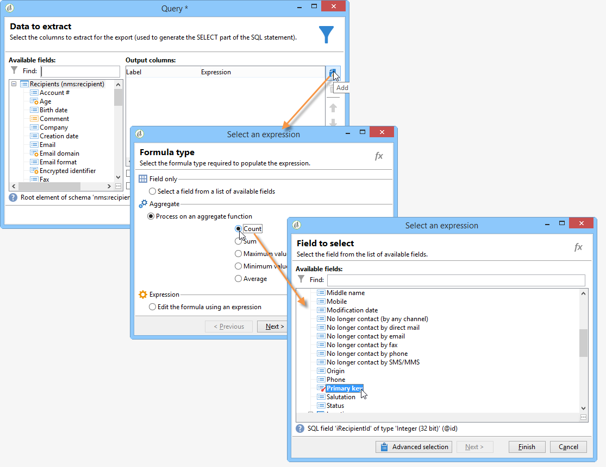

# 建立表格{#creating-a-table}


可以向報表中添加表以顯示資料。 這可以是基於多維資料集度量建立的透視表、具有組的清單或包含值細分的表。


## 建立包含組的清單 {#creating-a-list-with-group}

A **[!UICONTROL List with group]** type表用於對表中的資料進行分組並生成其統計資訊。 例如，您可以為資料建立合計和子合計。 每個組都有其自己的頁眉、詳細資訊和頁腳行。

>[!CAUTION]
>
>的 **[!UICONTROL Page]** 包含表的活動前必須有 **[!UICONTROL Query]** 或 **[!UICONTROL Script]** 活動以收集要在報告中分析的資料。 有關這些活動的詳細資訊，請參閱 [收集要分析的資料](../../reporting/using/collecting-data-to-analyze.md) 和 [指令碼活動](../../reporting/using/advanced-functionalities.md#script-activity)。

### 操作原則 {#operating-principle}

可能需要同時分析多個資料類別。 使用具有組的清單，可以組合資料並建立同一表中不同資料組的統計資訊。 為此，可以在表中建立組。

在以下示例中，組顯示資料庫中的所有市場活動、交貨以及每個交貨和每個市場活動發送的消息數。

它允許您列出市場活動(**[!UICONTROL Label (Campaign)]**，交貨清單(**[!UICONTROL Label]** )連結到市場活動，並允許您計算每個傳遞發送的郵件數(**[!UICONTROL Processed)]**，然後為每個促銷活動添加它們(**[!UICONTROL Sum(@processed)]** )。


### 實施步驟 {#implementation-steps}

下面提供了一個完整的實現示例： [用例：使用組清單建立報告](#use-case--create-a-report-with-a-group-list)。

請注意以下步驟，以建立「具有組的清單」類型表：

1. 轉到報表圖表並放置 **[!UICONTROL Query]** 的子菜單。 請參閱 [收集要分析的資料](../../reporting/using/collecting-data-to-analyze.md)。
1. 填入源表，並選擇統計資訊將關注的表欄位。
1. 放置a **[!UICONTROL Page]** 的下界。 有關此內容的詳細資訊，請參閱 [靜態元素](../../reporting/using/creating-a-new-report.md#static-elements)。
1. 插入 **[!UICONTROL List with group]** 在頁面中鍵入table。
1. 指定資料路徑，或在查詢中選擇作為資料源的表。

   如果以後要恢復源表中的欄位，並將它們插入表的單元格，則此步驟是必需的。

1. 建立表及其內容。
1. 在 **[!UICONTROL Preview]** 頁籤。 然後，您可以發佈報告，並根據需要將其導出為其他格式。 有關此內容的詳細資訊，請參閱 [導出報告](../../reporting/using/actions-on-reports.md#exporting-a-report)。

### 添加行和列 {#adding-lines-and-columns}

預設情況下， **[!UICONTROL List with group]** 類型表包括頁眉、明細行和頁腳行。

組本身包括頁眉、明細和頁腳行。

* **標題行**:此行允許您為表的列指定標題。

   

* **明細行**:此行包含統計值。

   

* **頁腳行**:此行允許您顯示總值。

   

可以添加行和列以滿足您的需要。

該組可放置在表的任何行上，並包括其自己的頁眉、詳細資訊和頁腳行。


**行和列**:要添加或刪除行或列，請轉到現有行或列，然後使用按一下右鍵菜單。


添加的行的性質取決於游標的位置。 例如，要添加標題行，請將游標放在標題上，然後按一下 **[!UICONTROL Add > A line above/below]**。


列的寬度可以通過 **[!UICONTROL Column format]** 的子菜單。

**組**:要添加組，請轉至行並在下拉菜單中選擇匹配項。


### 定義單元格內容 {#defining-cell-content}

要編輯表格的單元格並定義其內容和格式，請轉到該單元格，然後使用按一下右鍵菜單。

使用 **[!UICONTROL Expression]** 的子菜單。


* 要將要直接分析的值插入表中，請在可用欄位中選取它們。

   可用欄位清單與報表構造圖表中表之前的查詢內容一致。

   

* 輸入單元格的標籤，例如標題。

   為此，請使用與在資料庫中插入欄位相同的過程，但不要選擇表達式。 在 **[!UICONTROL Label]** 的子菜單。 它將按原樣顯示。

* 計算聚合（平均值、總和等） 並在單元格中顯示。

   要執行此操作，請使用 **[!UICONTROL Aggregates]** 按鈕。

   

### 定義單元格格式 {#defining-cell-format}


要定義單元格格式， **[!UICONTROL Cell format...]** 的子菜單。

通過這些選項，您可以個性化最終的報表呈現，並更輕鬆地閱讀資訊。

使用 **[!UICONTROL Carriage return]** 將資料導出到Excel時的欄位：選擇 **[!UICONTROL Yes]** 值以強制回車。 導出時將保留此值。 有關此內容的詳細資訊，請參閱 [導出報告](../../reporting/using/actions-on-reports.md#exporting-a-report)。

的 **[!UICONTROL Cell format]** 窗口，您可以訪問以下頁籤：

* 的 **[!UICONTROL Value]** 頁籤
* 的 **[!UICONTROL Borders]** 頁籤
* 的 **[!UICONTROL Click]** 頁籤
* 的 **[!UICONTROL Extra]** 頁籤

的 **[!UICONTROL Value]** 頁籤，您可以更改字型和各種值屬性，或根據其性質定義格式。


格式更改資料顯示：例如， **[!UICONTROL Number]**。 **[!UICONTROL Monetary]** 和 **[!UICONTROL Percentage]** 格式允許您對齊右側的數字並顯示小數點。

如何配置貨幣格式的示例：您可以指定值所表示的貨幣，選擇是否分隔千，以紅色顯示負值。 貨幣符號的位置取決於在其配置檔案中定義的運算子的語言。


日期配置示例：可以選擇是否顯示時間。


的 **邊框** 頁籤中，您可以將邊框添加到表格中的行和列。 將大型報告導出到Excel時，向單元格添加邊框可能會導致效能問題。


如有必要，可在表模板中定義邊框(**[!UICONTROL Administration > Configuration > Form rendering]** )。

在這種情況下，您會使用以下語法：

在Web頁籤中：

```
 .tabular td {
 border: solid 1px #000000;
 }
```

在Excel頁籤中：

```
 <style name="odd" fillColor="#fdfdfd">
  <border>
   <borderTop value="solid 0.05pt #000000" />
   <borderBottom value="solid 0.05pt #000000" />
   <borderLeft value="solid 0.05pt #000000" />
   <borderRight value="solid 0.05pt #000000" />
  </border>
 </style> 
 
 <style name="even" fillColor="#f7f8fa">
  <border>
   <borderTop value="solid 0.05pt #000000" />
   <borderBottom value="solid 0.05pt #000000" />
   <borderLeft value="solid 0.05pt #000000" />
   <borderRight value="solid 0.05pt #000000" />
  </border>
 </style> 
```

的 **[!UICONTROL Click]** 頁籤，用於在用戶按一下單元格或表格的內容時定義操作。

在下面的示例中，按一下單元格中的值可顯示報告的第二頁：它將包含有關單元格中遞送的資訊。


的 **額外** 頁籤中，您可以將視覺對象連結到資料，如彩色標籤或值欄。 當表在圖表中顯示為圖例時，將使用彩色標籤。 有關詳細資訊，請參閱實施示例： [步驟5 — 建立第二頁](#step-5---create-the-second-page)


## 用例：使用組清單建立報告 {#use-case--create-a-report-with-a-group-list}

在此示例中，我們將建立一個兩頁的報告：第一頁將包含清單、每個市場活動的交貨總數以及發送的消息數。 傳遞名稱將是可按一下的連結，並允許您轉到報告的第二頁，查看所選傳遞的每個電子郵件域的傳遞明細，其中包含表和圖表。 在第二頁上，表將用作圖表的圖例。


### 步驟1 — 建立報表 {#step-1---create-a-report}

建立與市場活動架構相關的新報告， **[!UICONTROL Campaigns (nms)]**。


按一下 **[!UICONTROL Save]** 的子菜單。

轉到圖表並添加用於設計報告內容的第一個元件：第一查詢和第一頁。


### 步驟2 — 建立第一個查詢 {#step-2---create-the-first-query}

第一個查詢允許您收集連結到每個市場活動的交貨。 目標是顯示一份關於與每次活動連結的Adobe Campaign資料庫各種交付情況的報告。

按兩下第一個查詢以編輯它，然後應用以下步驟來配置它：

1. 首先更改應用查詢源的架構：選擇 **[!UICONTROL Deliveries (nms)]** 架構。
1. 按一下 **[!UICONTROL Edit query]** 連結並顯示高級欄位。

   

1. 選擇以下欄位：

   * 交貨標籤，
   * 送貨的主鍵，
   * 競選標籤，
   * 已處理交貨的指標，
   * 競選連結的外鍵，
   * 錯誤率指示器。

   

   將別名連結到每個欄位：建議這樣做，以便從將添加到報告第一頁的表中選擇資料。

   在本示例中，我們將使用以下別名：

   * 標籤： **@label**
   * 主鍵： **@deliveryId**
   * 標籤（市場活動）: **@label1**
   * 已處理： **@processed**
   * 「活動」（「id」欄位）連結的外鍵： **@operationId**
   * 錯誤率： **@errorRatio**


1. 按一下 **[!UICONTROL Next]** 按了兩次按鈕才能到達 **[!UICONTROL Data filtering]** 的子菜單。

   添加篩選條件以僅收集連結到市場活動的交貨。

   此篩選器的語法如下：「『運動』的外鍵連結大於0」。

   

1. 按一下 **[!UICONTROL Finish]** 保存這些條件，然後按一下 **[!UICONTROL Ok]** 按鈕關閉對話框。

### 第3步：建立第一頁 {#step-3--create-the-first-page}

在此步驟中，我們將配置報告的第一頁。 要配置它，請應用以下步驟：

1. 開啟 **[!UICONTROL Page]** 並輸入其標題，例如 **交貨** 在這個例子中。

   

1. 通過工具欄插入包含組的清單並輸入其標籤，例如：每個市場活動的交貨清單。

   

1. 按一下 **[!UICONTROL Table data XPath...]** 連結並選擇傳遞連結，即 `[query/delivery]`。

   

1. 按一下 **[!UICONTROL Data]** 頁籤和更改表佈局：在右邊添加三列。

   

1. 添加組。

   

   此組將允許您將市場活動和連結到它們的交貨分組。

1. 在組窗口中，引用 **「競選」連結的外鍵** 關上窗子。

   

1. 編輯組標題的第一個單元格並插入 **[!UICONTROL Label]** 作為表達式的市場活動欄位。

   

1. 編輯詳細資訊行的第二個單元格並選擇交貨 **[!UICONTROL Label]**。

   

1. 編輯此單元格的格式並開啟 **[!UICONTROL Click]** 頁籤。 配置適當的選項，以便用戶按一下交貨名稱時，在同一窗口中開啟。

   

   要執行此操作，請選擇 **[!UICONTROL Next page]** 鍵入操作並選擇 **[!UICONTROL In the same window]** 選項。

   

1. 在窗口的下部，按一下 **[!UICONTROL Add]** 並指定 **`/vars/selectedDelivery`** 路徑和 **[!UICONTROL @deliveryId]** 與先前建立的查詢中定義的傳遞主鍵的別名匹配的表達式。 此公式允許您訪問所選交貨。

   

1. 編輯組頁腳行的第二個單元格並輸入 **[!UICONTROL Total per campaign]** 的子菜單。

   

1. 編輯組標題行的第三個單元格並輸入 **[!UICONTROL Number of messages sent]** 的子菜單。

   

   此資訊與列標題一致。

1. 編輯詳細資訊行的第三個單元格，並選擇已處理的消息指示符作為表達式。

   

1. 編輯組頁腳行的第三個單元格，選擇已處理的交貨指示符並應用 **[!UICONTROL Sum]** 合而為一。

   

1. 編輯詳細資訊行的第四個單元格，然後 **錯誤傳遞錯誤率** 作為表達式。

   

1. 選擇此單元格以顯示表示交貨錯誤率的值欄。

   要執行此操作，請訪問單元格格式，然後轉到 **[!UICONTROL More]** 頁籤。 選擇 **[!UICONTROL Value bar]** 的子菜單。 **[!UICONTROL Hide the cell value]** 的雙曲餘切值。

   

   您現在可以查看報告的呈現。 按一下 **[!UICONTROL Preview]** 的子菜單。 **[!UICONTROL Global]** 選項：這顯示了Adobe Campaign資料庫中連結到市場活動的所有交貨的清單。

   

   建議使用 **[!UICONTROL Preview]** 頁籤，確保正確選擇和配置了表中的資料。 完成此操作後，可以繼續設定表格格式。

1. 應用 **[!UICONTROL Bold]** 顯示每個市場活動的合計和已處理郵件總數的單元格樣式。

   

1. 按一下組題頭行的第1個單元格（顯示市場活動名稱的單元格），然後選擇 **[!UICONTROL Edit > Merge to right]**。

   

   合併組題頭行的前兩個單元格將重新對齊市場活動標題和連結到它的交貨清單。

   

   >[!CAUTION]
   >
   >我們建議在合併單元格之前等待您的報告生成，因為合併是不可逆的。

### 步驟4 — 建立第二個查詢 {#step-4---create-the-second-query}

我們希望添加第二個查詢和第二個頁面，以便在報表用戶按一下交貨時顯示交貨的詳細資訊。 在添加查詢之前，請編輯已建立的頁並啟用傳出轉換，以便它可以連結到查詢。

1. 在 **[!UICONTROL Page]** 活動並編輯其架構：選擇 **[!UICONTROL Recipient delivery logs]** 架構。

   

1. 編輯查詢並定義輸出列。 要顯示每個電子郵件域的交貨數，您需要：

   * 計算主鍵總和以計數交貨日誌數：

      

   * 收集收件人電子郵件域和有關此欄位的組資訊：要執行此操作，請選擇 **[!UICONTROL Group]** 的子菜單。

   

   將以下別名連結到欄位：

   * count（主鍵）: **@count**
   * 電子郵件域（收件人）: **@domain**

      


1. 按一下 **[!UICONTROL Next]** 按鈕兩次：這會帶你去 **[!UICONTROL Data filtering]** 的子菜單。

   添加篩選條件以僅收集連結到選定傳遞的資訊。

   語法如下：「傳遞」連結的外鍵等於設定的值 `$([vars/selectedDelivery])`

   

1. 關閉查詢配置窗口，並在第二個查詢後向圖表添加頁。

### 步驟5 — 建立第二頁 {#step-5---create-the-second-page}

1. 編輯頁面並輸入其標籤： **電子郵件域**。
1. 取消選中 **[!UICONTROL Enable output transitions]** 選項：這是報告的最後一頁，不會跟在其後的活動。

   

1. 使用按一下右鍵菜單添加具有組的新清單並調用它 **每個收件人的電子郵件域**。
1. 按一下 **[!UICONTROL Table data XPath...]** 的 **[!UICONTROL Recipient delivery logs]** 的子菜單。

   

1. 在 **[!UICONTROL Data]** 頁籤，按如下方式調整表：

   * 在右側添加兩列。
   * 在詳細資訊行的第一個單元格中，添加 **[!UICONTROL rowNum()-1]** 表達式，以計數行數。 然後更改單元格的格式：的 **[!UICONTROL Extra]** 頁籤 **[!UICONTROL Color tab]** 按一下 **[!UICONTROL Ok]**。

      

      此配置將使您能夠將表用作圖表的標題。

   * 在詳細資訊行的第二個單元格中， **[!UICONTROL Email domain(Recipient)]** 表達式。
   * 在詳細資訊行的第三個單元格中， **[!UICONTROL count(primary key)]** 表達式。

   

1. 使用按一下右鍵菜單將餅圖添加到頁面，然後分配 **電子郵件域** 標籤。 有關詳細資訊，請參閱 [圖表類型和變型](../../reporting/using/creating-a-chart.md#chart-types-and-variants)。
1. 按一下 **[!UICONTROL Variants]** 連結並取消選擇 **[!UICONTROL Display label]** 和 **[!UICONTROL Display caption]** 頁籤
1. 檢查是否未配置值排序。 如需詳細資訊，請參閱[本章節](../../reporting/using/processing-a-report.md#configuring-the-layout-of-a-descriptive-analysis-report)。

   

1. 在 **[!UICONTROL Data]** 頁籤，更改資料源：選擇 **[!UICONTROL Context data]** 從下拉清單中。

   

1. 然後按一下 **[!UICONTROL Advanced settings]** 並選擇指向收件人傳遞日誌的連結。

   

1. 在 **[!UICONTROL Chart type]** 的 **[!UICONTROL Email domain]** 變數。
1. 然後添加要執行的計算：選擇總計作為運算子。

   

1. 按一下 **[!UICONTROL Detail]** 按鈕，選擇計數將關注的欄位，然後關閉配置窗口。

   

1. 保存報告。

   您的頁面現在已配置。

### 步驟6 — 查看報表 {#step-6---viewing-the-report}

要查看此配置的結果，請按一下 **[!UICONTROL Preview]** 的子菜單。 **[!UICONTROL Global]** 的雙曲餘切值。

報告的第一頁詳細列出了資料庫中包含的所有交貨。


如果按一下其中一個交貨的連結，則會顯示圖表，顯示此交貨的電子郵件域的細目。 您現在位於報告的第二頁，可以通過按一下相應按鈕返回上一頁。


## 建立細分表或透視表 {#creating-a-breakdown-or-pivot-table}

此類型的表允許您顯示對資料庫中資料計算的統計資訊。

這些類型的報告的配置與用於描述性分析嚮導的配置類似。 如需詳細資訊，請參閱[此頁面](../../reporting/using/using-the-descriptive-analysis-wizard.md#configuring-the-quantitative-distribution-template)。

有關建立透視表的詳細資訊，請參閱 [此部分](../../reporting/using/using-cubes-to-explore-data.md)。
