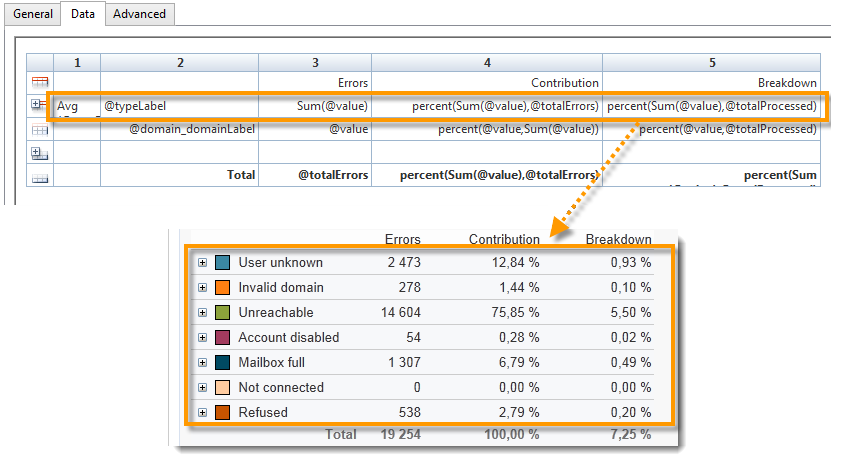
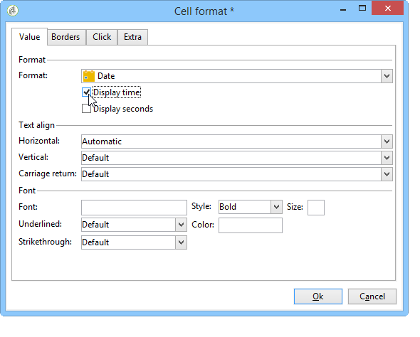
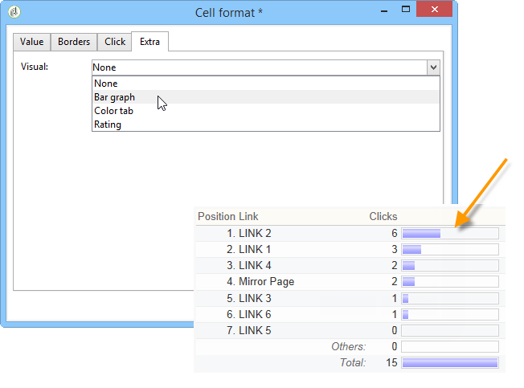
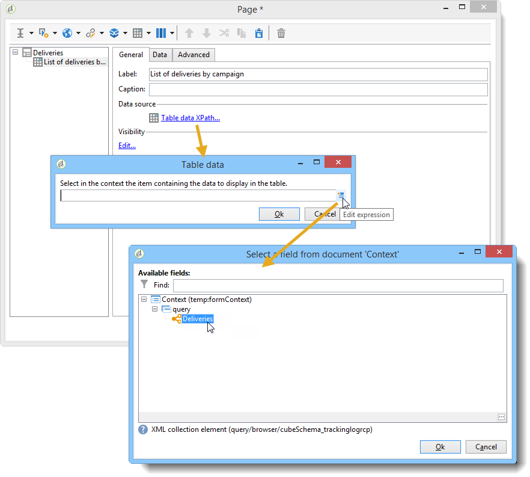

# 建立資料表{#creating-a-table}


您可以新增表格至報表以顯示資料。 這可以是根據多維資料集測量建立的透視表、具有組的清單或包含值劃分的表。


## 建立包含群組的清單 {#creating-a-list-with-group}

A **[!UICONTROL List with group]** 「類型表格」(type table)可讓您將表格中的資料分組，並產生相關統計資料。 例如，您可以建立資料的總計和子總計。 每個群組都有其專屬的頁首、詳細資料和頁尾行。

>[!CAUTION]
>
>此 **[!UICONTROL Page]** 包含表格的活動前面必須有 **[!UICONTROL Query]** 或 **[!UICONTROL Script]** 收集要在報表中分析的資料的活動。 如需這些活動的詳細資訊，請參閱 [收集資料以進行分析](../../reporting/using/collecting-data-to-analyze.md) 和 [指令碼活動](../../reporting/using/advanced-functionalities.md#script-activity).

### 操作原則 {#operating-principle}

您可能需要同時分析數個資料類別。 具有群組的清單可讓您結合資料，並針對相同表格內的各種資料群組建立統計資料。 若要這麼做，您可以在表格中建立群組。

在下列範例中，群組會顯示資料庫中的所有促銷活動、傳送，以及每次傳送和每個促銷活動所傳送的訊息數。

它可讓您列出促銷活動(**[!UICONTROL Label (Campaign)]**，傳遞清單(**[!UICONTROL Label]** )連結至促銷活動，並可讓您計算每次傳送傳送的訊息數(**[!UICONTROL Processed)]**，再為每個促銷活動新增促銷活動(**[!UICONTROL Sum(@processed)]** )。


### 實施步驟 {#implementation-steps}

以下提供完整的實作範例： [使用案例：建立包含群組清單的報表](#use-case--create-a-report-with-a-group-list).

請注意以下步驟，以建立「具有組的清單」類型表：

1. 前往報表圖表，並放置 **[!UICONTROL Query]** 活動。 請參閱 [收集資料以進行分析](../../reporting/using/collecting-data-to-analyze.md).
1. 填寫源表，並選擇統計資訊將涉及的表的欄位。
1. 放置 **[!UICONTROL Page]** 活動。 有關詳細資訊，請參閱 [靜態元素](../../reporting/using/creating-a-new-report.md#static-elements).
1. 插入 **[!UICONTROL List with group]** 在頁面中輸入表格。
1. 指定資料路徑，或在查詢中選擇作為資料源的表。

   如果以後要恢復源表中的欄位，並將它們插入表的單元格中，則此步驟是必需的。

1. 建立表格及其內容。
1. 在 **[!UICONTROL Preview]** 標籤。 接著，您可以發佈報表，並視需要將其匯出為不同格式。 有關詳細資訊，請參閱 [匯出報表](../../reporting/using/actions-on-reports.md#exporting-a-report).

### 添加行和列 {#adding-lines-and-columns}

依預設， **[!UICONTROL List with group]** 類型表包括頁眉、明細行和頁腳行。

組本身包括頁眉、詳細資訊和頁腳行。

* **標題行**:此行可讓您為表格的欄指定標題。

   

* **明細行**:此行包含統計值。

   

* **頁尾行**:此行可讓您顯示總值。

   

您可以新增行和欄以符合您的需求。

組可以放置在表的任何行上，並包括其自己的頁眉、詳細資訊和頁腳行。


**行和列**:要添加或刪除行或列，請轉到現有行或列，然後使用右鍵菜單。


添加的行的性質取決於游標的位置。 例如，要添加標題行，請將游標放在標題上，然後按一下 **[!UICONTROL Add > A line above/below]**.


欄的寬度可透過 **[!UICONTROL Column format]** 項目。

**群組**:若要新增群組，請移至某一行，然後在下拉式功能表中選取相符項目。


### 定義儲存格內容 {#defining-cell-content}

若要編輯表格的儲存格並定義其內容和格式，請移至儲存格，然後使用滑鼠右鍵功能表。

使用 **[!UICONTROL Expression]** ，以選擇要顯示的值。


* 要將要直接分析的值插入表中，請在可用欄位中選取它們。

   可用欄位清單與報表建構圖表中表格之前的查詢內容一致。

   

* 輸入儲存格的標籤，例如標題。

   要執行此操作，請使用與在資料庫中插入欄位相同的過程，但不選擇表達式。 在 **[!UICONTROL Label]** 欄位。 會依原樣顯示。

* 計算匯總（平均值、總和等） 並在儲存格中顯示。

   若要這麼做，請使用 **[!UICONTROL Aggregates]** 功能表項目，然後選取所需的促銷活動。

   

### 定義儲存格格式 {#defining-cell-format}


若要定義儲存格格式，請 **[!UICONTROL Cell format...]** 功能表來存取所選儲存格可用的所有格式選項。

這些選項可讓您個人化報表的最終轉譯，並更輕鬆地閱讀資訊。

使用 **[!UICONTROL Carriage return]** 欄位：選取 **[!UICONTROL Yes]** 值以強制回車。 匯出時會保留此值。 有關詳細資訊，請參閱 [匯出報表](../../reporting/using/actions-on-reports.md#exporting-a-report).

此 **[!UICONTROL Cell format]** 視窗中，您可以存取下列索引標籤：

* 此 **[!UICONTROL Value]** 標籤
* 此 **[!UICONTROL Borders]** 標籤
* 此 **[!UICONTROL Click]** 標籤
* 此 **[!UICONTROL Extra]** 標籤

此 **[!UICONTROL Value]** 頁簽可讓您更改字型和各種值屬性，或根據其性質定義格式。


格式會變更資料顯示：例如， **[!UICONTROL Number]**, **[!UICONTROL Monetary]** 和 **[!UICONTROL Percentage]** 格式可讓您對齊右側的圖形，並顯示小數點。

如何設定貨幣格式的範例：您可以指定值所表示的貨幣、選擇是否要分隔千位，以及以紅色顯示負值。 貨幣符號的位置取決於其設定檔中定義的運算子語言。


日期的設定範例：您可以選擇是否顯示時間。



此 **邊框** 索引標籤可讓您將邊框新增至表格中的行和欄。 將大型報表匯出至Excel時，新增邊框至儲存格可能會導致效能問題。


如有必要，您可以在表格範本中定義邊框(**[!UICONTROL Administration > Configuration > Form rendering]** )。

在此情況下，您會使用下列語法：

在Web頁簽中：

```
 .tabular td {
 border: solid 1px #000000;
 }
```

在Excel索引標籤中：

```
 <style name="odd" fillColor="#fdfdfd">
  <border>
   <borderTop value="solid 0.05pt #000000" />
   <borderBottom value="solid 0.05pt #000000" />
   <borderLeft value="solid 0.05pt #000000" />
   <borderRight value="solid 0.05pt #000000" />
  </border>
 </style> 
 
 <style name="even" fillColor="#f7f8fa">
  <border>
   <borderTop value="solid 0.05pt #000000" />
   <borderBottom value="solid 0.05pt #000000" />
   <borderLeft value="solid 0.05pt #000000" />
   <borderRight value="solid 0.05pt #000000" />
  </border>
 </style> 
```

此 **[!UICONTROL Click]** 索引標籤可讓您定義使用者按一下儲存格或表格內容時的動作。

在以下範例中，按一下儲存格中的值可讓您顯示報表的第二個頁面：其中會包含儲存格內傳送的資訊。


此 **額外** 索引標籤可讓您將視覺化連結至資料，例如彩色標籤或值列。 當表格在圖表中顯示為圖例時，會使用彩色標籤。 如需詳細資訊，請參閱實作範例： [步驟5 — 建立第二頁](#step-5---create-the-second-page)



## 使用案例：建立包含群組清單的報表 {#use-case--create-a-report-with-a-group-list}

在此範例中，我們將建立兩頁報表：第一個頁面會包含清單、每個促銷活動的傳送總數，以及傳送的訊息數量。 傳送名稱將可點按連結，且可讓您前往報表的第二頁，透過表格和圖表檢視所選傳送之每個電子郵件網域的傳送劃分。 在第二頁，表格將作為圖表的圖例。


### 步驟1 — 建立報表 {#step-1---create-a-report}

建立與促銷活動結構相關的新報表， **[!UICONTROL Campaigns (nms)]**.


按一下 **[!UICONTROL Save]** 來建立報表。

前往圖表，並新增用於設計報表內容的第一個元件：第一個查詢和第一個頁面。


### 步驟2 — 建立第一個查詢 {#step-2---create-the-first-query}

第一個查詢可讓您收集連結至每個促銷活動的傳遞。 目標是顯示連結至每個促銷活動之Adobe Campaign資料庫的各種傳送報表。

按兩下第一個查詢以進行編輯，然後套用下列步驟進行設定：

1. 首先，更改應用查詢源的架構：選取 **[!UICONTROL Deliveries (nms)]** 綱要。
1. 按一下 **[!UICONTROL Edit query]** 連結及顯示進階欄位。

   

1. 選取下列欄位：

   * 傳遞標籤，
   * 傳遞的主鍵，
   * 宣傳標籤，
   * 已處理傳送的指標，
   * 行銷活動連結的外鍵，
   * 錯誤率指示器。

   

   將別名連結到每個欄位：建議您這麼做，以便從表格中選取資料，以新增至報表的第一頁。

   在此範例中，我們將使用下列別名：

   * 標籤： **@label**
   * 主鍵： **@deliveryId**
   * 標籤（促銷活動）: **@label1**
   * 已處理： **@processed**
   * 「促銷活動」（「id」欄位）連結的外鍵： **@operationId**
   * 錯誤率： **@errorRatio**


1. 按一下 **[!UICONTROL Next]** 按兩下，才能到達 **[!UICONTROL Data filtering]** 步驟。

   新增篩選條件，以僅收集連結至促銷活動的傳送。

   此篩選器的語法如下：&quot;Campaigns連結的外鍵大於0&quot;。

   

1. 按一下 **[!UICONTROL Finish]** 若要儲存這些條件，請按一下 **[!UICONTROL Ok]** 以關閉查詢編輯器。

### 步驟3:建立第一頁 {#step-3--create-the-first-page}

在此步驟中，我們將設定報表的第一頁。 若要設定，請套用下列步驟：

1. 開啟 **[!UICONTROL Page]** 活動並輸入其標題，例如 **傳遞** 在這個情況下。

   

1. 透過工具列插入含群組的清單並輸入其標籤，例如：每個促銷活動的傳送清單。

   

1. 按一下 **[!UICONTROL Table data XPath...]** 連結，並選取傳送連結，即 `[query/delivery]`.

   

1. 按一下 **[!UICONTROL Data]** 頁簽和更改表格的佈局：在右側新增三欄。

   

1. 新增群組。

   

   此群組可讓您將行銷活動和連結至行銷活動的傳送分組。

1. 在組窗口中，參考 **「促銷活動」連結的外鍵** 然後關上窗戶。

   

1. 編輯群組標題的第一個儲存格並插入 **[!UICONTROL Label]** 行銷活動的欄位作為運算式。

   

1. 編輯詳細資訊行的第二個儲存格，並選取傳送 **[!UICONTROL Label]**.

   

1. 編輯此儲存格的格式並開啟 **[!UICONTROL Click]** 標籤。 設定適當的選項，讓使用者按一下傳送名稱時，就會在相同視窗中開啟。

   

   若要這麼做，請選取 **[!UICONTROL Next page]** 輸入動作並選取 **[!UICONTROL In the same window]** 作為開啟的選項。

   

1. 在視窗的下部，按一下 **[!UICONTROL Add]** 和指定 **`/vars/selectedDelivery`** 路徑和 **[!UICONTROL @deliveryId]** 符合傳送主要索引鍵別名的運算式，如先前建立的查詢中所定義。 此公式可讓您存取選取的傳送。

   

1. 編輯組頁尾行的第二個單元格，然後輸入 **[!UICONTROL Total per campaign]** 作為標籤。

   

1. 編輯組標題行的第三個單元格，然後輸入 **[!UICONTROL Number of messages sent]** 作為標籤。

   

   此資訊與欄標題一致。

1. 編輯詳細資訊行的第三個儲存格，並選取已處理的訊息指示器作為運算式。

   

1. 編輯群組頁尾行的第三個儲存格，選取已處理的傳送指標並套用 **[!UICONTROL Sum]** 集合到其中。

   

1. 編輯詳細資訊行的第四個儲存格，並選取 **錯誤傳遞錯誤率** 作為運算式。

   

1. 選取此儲存格，以顯示代表傳送錯誤率的值列。

   若要這麼做，請存取儲存格格式，然後前往 **[!UICONTROL More]** 標籤。 選取 **[!UICONTROL Value bar]** ，然後選取 **[!UICONTROL Hide the cell value]** 選項。

   

   您現在可以檢視報表的呈現。 按一下 **[!UICONTROL Preview]** 標籤，然後選取 **[!UICONTROL Global]** 選項：這會顯示連結至促銷活動之Adobe Campaign資料庫中所有傳送的清單。

   

   建議您使用 **[!UICONTROL Preview]** 頁簽，確保已正確選取並設定表格中的資料。 完成此操作後，您可以繼續格式化表格。

1. 套用 **[!UICONTROL Bold]** 樣式，顯示每個促銷活動的總計和處理的訊息總數。

   

1. 按一下群組標題行的第一個儲存格，即顯示促銷活動名稱的儲存格，然後選取 **[!UICONTROL Edit > Merge to right]**.

   

   合併群組標題行的前兩個儲存格，將會重新對齊促銷活動標題和連結至該行銷活動的傳送清單。

   

   >[!CAUTION]
   >
   >建議您等到報表建置完成，再合併儲存格，因為合併是不可復原的。

### 步驟4 — 建立第二個查詢 {#step-4---create-the-second-query}

我們想新增第二個查詢和第二個頁面，以在報表的使用者點按時顯示傳送的詳細資料。 新增查詢前，請編輯您建立的頁面並啟用傳出轉變，以便將其連結至查詢。

1. 在 **[!UICONTROL Page]** 活動及編輯其結構：選取 **[!UICONTROL Recipient delivery logs]** 綱要。

   

1. 編輯查詢並定義輸出欄。 若要顯示每個電子郵件網域的傳送數量，您必須：

   * 計算主要金鑰的總和，以計算傳送記錄檔的數量：

      

   * 收集此欄位的收件者電子郵件網域和群組資訊：要執行此操作，請選取 **[!UICONTROL Group]** 選項。

   

   將以下別名連結到欄位：

   * count(primary key): **@count**
   * 電子郵件域（收件人）: **@domain**

      


1. 按一下 **[!UICONTROL Next]** 按鈕兩次：這樣就能帶你去 **[!UICONTROL Data filtering]** 步驟。

   新增篩選條件，以僅收集連結至所選傳送的資訊。

   語法如下：「傳送」連結的外鍵等於設定的值 `$([vars/selectedDelivery])`

   

1. 關閉查詢配置窗口，並在第二個查詢後添加一個頁到圖表。

### 步驟5 — 建立第二頁 {#step-5---create-the-second-page}

1. 編輯頁面並輸入其標籤： **電子郵件網域**.
1. 取消核取 **[!UICONTROL Enable output transitions]** 選項：這是報表的最後一頁，後面不會有其他活動。

   

1. 使用滑鼠右鍵功能表新增群組清單，並加以呼叫 **每個收件者的電子郵件網域**.
1. 按一下 **[!UICONTROL Table data XPath...]** ，然後選取 **[!UICONTROL Recipient delivery logs]** 連結。

   

1. 在 **[!UICONTROL Data]** 標籤，調整表格如下：

   * 在右側新增兩欄。
   * 在詳細資訊行的第一個儲存格中，新增 **[!UICONTROL rowNum()-1]** 計算行數的運算式。 然後變更儲存格的格式：在 **[!UICONTROL Extra]** 索引標籤，選取 **[!UICONTROL Color tab]** 按一下 **[!UICONTROL Ok]**.

      

      此設定可讓您將表格用作圖表的註解。

   * 在詳細資訊行的第二個儲存格中，新增 **[!UICONTROL Email domain(Recipient)]** 運算式。
   * 在詳細資訊行的第三個儲存格中，新增 **[!UICONTROL count(primary key)]** 運算式。

   

1. 使用滑鼠右鍵功能表新增圓形圖至頁面，並指派 **電子郵件網域** 標籤。 如需詳細資訊，請參閱 [圖表類型和變體](../../reporting/using/creating-a-chart.md#chart-types-and-variants).
1. 按一下 **[!UICONTROL Variants]** 連結並取消選取 **[!UICONTROL Display label]** 和 **[!UICONTROL Display caption]** 選項。
1. 檢查是否未配置值排序。 如需詳細資訊，請參閱[本章節](../../reporting/using/processing-a-report.md#configuring-the-layout-of-a-descriptive-analysis-report)。

   

1. 在 **[!UICONTROL Data]** 頁簽，更改資料源：選取 **[!UICONTROL Context data]** 從下拉式清單中。

   

1. 然後按一下 **[!UICONTROL Advanced settings]** 並選取收件者傳送記錄檔的連結。

   

1. 在 **[!UICONTROL Chart type]** 區段，選取 **[!UICONTROL Email domain]** 變數。
1. 然後新增要執行的計算：選取總和作為運算子。

   

1. 按一下 **[!UICONTROL Detail]** 按鈕，選擇計數將關注的欄位，然後關閉配置窗口。

   

1. 儲存報表。

   您的頁面現在已設定完畢。

### 步驟6 — 檢視報表 {#step-6---viewing-the-report}

若要檢視此設定的結果，請按一下 **[!UICONTROL Preview]** 標籤，然後選取 **[!UICONTROL Global]** 選項。

報表的第一頁詳細說明資料庫中包含的所有傳送清單。


如果您按一下其中一個傳送的連結，圖表會顯示此傳送的電子郵件網域劃分。 您現在位在報表的第二頁，可按一下適當的按鈕，返回上一頁。


## 建立劃分或樞紐表格 {#creating-a-breakdown-or-pivot-table}

此類型的表格可讓您顯示根據資料庫中資料計算的統計資料。

這些類型的報表的設定與描述性分析精靈所使用的報表類似。 如需詳細資訊，請參閱[此頁面](../../reporting/using/using-the-descriptive-analysis-wizard.md#configuring-the-quantitative-distribution-template)。

有關建立透視表的詳細資訊，請參閱 [本節](../../reporting/using/using-cubes-to-explore-data.md).
