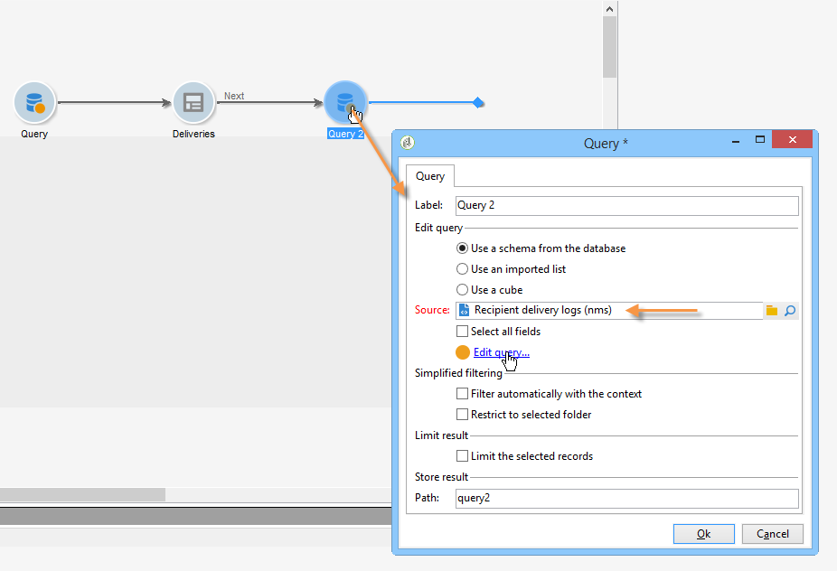
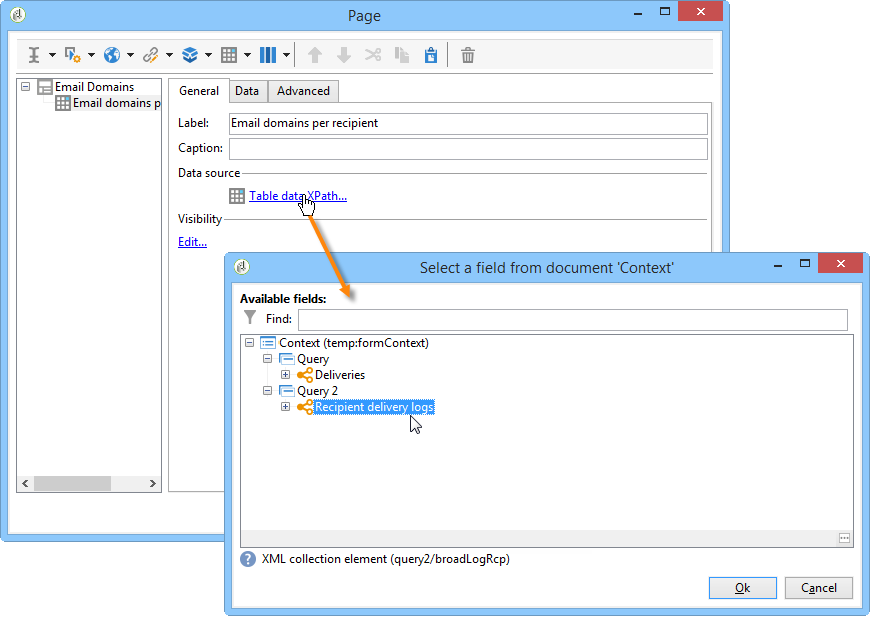

# 建立表{#creating-a-table}

您可以新增表格至報表以顯示資料。 這可以是基於立方度量建立的透視表、具有組的清單或包含值劃分的表。


## 建立含群組的清單 {#creating-a-list-with-group}

類型 **[!UICONTROL List with group]** 表格可讓您將表格中的資料分組，並產生其統計資料。 例如，您可以建立資料的總計和子總計。 每個群組都有自己的頁首、詳細資料和頁尾行。

>[!CAUTION]
>
>包 **[!UICONTROL Page]** 含表格的活動前面必須有 **[!UICONTROL Query]** 或 **[!UICONTROL Script]** 活動，才能收集要在報表中分析的資料。 如需這些活動的詳細資訊，請參 [閱「收集資料以分析](../../reporting/using/collecting-data-to-analyze.md)[和指令碼活動](../../reporting/using/advanced-functionalities.md#script-activity)」。

### 操作原則 {#operating-principle}

您可能需要一次分析數個資料類別。 具有群組的清單可讓您結合資料，並建立同一表格內不同資料群組的統計資料。 若要這麼做，您可以在表格中建立群組。

在下列範例中，群組會顯示資料庫中的所有促銷活動、傳送，以及每個傳送和每個促銷活動所傳送的訊息數。

它可讓您列出連結至促銷活動的促銷活動(傳送清單(**[!UICONTROL Label (Campaign)]**))，並可讓您計算每次傳送傳送(**[!UICONTROL Label]** ，為每個促銷活動加總之前)的訊息數(**[!UICONTROL Processed)]****[!UICONTROL Sum(@processed)]** )。


### 實施步驟 {#implementation-steps}

此處提供完整的實作範例：使 [用案例：建立含群組清單的報表](#use-case--create-a-report-with-a-group-list)。

請注意以下步驟，以建立「含群組的清單」類型表格：

1. 前往報表圖表並放置活 **[!UICONTROL Query]** 動。 請參閱 [收集資料以分析](../../reporting/using/collecting-data-to-analyze.md)。
1. 填寫來源表格，並選擇統計資料將涉及的表格欄位。
1. 在圖表 **[!UICONTROL Page]** 中放置活動。 For more on this, refer to [Static elements](../../reporting/using/creating-a-new-report.md#static-elements).
1. 將文字 **[!UICONTROL List with group]** 表格插入頁面。
1. 指定資料路徑，或在查詢中選擇為資料來源的表格。

   如果以後要恢復源表中的欄位，並將它們插入表的單元格，則此步驟是強制的。

1. 建立表及其內容。
1. 在標籤中顯示已完成的 **[!UICONTROL Preview]** 報表。 然後，您可以發佈報表，並視需要將其匯出為不同格式。 有關此的詳細資訊，請參 [閱匯出報表](../../reporting/using/actions-on-reports.md#exporting-a-report)。

### 添加行和列 {#adding-lines-and-columns}

預設情況下， **[!UICONTROL List with group]** 類型表包括頁眉、明細行和頁腳行。

組本身包括頁眉、明細和頁腳行。

* **題頭行**:此行可讓您為表格欄指定標題。

   

* **明細行**:此行包含統計值。

   

* **頁尾行**:此行可讓您顯示總值。

   

您可以根據需要新增行和欄。

該組可放置在表的任何行上，並包括其自己的頁眉、明細和頁腳行。


**行和列**:要添加或刪除行或列，請轉至現有行或列，然後使用按一下右鍵菜單。


添加的行的性質取決於游標的位置。 例如，若要新增標題行，請將游標置於標題上，然後按一下 **[!UICONTROL Add > A line above/below]**。


欄的寬度可透過項目來修 **[!UICONTROL Column format]** 改。

**群組**:若要新增群組，請移至一行，然後在下拉式選單中選取相符項目。


### 定義儲存格內容 {#defining-cell-content}

若要編輯表格的儲存格並定義其內容和格式，請移至儲存格，然後使用滑鼠右鍵選單。

使用功 **[!UICONTROL Expression]** 能表項目來選取要顯示的值。


* 要將要直接分析的值插入表中，請從可用欄位中選擇這些值。

   可用欄位清單與報表構造圖表中表之前的查詢內容一致。

   

* 輸入儲存格的標籤，例如標題一。

   要執行此操作，請使用與將欄位插入資料庫相同的過程，但不要選擇表達式。 在欄位中輸入標 **[!UICONTROL Label]** 簽。 將按原樣顯示。

* 計算匯總（平均值、總和等）並在儲存格中顯示。

   若要這麼做，請使用功能表 **[!UICONTROL Aggregates]** 項目並選取所要的促銷活動。

   

### 定義單元格格式 {#defining-cell-format}


要定義單元格格式，菜單 **[!UICONTROL Cell format...]** 允許您訪問所選單元格的所有可用格式選項。

這些選項可讓您個人化報表的最終呈現，讓您更輕鬆地閱讀資訊。

將資料匯 **[!UICONTROL Carriage return]** 出至Excel時，請使用欄位：選擇 **[!UICONTROL Yes]** 值以強制回車。 此值在導出時將保留。 有關此的詳細資訊，請參 [閱匯出報表](../../reporting/using/actions-on-reports.md#exporting-a-report)。

該窗 **[!UICONTROL Cell format]** 口允許您訪問以下頁籤：

* 頁籤( **[!UICONTROL Value]** T)
* 頁籤( **[!UICONTROL Borders]** T)
* 頁籤( **[!UICONTROL Click]** T)
* 頁籤( **[!UICONTROL Extra]** T)

此標 **[!UICONTROL Value]** 簽可讓您變更字型和各種值屬性，或根據其性質定義格式。


格式會變更資料顯示：例如， **[!UICONTROL Number]**&#x200B;和 **[!UICONTROL Monetary]****[!UICONTROL Percentage]** 格式允許您對齊右側的數字並顯示小數點。

如何設定貨幣格式的範例：您可以指定值所表示的貨幣、選擇是否分隔千位，並以紅色顯示負值。 貨幣符號的位置取決於在其配置檔案中定義的運算子的語言。


日期的設定範例：您可以選擇是否顯示時間。


「邊 **框** 」(Borders)頁籤可讓您將邊框添加到表格中的行和列。 將大型報表匯出至Excel時，新增邊框至儲存格可能會導致效能問題。


如有必要，可以在表模板中定義邊界(**[!UICONTROL Administration > Configuration > Form rendering]** )。

在這種情況下，您會使用下列語法：

在「網頁」索引標籤中：

```
 .tabular td {
 border: solid 1px #000000;
 }
```

在Excel標籤中：

```
 <style name="odd" fillColor="#fdfdfd">
  <border>
   <borderTop value="solid 0.05pt #000000" />
   <borderBottom value="solid 0.05pt #000000" />
   <borderLeft value="solid 0.05pt #000000" />
   <borderRight value="solid 0.05pt #000000" />
  </border>
 </style> 
 
 <style name="even" fillColor="#f7f8fa">
  <border>
   <borderTop value="solid 0.05pt #000000" />
   <borderBottom value="solid 0.05pt #000000" />
   <borderLeft value="solid 0.05pt #000000" />
   <borderRight value="solid 0.05pt #000000" />
  </border>
 </style> 
```

此標 **[!UICONTROL Click]** 簽可讓您定義當使用者點按儲存格或表格內容時的動作。

在下列範例中，按一下儲存格中的值可讓您顯示報表的第二頁：它將包含儲存格中傳送的資訊。


「 **Extra** 」標籤可讓您將視覺化項目連結至資料，例如彩色標籤或值列。 當表格在圖表中顯示為圖例時，會使用彩色標籤。 如需詳細資訊，請參閱實作範例：步 [驟5 —— 建立第二頁](#step-5---create-the-second-page)


## 使用案例：建立包含群組清單的報表 {#use-case--create-a-report-with-a-group-list}

在此範例中，我們將建立兩頁報表：第一頁將包含清單和每個促銷活動的傳送總數，以及傳送的訊息數。 傳送名稱將可點按連結，並可讓您前往報表的第二頁，以檢視所選傳送中每個電子郵件網域的傳送劃分及表格和圖表。 在第二頁，表格將用作圖表的圖例。


### 步驟1 —— 建立報表 {#step-1---create-a-report}

建立與促銷活動結構相關的新報表 **[!UICONTROL Campaigns (nms)]**。


按一 **[!UICONTROL Save]** 下以建立報表。

前往圖表並新增要用於設計報表內容的第一個元件：第一查詢和第一頁。


### 步驟2 —— 建立第一個查詢 {#step-2---create-the-first-query}

第一個查詢可讓您收集連結至每個促銷活動的傳送。 其目標是顯示連結至每個促銷活動之Adobe Campaign資料庫的各種傳送報表。

連按兩下第一個查詢以加以編輯，然後套用下列步驟以進行設定：

1. 首先，更改應用查詢源的方案：選擇方 **[!UICONTROL Deliveries (nms)]** 案。
1. 按一下連 **[!UICONTROL Edit query]** 結並顯示進階欄位。

   

1. 選取下列欄位：

   * 遞送標籤，
   * 交付的主要關鍵，
   * 促銷活動標籤，
   * 已處理交貨的指標，
   * 促銷活動連結的外鍵，
   * 錯誤率指示器。
   

   將別名連結到每個欄位：建議您這麼做，以方便從將新增至報表第一頁的表格中選取資料。

   在此示例中，我們將使用以下別名：

   * 標籤： **@label**
   * 主鍵： **@deliveryId**
   * 標籤（促銷活動）: **@label1**
   * 已處理： **@processed**
   * 「促銷活動」（「id」欄位）連結的外鍵： **@operationId**
   * 錯誤率： **@errorRatio**


1. 按兩 **[!UICONTROL Next]** 下按鈕以進入步 **[!UICONTROL Data filtering]** 驟。

   新增篩選條件，僅收集連結至促銷活動的傳送。

   此篩選器的語法如下：「&#39;促銷活動&#39;連結的外鍵大於0」。

   

1. 按一 **[!UICONTROL Finish]** 下以儲存這些條件，然後按一 **[!UICONTROL Ok]** 下以關閉查詢編輯器。

### 步驟3:建立第一頁 {#step-3--create-the-first-page}

在此步驟中，我們將設定報表的第一頁。 若要設定，請套用下列步驟：

1. 開啟活 **[!UICONTROL Page]** 動並輸入其標題，例如 **Deliveries** 。

   

1. 透過工具列插入含群組的清單並輸入其標籤，例如：每個促銷活動的傳送清單。

   

1. 按一下 **[!UICONTROL Table data XPath...]** 連結並選取傳送連結，例如 `[query/delivery]`。

   

1. 按一下該 **[!UICONTROL Data]** 頁籤並更改表的佈局：在右側新增三欄。

   

1. 新增群組。

   

   此群組可讓您將促銷活動和連結至促銷活動的傳送分組。

1. 在群組視窗中，參考「 **促銷活動」連結的外鍵** ，並關閉視窗。

   

1. 編輯群組標題的第一個儲存格，並將促銷 **[!UICONTROL Label]** 活動的欄位插入為運算式。

   

1. 編輯詳細資料行的第二個儲存格，並選取傳送 **[!UICONTROL Label]**。

   

1. 編輯此儲存格的格式，並開啟標 **[!UICONTROL Click]** 簽。 設定適當的選項，讓使用者按一下傳送名稱時，在相同視窗中開啟。

   

   要執行此操作，請選擇一 **[!UICONTROL Next page]** 個類型操作並選 **[!UICONTROL In the same window]** 擇作為開啟選項。

   

1. 在視窗的下半部，按一 **[!UICONTROL Add]** 下並指定路徑 **`/vars/selectedDelivery`****[!UICONTROL @deliveryId]** 和與傳送的主鍵別名相符的運算式，如先前建立的查詢中所定義。 此公式可讓您存取選取的傳送。

   

1. 編輯群組頁尾行的第二個儲存格，並輸 **[!UICONTROL Total per campaign]** 入為標籤。

   

1. 編輯群組標題行的第三個儲存格，並輸 **[!UICONTROL Number of messages sent]** 入為標籤。

   

   此資訊與列標題一致。

1. 編輯詳細資料行的第三個儲存格，並選取已處理的訊息指示符作為運算式。

   

1. 編輯群組頁尾行的第三個儲存格，選取已處理的傳送指標，並套用匯 **[!UICONTROL Sum]** 總至它。

   

1. 編輯明細行的第四個儲存格，並選取錯 **誤傳送錯誤率** ，做為運算式。

   

1. 選取此儲存格，以顯示代表傳送錯誤率的值列。

   若要這麼做，請存取儲存格格式，然後前往標 **[!UICONTROL More]** 簽。 在下拉 **[!UICONTROL Value bar]** 式清單中選取項目，然後選取 **[!UICONTROL Hide the cell value]** 選項。

   

   您現在可以檢視報表演算。 按一下標 **[!UICONTROL Preview]** 簽並選取 **[!UICONTROL Global]** 選項：這會顯示連結至促銷活動之Adobe Campaign資料庫中所有傳送的清單。

   

   建議使用標 **[!UICONTROL Preview]** 簽，以確認表格中的資料已正確選取和設定。 完成後，您可以繼續格式化表格。

1. 將樣式 **[!UICONTROL Bold]** 套用至顯示每個促銷活動總計和所處理訊息總數的儲存格。

   

1. 按一下群組標題行的第一個儲存格，即顯示促銷活動名稱的儲存格，然後選取 **[!UICONTROL Edit > Merge to right]**。

   

   合併群組標題行的前兩個儲存格，將會重新對齊促銷活動標題和連結至其的傳送清單。

   

   >[!CAUTION]
   >
   >我們建議您等到建立報表後再合併儲存格，因為合併是不可逆的。

### 步驟4 —— 建立第二個查詢 {#step-4---create-the-second-query}

我們想新增第二個查詢和第二個頁面，以在報表使用者點按時顯示傳送的詳細資料。 新增查詢前，請編輯您所建立的頁面，並啟用傳出轉移，以便連結至查詢。

1. 在活動後添加新查詢並 **[!UICONTROL Page]** 編輯其方案：選擇方 **[!UICONTROL Recipient delivery logs]** 案。

   

1. 編輯查詢並定義輸出列。 若要顯示每個電子郵件網域的傳送次數，您必須：

   * 計算主鍵的總和，以計算傳送記錄檔的數目：

      

   * 收集收件者電子郵件網域和群組資訊，並在此欄位中：若要這麼做，請在網 **[!UICONTROL Group]** 域名欄中選取選項。
   

   將下列別名連結到欄位：

   * count(primary key): **@count**
   * 電子郵件網域（收件者）: **@domain**

      


1. 按兩 **[!UICONTROL Next]** 下按鈕：這會帶您進入步 **[!UICONTROL Data filtering]** 驟。

   新增篩選條件，僅收集連結至所選傳送的資訊。

   語法如下：「傳送」連結的外鍵等於設定值 `$([vars/selectedDelivery])`

   

1. 關閉查詢設定視窗，並在第二個查詢後新增頁面至圖表。

### 步驟5 —— 建立第二頁 {#step-5---create-the-second-page}

1. 編輯頁面並輸入其標籤：電 **子郵件網域**。
1. 取消選中 **[!UICONTROL Enable output transitions]** 選項：這是報表的最後一頁，後面不會有其他活動。

   

1. 使用滑鼠右鍵功能表，新增包含群組的新清單，並依每個收件者呼叫 **此清單「電子郵件網域」**。
1. 按一下 **[!UICONTROL Table data XPath...]** 並選取連 **[!UICONTROL Recipient delivery logs]** 結。

   

1. 在標籤 **[!UICONTROL Data]** 中，按如下方式調整表格：

   * 在右側新增兩欄。
   * 在明細行的第一個單元格中，添加 **[!UICONTROL rowNum()-1]** 表達式以計算行數。 然後變更儲存格的格式：在頁籤 **[!UICONTROL Extra]** 中，選擇並 **[!UICONTROL Color tab]** 按一下 **[!UICONTROL Ok]**。

      

      此設定可讓您使用表格作為圖表的標題。

   * 在詳細資料行的第二個儲存格中，新增運算 **[!UICONTROL Email domain(Recipient)]** 式。
   * 在詳細資料行的第三個儲存格中，新增運算 **[!UICONTROL count(primary key)]** 式。
   

1. 使用右鍵功能表新增圓形圖至頁面，並指派「電子郵 **件網域** 」標籤給頁面。 如需詳細資訊，請參閱 [圖表類型和變數](../../reporting/using/creating-a-chart.md#chart-types-and-variants)。
1. 按一下連 **[!UICONTROL Variants]** 結並取消選取 **[!UICONTROL Display label]** 和選項 **[!UICONTROL Display caption]** 。
1. 檢查是否未配置值排序。 如需詳細資訊，請參閱[本小節](../../reporting/using/processing-a-report.md#configuring-the-layout-of-a-descriptive-analysis-report)。

   

1. 在標籤 **[!UICONTROL Data]** 中，變更資料來源：從下 **[!UICONTROL Context data]** 拉式清單中選取。

   

1. 然後按一 **[!UICONTROL Advanced settings]** 下並選取收件者傳送記錄的連結。

   

1. 在區段 **[!UICONTROL Chart type]** 中，選取變 **[!UICONTROL Email domain]** 數。
1. 然後，添加要執行的計算：選擇總和作為運算子。

   

1. 按一下按 **[!UICONTROL Detail]** 鈕以選擇計數將關注的欄位，然後關閉配置窗口。

   

1. 儲存報表。

   您的頁面現在已設定。

### 步驟6 —— 檢視報表 {#step-6---viewing-the-report}

要查看此配置的結果，請按一下該選 **[!UICONTROL Preview]** 項卡並選擇 **[!UICONTROL Global]** 選項。

報表的第一頁詳細列出資料庫中所包含的所有傳送。


如果您按一下其中一個傳送的連結，圖表會顯示此傳送的電子郵件網域劃分。 您現在位於報表的第二頁，可按一下適當的按鈕返回上一頁。


## 建立劃分或樞紐分析表 {#creating-a-breakdown-or-pivot-table}

此類型的表格可讓您顯示根據資料庫中資料計算的統計資料。

這些類型的報表的設定與描述性分析精靈所用的報表類似。 有關詳細資訊，請參見[此頁面](../../reporting/using/using-the-descriptive-analysis-wizard.md#configuring-the-quantitative-distribution-template)。

有關建立透視表的詳細資訊，請參 [閱此部分](../../reporting/using/using-cubes-to-explore-data.md)。
