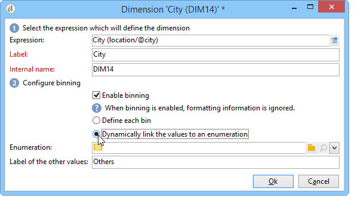
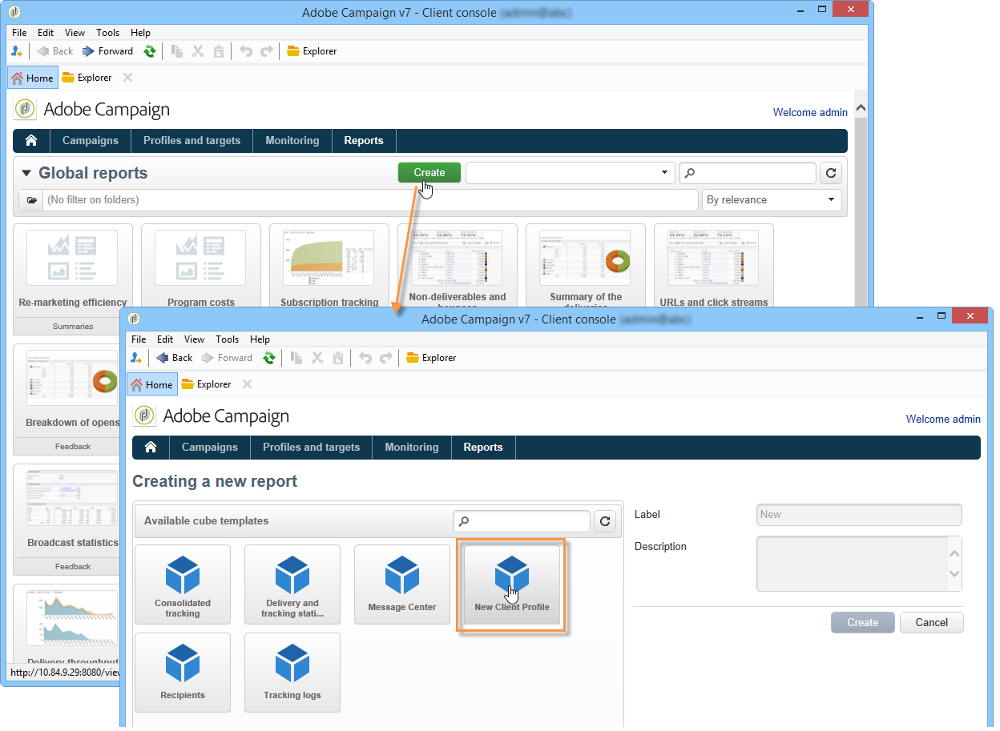

# 建立指標{#creating-indicators}

要使多維資料集功能化，您需要標識相關維和度量並在多維資料集中建立它們。

要建立多維資料集，請應用以下步驟：

1. 選擇工作表。 請參閱[選擇工作表](#selecting-the-work-table)。
1. 定義維度。 請參閱[定義維度](#defining-dimensions)。
1. 定義測量。 請參閱[建置指標](#building-indicators)。
1. 建立匯總（選用）。 請參閱[計算和使用匯總](../../reporting/using/concepts-and-methodology.md#calculating-and-using-aggregates)。

此示例說明如何快速建立報表中的簡單多維資料集以導出其測量。

實作步驟於下文詳細說明。 本章其他章節提供詳盡的選項和說明。

## 選擇工作表 {#selecting-the-work-table}

要建立多維資料集，請按一下多維資料集清單上方的&#x200B;**[!UICONTROL New]**&#x200B;按鈕。

選取事實架構，即包含您要探索之元素的架構。 在此範例中，我們將選取&#x200B;**Recipient**&#x200B;表格。

按一下&#x200B;**[!UICONTROL Save]**&#x200B;建立多維資料集：它將出現在多維資料集清單中，然後可以使用相應頁簽進行配置。

按一下&#x200B;**[!UICONTROL Filter the source data...]**&#x200B;連結，將此多維資料集的計算應用於資料庫中的資料選擇。

## 定義維度 {#defining-dimensions}

Dimension與根據每個多維資料集的相關數值模式為每個多維資料集定義的分析軸一致。 這些是分析中探討的維度，例如時間（年、月、日……）、產品或合同的分類（家庭、參考等）、人口區段（依城市、年齡組、狀態等）。

這些分析軸在多維資料集的&#x200B;**[!UICONTROL Dimension]**&#x200B;頁簽中定義。

按一下&#x200B;**[!UICONTROL Add]**&#x200B;按鈕以建立新維，然後在&#x200B;**[!UICONTROL Expression field]**&#x200B;中按一下&#x200B;**[!UICONTROL Edit expression]**&#x200B;圖示以選取包含相關資料的欄位。

* 首先，選擇收件者&#x200B;**年齡**。 對於此欄位，您可以定義組合年齡，並讓資訊閱讀更輕鬆。 建議您在可能有數個個別值時使用捆綁。

   要執行此操作，請核取&#x200B;**[!UICONTROL Enable binning]**&#x200B;選項。 在[資料綁定](../../reporting/using/concepts-and-methodology.md#data-binning)中詳細說明綁定模式。

   

* 新增&#x200B;**Date**&#x200B;類型維度。 在此處，我們要顯示收件者設定檔建立日期

   要執行此操作，請按一下&#x200B;**[!UICONTROL Add]**&#x200B;並選取收件者表格中的&#x200B;**[!UICONTROL Creation date]**&#x200B;欄位。

   

   可以選取日期顯示模式。 要執行此操作，請選取要使用的階層以及要產生的層級：

   

   在我們的範例中，我們只想顯示年、月和日，因為無法同時使用周和月/月：這些級別不相容。

* 建立另一個維度以分析與收件者城市相關的資料

   要執行此操作，請新增維度，並在收件者架構的&#x200B;**[!UICONTROL Location]**&#x200B;節點中選取城市。

   

   您可以啟用捆綁，讓資訊讀取更輕鬆，並將值連結至列舉。

   

   從下拉式清單中選取分項清單

   

   只會顯示分項清單中的值。 其他項目將分組在&#x200B;**[!UICONTROL Label of the other values]**&#x200B;欄位中定義的標籤下。

   有關詳細資訊，請參閱[動態管理Bin](../../reporting/using/concepts-and-methodology.md#dynamically-managing-bins)。

## 建設指標 {#building-indicators}

定義維度後，您必須為要在儲存格中顯示的值指定計算模式。 要執行此操作，請在&#x200B;**[!UICONTROL Measures]**&#x200B;索引標籤中建立相符的指標：建立將使用多維資料集的報告中要顯示的列數。

若要這麼做，請套用下列步驟：

1. 按一下 **[!UICONTROL Add]** 按鈕。
1. 選擇要應用的度量類型和公式。 在此，我們要統計受助者中的婦女人數。

   我們的度量基於事實模式，並使用&#x200B;**[!UICONTROL Count]**&#x200B;運算子。

   

   **[!UICONTROL Filter the measure data...]**&#x200B;連結可讓您僅選取女性。 有關定義度量和可用選項的詳細資訊，請參閱[定義度量](../../reporting/using/concepts-and-methodology.md#defining-measures)。

   

1. 輸入度量的標籤並保存它。

   

1. 保存多維資料集。

## 根據多維資料集建立報表 {#creating-a-report-based-on-a-cube}

配置多維資料集後，可將其用作建立新報告的模板。

操作步驟：

1. 按一下&#x200B;**[!UICONTROL Reports]**&#x200B;頁簽的&#x200B;**[!UICONTROL Create]**&#x200B;按鈕，然後選擇剛建立的多維資料集。

   

1. 按一下&#x200B;**[!UICONTROL Create]**&#x200B;按鈕以確認：這會帶您前往報表設定和檢視頁面。

   依預設，前兩個可用維度以行和欄提供，但表格中未顯示任何值。 若要產生表格，請按一下主圖示：

   

1. 您可以切換尺寸的軸、刪除它們、添加新測量等。 可能的操作詳見：[使用立方體來探索資料](../../reporting/using/using-cubes-to-explore-data.md)。

   要執行此操作，請使用適當的圖示。

   
