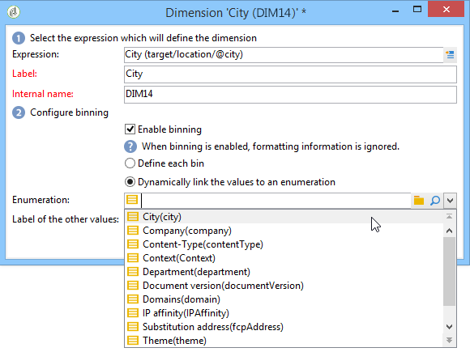

# 建立指標{#creating-indicators}

要使立方功能化，您需要標識相關維和度量並在立方中建立它們。

要建立立方，請應用以下步驟：

1. 選擇工作表。 請參閱 [選擇工作表](#selecting-the-work-table)。
1. 定義尺寸。 請參閱定 [義尺寸](#defining-dimensions)。
1. 定義測量。 請參閱「 [Building indicators(建立指示燈](#building-indicators))」。
1. 建立匯整（選用）。 請參閱計 [算和使用匯總](../../reporting/using/concepts-and-methodology.md#calculating-and-using-aggregates)。

此範例說明如何快速在報表中建立簡單立方，以匯出其度量。

實施步驟詳述如下。 本章的其他章節提供完整的選項和說明。

## 選擇工作表 {#selecting-the-work-table}

要建立立方，請按一下立 **[!UICONTROL New]** 方清單上方的按鈕。

選擇數值模式，即包含要瀏覽的元素的模式。 在此示例中，我們將選擇「收件 **者** 」(Recipient)表。

按一下 **[!UICONTROL Save]** 建立立方：它將出現在立方的清單中，然後可以使用相應的頁籤進行配置。

按一下該 **[!UICONTROL Filter the source data...]** 連結可將此立方的計算應用於資料庫中的選定資料。

## 定義尺寸 {#defining-dimensions}

維與為每個立方定義的分析軸基於其相關的事實模式一致。 這些是分析中探索的維度，例如時間（年、月、日……）、產品或合約的分類（家庭、參考等）、人口區段（依城市、年齡組、狀態等）。

這些分析軸在立方的選 **[!UICONTROL Dimension]** 項卡中定義。

按一 **[!UICONTROL Add]** 下按鈕以建立新維度，然後按一 **[!UICONTROL Expression field]**&#x200B;下圖 **[!UICONTROL Edit expression]** 示以選取包含相關資料的欄位。

* 從選取收件者年齡開 **始**。 對於此欄位，您可以定義系結至群組年齡，讓資訊閱讀更輕鬆。 我們建議在可能有數個個別值時使用二進位。

   若要這麼做，請勾選 **[!UICONTROL Enable binning]** 選項。 Data binning中詳細說明了 [Binning模式](../../reporting/using/concepts-and-methodology.md#data-binning)。

   

* 新增日 **期類** 型維度。 在這裡，我們要顯示收件者描述檔建立日期

   若要這麼做，請按一 **[!UICONTROL Add]** 下並選取收件 **[!UICONTROL Creation date]** 者表格中的欄位。

   

   您可以選擇日期顯示模式。 若要這麼做，請選取要使用的階層和要產生的層級：

   

   在我們的範例中，我們只想顯示年份、月份和日期，因為無法同時使用周和學期／月：這些級別不相容。

* 建立另一個維度以分析與收件者所在城市相關的資料

   若要這麼做，請新增維度，並在收件者方案的節 **[!UICONTROL Location]** 點中選取城市。

   

   您可以啟用綁定功能，讓資訊讀取更輕鬆，並將值連結至列舉。

   

   從下拉清單中選擇枚舉

   

   將只顯示枚舉中的值。 其他項目則會分組在欄位中定義的標 **[!UICONTROL Label of the other values]** 簽下。

   如需詳細資訊，請參閱動態 [管理Bin](../../reporting/using/concepts-and-methodology.md#dynamically-managing-bins)。

## 建築指標 {#building-indicators}

定義維後，您需要為要顯示在單元格中的值指定計算模式。 若要這麼做，請在標籤中建立相符的 **[!UICONTROL Measures]** 指標：建立將使用立方的報表中顯示的任意多個度量。

若要這麼做，請套用下列步驟：

1. Click the **[!UICONTROL Add]** button.
1. 選擇要應用的度量類型和公式。 在這裡，我們想統計一下接受治療的婦女人數。

   我們的度量是基於事實模式並使用運算 **[!UICONTROL Count]** 子。

   

   此連 **[!UICONTROL Filter the measure data...]** 結可讓您僅選擇女性。 有關定義度量和可用選項的詳細資訊，請參閱定 [義度量](../../reporting/using/concepts-and-methodology.md#defining-measures)。

   

1. 輸入度量的標籤並保存它。

   

1. 保存立方。

## 基於立方建立報表 {#creating-a-report-based-on-a-cube}

配置立方後，它可用作建立新報告的模板。

操作步驟：

1. 按一下 **[!UICONTROL Create]** 宇宙的按 **[!UICONTROL Reports]** 鈕，然後選擇剛建立的立方。

   

1. 按一下按 **[!UICONTROL Create]** 鈕以確認：這會帶您進入報表設定和檢視頁面。

   依預設，前兩個可用維度會以行和欄提供，但表格中不會顯示任何值。 要生成表，請按一下主表徵圖：

   

1. 可以切換尺寸軸、刪除它們、添加新測量等。 可能的操作詳細如下：使 [用立方來探索資料](../../reporting/using/using-cubes-to-explore-data.md)。

   若要這麼做，請使用適當的圖示。

   

