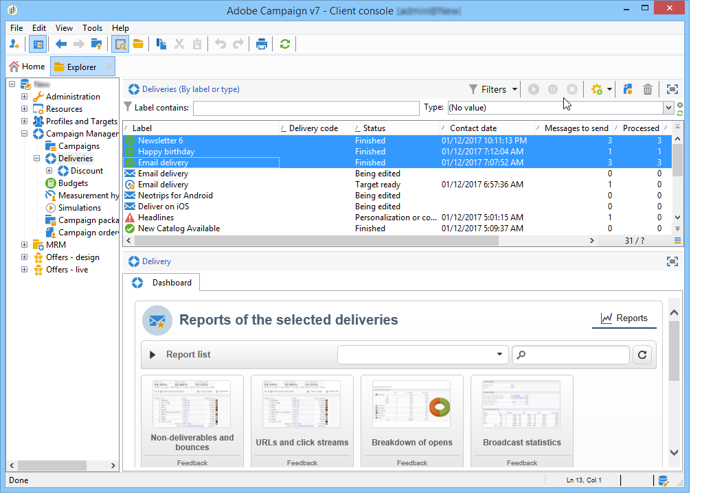

# 累積報告 {#cumulative-reports}

您可以顯示傳遞的累積報告。 要執行此操作，請選取要比較的傳送，以取得這些傳送的報告清單。

若要從清單中選取不相鄰的傳送，請在進行選取時按住CTRL鍵。

若要選取儲存在不同資料夾中的傳送，請按一下&#x200B;**[!UICONTROL Display sub-levels]** （可透過工具列存取）。 然後它們會顯示在相同的清單中。

