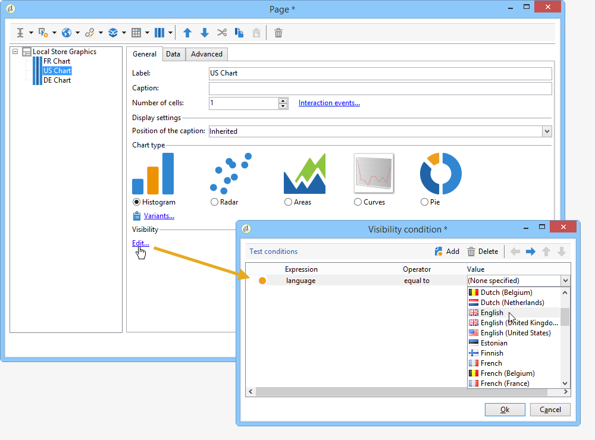

# 定義條件式內容{#defining-a-conditional-content}

您可以限制特定報表項目或頁面的顯示。

若要將特定項目設為條件式，請調整其可見度設定。 有關詳細資訊，請參閱[條件項目display](#conditioning-item-display)。

若要讓一或多個頁面的顯示成為條件式，請使用&#x200B;**[!UICONTROL Test]**&#x200B;類型活動。 有關詳細資訊，請參閱[條件頁面顯示](#conditioning-page-display)。

## 條件項顯示{#conditioning-item-display}

若要讓報表的部分顯示成為條件式，需要定義其可見性條件：如果不符合這些條件，則不會顯示項目。

可見性條件可能取決於運算子狀態，取決於在報表頁面中選取或輸入的項目。

[此區段](../../web/using/form-rendering.md#defining-fields-conditional-display)提供顯示頁面上項目的條件式顯示範例。

在下列範例中，顯示條件取決於語言：

## 調整頁面顯示{#conditioning-page-display}

在報表圖表中，**[!UICONTROL Test]**&#x200B;活動可讓您根據一或多個條件變更頁面順序。

此活動以下列操作原則為基礎：

1. 將&#x200B;**[!UICONTROL Test]**&#x200B;置於圖表中並加以編輯。
1. 按一下&#x200B;**[!UICONTROL Add]**&#x200B;按鈕以建立各種可能的案例。

   

   對於每種情況，都會將輸出轉變新增至&#x200B;**[!UICONTROL Test]**&#x200B;活動。

   

1. 選取&#x200B;**[!UICONTROL Enable default transition]**&#x200B;以新增轉變，以備其中一個設定的條件不符合時使用。

   如需詳細資訊，請參閱[本章節](../../web/using/defining-web-forms-page-sequencing.md#conditional-page-display)。

**[!UICONTROL Test]**&#x200B;活動可放置在圖表的開頭，以根據上下文或運算子設定檔來調整顯示。
