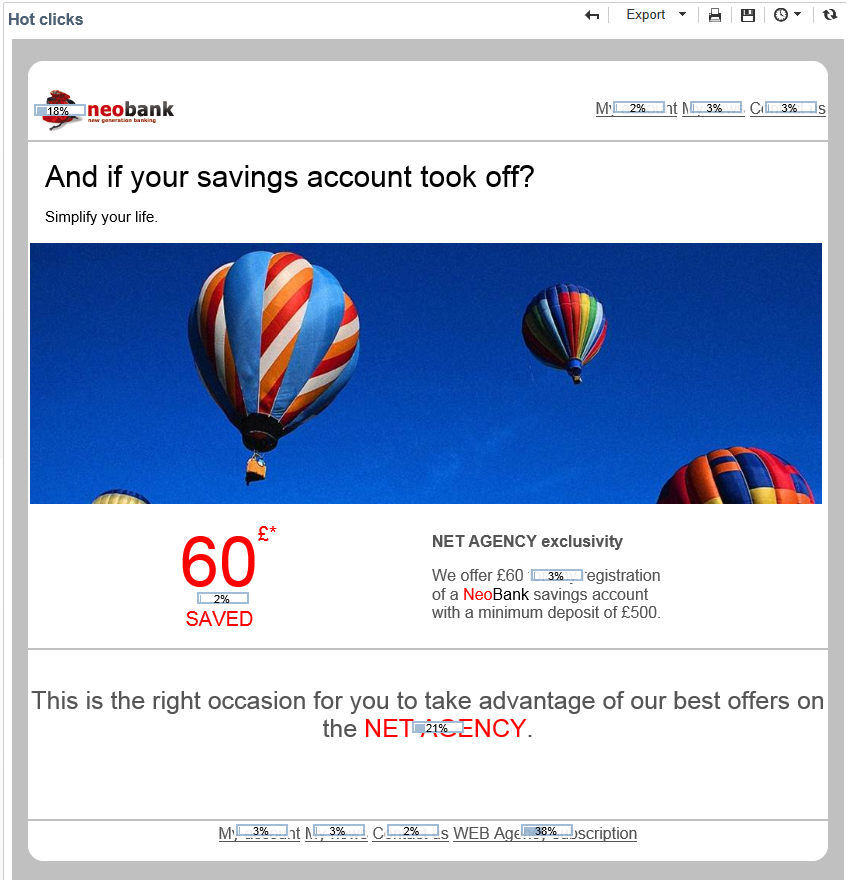

# 傳遞報告 {#delivery-reports}

您可以透過傳遞概述中可存取的各種報告，追蹤傳遞的執行情況。 若要顯示報表，請套用下列程式：

1. 前往 **[!UICONTROL Campaigns]** 標籤並按一下 **[!UICONTROL Delivery]** 顯示傳遞清單的連結。
1. 按一下您要顯示的傳送名稱，以顯示其詳細資料。

   

1. 選取 **[!UICONTROL Summary]** 標籤並按一下 **[!UICONTROL Reports]** 存取傳遞特定報告的連結。

   

   依預設，可使用下列報表：

   * **[!UICONTROL Delivery throughput]** ：請參閱 [傳遞總處理能力](../../reporting/using/global-reports.md#delivery-throughput).
   * **[!UICONTROL Sharing to social networks]** ：請參閱 [分享至社交網路](../../reporting/using/global-reports.md#sharing-to-social-networks).
   * **[!UICONTROL Statistics on sharing activities]** ：請參閱 [共用活動的統計資料](../../reporting/using/global-reports.md#statistics-on-sharing-activities).
   * **[!UICONTROL Hot clicks]** ：請參閱 [熱點點按](#hot-clicks).
   * **[!UICONTROL Tracking statistics]** ：請參閱 [追蹤統計資料](#tracking-statistics)
   * **[!UICONTROL URLs and click streams]** ：請參閱 [URL和點按流量](#urls-and-click-streams).
   * **[!UICONTROL Tracking indicators]** ：請參閱 [追蹤指標](#tracking-indicators).
   * **[!UICONTROL Non-deliverables and bounces]** ：請參閱 [無法傳遞的專案和退信](../../reporting/using/global-reports.md#non-deliverables-and-bounces).
   * **[!UICONTROL User activities]** ：請參閱 [使用者活動](../../reporting/using/global-reports.md#user-activities).
   * **[!UICONTROL Delivery summary]** ：請參閱 [傳遞摘要](#delivery-summary).
   * **[!UICONTROL Subscription tracking]** ：請參閱 [訂閱追蹤](../../reporting/using/global-reports.md#subscription-tracking).
   * **[!UICONTROL Delivery statistics]** ：請參閱 [傳遞統計資料](../../reporting/using/global-reports.md#delivery-statistics).
   * **[!UICONTROL Breakdown of opens]** ：請參閱 [開啟的劃分](../../reporting/using/global-reports.md#breakdown-of-opens).

## 追蹤指標 {#tracking-indicators}

此報表結合關鍵指標，用於追蹤收件者在接收傳遞時的行為。 它可以存取傳遞和接收統計資料、開啟及點進率、產生的點按資料流、網頁追蹤以及與社交網路的分享活動。

>[!NOTE]
>
>根據訊息開啟計算出的值一律為預估值，因為連結至文字格式電子郵件的錯誤邊界。 此 **[!UICONTROL Distinct opens/Sum of opens for the population reached]** 指示器會將此錯誤邊界列入考量。 有關追蹤開啟的詳細資訊，請參閱 [追蹤開啟次數](../../reporting/using/indicator-calculation.md#tracking-opens-).

**[!UICONTROL 1. Delivery statistics]**

* **[!UICONTROL Messages to deliver]** ：傳遞分析後要傳遞的訊息總數。
* **[!UICONTROL Success]** ：成功處理的訊息數。

**[!UICONTROL 2. Reception statistics]**

>[!NOTE]
>
>相關百分比是根據成功轉送的訊息數量計算。

* **[!UICONTROL Distinct opens for the population reached]** ：預估已開啟訊息至少一次的目標收件者人數。 由於必須開啟電子郵件才能點按連結，因此會考量追蹤URL的點按次數。
* **[!UICONTROL Sum of opens for the population reached]** ：目標收件者開啟的總數預估值。
* **[!UICONTROL Clicks on opt-out link]** ：對取消訂閱連結的點按次數。
* **[!UICONTROL Clicks on the mirror page link]** ：點按映象頁面連結的次數。 若要將納入考量，必須在傳送精靈（追蹤的URL）中定義連結。 請參閱此 [頁面](../../delivery/using/about-delivery-monitoring.md).
* **[!UICONTROL Estimation of forwards]** ：目標收件者轉寄的電子郵件預估數量。 此值的計算方式為減去相異人數與按一下電子郵件之相異收件者人數。

  >[!NOTE]
  >
  >如需不同人士和目標收件者之間差異的詳細資訊，請參閱 [目標對象/收件者](../../reporting/using/indicator-calculation.md#targeted-persons---recipients).

**[!UICONTROL 3. Open and click-through rate]**

此值表格顯示每個網域的分割傳遞次數、開啟次數、點按次數及原始反應性。 使用下列指標：

* **[!UICONTROL Sent]** ：在此網域上傳送的訊息總數。
* **[!UICONTROL Complaints]** ：此網域被回報為收件者不想要的訊息數。 此速率是根據此網域上傳送的訊息總數所計算。
* **[!UICONTROL Opens]** ：此網域中至少開啟過一次訊息的不同目標收件者人數。 此速率是根據此網域上傳送的訊息總數所計算。
* **[!UICONTROL Clicks]** ：至少點按一次相同傳遞的不同目標收件者人數。 此速率是根據此網域上傳送的訊息總數所計算
* **[!UICONTROL Raw reactivity]** ：與開啟傳送至少一次的收件者人數相比，已至少點按一次傳送的收件者人數的百分比。

>[!NOTE]
>
>此報告中顯示的網域名稱是在多維資料庫層級使用的分項清單中定義。 若要變更、新增或移除預設網域，請編輯 **[!UICONTROL Domains]** 逐項列出並修改值與別名。 有關詳細資訊，請參閱 [本節](../../platform/using/managing-enumerations.md). 此 **[!UICONTROL Others]** 類別包含不屬於任何專案清單值的網域名稱。

**[!UICONTROL 4. Generated click streams]**

>[!NOTE]
>
>相關百分比是根據成功轉送的訊息數量計算。

* **[!UICONTROL Distinct clicks for the population reached]** ：在傳送中按一下至少一次的不同人數。
* **[!UICONTROL Cumulated clicks]** ：目標收件者的點按總數，不包括取消訂閱連結和映象頁面。
* **[!UICONTROL Recipient clicks]** ：至少點按一次相同傳遞的不同目標收件者人數。
* **[!UICONTROL Estimated recipient reactivity]** ：在傳遞中按一下至少一次的收件者人數，與至少開啟傳遞一次的收件者預估人數的比率。 在選擇退出和映象頁面連結上的點選次數不會考慮在內。

**[!UICONTROL 5. Web tracking]**

* **[!UICONTROL Visited pages]** ：訊息接收後造訪的網頁數量。
* **[!UICONTROL Transactions]** ：訊息接收後的購買次數。
* **[!UICONTROL Total amount]** ：訊息接收後的購買總數。
* **[!UICONTROL Average transaction amount]** ：不同傳遞收件者進行的平均購買。
* **[!UICONTROL Articles]** ：傳遞收件者購買的文章數。
* **[!UICONTROL Average count of articles per transaction]** ：不同收件者每次購買的平均專案數。
* **[!UICONTROL Average amount per message]** ：每則訊息產生的平均購買量。

  >[!NOTE]
  >
  >若要將造訪的頁面、交易、金額或文章列入考量，網路追蹤標籤必須插入相符的網頁中。 Webtracking設定在中介紹 [本節](../../configuration/using/about-web-tracking.md).

**[!UICONTROL 6. Sharing activities to email and social networks]**

本區段顯示每個社交網路上共用的訊息數。 有關詳細資訊，請參閱 [分享至社交網路](../../reporting/using/global-reports.md#sharing-to-social-networks).

## URL 和點擊流量 {#urls-and-click-streams}

此報表顯示傳遞後造訪的頁面清單。

您可以選取下列專案來設定此報表的內容：要顯示的評分圖、時間篩選（自動作啟動以來、啟動後的前6小時等） 以及資料顯示模式（依標籤、依URL、依類別）。 按一下 **[!UICONTROL Refresh]** 以確認您的選取。

下列比率會顯示在報表的上半部分：

* **[!UICONTROL Reactivity]** ：已點按傳送的目標收件者數目與已開啟傳送的目標收件者估計數目之間的比率。 在選擇退出連結和映象頁面上的點選次數不會考慮在內。

  >[!NOTE]
  >
  >有關追蹤開啟的詳細資訊，請參閱 [追蹤開啟次數](../../reporting/using/indicator-calculation.md#tracking-opens-).

* **[!UICONTROL Distinct clicks]** ：在傳送中至少點選一次的不同人數（不包括取消訂閱連結和映象頁面）。 顯示的速率是根據成功傳送的訊息數來計算。
* **[!UICONTROL Cumulated clicks]** ：目標收件者的點按總數（不包括取消訂閱連結和映象頁面）。 顯示的速率是根據成功轉送的訊息數來計算。

**[!UICONTROL Platform average]** ：此平均比率顯示在每個比率（反應性、不同點按和累計點按）下，是針對過去六個月傳送的傳送進行計算。 系統只會考慮具有相同型別和相同通道的傳送。 校訂已排除。

中央表格提供下列資訊：

* **[!UICONTROL Clicks]** ：每個連結的累計點按次數。
* **[!UICONTROL Clicks (in %)]** ：每個連結的點按次數與累計點按總數的關係劃分。

**[!UICONTROL Breakdown of clicks in time]**

此圖表顯示每日累計點按次數的劃分。

## 傳遞摘要 {#delivery-summary}

此報表提供有關傳遞的所有主要資訊。

**[!UICONTROL Target population]**

本節提供兩種指標：

* **[!UICONTROL Initial population]** ：傳遞所定位的收件者總數。
* **[!UICONTROL Messages rejected by the rule]** ：套用型別規則時，分析期間忽略的地址數：地址遺失、隔離、封鎖清單上等。 如需型別規則的詳細資訊，請參閱此 [頁面](../../delivery/using/steps-validating-the-delivery.md#validation-process-with-typologies).

**[!UICONTROL Causes of exclusion]**

中間圖表顯示分析期間拒絕之訊息的每條規則劃分。

**[!UICONTROL Delivery statistics]**

本節包含下列指標：

* **[!UICONTROL Messages to be delivered]** ：傳遞分析後要傳遞的訊息總數。
* **[!UICONTROL Success]** ：成功處理的訊息數。 關聯率是要傳遞訊息數量的比率。
* **[!UICONTROL Errors]** ：傳送期間累計的錯誤總數和自動復原處理次數。 關聯率是要傳遞訊息數量的比率。
* **[!UICONTROL New quarantines]** ：傳送失敗（使用者不明、網域無效）後隔離的地址數。 關聯率是要傳遞訊息數量的比率。

## 熱點點擊 {#hot-clicks}

此報告顯示訊息內容 (HTML 和/或文字) 以及每個連結的連結點按百分比。個人化區塊取消訂閱連結、鏡像頁面連結和優惠連結有計入總累計點按數，但不顯示在報告中。

>[!NOTE]
>
>如果您的傳送包含優惠方案（互動），報表上方部分會顯示一個方塊，顯示優惠方案的點按百分比。

## 追蹤統計資料 {#tracking-statistics}

此報表提供有關開啟、點按和交易的統計資料。

它可讓您追蹤傳送的行銷影響。 您可以透過變更時幅（1小時、3小時或24小時檢視等）來設定值的顯示方式。 按一下 **[!UICONTROL Refresh]** 以確認您的選取。

此報表提供值表格和柏瑞圖圖表，顯示傳遞達到最高效率所需的時間。 使用下列指標：

* **[!UICONTROL Opens]** ：達到開啟的訊息總數百分比所需預估時間。 不考慮文字格式的電子郵件。 有關追蹤開啟的詳細資訊，請參閱 [追蹤開啟次數](../../reporting/using/indicator-calculation.md#tracking-opens-).
* **[!UICONTROL Clicks]** ：達到記錄的總點按次數百分比所需預估時間。 在選擇退出連結和映象頁面上的點選次數不會考慮在內。
* **[!UICONTROL Transactions]** ：達到訊息接收後交易總數百分比所需的時間。 若要將交易列入考量，必須將交易型別webtracking標籤插入相符的網頁中。 Webtracking設定在中介紹 [本節](../../configuration/using/about-web-tracking.md).
