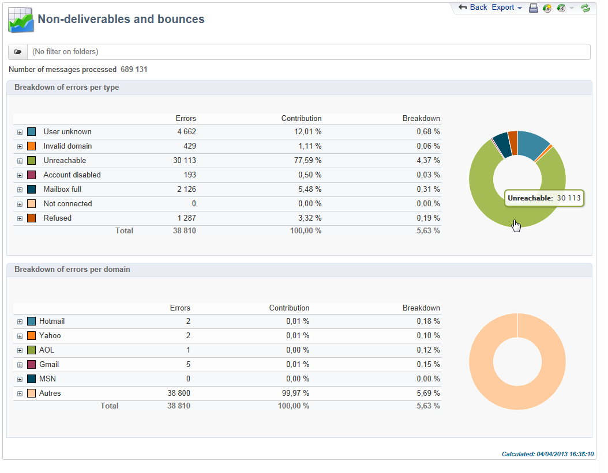
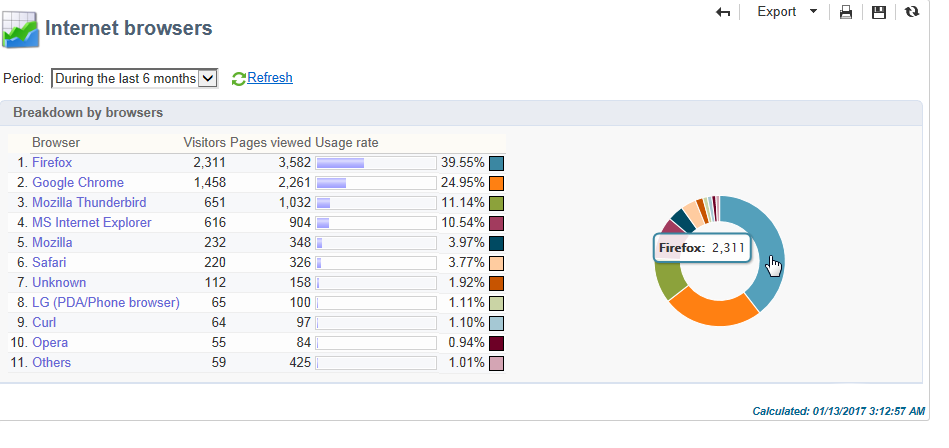

# 全域報表 {#global-reports}

這些報告涉及整個資料庫中資料的活動。 若要檢視報表控制面板，請前往標 **[!UICONTROL Reports]** 簽。

若要顯示報表，請按一下其名稱。 下列報表預設可用：

>[!CAUTION]
>
>此區段僅顯示連結至傳送的報表。

* **[!UICONTROL Delivery throughput]** :請參閱「 [傳送吞吐量」](#delivery-throughput)。
* **[!UICONTROL Browsers]** :請參閱「瀏 [覽器」](#browsers)。
* **[!UICONTROL Sharing to social networks]** :請參閱 [分享至社交網路](#sharing-to-social-networks)。
* **[!UICONTROL Statistics on sharing activities]** :請參閱分享 [活動的統計資料](#statistics-on-sharing-activities)。
* **[!UICONTROL Operating systems]** :請參閱 [作業系統](#operating-systems)。
* **[!UICONTROL URLs and click streams]** :請參閱 [URL並按一下串流](#urls-and-click-streams)。
* **[!UICONTROL Tracking indicators]** :請參閱 [追蹤指標](#tracking-indicators)。
* **[!UICONTROL Non-deliverables and bounces]** :請參閱 [非交付項和彈回](#non-deliverables-and-bounces)。
* **[!UICONTROL User activities]** :請參閱使 [用者活動](#user-activities)。
* **[!UICONTROL Subscription tracking]** :請參閱 [訂閱追蹤](#subscription-tracking)。
* **[!UICONTROL Delivery summary]** :請參閱「 [傳送摘要](#delivery-summary)」。
* **[!UICONTROL Delivery statistics]** :請參閱「 [傳送統計資料](#delivery-statistics)」。
* **[!UICONTROL Breakdown of opens]** :請參閱「 [開啟的劃分」](#breakdown-of-opens)。

## 傳送總處理能力 {#delivery-throughput}

此報表包含特定時段內整個平台的傳送吞吐量資訊。 要測量消息的傳送速度，標準是每小時發送的消息數和消息的大小（以位／秒為單位）。 在以下範例中，第一個圖表以藍色顯示成功的傳送，以及以橙色顯示錯誤傳送的數量。

您可以變更時標來設定顯示的值：1小時檢視、3小時檢視、24小時檢視等。 按一 **[!UICONTROL Refresh]** 下以確認您的選擇。

## 使用者活動 {#user-activities}

此報表以圖表的形式顯示每半小時、一小時或一天的開啟次數、點按次數和交易次數的劃分。

可以使用以下選項：

* **[!UICONTROL Opens]** :已開啟的消息總數。 文字格式的電子郵件不會納入考量。 有關追蹤開啟的詳細資訊，請參閱追蹤 [開啟](#tracking-opens-)。
* **[!UICONTROL Clicks]** :傳送中連結的點按總數。 未考慮取消訂閱連結和鏡像頁面的點按次數。
* **[!UICONTROL Transactions]** :收到訊息後的交易總數。 為了考慮事務，必須將事務類型Web跟蹤標籤插入匹配的Web頁。 網路追蹤設定會顯示 [在本節中](../../configuration/using/about-web-tracking.md)。

## 傳送失敗和退回的郵件 {#non-deliverables-and-bounces}

此報表顯示非交付項目的劃分，以及每個網際網路網域的彈回數劃分。

代 **[!UICONTROL Number of messages processed]** 表傳送伺服器處理的訊息總數。 此值低於某些傳送已停止或暫停（在伺服器處理之前）時要傳送的訊息數。

**[!UICONTROL Breakdown of errors by type]**

>[!NOTE]
>
>此報告中顯示的錯誤會觸發隔離程式。 有關隔離管理的詳細資訊，請參閱隔 [離管理](../../delivery/using/understanding-quarantine-management.md)。

此報告的第一部分以值表和圖表的形式顯示非交付項的劃分。

對於每種錯誤類型，我們都有：

* 此類型的錯誤消息數，
* 具有此類型錯誤的消息與具有錯誤的消息總數的百分比，
* 此類型的錯誤消息與處理消息總數的百分比。

使用下列指標：

* **[!UICONTROL User unknown]** :傳送期間產生錯誤類型，以指出電子郵件地址無效。
* **[!UICONTROL Invalid domain]** :傳送傳送時產生錯誤類型，以指出電子郵件地址的網域錯誤或不存在。
* **[!UICONTROL Inbox full]** :在五次傳送嘗試後產生錯誤類型，指出收件者的收件匣包含太多訊息。
* **[!UICONTROL Account disabled]** :傳送傳送時產生錯誤類型，指出該位址已不存在。
* **[!UICONTROL Rejected]** :當IAP（Internet訪問提供方）拒絕地址時(例如在應用安全規則（防垃圾郵件軟體）後)生成錯誤類型。
* **[!UICONTROL Unreachable]** :消息分發字串中發生的錯誤類型：發生在SMTP中繼上、域暫時無法訪問等
* **[!UICONTROL Not connected]** :錯誤類型，表示收件者的行動電話在傳送時已關閉或中斷網路連線。

   >[!NOTE]
   >
   >此指標僅涉及行動通道的傳送。 如需詳細資訊，請參閱[本小節](../../delivery/using/sms-channel.md)。

   按一下+符號可開啟值表的每 [行] 。 對於每種錯誤類型，您可以按域顯示錯誤消息的劃分。

   

**[!UICONTROL Breakdown of errors per domain]**

此報告的第二節以值表和圖表的形式，顯示每個網際網路網域的錯誤劃分。

對於每個域名，我們都有：

* 此域的錯誤消息數，
* 此域的錯誤消息與為此域處理的消息總數的百分比，
* 此域的錯誤消息與錯誤消息總數的百分比。

按一下+符號可開啟值表的每 [行] 。 對於每個域類型，可以按錯誤類型顯示錯誤消息的劃分。

>[!NOTE]
>
>此報告中顯示的域名是在多維資料集級別定義的。 要更改這些值，請編輯立 **[!UICONTROL Delivery logs (broadlogrcp)]** 方。 如需詳細資訊，請參閱[本小節](../../reporting/using/about-cubes.md)。類 **[!UICONTROL Others]** 別包括不屬於特定類的域名。

## 瀏覽器 {#browsers}

此報表顯示傳送收件者在相關期間使用之網際網路瀏覽器的劃分。

>[!NOTE]
>
>此報告中顯示的值是估計值：只有已點按傳送的收件者才會納入考量。

**全域統計資料**

瀏覽器使用的全域統計資料以值表和圖表的形式呈現。

使用下列指標：

* **[!UICONTROL Visitors]** :已定位並點選傳送至少一次的收件者總數（依網際網路瀏覽器）。
* **[!UICONTROL Pages viewed]** :所有傳送的傳送（依網際網路瀏覽器）中，連結點按總次數。
* **[!UICONTROL Usage rate]** :此比率代表訪客總數（每個網際網路瀏覽器）的劃分。

**每個瀏覽器的統計資料**

在全域統計值表中，您可以按一下每個瀏覽器名稱來檢視其使用狀況統計資料。

統計資料以曲線、圖表和值表的形式呈現。

曲線 **[!UICONTROL History]** 代表此瀏覽器每天的出勤率。 此比率是每天（在此瀏覽器上）訪客數與當天以最高出席率測量的訪客數之比。

圖 **[!UICONTROL Breakdown per version]** 表代表每個版本的訪客劃分，與訪客總數（在此瀏覽器上）比較。

值表使用下列指標：

* **[!UICONTROL Global rate]** :此比率代表每個版本的訪客數與訪客總數（在所有瀏覽器上）的比較。
* **[!UICONTROL Relative rate]** :此比率代表每個版本的訪客數與訪客總數（在此瀏覽器上）的比較。

### 分享至社交網路 {#sharing-to-social-networks}

病毒式行銷可讓遞送收件者與其聯絡網路分享資訊：他們可以新增連結至個人資料（Facebook、Twitter等）或者給朋友發個資訊。 傳送中會追蹤每個共用資訊和每個共用資訊的存取權。 For more information on viral marketing, refer to [this section](../../delivery/using/viral-and-social-marketing.md).

此報表顯示每個社交網路（Facebook、Twitter等）的共用和已開啟訊息的劃分資訊和／或每封電子郵件。

**[!UICONTROL Email delivery statistics]**

在電子郵件傳送統計資料中，會顯示兩個值：

* **[!UICONTROL Number of messages to be delivered]** :傳送分析期間處理的訊息總數。
* **[!UICONTROL Number of successful deliveries]** :成功處理的消息數。

**[!UICONTROL Sharing activities and mail open statistics]**

中心表格顯示電子郵件分享的統計資料並開啟。

在欄中 **[!UICONTROL Shares]** ，我們有下列指標：

* **[!UICONTROL No. of sharing activities]** :每個社交網路上共用的訊息總數。 此值等於相符個人化區塊圖示的點按總 **[!UICONTROL Links for sharing to social networks]** 數。
* **[!UICONTROL Breakdown]** :此比率代表每個社交網路的分享次數，與分享總數相關。
* **[!UICONTROL Sharing rate]** :此比率代表每個社交網路分享次數的劃分，與要傳送的訊息數目有關。

在欄中 **[!UICONTROL Opens]** ，我們有下列指標：

* **[!UICONTROL No. of opens]** :轉送訊息給的人員（透過個人化區塊）開啟的訊息 **[!UICONTROL Links for sharing to social networks]** 總數。 此值等於鏡像頁面的顯示次數。 傳送收件者開啟時，不會考慮其影響。
* **[!UICONTROL Breakdown]** :此比率代表每個社交網路的開啟次數，與開啟總數相關。
* **[!UICONTROL Rate of opens]** :此比率代表每個社交網路的開啟次數，與分享總數相關。

**[!UICONTROL Breakdown of sharing activities and opens]**

本節包含兩個圖表，代表分享活動的劃分，並依社交網路開啟。

## 分享活動統計 {#statistics-on-sharing-activities}

此報表顯示分享到社交網路（Facebook、Twitter、電子郵件等）的演變及時。

For more information on viral marketing, refer to [this section](../../delivery/using/viral-and-social-marketing.md).

統計資料以值表和圖表的形式呈現。

使用下列指標：

* **[!UICONTROL New contacts]** :收到透過電子郵件分享的訊息後的新訂閱數。 此值與收到透過電子郵件分享的訊息、按一下並填入訂閱表單的 **[!UICONTROL Subscription link]** 人數相符。
* **[!UICONTROL Opens]** :已傳送訊息給的人員（透過個人化區塊）開啟的訊 **[!UICONTROL Link for sharing to social networks]** 息總數。 此值等於鏡像頁面的顯示次數。 傳送收件者開啟時，不會考慮其影響。
* **[!UICONTROL Sharing activities]** :透過社交網路分享的訊息總數。 此值與個人化區塊圖示的點按總 **[!UICONTROL Links for sharing to social networks]** 數相符。

## 作業系統 {#operating-systems}

此報告顯示交付接收方在有關期間使用的作業系統明細。

>[!NOTE]
>
>此報告中顯示的值是估計值：只有已點按傳送的收件者才會納入考量。

**全域統計資料**

作業系統的全局使用統計資料以值表和圖表的形式顯示。

使用下列指標：

* **[!UICONTROL Visitors]** :點按傳送至少一次之目標收件者總數（每個作業系統）的每日平均數。
* **[!UICONTROL Pages viewed]** :所有傳送的傳送連結（依作業系統）的每日點按總次數平均值。
* **[!UICONTROL Rate of use]** :此比率代表訪客總數（依作業系統）的劃分。

**每個作業系統的統計資料**

在全局統計資訊值表中，按一下每個作業系統的名稱可查看每個作業系統的統計資訊。

統計資料以曲線、圖表和值表的形式呈現。

曲 **[!UICONTROL History]** 線代表此作業系統每天的使用率。 此比率是每天（在此作業系統上）訪客數與當天參與率最高之訪客人數之比。

圖 **[!UICONTROL Breakdown by version]** 表代表每個版本的訪客與此作業系統訪客總數的劃分。

值表使用下列指標：

* **[!UICONTROL Global rate]** :此比率代表訪客（每個版本）與整個作業系統訪客總數的劃分。
* **[!UICONTROL Relative rate]** :此比率代表與此作業系統訪客總數相關的訪客（每個版本）劃分。

## 訂閱追蹤 {#subscription-tracking}

此報表可讓您監控資訊服務的訂閱。 它顯示訂閱和取消訂閱。

按一下首頁的節點或瀏覽 **[!UICONTROL Profiles and targets > Services and subscriptions]** 器，即可顯示訂閱。 選取所要的訂閱，然後按一下標 **[!UICONTROL Reports]** 簽。 預 **[!UICONTROL Subscriptions tracking]** 設可使用報表。 它可讓您查看訂閱和取消訂閱趨勢以及一段時間的忠誠度比率。 您可以透過下拉式清單來設定此資料的表示法。 按一下 **[!UICONTROL Refresh]** 可驗證所選配置。

如需詳細資訊，請參閱[本頁面](../../delivery/using/managing-subscriptions.md)。

代表 **[!UICONTROL Number subscribed to date]** 目前訂閱的總人數。

**[!UICONTROL Overall evolution of subscriptions]**

值表使用下列指標：

* **[!UICONTROL Subscribers]** :有關期間的訂戶總數。
* **[!UICONTROL Subscriptions]** :有關期間的訂閱數。
* **[!UICONTROL Unsubscriptions]** :有關期間的未訂閱數。
* **[!UICONTROL Evolution]** :取消訂閱數減去訂閱數。 比率是根據訂閱者總數計算。
* **[!UICONTROL Loyalty]** :相關期間的訂閱者忠誠度比率。

**[!UICONTROL Subscription evolution curves]**

此圖表顯示相關期間訂閱和取消訂閱的演變。

## 傳送統計資料 {#delivery-statistics}

此報表依網際網路網域、處理及傳送的所有訊息、硬彈回調、開啟、點按和取消訂閱來顯示劃分。

使用下列指標：

* **[!UICONTROL Emails processed]** :傳送伺服器處理的訊息總數。
* **[!UICONTROL Delivered]** :成功處理的消息數與處理的消息總數的百分比。
* **[!UICONTROL Hard bounces]** :「硬」彈回數與已處理訊息總數的百分比。
* **[!UICONTROL Soft bounces]** :「軟」彈回數與已處理訊息總數的百分比。

   >[!NOTE]
   >
   >有關硬彈回數和軟彈回數的詳細資訊，請參閱 [隔離管理](../../delivery/using/understanding-quarantine-management.md)。

* **[!UICONTROL Opens]** :至少開啟一次訊息的目標收件者數目，與成功處理之訊息數目的百分比。
* **[!UICONTROL Clicks]** :點按至少一次傳送的人數與成功處理之訊息數目的百分比。
* **[!UICONTROL Unsubscription]** :取消訂閱連結的點按次數與成功處理訊息次數的百分比。

## 開啟次數劃分 {#breakdown-of-opens}

此報告顯示相關期間依作業系統、裝置和瀏覽器劃分的開啟次數。 對於每個類別，都會使用兩個圖表。 第一個顯示有關電腦和行動裝置上開啟次數的統計資料。 第二個顯示僅與行動裝置上開啟有關的統計資料。

開啟次數與開啟的消息總數相對應。 文字格式電子郵件不會計算在內。 有關「追蹤」開啟的詳細資訊，請參閱「追 [蹤」開啟](#tracking-opens-) 區段。

>[!NOTE]
>
>瀏覽器和作業系統名稱是瀏覽器使用者代理所傳送已開啟釘子的資訊的一部分。 Adobe Campaign會使用其裝置資訊來推斷裝置類型。