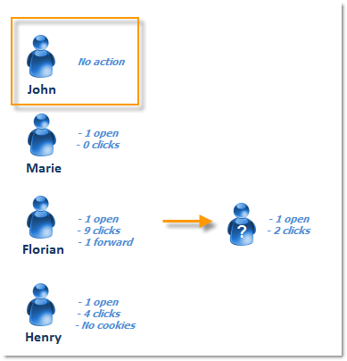

# 人員與收件者 {#person-people-and-recipients}

此範例可幫助您瞭解Adobe Campaign中個人與收件者之間的差異。 我們會將傳送內容傳送給數人，以強調使用者與收件者之間的差異，同時詳細說明下列指標的計算方法：

* **[!UICONTROL Clicks]**
* **[!UICONTROL Distinct clicks for the population reached]**
* **[!UICONTROL Distinct opens for the population reached]**
* **[!UICONTROL Estimation of forwards]**
* **[!UICONTROL Raw reactivity]**

>[!NOTE]
>
>這些指標用於&#x200B;**[!UICONTROL Tracking indicators]**&#x200B;報告。 如需詳細資訊，請參閱[追蹤指標](../../reporting/using/delivery-reports.md#tracking-indicators)。

傳遞中會新增三個連結。 會傳送給4位收件者：

* **[!UICONTROL John Davis]** ：此收件者未開啟電子郵件（因此未按一下任何連結）。
* **[!UICONTROL Marie Stuart]** ：開啟電子郵件但不點按任何連結。
* **[!UICONTROL Florian David]** ：開啟電子郵件並按一下連結9次。 他也會將電子郵件轉寄給開啟電子郵件並點選兩次的人。
* **[!UICONTROL Henry Macdonald]** ：此收件者已將其網際網路瀏覽器設定為拒絕Cookie。 他開啟電子郵件並按一下4次連結。

系統會傳回下列追蹤記錄：

為了更清楚瞭解人員和收件者的計算方式，我們將分析每個設定檔的記錄。

## 步驟1：John {#step-1--john}

**[!UICONTROL John Davis]**&#x200B;未開啟電子郵件（因此未按一下任何連結）。

由於John既未開啟也未點按電子郵件，因此未出現在紀錄中。

**中繼計算：**

|   | 已點擊的收件者 | 已點擊的人 | 開啟的收件者 |
|---|---|---|---|
| John | - | - | - |
| 中間總計 | 0 | 0 | 0 |

## 步驟2：瑪麗 {#step-2--marie}

**[!UICONTROL Marie Stuart]**&#x200B;會開啟電子郵件，但不點按任何連結。

Marie的開啟會顯示在下列記錄中：

開啟已指派給收件者：Marie。 因此，Adobe Campaign會將新收件者新增至該計數。

**中繼計算：**

|   | 已點擊的收件者 | 已點擊的人 | 開啟的收件者 |
|---|---|---|---|
| John | - | - | - |
| 瑪麗 | - | - | +1 |
| 中間總計 | 0 | 0 | 1 |

## 步驟3：弗洛里安 {#step-3--florian}

**[!UICONTROL Florian David]**&#x200B;開啟電子郵件並按一下連結9次。 他也會將電子郵件轉寄給開啟電子郵件並點選兩次的人。

Florian的動作（一次開啟和9次點按）會出現在下列記錄中：

**收件者**：開啟和點選已指派給相同的收件者(Florian)。 由於此收件者與先前的收件者(Marie)不同，因此Adobe Campaign會將新收件者新增至該計數。

人員：由於此收件者的瀏覽器接受Cookie，我們可以看到相同的識別碼(UUID)已指派給所有點按記錄： **`fe37a503 [...]`**。 Adobe Campaign可正確識別這些點按屬於同一人。 新人員已新增至計數。

**中繼計算：**

|   | 已點擊的收件者 | 已點擊的人 | 開啟的收件者 |
|---|---|---|---|
| John | - | - | - |
| 瑪麗 | - | - | +1 |
| 弗洛里安 | +1 | +1 | +1 |
| 中間總計 | 1 | 1 | 2 |

以下記錄與Florian轉寄電子郵件給之人員的開啟和兩次點按相符：

**收件者**：其開啟和點按已指派給轉寄電子郵件的收件者(Florian)。 由於此收件者已計算，因此收件者計數會維持不變。

**人員**：關於點按，我們可以看到相同的識別碼(UUID)已指派給所有記錄： **`9ab648f9 [...]`**。 尚未計算此識別碼。 因此，計數中會新增一個人員。

**中繼計算：**

|   | 已點擊的收件者 | 已點擊的人 | 開啟的收件者 |
|---|---|---|---|
| John | - | - | - |
| 瑪麗 | - | - | +1 |
| 弗洛里安 | +1 | +1 | +1 |
| 不明人員 | - | +1 | - |
| 中間總計 | 1 | 2 | 2 |

## 步驟4：Henry {#step-4--henry}

**[!UICONTROL Henry Macdonald]**&#x200B;已將其網際網路瀏覽器設定為拒絕Cookie。 他開啟電子郵件並按一下4次連結。

Henry所執行的開啟和4點按會出現在以下記錄中：

**收件者**：開啟和點選已指派給相同的收件者(Henry)。 由於此收件者尚未計算，因此Adobe Campaign會將收件者新增至該計數。

**人員**：由於Henry的瀏覽器不接受Cookie，因此每次點按都會產生新的識別碼(UUID)。 這4個點按的每一個都會解譯為來自不同人員。 由於這些識別碼尚未計數，已新增至計數。

**中繼計算：**

|   | 已點擊的收件者 | 已點擊的人 | 開啟的收件者 |
|---|---|---|---|
| John | - | - | - |
| 瑪麗 | - | - | +1 |
| 弗洛里安 | +1 | +1 | +1 |
| 不明人員 | - | +1 | - |
| Henry | +1 | +4 | +1 |
| 中間總計 | 2 | 6 | 3 |

## 摘要 {#summary}

在傳遞層級，我們有以下結果：

* **[!UICONTROL Clicks]** （點選的收件者）： 2
* **[!UICONTROL Distinct clicks for the population reached]** （點選的人）： 6
* **[!UICONTROL Distinct opens for the population reached]** （已開啟的收件者）： 3

轉送的原始反應性和預估值計算如下：

* **[!UICONTROL Estimation of forwards]** = **B - A** （因此，6 - 2 = 4）
* **[!UICONTROL Raw reactivity]** = **A / C** （因此，2 / 3 = 66,67%）

>[!NOTE]
>
>在下列公式中：
>
>* A代表&#x200B;**[!UICONTROL Clicks]**&#x200B;指標（已點按的收件者）。
>* B代表&#x200B;**[!UICONTROL Distinct clicks for the population reached]**&#x200B;指標（點選的人）。
>* C代表&#x200B;**[!UICONTROL Distinct opens for the population reached]**&#x200B;指標（已開啟的收件者）。
