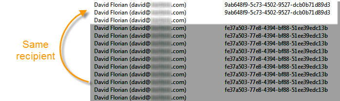

# 人員與收件者 {#person-people-and-recipients}

此範例可協助您了解Adobe Campaign中人員與收件者之間的差異。 我們會傳送訊息給數個人，強調人員與收件者之間的差異，同時詳細說明下列指標的計算方法：

* **[!UICONTROL Clicks]**
* **[!UICONTROL Distinct clicks for the population reached]**
* **[!UICONTROL Distinct opens for the population reached]**
* **[!UICONTROL Estimation of forwards]**
* **[!UICONTROL Raw reactivity]**

>[!NOTE]
>
>這些指標用於 **[!UICONTROL Tracking indicators]** 報表。 有關詳細資訊，請參閱 [追蹤指標](../../reporting/using/delivery-reports.md#tracking-indicators).

傳遞新增三個連結。 它會傳送給4個收件者：

* **[!UICONTROL John Davis]** :此收件者不會開啟電子郵件（因此不會點按任何連結）。
* **[!UICONTROL Marie Stuart]** :開啟電子郵件，但未點按任何連結。
* **[!UICONTROL Florian David]** :開啟電子郵件並點按連結9次。 他還會將電子郵件轉發給開啟並點擊兩次的人。
* **[!UICONTROL Henry Macdonald]** :此收件者已將其internet瀏覽器設定為拒絕cookie。 他開啟電子郵件並點按連結4次。

會傳回下列追蹤記錄：

為了更清楚了解人員和收件者的計算方式，我們將分析每個設定檔的記錄。

## 步驟1:約翰 {#step-1--john}

**[!UICONTROL John Davis]** 不會開啟電子郵件（因此不會點按任何連結）。

由於John既未開啟也未點按電子郵件，因此記錄中不會顯示他。

**中間計算：**

|  | 點按的收件者 | 點按的使用者 | 已開啟的收件者 |
|---|---|---|---|
| 約翰 | - | - | - |
| 中間總計 | 0 | 0 | 0 |

## 步驟2:瑪麗 {#step-2--marie}

**[!UICONTROL Marie Stuart]** 開啟電子郵件，但未點按任何連結。

Marie的開啟顯示在以下日誌中：

開啟會指派給收件者：瑪麗。 Adobe Campaign因此會將新收件者新增至計數。

**中間計算：**

|  | 點按的收件者 | 點按的使用者 | 已開啟的收件者 |
|---|---|---|---|
| 約翰 | - | - | - |
| 瑪麗 | - | - | +1 |
| 中間總計 | 0 | 0 | 1 |

## 步驟3:弗洛里安 {#step-3--florian}

**[!UICONTROL Florian David]** 開啟電子郵件並點按連結9次。 他還會將電子郵件轉發給開啟並點擊兩次的人。

Florian的動作（一次開啟，9次點按）會顯示在下列記錄中：

**收件者**:開啟和點按會指派給相同的收件者(Florian)。 由於此收件者與前一個收件者(Marie)不同，Adobe Campaign會將新收件者新增至計數。

人員：由於此收件者的瀏覽器接受Cookie，因此我們會看到相同的識別碼(UUID)已指派給所有點按記錄： **`fe37a503 [...]`**. Adobe Campaign會將這些點按正確識別為屬於同一人。 計數中會新增一個人。

**中間計算：**

|  | 點按的收件者 | 點按的使用者 | 已開啟的收件者 |
|---|---|---|---|
| 約翰 | - | - | - |
| 瑪麗 | - | - | +1 |
| 弗洛里安 | +1 | +1 | +1 |
| 中間總計 | 1 | 1 | 2 |

下列記錄檔與開啟的記錄檔相符，以及Florian將電子郵件轉送給的使用者執行的兩次點按：

**收件者**:其開啟次數和點按次數會指派給轉送電子郵件(Florian)的收件者。 由於此收件者已計數，因此收件者計數會維持不變。

**人員**:關於點按，我們會看到相同的識別碼(UUID)已指派給所有記錄： **`9ab648f9 [...]`**. 此識別碼尚未計算。 因此，會將新人員新增至計數。

**中間計算：**

|  | 點按的收件者 | 點按的使用者 | 已開啟的收件者 |
|---|---|---|---|
| 約翰 | - | - | - |
| 瑪麗 | - | - | +1 |
| 弗洛里安 | +1 | +1 | +1 |
| 未知人員 | - | +1 | - |
| 中間總計 | 1 | 2 | 2 |

## 步驟4:亨利 {#step-4--henry}

**[!UICONTROL Henry Macdonald]** 已將其internet瀏覽器配置為拒絕cookie。 他開啟電子郵件並點按連結4次。

Henry執行的開啟和4次點按會顯示在下列記錄中：

**收件者**:開啟和點按會指派給相同的收件者(Henry)。 由於此收件者尚未計算，Adobe Campaign會將收件者新增至計數。

**人員**:由於Henry的瀏覽器不接受Cookie，因此每次點按都會產生新的識別碼(UUID)。 4次點按中的每次都會被解譯為來自不同人員。 由於這些識別碼尚未計算，因此會新增至計數。

**中間計算：**

|  | 點按的收件者 | 點按的使用者 | 已開啟的收件者 |
|---|---|---|---|
| 約翰 | - | - | - |
| 瑪麗 | - | - | +1 |
| 弗洛里安 | +1 | +1 | +1 |
| 未知人員 | - | +1 | - |
| 亨利 | +1 | +4 | +1 |
| 中間總計 | 2 | 6 | 3 |

## 摘要 {#summary}

在傳送層級，我們有下列結果：

* **[!UICONTROL Clicks]** （已點按的收件者）:2
* **[!UICONTROL Distinct clicks for the population reached]** （點擊者）:6
* **[!UICONTROL Distinct opens for the population reached]** （已開啟的收件者）:3

正轉的原始反應性和估計計算如下：

* **[!UICONTROL Estimation of forwards]** = **B - A** （因此6 - 2 = 4）
* **[!UICONTROL Raw reactivity]** = **A / C** （因此2 / 3 = 66,67%）

>[!NOTE]
>
>在下列公式中：
>
>* A代表 **[!UICONTROL Clicks]** 指標（按一下的收件者）。
>* B代表 **[!UICONTROL Distinct clicks for the population reached]** 指標（按一下的人）。
>* C代表 **[!UICONTROL Distinct opens for the population reached]** 指示器（開啟的收件者）。

