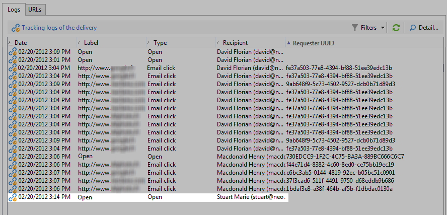

# 人員與收件者 {#person-people-and-recipients}

此示例將幫助您瞭解Adobe Campaign的人員/人員和接收者之間的區別。 我們將發送一封郵件給幾個人，以突出人員和收件人之間的差異，同時詳細說明以下指標的計算方法：

* **[!UICONTROL Clicks]**
* **[!UICONTROL Distinct clicks for the population reached]**
* **[!UICONTROL Distinct opens for the population reached]**
* **[!UICONTROL Estimation of forwards]**
* **[!UICONTROL Raw reactivity]**

>[!NOTE]
>
>這些指標用於 **[!UICONTROL Tracking indicators]** 報告。 有關此內容的詳細資訊，請參閱 [跟蹤指標](../../reporting/using/delivery-reports.md#tracking-indicators)。

三個連結被添加到傳遞中。 它將發送給4個收件人：

* **[!UICONTROL John Davis]** :此收件人不開啟電子郵件（因此不按一下任何連結）。
* **[!UICONTROL Marie Stuart]** :開啟電子郵件，但不按一下任何連結。
* **[!UICONTROL Florian David]** :開啟電子郵件並按一下連結9次。 他還將郵件轉發給開啟郵件的人，並點擊兩次。
* **[!UICONTROL Henry Macdonald]** :此收件人已將其Internet瀏覽器配置為拒絕cookie。 他開啟電子郵件，點擊連結4次。

返回以下跟蹤日誌：

為了更清楚地瞭解人員和收件人的計數方式，我們將分析每個配置檔案的日誌。

## 步驟1:約翰 {#step-1--john}

**[!UICONTROL John Davis]** 不開啟電子郵件（因此不按一下任何連結）。

由於John既未開啟也未按一下電子郵件，因此他不會出現在日誌中。

**中間計算：**

|  | 按一下的收件人 | 點擊的人 | 開啟的收件人 |
|---|---|---|---|
| 約翰 | - | - | - |
| 中間合計 | 0 | 0 | 0 |

## 步驟2:瑪麗 {#step-2--marie}

**[!UICONTROL Marie Stuart]** 開啟電子郵件，但不按一下任何連結。

Marie的開啟顯示在以下日誌中：

開啟的內容已分配給收件人：瑪麗。 Adobe Campaign因此在統計中增加了一個新的接受者。

**中間計算：**

|  | 按一下的收件人 | 點擊的人 | 開啟的收件人 |
|---|---|---|---|
| 約翰 | - | - | - |
| 瑪麗 | - | - | +1 |
| 中間合計 | 0 | 0 | 1 |

## 第3步：弗洛里安 {#step-3--florian}

**[!UICONTROL Florian David]** 開啟電子郵件並按一下連結9次。 他還將郵件轉發給開啟郵件的人，並點擊兩次。

Florian的操作（一次開啟，9次按一下）顯示在以下日誌中：

**收件人**:開啟和點擊被分配給同一個收件人（弗洛里安）。 由於此收件人與上一個收件人（瑪麗）不同，Adobe Campaign在計數中增加了一個新收件人。

人：由於此收件人的瀏覽器接受cookie，因此我們可以看到同一標識符(UUID)已分配給所有按一下日誌： **`fe37a503 [...]`**。 Adobe Campaign正確地將這些點擊標識為屬於同一個人。 將新人添加到計數中。

**中間計算：**

|  | 按一下的收件人 | 點擊的人 | 開啟的收件人 |
|---|---|---|---|
| 約翰 | - | - | - |
| 瑪麗 | - | - | +1 |
| 弗洛里安 | +1 | +1 | +1 |
| 中間合計 | 1 | 1 | 2 |

以下日誌與Florian將電子郵件轉發給的人開啟和點擊兩次一致：

**收件人**:它的開啟和點擊被分配給轉發電子郵件的收件人（弗洛里安）。 由於此收件人已被計數，因此收件人計數保持不變。

**人物**:關於按一下，我們可以看到為所有日誌分配了相同的標識符(UUID): **`9ab648f9 [...]`**。 尚未計算此標識符。 因此，在計數中增加一個新人。

**中間計算：**

|  | 按一下的收件人 | 點擊的人 | 開啟的收件人 |
|---|---|---|---|
| 約翰 | - | - | - |
| 瑪麗 | - | - | +1 |
| 弗洛里安 | +1 | +1 | +1 |
| 未知人 | - | +1 | - |
| 中間合計 | 1 | 2 | 2 |

## 第4步：亨利 {#step-4--henry}

**[!UICONTROL Henry Macdonald]** 已將其Internet瀏覽器配置為拒絕Cookie。 他開啟電子郵件，點擊連結4次。

Henry所執行的開啟和4次按一下顯示在以下日誌中：

**收件人**:開啟和點擊被分配給同一個收件人(Henry)。 由於此收件人尚未計數，Adobe Campaign在計數中增加了一個收件人。

**人物**:由於Henry的瀏覽器不接受Cookie，因此每次按一下都會生成新的標識符(UUID)。 每次點擊4次，都被解釋為來自不同的人。 由於這些標識符尚未計數，因此它們被添加到計數中。

**中間計算：**

|  | 按一下的收件人 | 點擊的人 | 開啟的收件人 |
|---|---|---|---|
| 約翰 | - | - | - |
| 瑪麗 | - | - | +1 |
| 弗洛里安 | +1 | +1 | +1 |
| 未知人 | - | +1 | - |
| 亨利 | +1 | +4 | +1 |
| 中間合計 | 2 | 6 | 3 |

## 摘要 {#summary}

在交貨層面，我們得到以下結果：

* **[!UICONTROL Clicks]** （按一下的收件人）:2
* **[!UICONTROL Distinct clicks for the population reached]** （點擊的人）:6
* **[!UICONTROL Distinct opens for the population reached]** （開啟的收件人）:3

原反應性和正應力估算計算如下：

* **[!UICONTROL Estimation of forwards]** = **B - A** （因此6 - 2 = 4）
* **[!UICONTROL Raw reactivity]** = **A/C** （因此2 / 3 = 66,67%）

>[!NOTE]
>
>在以下公式中：
>
>* A表示 **[!UICONTROL Clicks]** 指示符（按一下的收件人）。
>* B表示 **[!UICONTROL Distinct clicks for the population reached]** 指示符（點擊的人）。
>* C表示 **[!UICONTROL Distinct opens for the population reached]** 指示符（開啟的收件人）。

