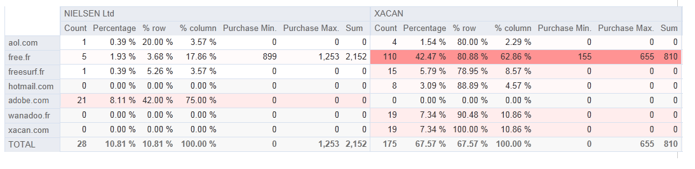

# 使用分析報表{#processing-a-report}

## 儲存分析報表 {#saving-an-analysis-report}

如果您有適當的權限，可以儲存從範本建立的分析報表，或以Excel、PDF或OpenOffice格式匯出。

若要儲存報表，請按一 **[!UICONTROL Save]** 下並為報表提供標籤。

如果 **[!UICONTROL Also save data]** 您想要建立報表的歷史記錄，並在儲存時查看報表的值，請選取。 有關詳細資訊，請參閱「 [歸檔分析報告」](#archiving-analysis-reports)。

此選 **[!UICONTROL Share this report]** 項可讓其他運算子存取報表。

儲存後，即可重新使用此報表來產生其他分析報表：

若要變更此報表，請編輯 **[!UICONTROL Administration > Configuration > Adobe Campaign tree reports]** Adobe Campaign樹狀結構的節點（或運算子具有編輯權限的第一個「報表」類型資料夾）。 如需詳細資訊，請參 [閱設定說明性分析報表的配置](#configuring-the-layout-of-a-descriptive-analysis-report)。

## 分析報表其他設定 {#analysis-report-additional-settings}

儲存描述性分析報表後，您就可以編輯其屬性並存取其他選項。

這些選項與標準報表相同，並在本頁中詳 [細說明](../../reporting/using/properties-of-the-report.md)。

## 設定描述性分析報表的配置 {#configuring-the-layout-of-a-descriptive-analysis-report}

您可以個人化描述性分析的圖表和表格中資料的顯示和版面配置。 所有選項都可透過Adobe Campaign樹狀結構存取，位於每個報 **[!UICONTROL Edit]** 表的標籤中。

### 分析報表顯示模式 {#analysis-report-display-mode}

使用範本建立報表時， **[!UICONTROL qualitative distribution]** 預設會選取表格和圖表顯示模式。 如果您只想要一個顯示模式，請取消選中相應的框。 這表示只有已勾選顯示模式的頁籤可用。

要更改報告的模式，請按一下該 **[!UICONTROL Select the link]** 表並從資料庫中選擇另一個表。

### 分析報表顯示設定 {#analysis-report-display-settings}

您可以隱藏或顯示統計資料和子總計，以及選擇統計資料的方向。

當您建立統計資料時，可以個人化其標籤。

其名稱將顯示在報表中。

但是，如果您取消勾選標籤和子總計顯示選項，這些選項將不會顯示在報表中。 當您將滑鼠指標暫留在表格的儲存格上時，名稱會出現在工具提示中。

依預設，統計資料會線上顯示。 若要變更方向，請從下拉式清單中選取適當的選項。

在以下示例中，統計資訊以列顯示。

### 分析報表資料配置 {#analysis-report-data-layout}

您可以直接在描述性分析表格中個人化資料配置。 若要這麼做，請以滑鼠右鍵按一下您要使用的變數。 從下拉式選單中選取可用選項：

* **[!UICONTROL Pivot]** 來更改變數的軸。
* **[!UICONTROL Up]** / **[!UICONTROL Down]** 以換行中的變數。
* **[!UICONTROL Move to the right]** / **[!UICONTROL Move to the left]** to swap the variables in columns.
* **[!UICONTROL Turn]** 來反轉變數軸。
* **[!UICONTROL Sort from A to Z]** 將變數值排序為低至高。
* **[!UICONTROL Sort from Z to A]** 將變數值排序為高或低。

   

若要返回初始顯示，請重新整理檢視。

### 分析報表圖表選項 {#analysis-report-chart-options}

您可以個人化圖表中資料的顯示。 若要這麼做，請按一下圖 **[!UICONTROL Variables...]** 表類型選擇階段期間可用的連結。

可以使用以下選項：

* 視窗的上方區段可讓您修改圖表顯示區域。
* 依預設，標籤會顯示在圖表中。 您可以取消勾選選項來隱藏 **[!UICONTROL Show values]** 它們。
* 此選 **[!UICONTROL Accumulate values]** 項可讓您將一個系列的值加總到另一個系列。
* 您可以決定是否顯示圖表圖例：若要隱藏，請取消勾選適當的選項。 依預設，圖例會顯示在圖表的右上角。

   圖例也可以顯示在圖表上方，以節省顯示空間。 若要這麼做，請選取 **[!UICONTROL Include in the chart]**

   在下拉式清單中選取垂直和 **[!UICONTROL Caption position]** 水準對齊方式。

   

## 匯出分析報表 {#exporting-an-analysis-report}

若要從分析報表匯出資料，請按一下下拉式清單並選取所要的輸出格式。

有關詳細資訊，請參見[此頁面](../../reporting/using/actions-on-reports.md)。

## 重新使用現有報告和分析 {#re-using-existing-reports-and-analyses}

您可以使用已儲存在Adobe Campaign中的現有報表，針對資料建立描述性分析報表。 當分析已保存或報告已建立並配置為通過描述性分析嚮導訪問時，可以使用此模式。

要瞭解如何保存說明性分析，請參閱 [保存分析報告](#saving-an-analysis-report)。

若要建立描述性分析報表，描述性分析精靈必須透過工作流程轉換或功能表來 **[!UICONTROL Tools > Descriptive analysis]** 執行。

1. 選擇 **[!UICONTROL Existing analyses and reports]** 並按一下 **[!UICONTROL Next]**。
1. 這可讓您存取可用報表的清單。 選擇您要產生的報表。

   

## 封存分析報告 {#archiving-analysis-reports}

當您根據現有分析建立描述性分析時，可以建立封存以儲存資料並比較報表結果。

若要建立歷史記錄，請套用下列步驟：

1. 開啟現有分析或建立新的描述性分析精靈。
1. 在報表顯示頁面中，按一下按鈕以在工具列中建立歷史記錄，然後確認如下所示：

   

1. 使用封存存取按鈕來顯示先前的分析。

   

