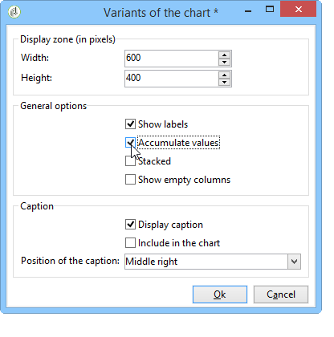

# 使用分析報表{#processing-a-report}

## 儲存分析報表 {#saving-an-analysis-report}

如果您有適當的權限，則可以保存從模板建立的分析報告，或以Excel、PDF或OpenOffice格式導出。

若要儲存報表，請按一下 **[!UICONTROL Save]** 給報表貼上標籤。

選擇 **[!UICONTROL Also save data]** 如果您想要建立報表的歷史記錄，並在儲存時查看報表的值。 有關詳細資訊，請參閱 [封存分析報表](#archiving-analysis-reports).

此 **[!UICONTROL Share this report]** 選項可讓其他運算子存取報表。

儲存後，此報表便可重新用於產生其他分析報表：

若要變更此報表，請編輯 **[!UICONTROL Administration > Configuration > Adobe Campaign tree reports]** Adobe Campaign樹的節點（或運算子具有編輯權限的第一個「Reports」類型資料夾）。 有關詳細資訊，請參閱 [設定描述性分析報表的配置](#configuring-the-layout-of-a-descriptive-analysis-report).

## 分析報告其他設定 {#analysis-report-additional-settings}

儲存描述性分析報表後，您可以編輯其屬性並存取其他選項。

這些選項與標準報表相同，於 [本頁](../../reporting/using/properties-of-the-report.md).

## 設定描述性分析報表的配置 {#configuring-the-layout-of-a-descriptive-analysis-report}

您可以在描述性分析的圖表和表格中個人化資料的顯示和配置。 所有選項都可透過Adobe Campaign樹狀結構(位於 **[!UICONTROL Edit]** 標籤。

### 分析報表顯示模式 {#analysis-report-display-mode}

使用 **[!UICONTROL qualitative distribution]** 預設會選取範本、表格和圖表顯示模式。 如果您只想要一個顯示模式，請取消勾選適當的方塊。 這表示只有已勾選顯示模式的索引標籤可供使用。

若要變更報表的結構，請按一下 **[!UICONTROL Select the link]** 並從資料庫中選擇另一個表。

### 分析報表顯示設定 {#analysis-report-display-settings}

您可以隱藏或顯示統計資料和子總計，以及選擇統計資料的方向。

當您建立統計資料時，可以個人化其標籤。

其名稱會顯示在報表中。

不過，如果您取消勾選標籤和子總計顯示選項，它們將不會顯示在報表中。 將滑鼠指標暫留在表格的儲存格上時，名稱會顯示在工具提示中。

依預設，統計資料會線上顯示。 若要變更方向，請從下拉式清單中選取適當的選項。

在以下範例中，統計資料會以欄顯示。

### 分析報表資料配置 {#analysis-report-data-layout}

您可以直接在描述性分析表格中個人化資料配置。 若要這麼做，請以滑鼠右鍵按一下您要使用的變數。 從下拉式選單中選取可用選項：

* **[!UICONTROL Pivot]** 變更變數的軸。
* **[!UICONTROL Up]** / **[!UICONTROL Down]** 換行中的變數。
* **[!UICONTROL Move to the right]** / **[!UICONTROL Move to the left]** 以交換欄中的變數。
* **[!UICONTROL Turn]** 來反轉變數軸。
* **[!UICONTROL Sort from A to Z]** 將變數值排序為低到高。
* **[!UICONTROL Sort from Z to A]** 將變數值從高到低排序。

   

要返回初始顯示，請刷新視圖。

### 分析報表圖表選項 {#analysis-report-chart-options}

您可以個人化圖表中資料的顯示。 若要這麼做，請按一下 **[!UICONTROL Variables...]** 在圖表類型選擇階段期間可用的連結。

可以使用以下選項：

* 窗口的上部部分允許您修改圖表顯示區域。
* 依預設，標籤會顯示在圖表中。 您可以取消勾選 **[!UICONTROL Show values]** 選項。
* 此 **[!UICONTROL Accumulate values]** 選項可讓您將值從一個系列新增至另一個系列。
* 您可以決定是否顯示圖表圖例：若要隱藏，請取消勾選適當的選項。 依預設，圖例會顯示在右上角的圖表外。

   圖例也可顯示在圖表上方，以節省顯示空間。 若要這麼做，請選取選項 **[!UICONTROL Include in the chart]**

   在 **[!UICONTROL Caption position]** 下拉式清單。

   

## 匯出分析報表 {#exporting-an-analysis-report}

若要從分析報表匯出資料，請按一下下拉式清單，然後選取所需的輸出格式。

如需詳細資訊，請參閱[此頁面](../../reporting/using/actions-on-reports.md)。

## 重新使用現有報告和分析 {#re-using-existing-reports-and-analyses}

您可以使用已儲存在Adobe Campaign中的現有報表，針對資料建立描述性分析報表。 當已儲存分析或已建立報表並設定為透過描述性分析精靈存取時，即可使用此模式。

要了解如何保存描述性分析，請參閱 [儲存分析報表](#saving-an-analysis-report).

若要建立描述性分析報表，描述性分析精靈必須透過工作流程轉變或 **[!UICONTROL Tools > Descriptive analysis]** 功能表。

1. 選取 **[!UICONTROL Existing analyses and reports]** 並按一下 **[!UICONTROL Next]**。
1. 這可讓您存取可用報表的清單。 選擇要生成的報表。

   

## 封存分析報表 {#archiving-analysis-reports}

當您根據現有分析建立描述性分析時，可以建立封存檔以儲存資料並比較報表結果。

若要建立歷史記錄，請套用下列步驟：

1. 開啟現有分析或建立新的描述性分析精靈。
1. 在報表顯示頁面中，按一下按鈕以在工具列中建立歷史記錄，然後確認，如下所示：

   

1. 使用「存檔訪問」按鈕顯示以前的分析。

   
