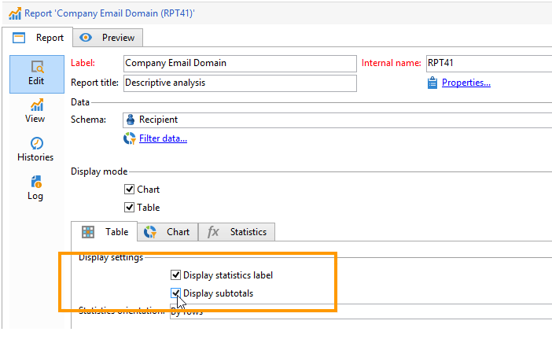
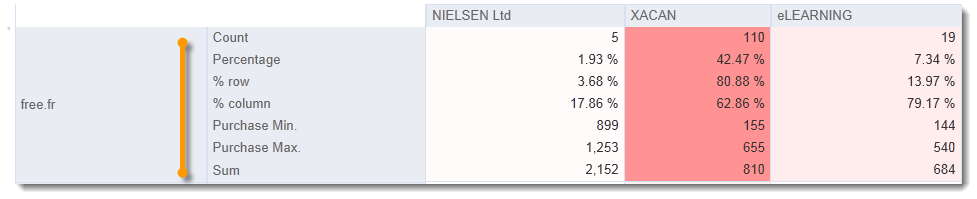
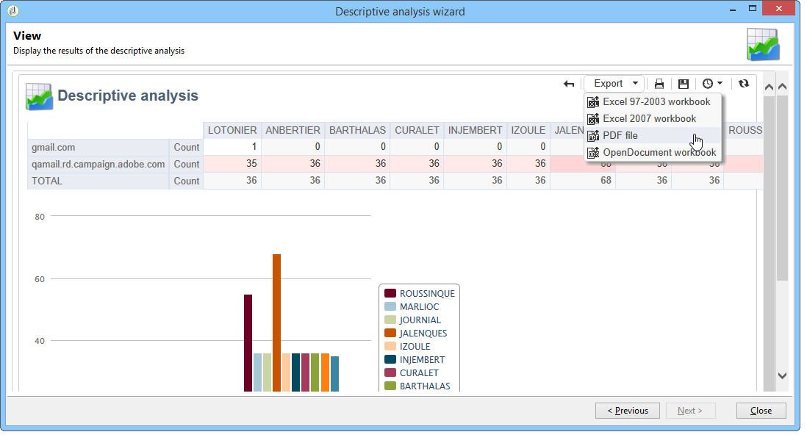

# 使用分析報表{#processing-a-report}

## 儲存分析報告 {#saving-an-analysis-report}

如果您有適當的許可權，可以儲存從範本建立的分析報告，或將其匯出為Excel、PDF或OpenOffice格式。

若要儲存報告，請按一下&#x200B;**[!UICONTROL Save]**，並為報告加上標籤。

如果要建立報表歷史記錄，並在儲存時檢視報表值，請選取&#x200B;**[!UICONTROL Also save data]**。 如需詳細資訊，請參閱[封存分析報告](#archiving-analysis-reports)。

**[!UICONTROL Share this report]**&#x200B;選項可讓其他操作者存取報告。

儲存後，此報告即可重複用於產生其他分析報告：

若要變更此報告，請編輯Adobe Campaign樹狀結構的&#x200B;**[!UICONTROL Administration > Configuration > Adobe Campaign tree reports]**&#x200B;節點（或操作員擁有編輯許可權的第一個「報告」型別資料夾）。 如需詳細資訊，請參閱[設定描述性分析報告的配置](#configuring-the-layout-of-a-descriptive-analysis-report)。

## 分析報告其他設定 {#analysis-report-additional-settings}

描述性分析報告儲存後，您可以編輯其屬性並存取其他選項。

這些選項與標準報告相同，並在[此頁面](../../reporting/using/properties-of-the-report.md)中詳細說明。

## 設定描述性分析報告的配置 {#configuring-the-layout-of-a-descriptive-analysis-report}

您可以在描述性分析的圖表和表格中，個人化資料的顯示和版面配置。 所有選項都可透過每個報告&#x200B;**[!UICONTROL Edit]**&#x200B;索引標籤中的Adobe Campaign樹狀結構來存取。

### 分析報表顯示模式 {#analysis-report-display-mode}

當您使用&#x200B;**[!UICONTROL qualitative distribution]**&#x200B;範本建立報告時，預設會選取表格和圖表顯示模式。 如果您只想要一種顯示模式，請取消核取適當的方塊。 這表示只有已勾選顯示模式的標籤才可使用。

若要變更報表的結構描述，請按一下&#x200B;**[!UICONTROL Select the link]**&#x200B;並從資料庫中選取其他資料表。

### 分析報表顯示設定 {#analysis-report-display-settings}

您可以隱藏或顯示統計資料與小計，也可以選擇統計資料的方向。

建立統計資料時，您可以個人化其標籤。

其名稱將顯示在報表中。

但是，如果您取消勾選標籤和小計顯示選項，這些標籤和小計將不會顯示在報表中。 當您將滑鼠游標停留在表格的儲存格上時，該名稱將會出現在工具提示中。

依預設，統計資料會線上上顯示。 若要變更方向，請從下拉式清單中選取適當的選項。

在下列範例中，統計資料會以欄顯示。

### 分析報表資料配置 {#analysis-report-data-layout}

您可以直接在描述性分析表格中個人化資料配置。 若要這麼做，請以滑鼠右鍵按一下您要使用的變數。 從下拉式選單中選取可用的選項：

* **[!UICONTROL Pivot]**&#x200B;以變更變數的座標軸。
* **[!UICONTROL Up]** / **[!UICONTROL Down]**&#x200B;以交換行中的變數。
* **[!UICONTROL Move to the right]** / **[!UICONTROL Move to the left]**&#x200B;以交換資料行中的變數。
* **[!UICONTROL Turn]**&#x200B;以反轉變數軸。
* **[!UICONTROL Sort from A to Z]**&#x200B;可將變數值從低到高排序。
* **[!UICONTROL Sort from Z to A]**&#x200B;可將變數值排序為高到低。

  

若要返回初始顯示，請重新整理檢視。

### 分析報表圖表選項 {#analysis-report-chart-options}

可以在圖表中個人化資料的顯示。 若要這麼做，請按一下圖表型別選取階段期間可用的&#x200B;**[!UICONTROL Variables...]**&#x200B;連結。

可以使用以下選項：

* 視窗的上半部可讓您修改圖表顯示區域。
* 依預設，標籤會顯示在圖表中。 您可以取消勾選&#x200B;**[!UICONTROL Show values]**&#x200B;選項來隱藏它們。
* **[!UICONTROL Accumulate values]**&#x200B;選項可讓您將一個數列的值加到另一個數列。
* 您可以決定是否顯示圖表圖例：若要隱藏圖例，請取消勾選適當的選項。 根據預設，圖例會顯示在圖表右上角的外部。

  圖例也可以顯示在圖表的頂端，以節省顯示空間。 若要這麼做，請選取選項&#x200B;**[!UICONTROL Include in the chart]**

  在&#x200B;**[!UICONTROL Caption position]**&#x200B;下拉式清單中選取垂直和水平對齊。

  

## 匯出分析報告 {#exporting-an-analysis-report}

若要從分析報表匯出資料，請按一下下拉式清單並選取所需的輸出格式。

如需詳細資訊，請參閱[此頁面](../../reporting/using/actions-on-reports.md)。

## 重複使用現有的報告和分析 {#re-using-existing-reports-and-analyses}

您可以使用已儲存在Adobe Campaign中的現有報告，建立資料的描述性分析報告。 當已儲存分析或已建立報告並設定為可透過描述性分析精靈存取時，就可以使用此模式。

若要瞭解如何儲存描述性分析，請參閱[儲存分析報告](#saving-an-analysis-report)。

若要建立描述性分析報表，描述性分析精靈必須透過工作流程轉換或&#x200B;**[!UICONTROL Tools > Descriptive analysis]**&#x200B;功能表執行。

1. 選取 **[!UICONTROL Existing analyses and reports]** 並按一下 **[!UICONTROL Next]**。
1. 這可讓您存取可用報告的清單。 選取您要產生的報告。

   

## 封存分析報表 {#archiving-analysis-reports}

當您根據現有分析建立描述性分析時，可以建立封存來儲存資料並比較報告結果。

若要建立歷史記錄，請套用下列步驟：

1. 開啟現有的分析或建立新的描述性分析精靈。
1. 在報表顯示頁面中，按一下按鈕以在工具列中建立歷史記錄，然後如下所示確認：

   

1. 使用封存存取按鈕來顯示先前的分析。

   
