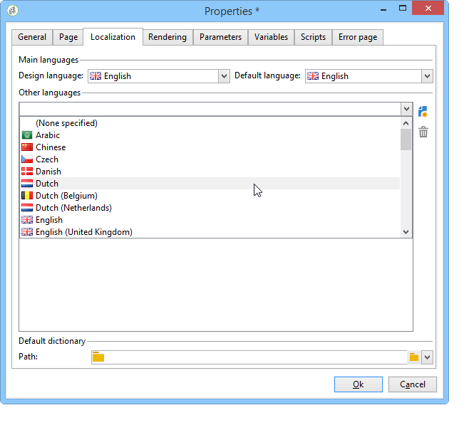
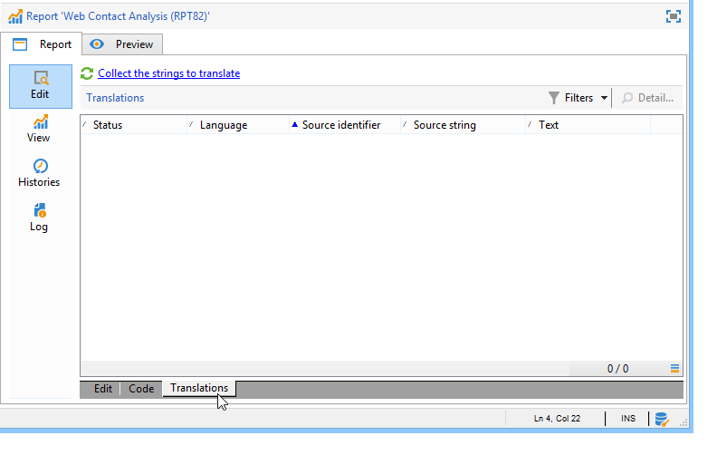

# 報吿屬性{#properties-of-the-report}

您可以完全個人化並設定報表以符合您的需求。 要執行此操作，請編輯其屬性。 報表屬性可透過 **[!UICONTROL Properties]** 按鈕。

以下說明一般屬性。 在 **[!UICONTROL Parameters]**, **[!UICONTROL Variables]** 和 **[!UICONTROL Scripts]** 索引標籤已說明 [在本節](../../reporting/using/advanced-functionalities.md).

## 一般屬性 {#overall-properties}

在 **[!UICONTROL General]** 頁簽，您可以編輯下列設定：

* 報表的標籤和內部名稱。 此 **[!UICONTROL Internal name]** 會用於報表最終URL中。 報表建立後不應變更。

* 報表 **資料夾** 在建立報表時被選取。 最佳作法是為自訂報表建立專用資料夾，以避免與 [內建報表](../../reporting/using/about-campaign-built-in-reports.md).

* 此 **儲存** 中所選的URL。 若要變更報表的資料表格，請按一下 **[!UICONTROL Select link]** 表徵圖 **[!UICONTROL Document type]** 欄位。

   

* 此 **存取控制** 參數。 以下說明這些設定。

## 控制對報告的存取 {#report-accessibility}

報表可在Adobe Campaign主控台或網頁瀏覽器中存取。 在此情況下，可能需要設定報表存取控制，如下所示。

可能的選項包括：

* **[!UICONTROL Anonymous access]**:此選項可允許不受限制地訪問報告。 但是，不可能操縱。

   「webapp」技術運算子的權限用於顯示報表元素。 深入了解 [在本節](../../platform/using/access-management-operators.md).

* **[!UICONTROL Access control]**:此選項可讓Adobe Campaign運算子在登入後加以存取。
* **[!UICONTROL Specific account]**:此選項可讓您使用在 **[!UICONTROL Operator]** 欄位。

## 翻譯您的報表 {#report-localization}

您可以設定要將報表翻譯成的語言。 若要這麼做，請按一下 **[!UICONTROL Localization]** 標籤。

編輯語言是您所撰寫的語言。 新增語言時，子索引標籤會出現在報表編輯頁面中。

>[!NOTE]
>
>如需Campaign網頁本地化的詳細資訊，請參閱 [本節](../../web/using/translating-a-web-form.md).

## 個人化HTML轉譯 {#personalizing-html-rendering}

在 **[!UICONTROL Rendering]** ，您就可以個人化頁面的資料顯示模式。 您可以選擇：

* 報表中的導覽類型：透過按鈕或連結。
* 報表元素的標籤預設位置。 每個元素的此位置都可能超載。
* 用於產生報表頁面的範本或主題。

## 個人化錯誤頁面 {#personalizing-the-error-page}

此 **[!UICONTROL Error page]** 標籤，以設定報表顯示中發生錯誤時將顯示的訊息。

您可以定義文字並將其連結至特定識別碼，以管理報表本地化。 有關詳細資訊，請參閱 [新增頁首和頁尾](../../reporting/using/element-layout.md#adding-a-header-and-a-footer).

