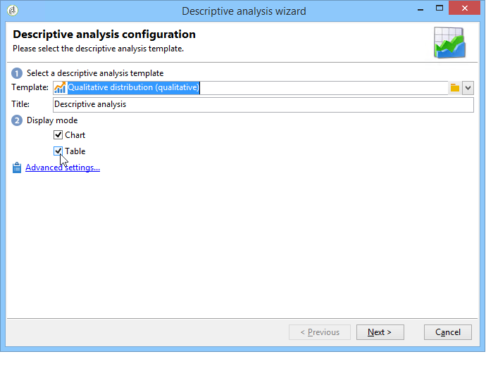
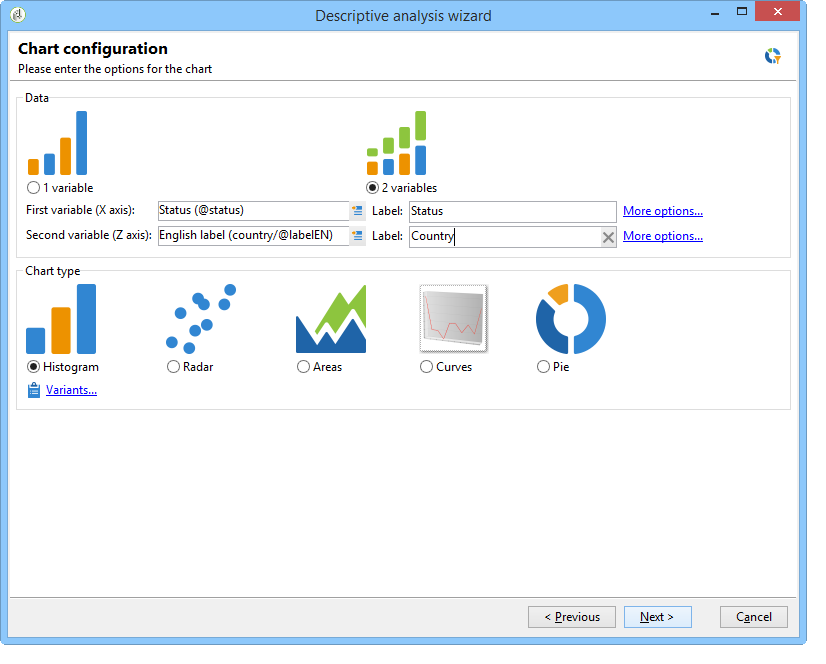
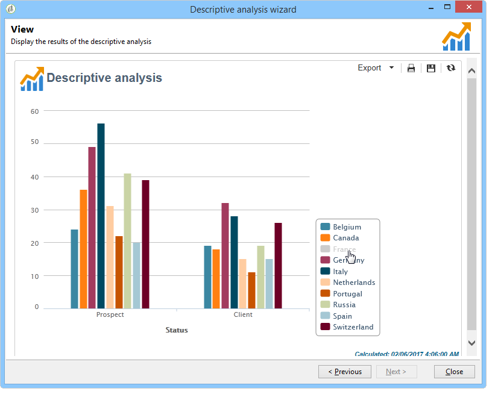
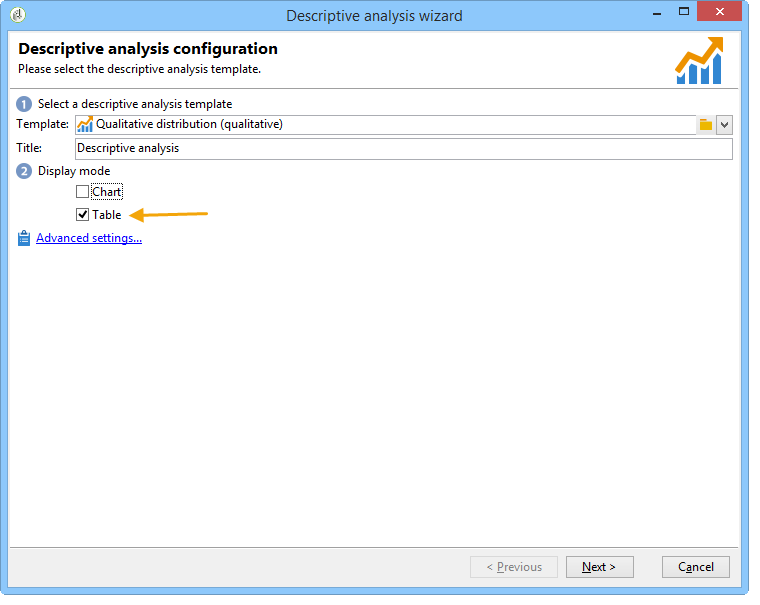
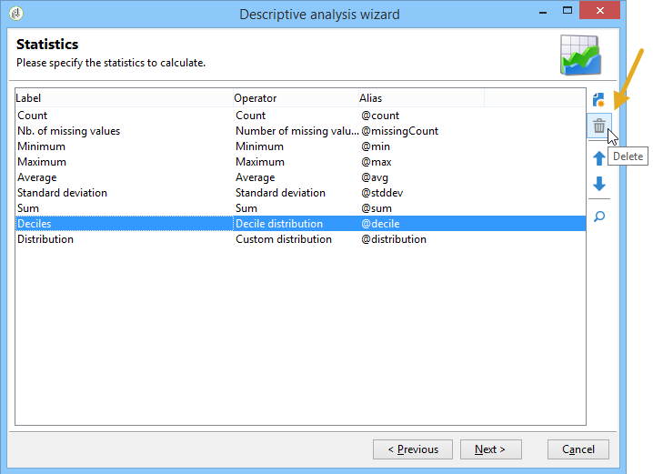
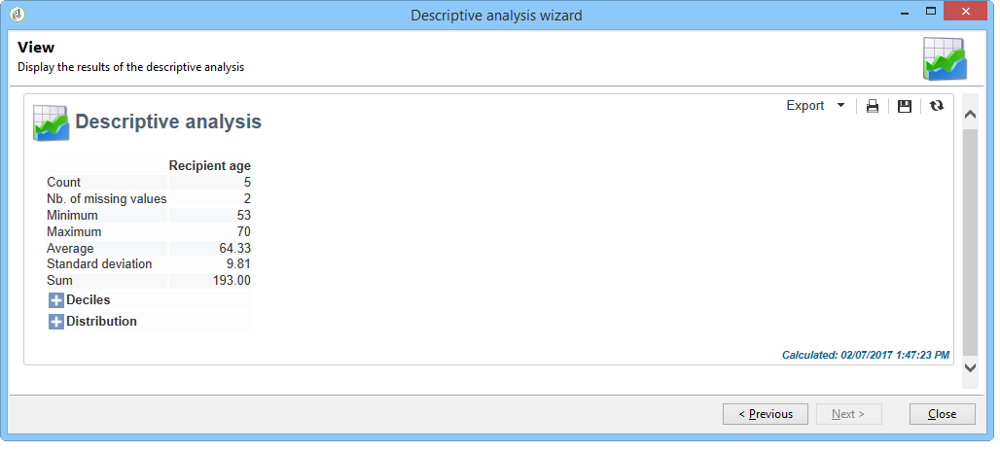
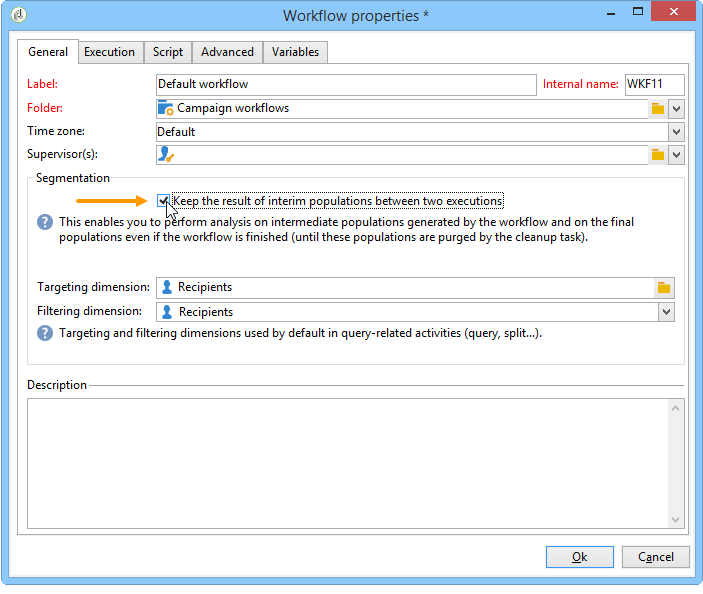
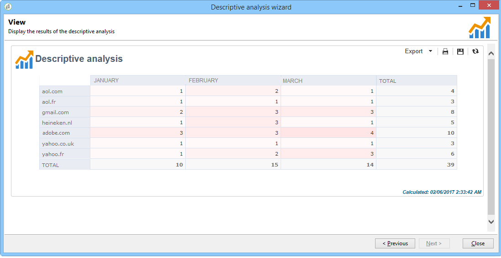

# 使用案例{#use-cases}


## 分析人口 {#analyzing-a-population}

以下範例可讓您使用描述性分析精靈，探索由一組電子報鎖定的母體。

實作步驟於下文詳細說明，而本章其他章節則提供選項和說明的完整清單。

### 識別要分析的人口 {#identifying-the-population-to-analyze}

在此範例中，我們想探索包含在 **電子報** 檔案夾。

若要這麼做，請選取相關傳送，然後按一下滑鼠右鍵並選取 **[!UICONTROL Action > Explore the target...]**.


### 選取分析類型 {#selecting-a-type-of-analysis}

在助理的第一個步驟中，您可以選取要使用的描述性分析範本。 依預設，Adobe Campaign提供兩個範本： **[!UICONTROL Qualitative distribution]** 和 **[!UICONTROL Quantitative distribution]**. 有關詳細資訊，請參閱 [配置定性分佈模板](../../reporting/using/using-the-descriptive-analysis-wizard.md#configuring-the-qualitative-distribution-template) 區段。 各種呈現會顯示在 [關於描述性分析](../../reporting/using/about-descriptive-analysis.md) 區段。

在此範例中，選取 **[!UICONTROL Qualitative distribution]** 範本，並選擇顯示圖表和表格（陣列）。 為報表命名（「描述性分析」），然後按一下 **[!UICONTROL Next]**.



### 選取要顯示的變數 {#selecting-the-variables-to-display}

下一個步驟可讓您選取要顯示在表格中的資料。

按一下 **[!UICONTROL Add...]** 連結以選取包含要顯示之資料的變數。 在此，我們想要在一行上顯示傳送收件者的城市：


欄會顯示每家公司的購買次數。 在此範例中，金額會匯總至 **網路購買** 欄位。

在此，我們要定義結果綁定以釐清其顯示。 若要這麼做，請選取 **[!UICONTROL Manual]** 綁定選項，並設定要顯示的段的計算類：


然後，按一下 **[!UICONTROL Ok]** 來核准設定。

定義行和列後，可以使用工具欄更改、移動或刪除它們。


### 定義顯示格式 {#defining-the-display-format}

精靈的下一個步驟可讓您選取要產生的圖表類型。

在此案例中，選取色階分佈圖。


在 [分析報表圖表選項](../../reporting/using/processing-a-report.md#analysis-report-chart-options) 區段。

### 設定統計值以計算 {#configuring-the-statistic-to-calculate}

然後指定要套用至收集資料的計算。 依預設，描述性分析精靈會執行值的簡單計數。

此窗口允許您定義要計算的統計資訊清單。


若要建立新的統計資料，請按一下 **[!UICONTROL Add]** 按鈕。 有關詳細資訊，請參閱 [統計計算](../../reporting/using/using-the-descriptive-analysis-wizard.md#statistics-calculation).

### 檢視及使用報表 {#viewing-and-using-the-report}

精靈的最後一個步驟會顯示表格和圖表。

您可以使用表格上方的工具列來儲存、匯出或列印資料。 有關詳細資訊，請參閱 [處理報表](../../reporting/using/processing-a-report.md).


## 定性資料分析 {#qualitative-data-analysis}

### 圖表顯示範例 {#example-of-a-chart-display}

**目標**:生成潛在客戶或客戶所在位置的分析報告。

1. 開啟描述性分析精靈並選取 **[!UICONTROL Chart]** 只有。

   

   按一下 **[!UICONTROL Next]** 來核准此步驟。

1. 然後選取 **[!UICONTROL 2 variables]** ，並指定 **[!UICONTROL First variable (abscissa)]** 會指收件者狀態（潛在客戶/客戶），而第二個變數則指國家。
1. 選擇 **[!UICONTROL Cylinders]** 作為類型。

   

1. 按一下 **[!UICONTROL Next]** 並保留預設值 **[!UICONTROL Simple count]** 統計。
1. 按一下 **[!UICONTROL Next]** 來顯示報表。

   

   將滑鼠指標暫留在長條上，即可查看該國家/地區的確切客戶或潛在客戶數量。

1. 根據圖例，啟用或停用其中一個國家的顯示。

   

### 表格顯示範例 {#example-of-a-table-display}

**目標**:分析公司電子郵件網域。

1. 開啟描述性分析精靈，然後選取 **[!UICONTROL Array]** 僅顯示模式。

   

   按一下 **[!UICONTROL Next]** 按鈕來核准此步驟。

1. 選取 **[!UICONTROL Company]** 變數作為欄，而 **[!UICONTROL Email domain]** 變數。
1. 保留 **[!UICONTROL By rows]** 統計定位選項：統計計算將顯示在 **[!UICONTROL Email domain]** 變數。

   

   按一下 **[!UICONTROL Next]** 來核准此步驟。

1. 然後輸入要計算的統計資訊：保留預設計數並建立新的統計資料。 要執行此操作，請按一下 **[!UICONTROL Add]** 選取 **[!UICONTROL Total percentage distribution]** 作為運算子。

   

1. 輸入統計資料的標籤，以便在顯示報表時不會出現空白欄位。

   

1. 按一下 **[!UICONTROL Next]** 來顯示報表。

   

1. 產生分析報表後，您就可以調整顯示以符合您的需求，而不需變更設定。 例如，您可以切換軸：按一下右鍵域名並選擇 **[!UICONTROL Turn]** 的上界。

   

   表格顯示以下資訊：

   

## 定量資料分析 {#quantitative-data-analysis}

**目標**:生成收件年齡的量化分析報告

1. 開啟描述性分析精靈並選取 **[!UICONTROL Quantitative distribution]** 從下拉式清單中。

   

   按一下 **[!UICONTROL Next]** 按鈕來核准此步驟。

1. 選取 **[!UICONTROL Age]** 變數並輸入其標籤。 指定它是否為整數，然後按一下 **[!UICONTROL Next]**.

   

1. 刪除 **[!UICONTROL Deciles]**, **[!UICONTROL Distribution]** 和 **[!UICONTROL Sum]** 統計資料：這裡不需要。

   

1. 按一下 **[!UICONTROL Next]** 來顯示報表。

   

## 在工作流程中分析轉變目標 {#analyzing-a-transition-target-in-a-workflow}

**目標**:生成目標工作流母體的報告

1. 開啟所需的鎖定目標工作流程。
1. 以滑鼠右鍵按一下指向收件者表格的轉變。
1. 選擇 **[!UICONTROL Analyze target]** （在下拉式功能表中）以開啟描述性分析視窗。

   

1. 此時，您可以選取 **[!UICONTROL Existing analyses and reports]** 選項，並使用先前建立的報表(請參閱 [重新使用現有報告和分析](../../reporting/using/processing-a-report.md#re-using-existing-reports-and-analyses))，或建立新的描述性分析。 若要這麼做，請將 **[!UICONTROL New descriptive analysis from a template]** 選項。

   其餘的設定與所有描述性分析的設定相同。

### Target分析建議 {#target-analyze-recommendations}

在工作流程中分析母體時，母體仍須存在於轉變中。 如果啟動工作流程，則可能會從轉變中清除關於母體的結果。 若要執行分析，您可以執行下列任一動作：

* 從其目標活動分離轉變，並啟動工作流程使其變為活動狀態。 轉變開始閃爍後，請照常啟動精靈。

   

* 借由選取 **[!UICONTROL Keep the result of interim populations between two executions]** 選項。 這可讓您啟動您所選取之轉變的分析，即使工作流程已完成亦然。

   

   如果從轉變中清除了母體，則會出現錯誤訊息，要求您在啟動描述性分析精靈之前選取相關選項。

   

>[!CAUTION]
>
>此 **[!UICONTROL Keep the result of interim populations between two executions]** 選項只能用於開發階段，但絕不能用於生產環境。\
>當達到保留期限時，系統會自動清除臨時人口。 此截止日期在工作流屬性中指定 **[!UICONTROL Execution]** 標籤。

## 分析收件者追蹤記錄 {#analyzing-recipient-tracking-logs}

描述性分析嚮導可以生成其他工作表的報告。 這表示您可以建立專用報表來分析傳送記錄。

在此範例中，我們要分析新聞稿收件者的再次活動率。

若要這麼做，請套用下列步驟：

1. 透過 **[!UICONTROL Tools > Descriptive analysis]** 菜單和更改預設工作表。 選擇 **[!UICONTROL Recipient tracking log]** 並新增篩選器以排除校樣並包含電子報。

   

   選取表格顯示，然後按一下 **[!UICONTROL Next]**.

1. 在下一個視窗中，指定分析與傳送有關。

   

   在此，傳遞標籤會顯示在第一欄中。

1. 刪除預設計數並建立三個統計資訊，以配置要在表中顯示的統計資訊。

   在此，表格將顯示每份電子報：開啟次數、點按次數、再活動率（百分比）。

1. 新增統計資料以計算點按次數：在 **[!UICONTROL Filter]** 標籤。

   

1. 然後按一下 **[!UICONTROL General]** 頁簽以更名統計標籤和別名：

   

1. 新增第二個統計資料，以計算開啟次數：

   

1. 然後按一下 **[!UICONTROL General]** 頁簽來更名統計標籤及其別名：

   

1. 新增第三個統計資料並選取 **[!UICONTROL Calculated field]** 運算子來測量反應性率。

   

   前往 **[!UICONTROL User function]** 欄位，然後輸入下列公式：

   ```
   @clic / @open * 100
   ```

   調整統計標籤，如下所示：

   

   最後，指定值是否以百分比顯示：要執行此操作，請取消選中 **[!UICONTROL Default formatting]** 選項 **[!UICONTROL Advanced]** 索引標籤和選取 **[!UICONTROL Percentage]** 沒有小數點。

   

1. 按一下 **[!UICONTROL Next]** 來顯示報表。

   

## 分析傳送排除記錄檔 {#analyzing-delivery-exclusion-logs}

如果分析與傳送有關，您可以分析排除的母體。 若要這麼做，請選取要分析的傳送，然後按一下滑鼠右鍵以存取 **[!UICONTROL Action > Explore exclusions]** 功能表。


這會將您帶往描述性分析精靈，而分析會與收件者排除記錄有關。

例如，您可以顯示所有已排除位址的網域，並依排除日期加以排序。


這會產生下列類型的報表：


