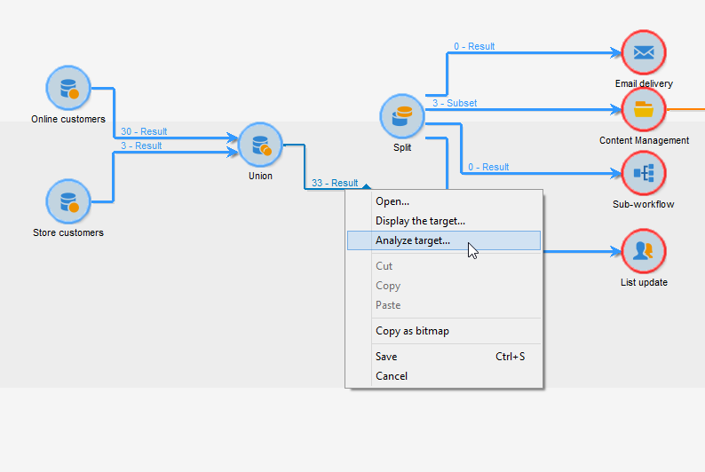

# 使用案例{#use-cases}


## 分析人口 {#analyzing-a-population}

以下示例允許您使用說明性分析嚮導來瀏覽一組新聞稿所針對的人口。

下面詳細介紹了實施步驟，本章其他部分提供了詳盡的選項和說明清單。

### 確定要分析的人口 {#identifying-the-population-to-analyze}

在本示例中，我們要探討包含在 **通訊** 的子菜單。

要執行此操作，請選擇相關交貨，然後按一下右鍵並選擇 **[!UICONTROL Action > Explore the target...]**。


### 選擇分析類型 {#selecting-a-type-of-analysis}

在助理的第一步中，可以選擇要使用的說明性分析模板。 預設情況下，Adobe Campaign提供兩個模板： **[!UICONTROL Qualitative distribution]** 和 **[!UICONTROL Quantitative distribution]**。 有關詳情，請參閱 [配置定性分佈模板](../../reporting/using/using-the-descriptive-analysis-wizard.md#configuring-the-qualitative-distribution-template) 的子菜單。 在 [關於描述性分析](../../reporting/using/about-descriptive-analysis.md) 的子菜單。

對於此示例，選擇 **[!UICONTROL Qualitative distribution]** 模板，然後選擇包含圖表和表（陣列）的顯示。 為報告指定名稱（「描述性分析」），然後按一下 **[!UICONTROL Next]**。


### 選擇要顯示的變數 {#selecting-the-variables-to-display}

下一步允許您選擇要在表格中顯示的資料。

按一下 **[!UICONTROL Add...]** 連結，以選擇包含要顯示的資料的變數。 在此，我們希望在一行上顯示我們的送貨收件人的城市：


這些列將顯示每個公司的採購數。 在本例中，金額在 **Web購買** 的子菜單。

在此，我們要定義結果綁定以澄清其顯示。 要執行此操作，請選擇 **[!UICONTROL Manual]** binning選項，並設定要顯示的段的計算類：


然後，按一下 **[!UICONTROL Ok]** 以批准配置。

定義行和列後，可使用工具欄更改、移動或刪除它們。


### 定義顯示格式 {#defining-the-display-format}

嚮導的下一步允許您選擇要生成的圖表類型。

在這種情況下，請選擇直方圖。


不同圖形的可能配置在 [分析報表圖表選項](../../reporting/using/processing-a-report.md#analysis-report-chart-options) 的子菜單。

### 配置統計資訊以計算 {#configuring-the-statistic-to-calculate}

然後指定要應用於收集的資料的計算。 預設情況下，說明性分析嚮導執行簡單的值計數。

通過此窗口可以定義要計算的統計資訊清單。


要建立新統計資訊，請按一下 **[!UICONTROL Add]** 按鈕 有關此內容的詳細資訊，請參閱 [統計計算](../../reporting/using/using-the-descriptive-analysis-wizard.md#statistics-calculation)。

### 查看和使用報表 {#viewing-and-using-the-report}

嚮導的最後一步顯示表和圖表。

可以使用表格上方的工具欄儲存、導出或打印資料。 有關此內容的詳細資訊，請參閱 [處理報表](../../reporting/using/processing-a-report.md)。


## 定性資料分析 {#qualitative-data-analysis}

### 圖表顯示示例 {#example-of-a-chart-display}

**目標**:生成有關潛在客戶或客戶位置的分析報告。

1. 開啟說明性分析嚮導並選擇 **[!UICONTROL Chart]** 只是。

   

   按一下 **[!UICONTROL Next]** 以批准此步驟。

1. 然後選擇 **[!UICONTROL 2 variables]** 選項並指定 **[!UICONTROL First variable (abscissa)]** 將指收件人狀態（潛在客戶/客戶），而第二個變數將指國家/地區。
1. 選擇 **[!UICONTROL Cylinders]** 的雙曲餘切值。

   

1. 按一下 **[!UICONTROL Next]** 保留預設值 **[!UICONTROL Simple count]** 統計。
1. 按一下 **[!UICONTROL Next]** 的子菜單。

   

   將滑鼠懸停在酒吧上，查看該國家/地區的確切客戶數或潛在客戶數。

1. 根據圖例啟用或禁用其中一個國家（地區）的顯示。

   

### 表格顯示示例 {#example-of-a-table-display}

**目標**:分析公司電子郵件域。

1. 開啟說明性分析嚮導，然後選擇 **[!UICONTROL Array]** 僅顯示模式。

   

   按一下 **[!UICONTROL Next]** 按鈕來批准此步驟。

1. 選擇 **[!UICONTROL Company]** 變數（列）和 **[!UICONTROL Email domain]** 變數。
1. 保留 **[!UICONTROL By rows]** 選項，用於統計方向：統計計算將顯示在 **[!UICONTROL Email domain]** 變數。

   

   按一下 **[!UICONTROL Next]** 以批准此步驟。

1. 然後輸入要計算的統計資訊：保留預設計數並建立新統計。 要執行此操作，請按一下 **[!UICONTROL Add]** 選擇 **[!UICONTROL Total percentage distribution]** 作為運算子。

   

1. 輸入統計資訊的標籤，以便在顯示報告時不會出現空白欄位。

   

1. 按一下 **[!UICONTROL Next]** 的子菜單。

   

1. 生成分析報告後，您可以調整顯示以適應您的需要，而無需更改配置。 例如，可以切換軸：按一下右鍵域名並選擇 **[!UICONTROL Turn]** 的上界。

   

   該表顯示如下資訊：

   

## 定量資料分析 {#quantitative-data-analysis}

**目標**:生成接受年齡的定量分析報告

1. 開啟說明性分析嚮導並選擇 **[!UICONTROL Quantitative distribution]** 從下拉清單中。

   

   按一下 **[!UICONTROL Next]** 按鈕來批准此步驟。

1. 選擇 **[!UICONTROL Age]** 並輸入其標籤。 指定它是否為整數，然後按一下 **[!UICONTROL Next]**。

   

1. 刪除 **[!UICONTROL Deciles]**。 **[!UICONTROL Distribution]** 和 **[!UICONTROL Sum]** 統計：這裡不需要。

   

1. 按一下 **[!UICONTROL Next]** 的子菜單。

   

## 分析工作流中的轉換目標 {#analyzing-a-transition-target-in-a-workflow}

**目標**:生成目標工作流填充的報告

1. 開啟所需的目標工作流。
1. 按一下右鍵指向收件人表的過渡。
1. 選擇 **[!UICONTROL Analyze target]** 的子菜單。

   

1. 此時，您可以選擇 **[!UICONTROL Existing analyses and reports]** 選項，並使用以前建立的報告(請參閱 [重新使用現有報告和分析](../../reporting/using/processing-a-report.md#re-using-existing-reports-and-analyses))，或建立新的描述性分析。 為此，請 **[!UICONTROL New descriptive analysis from a template]** 選項。

   其餘的配置與所有描述性分析的配置相同。

### 目標分析建議 {#target-analyze-recommendations}

對工作流中的人口進行分析需要人口仍在過渡中。 如果啟動工作流，則可能會從轉換中清除與填充有關的結果。 要運行分析，您可以執行以下任一操作：

* 從其目標活動分離轉換並啟動工作流使其處於活動狀態。 一旦轉換開始閃爍，就以通常的方式啟動嚮導。

   

* 通過選擇 **[!UICONTROL Keep the result of interim populations between two executions]** 的雙曲餘切值。 這樣，即使工作流已完成，您也可以啟動對所選內容轉換的分析。

   

   如果填充從轉換中清除，則會出現一條錯誤消息，要求您在啟動說明性分析嚮導之前選擇相關選項。

   

>[!CAUTION]
>
>的 **[!UICONTROL Keep the result of interim populations between two executions]** 選項只能在開發階段使用，但不能用於生產環境。\
>在達到保留期限後，臨時人口將自動清除。 此截止日期在工作流屬性中指定 **[!UICONTROL Execution]** 頁籤。

## 分析收件人跟蹤日誌 {#analyzing-recipient-tracking-logs}

描述性分析嚮導可以生成有關其他工作表的報告。 這意味著您可以通過建立專用報告來分析交付日誌。

在本例中，我們要分析通訊收件人的反應性率。

若要這麼做，請套用下列步驟：

1. 通過 **[!UICONTROL Tools > Descriptive analysis]** 的子菜單。 選擇 **[!UICONTROL Recipient tracking log]** 並添加一個過濾器以排除校樣並包括新聞稿。

   

   選擇表格顯示，然後按一下 **[!UICONTROL Next]**。

1. 在下一個窗口中，指定分析涉及交貨。

   

   此處，交貨標籤將顯示在第一列中。

1. 刪除預設計數並建立三個統計資訊，以配置要顯示在表中的統計資訊。

   在此，每份新聞簡報的表格將顯示：開啟次數、點擊次數、反應性率（百分比）。

1. 添加統計資訊以計數按一下次數：在 **[!UICONTROL Filter]** 頁籤。

   

1. 然後按一下 **[!UICONTROL General]** 頁籤以更名統計標籤和別名：

   

1. 添加第二個統計資訊，以計算開啟次數：

   

1. 然後按一下 **[!UICONTROL General]** 頁籤，以更名統計標籤及其別名：

   

1. 添加第三個統計資訊並選擇 **[!UICONTROL Calculated field]** 測量反應性率的操作器。

   

   轉到 **[!UICONTROL User function]** ，然後輸入以下公式：

   ```
   @clic / @open * 100
   ```

   調整統計標籤，如下所示：

   

   最後，指定值是否以百分比顯示：要執行此操作，請取消選中 **[!UICONTROL Default formatting]** 的上界 **[!UICONTROL Advanced]** 頁籤 **[!UICONTROL Percentage]** 沒有小數點。

   

1. 按一下 **[!UICONTROL Next]** 的子菜單。

   

## 分析傳遞排除日誌 {#analyzing-delivery-exclusion-logs}

如果分析涉及交貨，則可以分析排除的總量。 要執行此操作，請選擇要分析的交貨，然後按一下右鍵以訪問 **[!UICONTROL Action > Explore exclusions]** 的子菜單。


這將帶您進入描述性分析嚮導，分析將涉及收件人排除日誌。

例如，您可以顯示所有排除地址的域並按排除日期對它們進行排序。


這將生成以下類型的報告：


