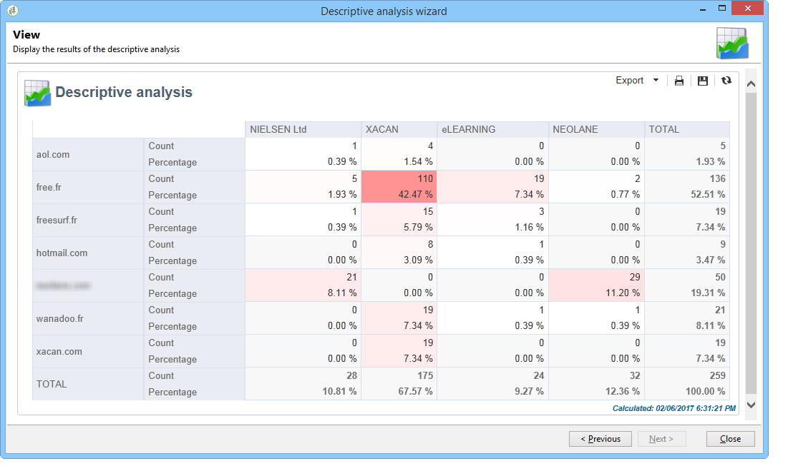
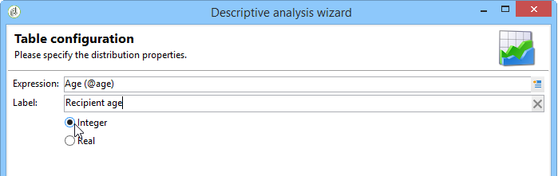

# Analysis報告使用案例 {#use-cases}

## 分析人口 {#analyzing-a-population}

下列範例可讓您使用描述性分析助理，探索一組電子報所定位的母體。

實作步驟將於下文詳細說明，而本章其他章節則提供選項及說明的完整清單。

### 識別要分析的母體 {#identifying-the-population-to-analyze}

在此範例中，我們要探索&#x200B;**電子報**&#x200B;資料夾中包含之傳遞的目標母體。

若要這麼做，請選取相關傳遞，然後按一下滑鼠右鍵並選取&#x200B;**[!UICONTROL Action > Explore the target...]**。


### 選取分析型別 {#selecting-a-type-of-analysis}

在助理的第一個步驟中，您可以選取要使用的描述性分析範本。 依預設，Adobe Campaign提供兩個範本： **[!UICONTROL Qualitative distribution]**&#x200B;和&#x200B;**[!UICONTROL Quantitative distribution]**。 如需詳細資訊，請參閱[設定質化發佈範本](../../reporting/using/using-the-descriptive-analysis-wizard.md#configuring-the-qualitative-distribution-template)區段。 各種演算會顯示在[關於描述性分析](../../reporting/using/about-descriptive-analysis.md)區段中。

在此範例中，選取&#x200B;**[!UICONTROL Qualitative distribution]**&#x200B;範本，然後選擇包含圖表和表格（陣列）的顯示。 為報表命名（「描述性分析」）並按一下&#x200B;**[!UICONTROL Next]**。


### 選取要顯示的變數 {#selecting-the-variables-to-display}

下一個步驟可讓您選取要在表格中顯示的資料。

按一下&#x200B;**[!UICONTROL Add...]**&#x200B;連結以選取包含要顯示之資料的變數。 我們想要在此在一行中顯示傳送收件者的城市：


欄會顯示每個公司的購買次數。 在此範例中，金額是在&#x200B;**網頁購買**&#x200B;欄位中進行彙總。

在此，我們要定義結果量化以釐清其顯示。 若要這麼做，請選取&#x200B;**[!UICONTROL Manual]**&#x200B;量化選項，並設定要顯示之區段的計算類別：


然後，按一下&#x200B;**[!UICONTROL Ok]**&#x200B;以核准設定。

定義直線和欄之後，您可以使用工具列來變更、移動或刪除它們。


### 定義顯示格式 {#defining-the-display-format}

助理的下一個步驟可讓您選取要產生的圖表型別。

在這種情況下，請選擇色階分佈圖。


不同圖形的可能設定在[分析報告圖表選項](../../reporting/using/processing-a-report.md#analysis-report-chart-options)區段中詳細說明。

### 設定要計算的統計資料 {#configuring-the-statistic-to-calculate}

然後指定要套用至所收集資料的計算。 依預設，描述性分析助理會執行值的簡單計數。

此視窗可讓您定義要計算的統計資料清單。


若要建立新的統計資料，請按一下&#x200B;**[!UICONTROL Add]**&#x200B;按鈕。 如需詳細資訊，請參閱[統計資料計算](../../reporting/using/using-the-descriptive-analysis-wizard.md#statistics-calculation)。

### 檢視及使用報表 {#viewing-and-using-the-report}

助理的最後一步會顯示表格和圖表。

您可以使用表格上方的工具列來儲存、匯出或列印資料。 如需詳細資訊，請參閱[處理報表](../../reporting/using/processing-a-report.md)。


## 質化資料分析 {#qualitative-data-analysis}

### 圖表顯示範例 {#example-of-a-chart-display}

**目標**：產生潛在客戶或客戶位置的分析報告。

1. 開啟描述性分析助理並只選取&#x200B;**[!UICONTROL Chart]**。

   

   按一下&#x200B;**[!UICONTROL Next]**&#x200B;以核准此步驟。

1. 然後選取&#x200B;**[!UICONTROL 2 variables]**&#x200B;選項，並指定&#x200B;**[!UICONTROL First variable (abscissa)]**&#x200B;將參照收件者狀態（潛在客戶/客戶），而第二個變數將參照國家。
1. 選取&#x200B;**[!UICONTROL Cylinders]**&#x200B;作為型別。

   

1. 按一下&#x200B;**[!UICONTROL Next]**&#x200B;並保留預設值&#x200B;**[!UICONTROL Simple count]**&#x200B;統計資料。
1. 按一下&#x200B;**[!UICONTROL Next]**&#x200B;以顯示報表。

   

   將滑鼠指標暫留在橫條上，可檢視此國家/地區的確切客戶或潛在客戶數目。

1. 根據圖例啟用或停用顯示其中一個國家/地區。

   

### 表格顯示範例 {#example-of-a-table-display}

**目標**：分析公司電子郵件網域。

1. 開啟描述性分析小幫手，並只選取&#x200B;**[!UICONTROL Array]**&#x200B;顯示模式。

   

   按一下&#x200B;**[!UICONTROL Next]**&#x200B;按鈕以核准此步驟。

1. 選取&#x200B;**[!UICONTROL Company]**&#x200B;變數作為欄，選取&#x200B;**[!UICONTROL Email domain]**&#x200B;變數作為列。
1. 保留統計資料方向的&#x200B;**[!UICONTROL By rows]**&#x200B;選項：統計資料計算會顯示在&#x200B;**[!UICONTROL Email domain]**&#x200B;變數的右側。

   

   按一下&#x200B;**[!UICONTROL Next]**&#x200B;以核准此步驟。

1. 然後輸入要計算的統計值：保留預設計數並建立新的統計值。 若要這麼做，請按一下&#x200B;**[!UICONTROL Add]**&#x200B;並選取&#x200B;**[!UICONTROL Total percentage distribution]**&#x200B;作為運運算元。

   

1. 輸入統計資料的標籤，以便在顯示報告時不會出現空白欄位。

   

1. 按一下&#x200B;**[!UICONTROL Next]**&#x200B;以顯示報表。

   

1. 產生分析報告後，您可以調整顯示以符合您的需求，而無需變更設定。 例如，您可以切換軸：在網域名稱上按一下滑鼠右鍵，然後在捷徑功能表上選取&#x200B;**[!UICONTROL Turn]**。

   

   此表格會顯示下列資訊：

   

## 量化資料分析 {#quantitative-data-analysis}

**目標**：產生收件者年齡的量化分析報告

1. 開啟描述性分析小幫手，並從下拉式清單中選取&#x200B;**[!UICONTROL Quantitative distribution]**。

   

   按一下&#x200B;**[!UICONTROL Next]**&#x200B;按鈕以核准此步驟。

1. 選取&#x200B;**[!UICONTROL Age]**&#x200B;變數並輸入其標籤。 指定是否為整數，然後按一下&#x200B;**[!UICONTROL Next]**。

   

1. 刪除&#x200B;**[!UICONTROL Deciles]**、**[!UICONTROL Distribution]**&#x200B;和&#x200B;**[!UICONTROL Sum]**&#x200B;統計資料：此處不需要這些資料。

   

1. 按一下&#x200B;**[!UICONTROL Next]**&#x200B;以顯示報表。

   

## 分析工作流程中的轉變目標 {#analyzing-a-transition-target-in-a-workflow}

**目標**：產生目標工作流程母體的報告

1. 開啟所需的目標定位工作流程。
1. 以滑鼠右鍵按一下指向收件者表格的轉變。
1. 在下拉式功能表中選取&#x200B;**[!UICONTROL Analyze target]**&#x200B;以開啟描述性分析視窗。

   

1. 此時，您可以選取「**[!UICONTROL Existing analyses and reports]**」選項，並使用先前建立的報告（請參閱[重複使用現有報告和分析](../../reporting/using/processing-a-report.md#re-using-existing-reports-and-analyses)），或建立新的描述性分析。 若要這麼做，請保留&#x200B;**[!UICONTROL New descriptive analysis from a template]**&#x200B;選項預設為選取。

   其餘的組態與所有描述性分析相同。

### Target分析建議 {#target-analyze-recommendations}

工作流程中的母體分析需要母體仍然存在於轉變中。 如果啟動工作流程，可能會從轉變中清除有關母體的結果。 若要執行分析，您可以：

* 將轉變與其目標活動分離，並啟動工作流程以使其成為使用中。 一旦轉換開始閃爍，請像平常一樣啟動助理。

  

* 選取&#x200B;**[!UICONTROL Keep the result of interim populations between two executions]**&#x200B;選項，修改工作流程的內容。 這可讓您啟動所選轉變的分析，即使工作流程已完成。

  

  如果從轉變中清除母體，則會出現錯誤訊息，要求您在啟動描述性分析助理之前選取相關選項。

  

>[!CAUTION]
>
>**[!UICONTROL Keep the result of interim populations between two executions]**&#x200B;選項只能用於開發階段，絕不能用於生產環境。\
>一旦達到保留期限，系統就會自動清除臨時母體。 已在工作流程屬性&#x200B;**[!UICONTROL Execution]**&#x200B;索引標籤中指定此期限。

## 分析收件者追蹤記錄 {#analyzing-recipient-tracking-logs}

描述性分析助理可以產生其他工作表的報告。 這表示您可以透過建立專用報告來分析傳遞記錄。

在此範例中，我們要分析新聞稿收件者的反應率。

若要這麼做，請套用下列步驟：

1. 透過&#x200B;**[!UICONTROL Tools > Descriptive analysis]**&#x200B;功能表開啟描述性分析小幫手，並變更預設工作表。 選取&#x200B;**[!UICONTROL Recipient tracking log]**&#x200B;並新增篩選器，以排除校樣並包含電子報。

   

   選取表格顯示並按一下&#x200B;**[!UICONTROL Next]**。

1. 在下一個視窗中，指定分析涉及傳送。

   

   在這裡，傳遞標籤將顯示在第一欄。

1. 刪除預設計數，並建立三個統計值，以設定要在表格中顯示的統計值。

   在此，針對每個Newsletter，表格將會顯示：開啟次數、點按次數、反應率（百分比）。

1. 新增統計數字以計算點按次數：在&#x200B;**[!UICONTROL Filter]**&#x200B;索引標籤中定義相關篩選器。

   

1. 然後按一下&#x200B;**[!UICONTROL General]**&#x200B;標籤以重新命名統計標籤和別名：

   

1. 新增第二個統計值以計算開啟次數：

   

1. 然後按一下&#x200B;**[!UICONTROL General]**&#x200B;標籤以重新命名統計標籤及其別名：

   

1. 新增第三個統計資料，並選取&#x200B;**[!UICONTROL Calculated field]**&#x200B;運運算元以測量反應率。

   

   移至&#x200B;**[!UICONTROL User function]**&#x200B;欄位並輸入下列公式：

   ```
   @clic / @open * 100
   ```

   調整統計標籤，如下所示：

   

   最後，指定值是否以百分比顯示：若要這麼做，請取消勾選「**[!UICONTROL Advanced]**」索引標籤中的「**[!UICONTROL Default formatting]**」選項，然後選取不含小數點的「**[!UICONTROL Percentage]**」。

   

1. 按一下&#x200B;**[!UICONTROL Next]**&#x200B;以顯示報表。

   

## 分析傳遞排除記錄 {#analyzing-delivery-exclusion-logs}

如果分析涉及傳遞，您可以分析排除的母體。 若要這麼做，請選取要分析的傳遞，並按一下滑鼠右鍵存取&#x200B;**[!UICONTROL Action > Explore exclusions]**&#x200B;功能表。


這會將您帶到描述性分析助理，分析會關注收件者排除記錄。

例如，您可以顯示所有排除位址的網域，並依排除日期排序。


這會產生下列型別的報表：


