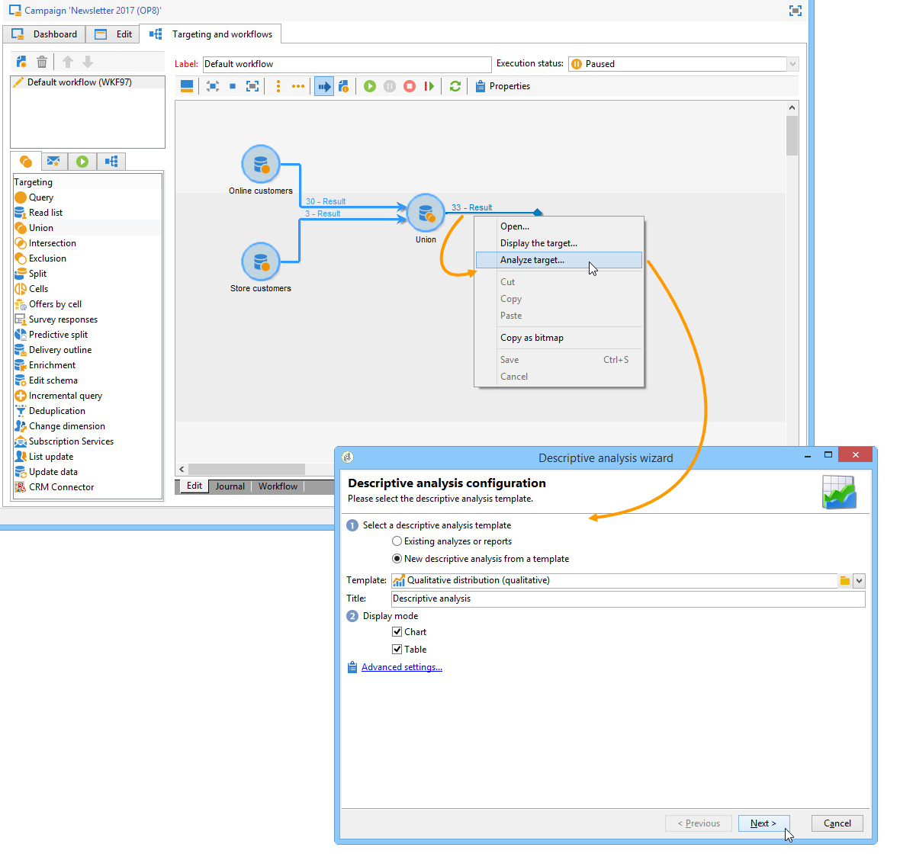

# 使用案例{#use-cases}

## 分析人口 {#analyzing-a-population}

以下範例可讓您使用描述性分析精靈來探索一組電子報所定位的人口。

實作步驟如下所述，而本章其他章節則提供選項和說明的完整清單。

### 確定要分析的人口 {#identifying-the-population-to-analyze}

在此範例中，我們想要探索Newsletters資料夾中所包含之遞送的目 **標人口** 。

若要這麼做，請選取相關的傳送，然後按一下滑鼠右鍵並選取 **[!UICONTROL Action > Explore the target...]**。


### 選取分析類型 {#selecting-a-type-of-analysis}

在助理的第一個步驟中，您可以選擇要使用的描述性分析模板。 依預設，Adobe Campaign提供兩個範本： **[!UICONTROL Qualitative distribution]** 和 **[!UICONTROL Quantitative distribution]**。 有關詳細資訊，請參閱「 [配置定性分佈模板](../../reporting/using/using-the-descriptive-analysis-wizard.md#configuring-the-qualitative-distribution-template) 」部分。 「關於說明性分析」(About descriptive [analysis)部分顯示了各種渲染](../../reporting/using/about-descriptive-analysis.md) 。

在此範例中，選取范 **[!UICONTROL Qualitative distribution]** 本並選擇包含圖表和表格（陣列）的顯示。 為報表指定名稱（「說明性分析」），然後按一下 **[!UICONTROL Next]**。


### 選取要顯示的變數 {#selecting-the-variables-to-display}

下一步可讓您選取要顯示在表格中的資料。

按一下 **[!UICONTROL Add...]** 連結，以選取包含要顯示之資料的變數。 在這裡，我們想在一行中展示我們送貨的收件人的城市：


欄將顯示每家公司的購買次數。 在此範例中，金額會匯總至「網頁 **購買」欄位** 。

在此，我們要定義結果綁定以釐清其顯示。 要執行此操作，請選擇 **[!UICONTROL Manual]** 綁定選項，並設定要顯示的段的計算類：


然後，按一 **[!UICONTROL Ok]** 下以核准設定。

定義行和列後，可使用工具欄更改、移動或刪除行和列。


### 定義顯示格式 {#defining-the-display-format}

精靈的下一步可讓您選取您要產生的圖表類型。

在這種情況下，請選擇直方圖。


「分析」報表圖表選項部分詳細介紹了不同圖 [形的可能配置](../../reporting/using/processing-a-report.md#analysis-report-chart-options) 。

### 配置統計以計算 {#configuring-the-statistic-to-calculate}

然後指定要套用至收集資料的計算。 依預設，描述性分析精靈會執行簡單的值計數。

此視窗可讓您定義要計算的統計資料清單。


若要建立新統計資料，請按一下 **[!UICONTROL Add]** 按鈕。 For more on this, refer to [Statistics calculation](../../reporting/using/using-the-descriptive-analysis-wizard.md#statistics-calculation).

### 檢視和使用報表 {#viewing-and-using-the-report}

嚮導的最後一個步驟顯示表和圖表。

您可以使用表格上方的工具列來儲存、匯出或列印資料。 如需詳細資訊，請參閱「處 [理報表」](../../reporting/using/processing-a-report.md)。


## 定性資料分析 {#qualitative-data-analysis}

### 圖表顯示範例 {#example-of-a-chart-display}

**目標**:產生潛在客戶或客戶所在位置的分析報告。

1. 開啟描述性分析精靈並僅選 **[!UICONTROL Chart]** 取。

   

   按一 **[!UICONTROL Next]** 下以核准此步驟。

1. 然後選取 **[!UICONTROL 2 variables]** 選項並指定收件者 **[!UICONTROL First variable (abscissa)]** 狀態（潛在客戶／客戶）和第二個變數會參考國家。
1. 選 **[!UICONTROL Cylinders]** 擇類型。

   

1. 按一 **[!UICONTROL Next]** 下並保留預設統 **[!UICONTROL Simple count]** 計資料。
1. 按一 **[!UICONTROL Next]** 下以顯示報表。

   

   將滑鼠指標暫留在橫條上，即可查看該國的確切客戶或潛在客戶人數。

1. 根據圖例啟用或禁用其中一個國家的顯示。

   

### 表格顯示範例 {#example-of-a-table-display}

**目標**:分析公司電子郵件網域。

1. 開啟描述性分析精靈，並僅選取 **[!UICONTROL Array]** 顯示模式。

   

   按一下 **[!UICONTROL Next]** 按鈕以核准此步驟。

1. 選取 **[!UICONTROL Company]** 變數為欄，變 **[!UICONTROL Email domain]** 數為列。
1. 保留統 **[!UICONTROL By rows]** 計資料方向選項：統計計算將顯示在變數的右 **[!UICONTROL Email domain]** 側。

   

   按一 **[!UICONTROL Next]** 下以核准此步驟。

1. 然後輸入要計算的統計資訊：保留預設計數並建立新的統計資料。 若要這麼做，請按一 **[!UICONTROL Add]** 下並選 **[!UICONTROL Total percentage distribution]** 取為運算元。

   

1. 輸入統計資料的標籤，以便在顯示報表時不會出現空白欄位。

   

1. 按一 **[!UICONTROL Next]** 下以顯示報表。

   

1. 分析報表產生後，您就可以調整顯示，以符合您的需求，而不需變更設定。 例如，您可以切換軸：按一下右鍵域名，然後在快捷菜 **[!UICONTROL Turn]** 單中選擇。

   

   下表顯示以下資訊：

   

## 量化資料分析 {#quantitative-data-analysis}

**目標**:以產生收件者年齡的量化分析報告

1. 開啟描述性分析精靈，並從 **[!UICONTROL Quantitative distribution]** 下拉式清單中選取。

   

   按一下 **[!UICONTROL Next]** 按鈕以核准此步驟。

1. 選取變 **[!UICONTROL Age]** 數並輸入其標籤。 指定它是否為整數，然後按一下 **[!UICONTROL Next]**。

   

1. 刪除統 **[!UICONTROL Deciles]**&#x200B;計數 **[!UICONTROL Distribution]** 據 **[!UICONTROL Sum]** :這裡不需要。

   

1. 按一 **[!UICONTROL Next]** 下以顯示報表。

   

## 分析工作流中的轉換目標 {#analyzing-a-transition-target-in-a-workflow}

**目標**:若要產生有關定位工作流程人口的報表

1. 開啟所要的定位工作流程。
1. 以滑鼠右鍵按一下指向收件者表格的轉場。
1. 在下 **[!UICONTROL Analyze target]** 拉式選單中選取，以開啟描述性分析視窗。

   

1. 此時，您可以選取選項並使 **[!UICONTROL Existing analyses and reports]** 用先前建立的報表(請參閱「重新使用現有報表 [和分析](../../reporting/using/processing-a-report.md#re-using-existing-reports-and-analyses)」)，或建立新的描述性分析。 若要這麼做，請依預設 **[!UICONTROL New descriptive analysis from a template]** 保留選取的選項。

   其餘的配置與所有描述性分析的配置相同。

### 目標分析建議 {#target-analyze-recommendations}

在工作流中分析人口需要人口仍然在轉換中。 如果啟動工作流，則可能會從轉換中清除有關人口的結果。 若要執行分析，您可以執行下列任一動作：

* 將轉場從其目標活動分離，然後啟動工作流程使其處於活動狀態。 轉場開始閃爍後，以通常的方式啟動精靈。

   

* 通過選擇選項修改工作流的 **[!UICONTROL Keep the result of interim populations between two executions]** 屬性。 這可讓您啟動對所選項目轉換的分析，即使工作流程已完成亦然。

   

   如果人口已從轉換中清除，則會出現錯誤訊息，要求您在啟動描述性分析精靈之前選取相關選項。

   

>[!CAUTION]
>
>此選 **[!UICONTROL Keep the result of interim populations between two executions]** 項僅能用於開發階段，但絕不能用於生產環境。\
>當臨時人口的保留期限到達時，系統會自動清除。 此期限是在工作流屬性頁籤中指 **[!UICONTROL Execution]** 定的。

## 分析收件者追蹤記錄檔 {#analyzing-recipient-tracking-logs}

描述性分析嚮導可生成關於其他工作表的報告。 這表示您可以建立專用的報表來分析傳送記錄檔。

在此範例中，我們要分析電子報收件人的反應率。

若要這麼做，請套用下列步驟：

1. 通過菜單開啟描述性分析 **[!UICONTROL Tools > Descriptive analysis]** 嚮導並更改預設工作表。 選取 **[!UICONTROL Recipient tracking log]** 並新增篩選以排除校樣並包含電子報。

   

   選取表格顯示，然後按一下 **[!UICONTROL Next]**。

1. 在下一個視窗中，指定分析與傳送有關。

   

   在此，傳送標籤會顯示在第一欄中。

1. 刪除預設計數並建立三個統計資訊，以配置要顯示在表中的統計資訊。

   在這裡，每份電子報的表格會顯示：開啟次數、點按次數、反應率（以百分比表示）。

1. 新增統計資料以計算點按次數：在標籤中定義相關的 **[!UICONTROL Filter]** 篩選。

   

1. 然後，按一下該 **[!UICONTROL General]** 頁籤以更名統計資訊標籤和別名：

   

1. 新增第二個統計資料，以計算開啟次數：

   

1. 然後，按一下該 **[!UICONTROL General]** 頁籤以更名統計資訊標籤及其別名：

   

1. 添加第三個統計量並選擇 **[!UICONTROL Calculated field]** 算子來測量反應性率。

   

   轉到該字 **[!UICONTROL User function]** 段並輸入以下公式：

   ```
   @clic / @open * 100
   ```

   調整統計標籤，如下所示：

   

   最後，指定值是否以百分比顯示：若要這麼做，請取消勾 **[!UICONTROL Default formatting]** 選標籤中的選 **[!UICONTROL Advanced]** 項，然後 **[!UICONTROL Percentage]** 選取不含小數點。

   

1. 按一 **[!UICONTROL Next]** 下以顯示報表。

   

## 分析傳送排除記錄 {#analyzing-delivery-exclusion-logs}

如果分析涉及交貨，您可以分析排除的人口。 若要這麼做，請選取要分析的傳送，然後按一下滑鼠右鍵以存取功 **[!UICONTROL Action > Explore exclusions]** 能表。


這會帶您前往描述性分析精靈，而分析會與收件者排除記錄有關。

例如，您可以顯示所有已排除位址的網域，並依排除日期加以排序。


這會產生下列類型的報表：


