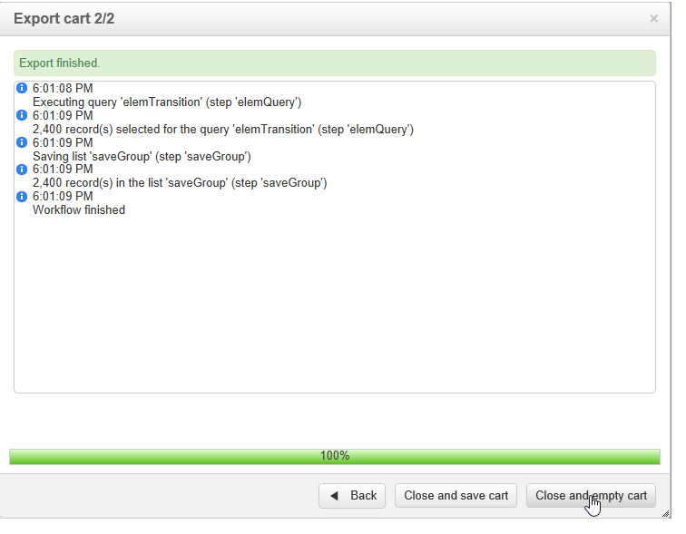

# 使用 cubes 來探索資料{#using-cubes-to-explore-data}

Marketing Analytics可讓您更輕鬆建立報表，以及透過立方體從資料庫中識別和選取資料。 這可讓您：

* 根據立方體建立報表。 此程式的詳細說明如下： [探索報表中的資料](#exploring-the-data-in-a-report).
* 收集資料庫中的資料，並將其分組為清單，例如識別和建立目標及傳送。 有關詳細資訊，請參閱 [建立目標人口](#building-a-target-population).
* 將透視表插入報表中，引用報表中的現有多維資料集。 有關詳細資訊，請參閱 [將樞紐表格插入報表](#inserting-a-pivot-table-into-a-report).

>[!NOTE]
>
>建立或修改多維度資料集時，必須使用Marketing Analytics。 有關詳細資訊，請參閱 [關於立方體](../../reporting/using/ac-cubes.md).

## 探索報表中的資料 {#exploring-the-data-in-a-report}

### 步驟1 — 根據多維資料集建立報表 {#step-1---creating-a-report-based-on-a-cube}

若要根據多維資料集建立報表，請按一下 **[!UICONTROL Create]** 按鈕 **[!UICONTROL Reports]** 頁簽，然後選擇要使用的多維資料集。

此程式的詳細說明如下： [根據多維資料集建立報表](../../reporting/using/creating-indicators.md#creating-a-report-based-on-a-cube).

### 步驟2 — 選擇行和列 {#step-2---selecting-lines-and-columns}

預設顯示會顯示多維資料集的前兩個維度（在此例中是年齡和城市）。

此 **[!UICONTROL Add]** 每個軸上的按鈕可讓您新增維度。

1. 選擇要在表格的行和列中顯示的尺寸。 若要這麼做，請拖放可用的維度，如下所示：
1. 從清單中選擇要添加到表的維：

   

1. 然後選取此維度的參數。

   

   參數取決於所選維度的資料類型。

   例如，日期可以有數個層級可用。 有關詳細資訊，請參閱 [顯示度量](../../reporting/using/concepts-and-methodology.md#displaying-measures).

   在此情況下提供下列選項：

   

   您可以：

   * 在載入期間展開資料：每次更新報告時，預設都會顯示值(預設值：否)。
   * 在行尾顯示總計：當資料以欄顯示時，其他選項可讓您在行的結尾顯示總計：欄會新增至表格(預設值：是)。
   * 套用排序：列的值可以根據值、標籤或根據度量(預設值：值)。
   * 以遞增(a-z、0-9)或遞減(z-a、9-0)順序顯示值。
   * 變更載入時要顯示的欄數(預設為：200)。

1. 按一下 **[!UICONTROL Ok]** 若要確認：維度會新增至現有維度。

   表格上方的黃色橫幅顯示您已進行變更：按一下 **[!UICONTROL Save]** 按鈕來儲存。

   

### 步驟3 — 設定顯示的測量 {#step-3---configuring-the-measures-to-display}

行和列就位後，指明要顯示的測量及其顯示模式。

預設情況下，只顯示一個度量。 要添加或配置測量，請執行以下操作：

1. 按一下 **[!UICONTROL Measures]** 按鈕。

   

1. 此 **[!UICONTROL Use a measure]** 按鈕可讓您選擇現有度量之一。

   

   選擇要顯示的資訊和格式類型。 選項清單取決於已配置的度量類型。

   

   也可透過 **[!UICONTROL Edit the configuration of the pivot table]** 圖示。

   

   然後，您可以選擇是否顯示度量標籤。 有關詳細資訊，請參閱 [設定顯示](../../reporting/using/concepts-and-methodology.md#configuring-the-display).

1. 可以使用現有措施來建立新措施。 要執行此操作，請按一下 **[!UICONTROL Create a measure]** 並加以設定。

   

   可使用以下類型的測量：

   * 措施組合：此類型的測量允許您使用現有測量來構建新測量：

      可用的運算子為：和、差、乘和速率。

   * 比例：此類型的測量可讓您計算為指定維度測量的記錄數。 您可以根據維或子維計算比例。
   * 變化：此測量可讓您計算層級值的變化。
   * 標準差：這類測量可讓您計算每組儲存格內的偏差，而不是平均值。 例如，您可以比較所有現有區段的購買量。

   建立的度量將添加到報告中。

   

   建立測量後，可以編輯該測量，並在必要時更改其配置。 若要這麼做，請按一下 **[!UICONTROL Measures]** 按鈕，然後轉到要編輯的度量的頁簽。

   然後按一下 **[!UICONTROL Edit the dynamic measure]** 來存取設定功能表。

## 建立目標人口 {#building-a-target-population}

使用立方體建立報表，可讓您從表格收集資料並儲存在清單中。

若要這麼做，請將其新增至購物車並處理其內容。

要將母體分組到清單中，請應用以下步驟：

1. 按一下包含要收集之母體的儲存格來選取母體，然後按一下 **[!UICONTROL Add to cart]** 表徵圖。

   

   收集各種設定檔時，請視需要多次執行此動作

1. 按一下 **[!UICONTROL Show cart]** 按鈕，在運行導出之前查看其內容。

   

1. 此 **[!UICONTROL Export]** 按鈕可讓您將購物車中的項目群組至清單中。

   您需要指定清單的名稱以及要執行的匯出類型。

   

   按一下 **[!UICONTROL Start]** 執行匯出。

1. 匯出完成後，訊息會確認其執行，以及已處理的記錄數。

   

   您可以儲存購物車的內容或將其空白。

   相關清單可透過 **[!UICONTROL Profiles and targets]** 標籤。

   

## 將樞紐表格插入報表 {#inserting-a-pivot-table-into-a-report}

要建立表並瀏覽多維資料集中的資料，請應用以下步驟：

1. 使用單頁建立新報表，並插入樞紐表格。 如需詳細資訊，請參閱[此頁面](../../reporting/using/creating-a-table.md#creating-a-breakdown-or-pivot-table)。

   

1. 在 **[!UICONTROL Data]** 頁的頁簽中，選擇一個多維資料集以處理它包含的維，並顯示計算度量。

   

   這可讓您建立要顯示的報表。 有關詳細資訊，請參閱 [步驟2 — 選擇行和列](#step-2---selecting-lines-and-columns).
