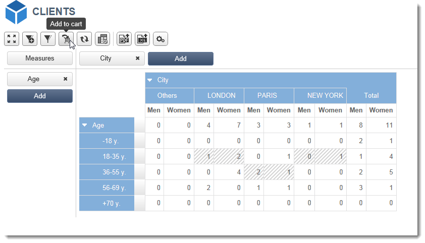
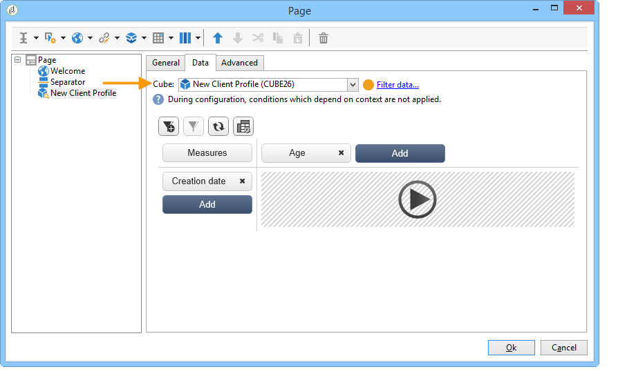

# 使用 cubes 來探索資料{#using-cubes-to-explore-data}

市場營銷分析使建立報告以及通過立方從資料庫中識別和選擇資料變得更容易。 這使您能夠：

* 基於立方建立報告。 此處詳述了該過程： [瀏覽報告中的資料](#exploring-the-data-in-a-report)。
* 收集資料庫中的資料並將其分組到清單中，例如識別和構建目標和交付。 有關此內容的詳細資訊，請參閱 [構建目標人口](#building-a-target-population)。
* 將透視表插入報表，引用報表中的現有多維資料集。 有關此內容的詳細資訊，請參閱 [將透視表插入報表](#inserting-a-pivot-table-into-a-report)。

>[!NOTE]
>
>建立或修改立方是必需的市場營銷分析。 有關此內容的詳細資訊，請參閱 [關於立方](../../reporting/using/about-cubes.md)。

## 瀏覽報告中的資料 {#exploring-the-data-in-a-report}

### 步驟1 — 基於多維資料集建立報告 {#step-1---creating-a-report-based-on-a-cube}

要建立基於多維資料集的報告，請按一下 **[!UICONTROL Create]** 按鈕 **[!UICONTROL Reports]** 頁籤，然後選擇要使用的多維資料集。

此處詳述了該過程： [基於多維資料集建立報告](../../reporting/using/creating-indicators.md#creating-a-report-based-on-a-cube)。

### 步驟2 — 選擇行和列 {#step-2---selecting-lines-and-columns}

預設顯示顯示立方的前兩個維（在本例中為年齡和城市）。

的 **[!UICONTROL Add]** 每個軸上的按鈕使您能夠添加尺寸。

1. 選擇要在表的行和列中顯示的尺寸。 要執行此操作，請拖放可用尺寸，如下所示：
1. 從清單中選擇要添加到表的維：

   

1. 然後選擇此尺寸的參數。

   

   參數取決於所選維的資料類型。

   例如，對於日期，可以使用多個級別。 有關此內容的詳細資訊，請參閱 [顯示度量](../../reporting/using/concepts-and-methodology.md#displaying-measures)。

   在本例中提供以下選項：

   

   您可以：

   * 載入期間展開資料：預設情況下，每次更新報告時，都會顯示值(預設值：不)。
   * 在行末顯示合計：在列中顯示資料時，附加選項允許您在行的末尾顯示合計：將列添加到表中(預設值：是)。
   * 應用排序：可以根據值、標籤或基於度量(預設值：按值)。
   * 按升序(a-z, 0-9)或降序(z-a, 9-0)順序顯示值。
   * 更改載入時要顯示的列數(預設情況下：200)。

1. 按一下 **[!UICONTROL Ok]** 確認：該維將添加到現有維。

   表上的黃色標語顯示您已進行更改：按一下 **[!UICONTROL Save]** 按鈕。

   

### 步驟3 — 配置要顯示的測量 {#step-3---configuring-the-measures-to-display}

行和列一旦到位，請指明要顯示的度量及其顯示模式。

預設情況下，只顯示一個度量。 要添加或配置度量：

1. 按一下 **[!UICONTROL Measures]** 按鈕。

   

1. 的 **[!UICONTROL Use a measure]** 按鈕，您可以選擇現有度量之一。

   

   選擇要顯示的資訊和格式類型。 選項清單取決於已配置的度量類型。

   

   通過 **[!UICONTROL Edit the configuration of the pivot table]** 的子菜單。

   

   然後，可以選擇是否顯示度量標籤。 有關此內容的詳細資訊，請參閱 [配置顯示](../../reporting/using/concepts-and-methodology.md#configuring-the-display)。

1. 用現有的方法可以建立新的措施。 要執行此操作，請按一下 **[!UICONTROL Create a measure]** 並配置。

   

   可以使用以下類型的度量：

   * 措施組合：此類型的度量使您能夠使用現有度量構建新度量：

      可用運算子包括：和、差、乘法和速率。

   * 比例：此類型的度量使您能夠計算給定維的測量記錄數。 可以根據尺寸或子尺寸計算比例。
   * 變體：此度量允許您計算級別值的變化。
   * 標準差：此類型的度量允許您計算每組單元格中與值平均值相比的偏差。 例如，您可以比較所有現有段的採購量。

   建立的度量將添加到報表。

   

   建立度量後，可編輯它，並在必要時更改其配置。 要執行此操作，請按一下 **[!UICONTROL Measures]** 按鈕，轉到要編輯的度量的頁籤。

   然後按一下 **[!UICONTROL Edit the dynamic measure]** 的子菜單。

## 構建目標人口 {#building-a-target-population}

使用多維資料集生成報告使您能夠從表中收集資料並將其保存到清單中。

為此，請將它們添加到購物車並處理其內容。

要將人口分組到清單中，請應用以下步驟：

1. 按一下包含要收集的填充的單元格以選擇它們，然後按一下 **[!UICONTROL Add to cart]** 表徵圖

   

   收集各種配置檔案時需要多次

1. 按一下 **[!UICONTROL Show cart]** 按鈕，在運行導出之前查看其內容。

   

1. 的 **[!UICONTROL Export]** 按鈕，將購物車中的物料分組到清單中。

   您需要指定清單的名稱和要執行的導出類型。

   

   按一下 **[!UICONTROL Start]** 以運行導出。

1. 導出完成後，將顯示一條消息確認其執行情況和已處理的記錄數。

   

   您可以保存購物車的內容或將其清空。

   通過 **[!UICONTROL Profiles and targets]** 頁籤。

   

## 將透視表插入報表 {#inserting-a-pivot-table-into-a-report}

要建立表並瀏覽多維資料集中的資料，請應用以下步驟：

1. 使用單頁建立新報告，並將透視表插入其中。 如需詳細資訊，請參閱[此頁面](../../reporting/using/creating-a-table.md#creating-a-breakdown-or-pivot-table)。

   

1. 在 **[!UICONTROL Data]** 頁籤，選擇一個多維資料集以處理它包含的維並顯示計算度量。

   

   這允許您生成要顯示的報告。 有關此內容的詳細資訊，請參閱 [步驟2 — 選擇行和列](#step-2---selecting-lines-and-columns)。
