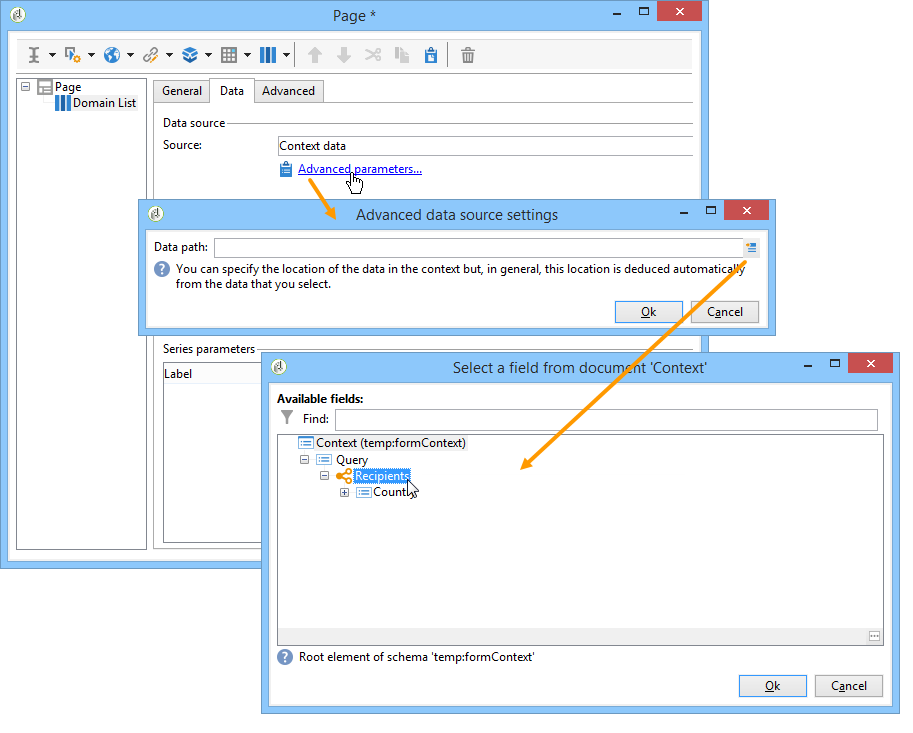

# 在報表中使用內容{#using-the-context}

當您想要以&#x200B;**[!UICONTROL tables]**&#x200B;或&#x200B;**[!UICONTROL charts]**&#x200B;的格式呈現資料時，可以從兩個來源取得：新查詢（請參閱[定義資料](#defining-a-direct-filter-on-data)的直接篩選）或報告內容（請參閱[使用內容資料](#using-context-data)）。

## 定義資料的直接篩選 {#defining-a-direct-filter-on-data}

### 篩選資料 {#filtering-data}

建立報表時，不強制使用&#x200B;**[!UICONTROL Query]**&#x200B;型別活動。 可直接在組成報表的表格和圖表中篩選資料。

這可讓您直接透過報告的&#x200B;**[!UICONTROL Page]**&#x200B;活動選取要在報告中顯示的資料。

若要這麼做，請按一下&#x200B;**[!UICONTROL Data]**&#x200B;索引標籤中的&#x200B;**[!UICONTROL Filter data...]**&#x200B;連結：此連結可讓您存取運算式編輯器，以定義要分析之資料的查詢。

### 範例：在圖表中使用篩選器 {#example--use-a-filter-in-a-chart}

在以下範例中，我們希望圖表只顯示住在法國以及在該年期間進行購買的收件者設定檔。

若要定義此篩選器，請將頁面放入圖表並加以編輯。 按一下&#x200B;**[!UICONTROL Filter data]**&#x200B;連結，並建立符合您要顯示之資料的篩選器。 如需在Adobe Campaign中建立查詢的詳細資訊，請參閱[本節](../../platform/using/about-queries-in-campaign.md)。

在這裡，我們要依選取的收件者城市顯示劃分。

轉譯看起來會像這樣：

### 範例：在樞紐分析表中使用篩選器 {#example--use-a-filter-in-a-pivot-table}

在此範例中，篩選器可讓您在樞紐分析表中只顯示非巴黎客戶，而不需預先使用其他查詢。

應用以下步驟：

1. 將頁面放入圖表中並加以編輯。
1. 建立樞紐分析表。
1. 移至&#x200B;**[!UICONTROL Data]**&#x200B;標籤，並選取要使用的Cube。
1. 按一下&#x200B;**[!UICONTROL Filter data...]**&#x200B;連結並定義下列查詢，以從公司清單中移除Adobe。

   

只有符合篩選條件的收件者才會出現在報告中。

## 使用內容資料 {#using-context-data}

若要以&#x200B;**[!UICONTROL table]**&#x200B;或&#x200B;**[!UICONTROL chart]**&#x200B;的格式表示資料，資料可能來自報表內容。

在包含表格或圖表的頁面中，**[!UICONTROL Data]**&#x200B;索引標籤可讓您選取資料來源。

* **[!UICONTROL New query]**&#x200B;選項可讓您建立查詢以收集資料。 如需詳細資訊，請參閱[定義資料](#defining-a-direct-filter-on-data)的直接篩選。
* **[!UICONTROL Context data]**&#x200B;選項可讓您使用輸入資料：報表的內容與包含圖表或表格的頁面之入站轉變中所包含的資訊一致。 例如，此內容可能包含透過放置在&#x200B;**[!UICONTROL Page]**&#x200B;活動之前的&#x200B;**[!UICONTROL Query]**&#x200B;活動所收集的資料，且您需要指定報告涉及的表格和欄位。

例如，在查詢方塊中，建立收件者的下列查詢：

然後指出報表中的資料來源，在此案例中： **[!UICONTROL Data from the context]**。

系統會自動推斷資料位置。 如有必要，您可以強制資料路徑。

當您選取統計資料會關注的資料時，可用欄位與查詢中指定的資料一致。

