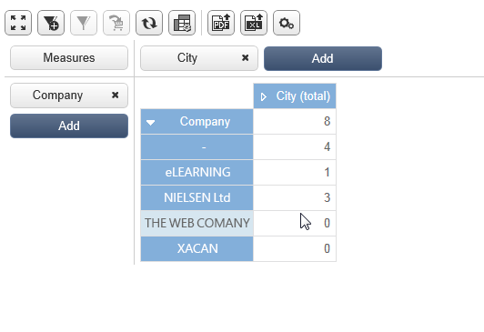

# 在報告中使用內容{#using-the-context}

當您想要以下列格式表示資料時 **[!UICONTROL tables]** 或 **[!UICONTROL charts]**，可從兩個來源取得：新查詢(請參閱 [定義資料的直接篩選](#defining-a-direct-filter-on-data))或報表內容(請參閱 [使用內容資料](#using-context-data))。

## 定義資料的直接篩選 {#defining-a-direct-filter-on-data}

### 篩選資料 {#filtering-data}

使用 **[!UICONTROL Query]** 建立報表時型別活動不是強制性的。 您可以直接在組成報表的表格和圖表中篩選資料。

這可讓您透過直接在報表中選取要顯示的資料 **[!UICONTROL Page]** 報告的活動。

若要這麼做，請按一下 **[!UICONTROL Filter data...]** 中的連結 **[!UICONTROL Data]** 索引標籤：此連結可讓您存取運算式編輯器，以定義要分析之資料的查詢。

### 範例：在圖表中使用篩選器 {#example--use-a-filter-in-a-chart}

在以下範例中，我們希望圖表只顯示住在法國以及當年購買過產品的收件者設定檔。

若要定義此篩選器，請將頁面放入圖表並加以編輯。 按一下 **[!UICONTROL Filter data]** 連結並建立符合您要顯示之資料的篩選器。 如需在Adobe Campaign中建立查詢的詳細資訊，請參閱 [本節](../../platform/using/about-queries-in-campaign.md).

在此，我們想要依所選收件者的城市顯示劃分。

演算結果如下：

### 範例：在樞紐分析表中使用篩選器 {#example--use-a-filter-in-a-pivot-table}

在此範例中，篩選器可讓您在樞紐分析表中只顯示非巴黎客戶，而不需預先使用其他查詢。

應用以下步驟：

1. 將頁面放入圖表中並加以編輯。
1. 建立樞紐分析表。
1. 前往 **[!UICONTROL Data]** 頁簽並選取要使用的立方結構。
1. 按一下 **[!UICONTROL Filter data...]** 連結並定義下列查詢，以從公司清單中移除Adobe。

   

只有符合篩選條件的收件者才會出現在報告中。

## 使用內容資料 {#using-context-data}

若要以「 」的格式表示資料 **[!UICONTROL table]** 或 **[!UICONTROL chart]**，資料可能來自報表內容。

在包含表格或圖表的頁面中， **[!UICONTROL Data]** 索引標籤可讓您選取資料來源。

* 此 **[!UICONTROL New query]** 選項可讓您建立查詢以收集資料。 有關詳細資訊，請參閱 [定義資料的直接篩選](#defining-a-direct-filter-on-data).
* 此 **[!UICONTROL Context data]** 選項可讓您使用輸入資料：報表的內容與包含圖表或表格的頁面之入站轉變中所包含的資訊一致。 例如，此內容可能包含透過收集的資料。 **[!UICONTROL Query]** 放在之前的活動 **[!UICONTROL Page]** 活動以及需要指定報表相關表格和欄位的活動。

例如，在查詢方塊中，為收件者建立下列查詢：

然後指出報表中的資料來源，在此案例中為： **[!UICONTROL Data from the context]**.

系統會自動推斷資料位置。 如有必要，您可以強制資料路徑。

當您選取統計資料將關注的資料時，可用的欄位與查詢中指定的資料一致。

