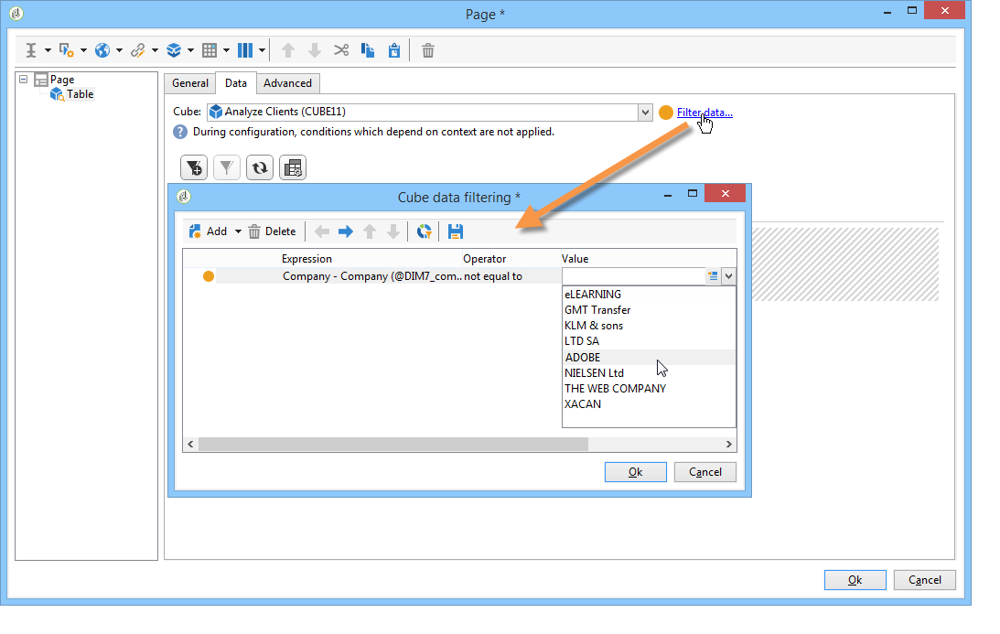

# 在報表中使用上下文{#using-the-context}

當要以 **[!UICONTROL tables]** 或 **[!UICONTROL charts]**&#x200B;它可以從兩個來源中獲取：新查詢(請參閱 [定義資料的直接篩選器](#defining-a-direct-filter-on-data))或報告上下文(請參閱 [使用上下文資料](#using-context-data))。

## 定義資料的直接篩選器 {#defining-a-direct-filter-on-data}

### 篩選資料 {#filtering-data}

使用 **[!UICONTROL Query]** 生成報告時，類型活動不是必需的。 資料可以直接在構成報告的表和圖表中過濾。

這樣，您就可以通過 **[!UICONTROL Page]** 的子菜單。

要執行此操作，請按一下 **[!UICONTROL Filter data...]** 連結 **[!UICONTROL Data]** 頁籤：此連結允許您訪問表達式編輯器來定義要分析的資料的查詢。

### 示例：在圖表中使用篩選器 {#example--use-a-filter-in-a-chart}

在下例中，我們希望圖表僅顯示居住在法國並在年內購買的收件人配置檔案。

要定義此篩選器，請在圖表中放置一個頁面並對其進行編輯。 按一下 **[!UICONTROL Filter data]** 連結並建立與要顯示的資料匹配的篩選器。 有關在Adobe Campaign構建查詢的詳細資訊，請參閱 [此部分](../../platform/using/about-queries-in-campaign.md)。

在此，我們要按所選收件人所在城市顯示分類。

渲染將如下所示：

### 示例：在透視表中使用篩選器 {#example--use-a-filter-in-a-pivot-table}

在本示例中，篩選器允許您在透視表中僅顯示非巴黎客戶，而無需事先使用另一個查詢。

應用以下步驟：

1. 在圖表中放置一個頁面並對其進行編輯。
1. 建立透視表。
1. 轉到 **[!UICONTROL Data]** 頁籤，然後選擇要使用的多維資料集。
1. 按一下 **[!UICONTROL Filter data...]** 連結並定義以下查詢，以從公司清單中刪除Adobe。

   

只有符合篩選條件的收件人才會出現在報告中。

## 使用上下文資料 {#using-context-data}

表示以 **[!UICONTROL table]** 或 **[!UICONTROL chart]**，資料可以來自報表上下文。

在包含表或圖表的頁中， **[!UICONTROL Data]** 頁籤，以選擇資料源。

* 的 **[!UICONTROL New query]** 選項，可生成用於收集資料的查詢。 有關此內容的詳細資訊，請參閱 [定義資料的直接篩選器](#defining-a-direct-filter-on-data)。
* 的 **[!UICONTROL Context data]** 選項，您可以使用輸入資料：報告的上下文與包含圖表或表的頁面的入站轉換中包含的資訊一致。 例如，此上下文可包含通過 **[!UICONTROL Query]** 放在 **[!UICONTROL Page]** 活動，您需要為其指定報表所涉及的表和欄位。

例如，在查詢框中，為收件人生成以下查詢：

然後在報告中指明資料的來源，在這種情況下： **[!UICONTROL Data from the context]**。

自動推斷資料位置。 如有必要，可強制資料路徑。

選擇統計資訊將關注的資料時，可用欄位與查詢中指定的資料一致。

