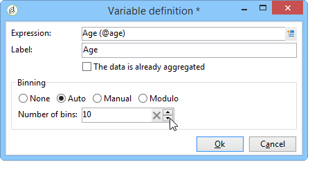
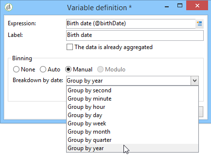
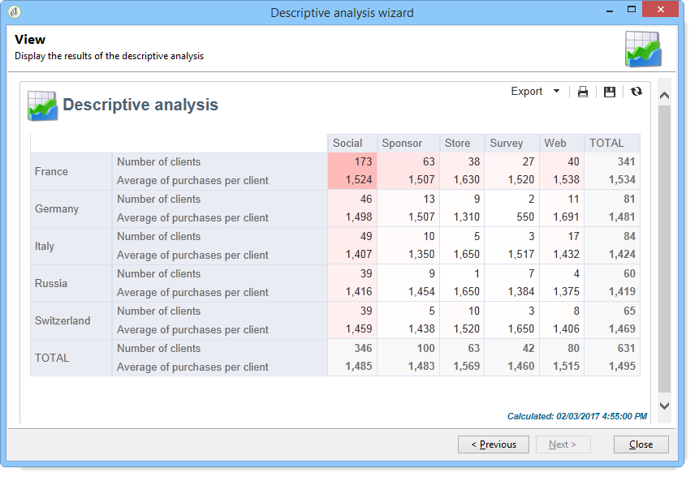
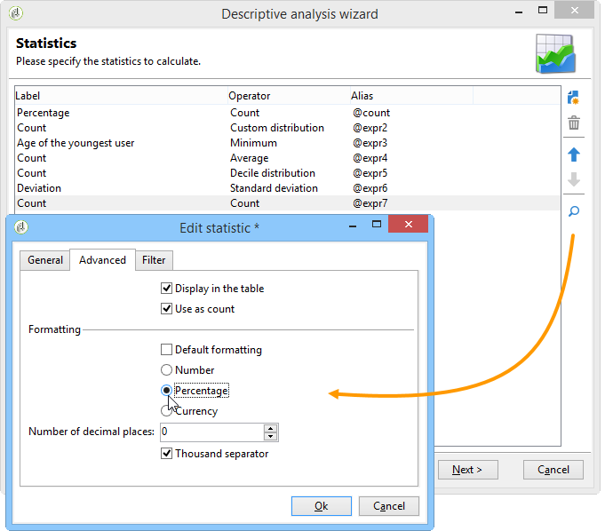

# 使用描述性分析精靈{#using-the-descriptive-analysis-wizard}

要建立描述性分析報告，請使用專用嚮導。 配置取決於要分析的資料和所需的渲染。

## 分析資料庫中的資料 {#analyzing-data-in-the-database}

描述性分析嚮導可通過 **[!UICONTROL Tools > Descriptive analysis]** 菜單：在這種情況下，預設情況下分析涉及收件人(**nms：收件人**)。 它適用於Adobe Campaign資料庫中的所有資料。

要分析標準收件人以外的表(**nms：收件人**)，按一下 **[!UICONTROL Advanced settings...]** 連結到嚮導的最後一階段，並選擇與設定匹配的表。 **cus：單個**:

如果要生成部分資料的統計資訊，可以定義篩選器：要執行此操作，請按一下 **[!UICONTROL Advanced settings...]** 連結並定義要應用的篩選器，如下所示：

這項分析只涉及16歲及以上的資料庫接收者，以及生活在倫敦的人。

## 分析一組資料 {#analyzing-a-set-of-data}

可以通過其他上下文使用說明性分析嚮導：清單、工作流轉換、一個或多個遞送、選擇收件人等。

它可通過指向收件人表的Adobe Campaign樹的多個節點訪問。

通過選擇項並按一下右鍵，開啟說明性分析嚮導。 將只分析所選資料。

* 對於 **收件人**，選擇要分析的收件人，然後按一下右鍵並選擇 **[!UICONTROL Actions > Explore...]**，如上所示。 如果將篩選器應用於收件人清單，則只分析其內容。

   要選擇資料夾或當前篩選器中的所有收件人，請使用CTRL+A快捷方式。 這意味著即使未顯示的收件者也將被選中。

   有關收件人的描述性分析的示例，請參閱： [定性資料分析](../../reporting/using/use-cases.md#qualitative-data-analysis)。

* 在 **工作流**，將游標置於指向收件人表的過渡上，按一下右鍵並選擇 **[!UICONTROL Analyze target]**。 有關詳細資訊，請參閱中的示例 [分析工作流中的過渡目標](../../reporting/using/use-cases.md#analyzing-a-transition-target-in-a-workflow)。
* 對於 **清單**，選擇一個或多個清單，並應用與收件人相同的流程。
* 在 **交貨**，選擇要分析其目標的交貨，按一下右鍵並選擇 **[!UICONTROL Actions > Explore the target]**，如下所示：

   

   此處提供了交貨描述性分析的示例： [分析人口](../../reporting/using/use-cases.md#analyzing-a-population) 這裡： [分析收件人跟蹤日誌](../../reporting/using/use-cases.md#analyzing-recipient-tracking-logs)。

## 配置定性分佈模板 {#configuring-the-qualitative-distribution-template}

的 **[!UICONTROL Qualitative distribution]** 模板用於建立所有類型資料（如公司名稱、電子郵件域）的統計資訊。

可用於通過 **[!UICONTROL Qualitative distribution]** 模板的詳細資訊 [在表中顯示資料](#displaying-data-in-the-table)。 完整示例詳見 [分析人口](../../reporting/using/use-cases.md#analyzing-a-population)。

使用描述性分析嚮導分析資料時，可用選項取決於所選設定。 下文詳述。

### 資料綁定 {#data-binning}

選擇要顯示的變數時，可以定義資料綁定，換句話說，為所選資料配置分組標準。

>[!NOTE]
>
>當計算所涉及的欄位使用聚合計算時，檢查 **[!UICONTROL The data is already aggregated]** 來改善效能。

選項將因欄位內容而異：

* **[!UICONTROL None]** :此選項允許您顯示變數的所有可用值，而不進行綁定。

   >[!CAUTION]
   >
   >應謹慎使用此選項：它會對報告和機器效能產生重大影響。

* **[!UICONTROL Auto]** :此選項允許您顯示n個最常表示的值。 這些變數會自動計算，每個變數表示變數與bin數的百分比。 對於數值，Adobe Campaign會自動生成n個類以將資料排序。
* **[!UICONTROL Manual]** :此選項的操作方式與 **[!UICONTROL Auto]** 選項，但可以手動設定這些值。 要執行此操作，請按一下 **[!UICONTROL Add]** 按鈕。

   值可由Adobe Campaign在個性化之前自動初始化：為此，請輸入要生成的框數，然後按一下 **[!UICONTROL Initialize with]** 連結，如下所示：

   

   然後根據您的需要調整您的內容：

   

   根據所需的精度級別，包含日期的欄位可以按時間、日、月、年等分組。

   

* **[!UICONTROL Modulo]** :允許您建立數值組（如果數值）。 例如，值為10的模允許您建立一個值間隔，該間隔將更改10 x 10。

   

   此示例允許您按年齡組查看收件人的細分。

   

### 在表中顯示資料 {#displaying-data-in-the-table}

使用工具欄可個性化表中變數的顯示：刪除列、以行而不是列顯示資料、將列移到左或右、查看或更改值計算。

窗口的上部部分允許您選擇顯示設定。

您可以顯示或隱藏統計資訊的名稱和子合計，並選擇統計資訊的方向。 有關此內容的詳細資訊，請參閱 [分析報告顯示設定](../../reporting/using/processing-a-report.md#analysis-report-display-settings)。

### 在圖表中顯示資料 {#displaying-data-in-the-chart}

在說明性分析嚮導的第一步中，您可以選擇只以圖表形式顯示資料，而不使用表。 在這種情況下，配置圖形時必須進行變數選擇。 必須先選擇要顯示的變數數，然後從相關資料庫中選擇欄位。

然後選擇所需的圖表類型。

>[!NOTE]
>
>可以同時在圖表和表中顯示變數。 為此，請在 **[!UICONTROL Table configuration]** 的子菜單。 按一下 **[!UICONTROL Next]** 並在圖表配置窗口中選擇圖表類型。 如果子維在表中定義，則它們不會顯示在圖表中。

按一下 **[!UICONTROL Variants]** 連結以修改圖表屬性。

提供的選項取決於所選圖表的類型。 如需詳細資訊，請參閱[本頁面](../../reporting/using/creating-a-chart.md#chart-types-and-variants)。

### 統計計算 {#statistics-calculation}

使用說明性分析嚮導可以計算資料的幾種類型的統計資訊。 預設情況下，只配置一個簡單計數。

按一下 **[!UICONTROL Add]** 的子菜單。

可以執行以下操作：

* **[!UICONTROL Count]** 計算要聚合的欄位的所有非空值，包括重複值（聚合欄位）,
* **[!UICONTROL Average]** 計算數值域中的平均值，
* **[!UICONTROL Minimum]** 計算數值域中的最小值，
* **[!UICONTROL Maximum]** 計算數值域中的最大值，
* **[!UICONTROL Sum]** 計算數值域中的值之和，
* **[!UICONTROL Standard deviation]** 計算返回值在平均值附近的散落情況，
* **[!UICONTROL Row percentage distribution]** 計算列中的值與行中的值的比率（僅適用於表）,
* **[!UICONTROL Column percentage distribution]** 計算行中的值與列中值的比率（僅適用於表）,
* **[!UICONTROL Total percentage distribution]** 計算值所關注的接收者的分佈，

   

* **[!UICONTROL Calculated field]** 建立個性化運算子（僅適用於表）。 的 **[!UICONTROL User function]** 欄位中，您可以輸入要應用於資料的計算。

   示例：根據國家/地區和原產計算每個客戶的平均採購額

   

   要在表中顯示上述資訊，您需要建立一個計算欄位來儲存每個客戶的平均採購額。

   操作步驟：

   1. 計算採購總額。

      

   1. 此統計資訊將不顯示在表中。 您需要取消選中 **[!UICONTROL Display in the table]** 選項 **[!UICONTROL Advanced]** 頁籤。

      

   1. 新建 **[!UICONTROL Calculated field]** 鍵入統計資訊，並在 **[!UICONTROL User function]** 欄位： **@purchases/@count**。

      

### 顯示報表 {#displaying-the-report}

嚮導的最後一步允許您顯示報告，即已配置的表或圖表。

當報表包含表時，計算結果單元格被著色。 結果越高，顏色越濃。

可以更改結果的佈局。 為此，按一下右鍵相關變數並從快捷菜單中選取輸入。

當報表包含圖表時，圖例的標籤允許您過濾顯示的資訊：按一下標籤以啟用/禁用圖表中的顯示。

## 配置定量分發模板 {#configuring-the-quantitative-distribution-template}

要自行生成描述性分析，請選擇 **從模板新建描述性分析** 的子菜單。

的 **[!UICONTROL Quantitative distribution]** 用於生成可以測量或計算的資料（如發票額、收件人的年齡）的統計資訊的模板。

通過 **[!UICONTROL Quantitative distribution]** 模板在實現示例中詳細說明 [定量資料分析](../../reporting/using/use-cases.md#quantitative-data-analysis)。

使用描述性分析嚮導建立定量報告時可用的選項如下所詳述。

首先選擇計算所關注的變數：

預設情況下，Adobe Campaign提供一系列統計資訊，以便為選定資料計算。 您可以根據需要更改此清單、添加到清單或刪除統計資訊。

可以執行以下操作：

* **[!UICONTROL Count]** 計算要聚合的欄位的所有非空值，包括重複值（聚合欄位）,
* **[!UICONTROL Average]** 計算數值域中的平均值，
* **[!UICONTROL Minimum]** 計算數值域中的最小值，
* **[!UICONTROL Maximum]** 以計算數字欄位中的值的最大值。
* **[!UICONTROL Sum]** 計算數值域中的值之和，
* **[!UICONTROL Standard deviation]** 計算返回的值在平均值周圍的分佈情況。
* **[!UICONTROL Number of missing values]** 計算沒有定義值的數字欄位數。
* **[!UICONTROL Decile distribution]** 分配返回的值，使每個值代表數字欄位中值的十分之一。
* **[!UICONTROL Custom distribution]** 分配基於用戶定義的閾值返回的值。

   的 **[!UICONTROL Detail...]** 按鈕，您可以編輯統計資訊，並根據需要個性化其計算或顯示：

   

   嚮導的最後一步顯示了定量分析報告。

   

   要更改報告，請參閱 [處理報告](../../reporting/using/processing-a-report.md)。
