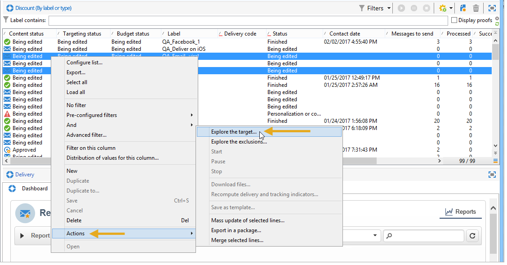

# 使用描述性分析精靈{#using-the-descriptive-analysis-wizard}

若要建立描述性分析報表，請使用專用精靈。 設定取決於要分析的資料和所需的呈現。

## 分析資料庫{#analyzing-data-in-the-database}中的資料

描述性分析嚮導可通過&#x200B;**[!UICONTROL Tools > Descriptive analysis]**&#x200B;菜單啟動：在此情況下，分析預設與收件者有關(**nms:recipient**)。 它會套用至Adobe Campaign資料庫中的所有資料。

要分析標準收件者(**nms:recipient**)以外的表，請按一下嚮導最後一階段的&#x200B;**[!UICONTROL Advanced settings...]**&#x200B;連結，並選擇與您的設定匹配的表，在此例中，**cus:indival**:

如果您想對部分資料產生統計資料，可以定義篩選器：若要這麼做，請按一下&#x200B;**[!UICONTROL Advanced settings...]**&#x200B;連結並定義要套用的篩選器，如下所示：

這項分析將只涉及16歲及以上、居住在倫敦的資料庫接收者。

## 分析資料集{#analyzing-a-set-of-data}

您可以透過不同內容使用描述性分析精靈：清單、工作流程轉變、一或多個傳送、收件者選取等。

您可透過Adobe Campaign樹狀結構中指向收件者表格的數個節點存取。

選取項目並按一下滑鼠右鍵，開啟描述性分析精靈。 只會分析選取的資料。

* 對於一組&#x200B;**收件者**，選擇要分析的收件者，按一下右鍵並選擇&#x200B;**[!UICONTROL Actions > Explore...]**，如上所示。 如果篩選器套用至收件者清單，則只會分析其內容。

   要選擇資料夾或當前篩選器中的所有收件者，請使用CTRL+A快捷方式。 這表示即使未顯示的收件者也將被選取。

   如需收件者的描述性分析範例，請參閱：[定性資料分析](../../reporting/using/use-cases.md#qualitative-data-analysis)。

* 在&#x200B;**workflow**&#x200B;的上下文中，將游標置於指向收件者表的轉變上，按一下右鍵並選擇&#x200B;**[!UICONTROL Analyze target]**。 有關詳細資訊，請參閱[分析工作流](../../reporting/using/use-cases.md#analyzing-a-transition-target-in-a-workflow)中的轉變目標中的範例。
* 對於&#x200B;**lists**，選擇一個或多個清單，並應用與收件者相同的流程。
* 在&#x200B;**delivery**&#x200B;的內容中，選取您要分析其目標的傳送，按一下滑鼠右鍵並選取&#x200B;**[!UICONTROL Actions > Explore the target]**，如下所示：

   

   以下提供傳送的描述性分析範例：[分析母體](../../reporting/using/use-cases.md#analyzing-a-population)和此處：[分析收件者追蹤記錄](../../reporting/using/use-cases.md#analyzing-recipient-tracking-logs)。

## 配置定性分佈模板{#configuring-the-qualitative-distribution-template}

**[!UICONTROL Qualitative distribution]**&#x200B;範本可讓您建立所有資料類型的統計資料（例如公司名稱、電子郵件網域）。

在[在表](#displaying-data-in-the-table)中顯示資料中詳細說明了可用於通過&#x200B;**[!UICONTROL Qualitative distribution]**&#x200B;模板建立的報告的配置選項。 [分析母體](../../reporting/using/use-cases.md#analyzing-a-population)中會詳細說明完整範例。

使用描述性分析精靈分析資料時，可用的選項取決於所選的設定。 下文詳述。

### 資料綁定{#data-binning}

選取要顯示的變數時，您可以定義資料捆綁，換句話說，就是為選取的資料設定分組條件。

>[!NOTE]
>
>當使用匯總計算與計算有關的欄位時，請檢查&#x200B;**[!UICONTROL The data is already aggregated]**&#x200B;以改進效能。

選項會因欄位內容而異：

* **[!UICONTROL None]** :此選項可讓您顯示變數的所有可用值，而不進行二進位。

   >[!CAUTION]
   >
   >此選項應謹慎使用：它可能對報表和機器效能產生重大影響。

* **[!UICONTROL Auto]** :此選項可讓您顯示n個最常顯示的值。系統會自動計算變數，且每個變數代表變數與垃圾桶數量之比的百分比。 對於數值，Adobe Campaign會自動產生n個類別，以將資料排序。
* **[!UICONTROL Manual]** :此選項的運作方式 **[!UICONTROL Auto]** 與選項類似，但您可以手動設定這些值。要執行此操作，請按一下值表格右側的&#x200B;**[!UICONTROL Add]**&#x200B;按鈕。

   Adobe Campaign可在個人化前自動初始化值：要執行此操作，請輸入要生成的bin數，然後按一下&#x200B;**[!UICONTROL Initialize with]**&#x200B;連結，如下所示：

   

   然後根據您的需求調整內容：

   

   根據所需的精準度，包含日期的欄位可依時間、日、月、年等分組。

   

* **[!UICONTROL Modulo]** :可讓您建立值群組，以防數值出現。例如，值為10的模可讓您建立值以十為單位變更的間隔。

   

   此範例可讓您依年齡群組檢視收件者的劃分。

   

### 在表{#displaying-data-in-the-table}中顯示資料

使用工具列來個人化表格中變數的顯示：刪除列、以行顯示資料而非以列顯示資料、將列向左或向右移動、查看或更改值計算。

視窗的上方區段可讓您選取顯示設定。

您可以顯示或隱藏統計資訊和子總計的名稱，並選擇統計資訊的方向。 如需詳細資訊，請參閱[分析報表顯示設定](../../reporting/using/processing-a-report.md#analysis-report-display-settings)。

### 在圖表{#displaying-data-in-the-chart}中顯示資料

在描述性分析精靈的第一個步驟中，您可以選擇只以圖表形式顯示資料，不使用表格。 在這種情況下，配置圖形時必須完成變數選擇。 您必須先選取要顯示的變數數，並從相關資料庫選取欄位。

然後選取所需的圖表類型。

>[!NOTE]
>
>您可以同時在圖表和表格中顯示變數。 要執行此操作，請在&#x200B;**[!UICONTROL Table configuration]**&#x200B;窗口中輸入變數。 按一下&#x200B;**[!UICONTROL Next]**&#x200B;並在圖表配置窗口中選擇圖表類型。 如果子維在表格中定義，則它們不會顯示在圖表中。

按一下&#x200B;**[!UICONTROL Variants]**&#x200B;連結以修改圖表屬性。

提供的選項取決於所選圖表的類型。 如需詳細資訊，請參閱[本頁面](../../reporting/using/creating-a-chart.md#chart-types-and-variants)。

### 統計計算{#statistics-calculation}

描述性分析精靈可讓您計算資料的數種統計資料類型。 預設情況下，僅配置一個簡單計數。

按一下&#x200B;**[!UICONTROL Add]**&#x200B;以建立新的統計資料。

可執行下列操作：

* **[!UICONTROL Count]** 要計算要聚合的欄位的所有非空值，包括重複值（聚合欄位的）,
* **[!UICONTROL Average]** 計算數值欄位中的平均值，
* **[!UICONTROL Minimum]** 計算數值欄位中值的最小值，
* **[!UICONTROL Maximum]** 計算數值欄位中值的最大值，
* **[!UICONTROL Sum]** 計算數值欄位中值的總和，
* **[!UICONTROL Standard deviation]** 計算傳回值在平均值中的散布情況，
* **[!UICONTROL Row percentage distribution]** 要計算列中值和行中值的比率（僅適用於表）,
* **[!UICONTROL Column percentage distribution]** 要計算行中值與列中值的比率（僅適用於表）,
* **[!UICONTROL Total percentage distribution]** 計算值所關注的收件者分佈，

   

* **[!UICONTROL Calculated field]** 以建立個人化運算子（僅適用於表格）。**[!UICONTROL User function]**&#x200B;欄位可讓您輸入要套用至資料的計算。

   範例：根據國家/地區和來源計算每位客戶的平均購買量

   

   若要在表格中顯示上述資訊，您需要建立計算欄位，以儲存每位客戶的平均購買量。

   操作步驟：

   1. 計算購買總計。

      

   1. 此統計資料不會顯示在表格中。 您需要取消選中&#x200B;**[!UICONTROL Advanced]**&#x200B;頁簽的&#x200B;**[!UICONTROL Display in the table]**&#x200B;選項。

      

   1. 建立新的&#x200B;**[!UICONTROL Calculated field]**&#x200B;類型統計值，並在&#x200B;**[!UICONTROL User function]**&#x200B;欄位中輸入以下公式：**@purchases/@count**。

      

### 顯示報表{#displaying-the-report}

精靈的最後一個步驟可讓您顯示報表，亦即已設定的表格或圖表。

當報表包含表格時，將顯示計算結果單元格。 結果越高，顏色就越濃。

可以更改結果的佈局。 要執行此操作，請以滑鼠右鍵按一下相關變數，然後從捷徑功能表中選取輸入。

當報表包含圖表時，圖例的標籤可讓您篩選顯示的資訊：按一下標籤以啟用/停用圖表中的顯示。

## 配置定量分佈模板{#configuring-the-quantitative-distribution-template}

若要自行產生描述性分析，請選取預設未設定的範本&#x200B;**選項中的**&#x200B;新增描述性分析。

**[!UICONTROL Quantitative distribution]**&#x200B;範本，可讓您產生可測量或計算之資料的統計資料（例如發票金額、收件者的年齡）。

透過&#x200B;**[!UICONTROL Quantitative distribution]**&#x200B;範本建立之分析報表的設定模式在實施範例[量化資料分析](../../reporting/using/use-cases.md#quantitative-data-analysis)中詳細說明。

使用描述性分析精靈建立量化報表時可用的選項在下文詳細說明。

首先，選取計算所關注的變數：

依預設，Adobe Campaign提供一系列統計資料，供您針對選取的資料進行計算。 您可以根據自己的需要更改此清單、添加到清單或刪除統計資訊。

可執行下列操作：

* **[!UICONTROL Count]** 要計算要聚合的欄位的所有非空值，包括重複值（聚合欄位的）,
* **[!UICONTROL Average]** 計算數值欄位中的平均值，
* **[!UICONTROL Minimum]** 計算數值欄位中值的最小值，
* **[!UICONTROL Maximum]** 計算數值欄位中值的最大值。
* **[!UICONTROL Sum]** 計算數值欄位中值的總和，
* **[!UICONTROL Standard deviation]** 來計算傳回值在平均值周圍的分佈。
* **[!UICONTROL Number of missing values]** 以計算沒有定義值的數值欄位數。
* **[!UICONTROL Decile distribution]** 分佈傳回的值，使得每個都代表數1/10欄位中的第個值。
* **[!UICONTROL Custom distribution]** 分配根據用戶定義閾值返回的值。

   **[!UICONTROL Detail...]**&#x200B;按鈕可讓您編輯統計資料，並視需要個人化其計算或顯示：

   

   精靈的最後一個步驟會顯示量化分析報表。

   

   若要變更報表，請參閱[處理報表](../../reporting/using/processing-a-report.md)。
