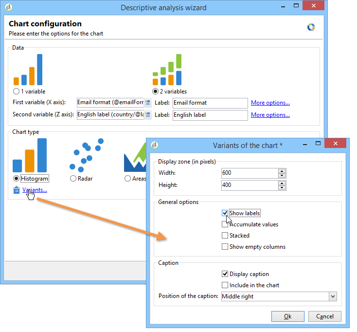
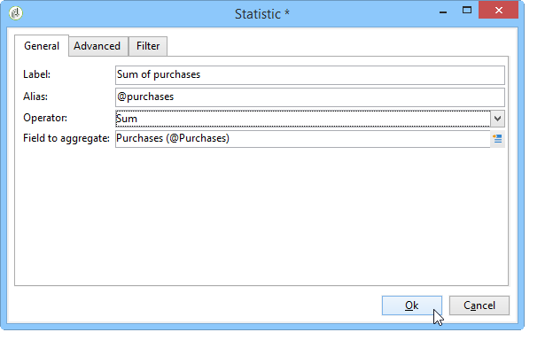

# 使用描述性分析助理{#using-the-descriptive-analysis-wizard}

若要建立描述性分析報告，請使用專用助理。 設定取決於要分析的資料以及所需的呈現。

## 分析資料庫中的資料 {#analyzing-data-in-the-database}

描述性分析助理可以透過&#x200B;**[!UICONTROL Tools > Descriptive analysis]**&#x200B;功能表啟動：在此情況下，分析預設與收件者有關(**nms：recipient**)。 此維度會套用至Adobe Campaign資料庫中的所有資料。

若要分析標準收件者(**nms：recipient**)以外的表格，請按一下助理員最後階段的&#x200B;**[!UICONTROL Advanced settings...]**&#x200B;連結，並選取符合您設定的表格，在此例中為&#x200B;**cus：individual**：

如果您想要針對部分資料產生統計資料，可以定義篩選：若要這麼做，請按一下&#x200B;**[!UICONTROL Advanced settings...]**&#x200B;連結，並定義要套用的篩選，如下所示：

此分析僅涉及16歲以上且居住在倫敦的資料庫收件者。

## 分析資料集 {#analyzing-a-set-of-data}

您可以透過不同內容使用描述性分析助理：清單、工作流程轉變、一個或多個傳遞、選擇收件者等。

可透過指向收件者表格的Adobe Campaign樹狀結構的數個節點進行存取。

選取專案並按一下滑鼠右鍵，開啟描述性分析助理。 只會分析選取的資料。

* 針對一組&#x200B;**收件者**，選取要分析的收件者，然後按一下滑鼠右鍵並選取&#x200B;**[!UICONTROL Actions > Explore...]**，如上所示。 如果篩選器套用至收件者清單，則只會分析其內容。

  若要選取資料夾或目前篩選器中的所有收件者，請使用CTRL+A快速鍵。 這表示系統甚至會選取未顯示的收件者。

  如需收件者的描述性分析範例，請參閱： [定性資料分析](../../reporting/using/use-cases.md#qualitative-data-analysis)。

* 在&#x200B;**工作流程**&#x200B;的內容中，將游標置於指向收件者表格的轉變上，按一下滑鼠右鍵並選取&#x200B;**[!UICONTROL Analyze target]**。 如需詳細資訊，請參閱[分析工作流程中的轉換目標](../../reporting/using/use-cases.md#analyzing-a-transition-target-in-a-workflow)中的範例。
* 針對&#x200B;**清單**，選取一或多個清單，並套用與收件者相同的程式。
* 在&#x200B;**傳遞**&#x200B;的內容中，選取您要分析其目標的傳遞，按一下滑鼠右鍵並選取&#x200B;**[!UICONTROL Actions > Explore the target]**，如下所示：

  

  這裡提供傳遞的描述性分析範例： [分析母體](../../reporting/using/use-cases.md#analyzing-a-population)，這裡： [分析收件者追蹤記錄](../../reporting/using/use-cases.md#analyzing-recipient-tracking-logs)。

## 設定質化分佈範本 {#configuring-the-qualitative-distribution-template}

**[!UICONTROL Qualitative distribution]**&#x200B;範本可讓您建立所有資料型別（例如公司名稱、電子郵件網域）的統計資料。

透過&#x200B;**[!UICONTROL Qualitative distribution]**&#x200B;範本建立之報告可用的組態選項在[在表格中顯示資料](#displaying-data-in-the-table)中有詳細說明。 在[分析母體](../../reporting/using/use-cases.md#analyzing-a-population)中會詳細說明完整範例。

當您使用描述性分析助理來分析資料時，可用的選項取決於所選的設定。 下文將詳述這些內容。

### 資料量化 {#data-binning}

當您選取要顯示的變數時，可以定義資料量化，換句話說，就是為選取的資料設定分組條件。

>[!NOTE]
>
>使用彙總來計算計算涉及的欄位時，請檢查&#x200B;**[!UICONTROL The data is already aggregated]**&#x200B;以改進效能。

選項會因欄位內容而異：

* **[!UICONTROL None]** ：此選項可讓您顯示變數的所有可用值，而不需量化。

  >[!CAUTION]
  >
  >使用此選項時請務必謹慎：它可能會對報告和電腦效能產生重大影響。

* **[!UICONTROL Auto]** ：此選項可讓您顯示n個最常代表的值。 它們會自動計算，而且每一項代表相較於回收桶數的變數百分比。 對於數值，Adobe Campaign會自動產生n個類別來將資料排序到其中。
* **[!UICONTROL Manual]** ：此選項的運作方式類似&#x200B;**[!UICONTROL Auto]**&#x200B;選項，只是您可以手動設定這些值。 若要這麼做，請按一下值表格右側的&#x200B;**[!UICONTROL Add]**&#x200B;按鈕。

  在個人化之前，值可以由Adobe Campaign自動初始化：若要這麼做，請輸入您要產生的回收桶數目，然後按一下&#x200B;**[!UICONTROL Initialize with]**&#x200B;連結，如下所示：

  

  然後調整您的內容以符合您的需求：

  

  根據所需的精確度等級，包含日期的欄位可依時間、日、月、年等分組。

  

* **[!UICONTROL Modulo]** ：可讓您建立數值群組。 例如，值為10的模數可讓您建立十乘以十的值間隔。

  

  此範例可讓您檢視依年齡群組劃分的收件者細目。

  

### 在表格中顯示資料 {#displaying-data-in-the-table}

使用工具列來個人化表格中變數的顯示：刪除欄、以行而非欄顯示資料、將欄向左或向右移動、檢視或更改值計算。

視窗的上半部可讓您選取顯示設定。

您可以顯示或隱藏統計資料及小計的名稱，並選擇統計資料的方向。 如需詳細資訊，請參閱[分析報表顯示設定](../../reporting/using/processing-a-report.md#analysis-report-display-settings)。

### 在圖表中顯示資料 {#displaying-data-in-the-chart}

在描述性分析助理的第一個步驟中，您可以選擇只以圖表形式顯示資料，而不使用表格。 在這種情況下，設定圖形時必須選取變數。 您必須先選取要顯示的變數數目，然後從相關資料庫中選取欄位。

然後選取所需的圖表型別。

>[!NOTE]
>
>您可以同時在圖表和表格中顯示變數。 若要這麼做，請在&#x200B;**[!UICONTROL Table configuration]**&#x200B;視窗中輸入變數。 按一下&#x200B;**[!UICONTROL Next]**&#x200B;並在圖表組態視窗中選取圖表型別。 如果在表格中定義了子維度，則它們不會顯示在圖表中。

按一下&#x200B;**[!UICONTROL Variants]**&#x200B;連結以修改圖表屬性。

提供的選項取決於所選的圖表型別。 如需詳細資訊，請參閱[本頁面](../../reporting/using/creating-a-chart.md#chart-types-and-variants)。

### 統計資料計算 {#statistics-calculation}

描述性分析助理可以讓您計算資料的幾種統計資料。 依預設，僅設定一個簡單計數。

按一下&#x200B;**[!UICONTROL Add]**&#x200B;以建立新的統計資料。

可以執行下列操作：

* **[!UICONTROL Count]**&#x200B;以計算要彙總之欄位的所有非null值，包括（彙總欄位）的重複值，
* **[!UICONTROL Average]**&#x200B;計算數值欄位中值的平均值，
* **[!UICONTROL Minimum]**&#x200B;計算數值欄位中值的最小值，
* **[!UICONTROL Maximum]**&#x200B;計算數值欄位中值的最大值，
* **[!UICONTROL Sum]**&#x200B;計算數值欄位中值的總和，
* **[!UICONTROL Standard deviation]**&#x200B;計算傳回值如何散佈在平均值周圍，
* **[!UICONTROL Row percentage distribution]**&#x200B;以計算一欄中的值與一列中的值的比率（僅適用於表格），
* **[!UICONTROL Column percentage distribution]**&#x200B;計算一列中的值與一欄中值的比率（僅適用於表格），
* **[!UICONTROL Total percentage distribution]**&#x200B;以計算值所關注的收件者分佈，

  

* **[!UICONTROL Calculated field]**&#x200B;以建立個人化運運算元（僅適用於表格）。 **[!UICONTROL User function]**&#x200B;欄位可讓您輸入要套用至資料的計算。

  範例：根據國家/地區和來源計算每位客戶的平均採購金額

  

  若要在表格中顯示上述資訊，您必須建立計算欄位，以儲存每位客戶的平均購買金額。

  操作步驟：

   1. 計算購買總計。

      

   1. 此統計資料不會顯示在表格中。 您必須取消核取&#x200B;**[!UICONTROL Advanced]**&#x200B;索引標籤的&#x200B;**[!UICONTROL Display in the table]**&#x200B;選項。

      

   1. 建立新的&#x200B;**[!UICONTROL Calculated field]**&#x200B;型別統計資料，並在&#x200B;**[!UICONTROL User function]**&#x200B;欄位中輸入下列公式： **@purchases/@count**。

      

### 顯示報表 {#displaying-the-report}

助理的最後一個步驟可讓您顯示報表，也就是已設定的表格或圖表。

當報表包含表格時，計算結果儲存格會著色。 結果愈高，色彩愈強烈。

可以變更結果的配置。 若要這麼做，請以滑鼠右鍵按一下相關的變數，然後從快捷選單中選取輸入。

當報表包含圖表時，圖例的標籤可讓您篩選顯示的資訊：按一下標籤可啟用/停用圖表中的顯示。

## 設定量化發佈範本 {#configuring-the-quantitative-distribution-template}

若要自行產生描述性分析，請選取&#x200B;**從範本新增描述性分析**&#x200B;選項（若預設未設定）。

**[!UICONTROL Quantitative distribution]**&#x200B;範本可讓您針對可測量或計數的資料產生統計資料（例如發票金額、收件者的年齡）。

透過&#x200B;**[!UICONTROL Quantitative distribution]**&#x200B;範本建立之分析報告的設定模式在實施範例[量化資料分析](../../reporting/using/use-cases.md#quantitative-data-analysis)中有詳細說明。

使用描述性分析助理建立量化報告時可用的選項詳述如下。

首先，選取計算涉及的變數：

依預設，Adobe Campaign提供一系列要針對所選資料計算的統計資料。 您可以視需要變更此清單、新增至此清單或刪除統計資料。

可以執行下列操作：

* **[!UICONTROL Count]**&#x200B;以計算要彙總之欄位的所有非null值，包括（彙總欄位）的重複值，
* **[!UICONTROL Average]**&#x200B;計算數值欄位中值的平均值，
* **[!UICONTROL Minimum]**&#x200B;計算數值欄位中值的最小值，
* **[!UICONTROL Maximum]**&#x200B;以計算數值欄位中值的最大值。
* **[!UICONTROL Sum]**&#x200B;計算數值欄位中值的總和，
* **[!UICONTROL Standard deviation]**&#x200B;計算傳回的值在平均值周圍的分佈方式。
* **[!UICONTROL Number of missing values]**&#x200B;計算未定義值的數值欄位數目。
* **[!UICONTROL Decile distribution]**&#x200B;以分配傳回的值，讓每個都代表數值欄位中值的1/10。
* **[!UICONTROL Custom distribution]**&#x200B;以根據使用者定義的臨界值分配傳回的值。

  **[!UICONTROL Detail...]**&#x200B;按鈕可讓您編輯統計資料，並視需要個人化其計算或顯示：

  

  助理的最後一步會顯示定量分析報告。

  

  若要變更報表，請參閱[處理報表](../../reporting/using/processing-a-report.md)。
