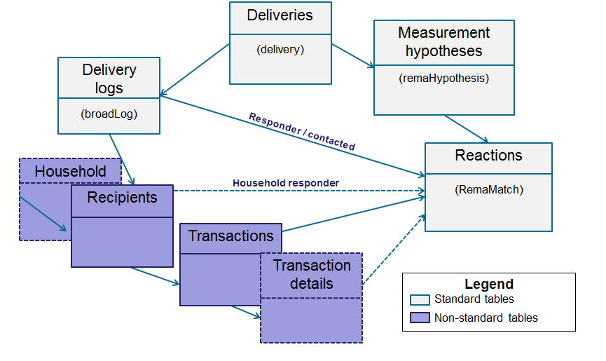

# 配置市場活動響應管理器{#configuration}


本節面向負責配置響應管理的人員。 它假定對擴展架構、定義工作流和SQL寫程式有一定程度的瞭解。

這使您能夠瞭解如何將標準資料模型調整為與個人表一起位於Adobe Campaign外部的事務表的特定性質。 這一個人名表可以與Adobe Campaign現有個人名表或另一個名表一致

測量假設由操作流程工作流啟動( **[!UICONTROL operationMgt]** )。 每個假設都表示一個單獨的進程，以非同步方式執行，並且執行狀態（正在編輯、掛起、已完成、失敗等） 並由調度程式控制，該調度程式管理優先順序約束、同時進程數的限制、低活動頁以及頻率的自動執行。

## 配置架構 {#configuring-schemas}

>[!CAUTION]
>
>不要修改應用程式的內置架構，而是使用架構擴展機制。 否則，在將來升級應用程式時，將不會更新修改的架構。 這可能在使用Adobe Campaign時導致故障。

在使用反應模組之前，需要應用程式整合，以便定義要衡量的各種表（事務處理、事務詳細資訊）及其與交貨、優惠和個人的關係。

### 標準架構 {#standard-schemas}

開箱即用 **[!UICONTROL nms:remaMatch]** 模式包含反應日誌表，即個體、假設和事務表之間的關係。 此模式將用作反應日誌的最終目標表的繼承模式。

的 **[!UICONTROL nms:remaMatchRcp]** 架構也是一個標準，它包含為Adobe Campaign收件人( **[!UICONTROL nms:recipient]** )。 為了使用，需要將其擴展以映射到事務表（包含採購等）。

### 事務表和事務詳細資訊 {#transaction-tables-and-transaction-details}

事務表必須包括指向個人的直接連結。

您還可以添加包含事務詳細資訊的表。 這與個人沒有直接聯繫。

例如，如果我們以收款為例，則事務處理表連結到聯繫人（收款表），而收款行表僅連結到收款表（明細表）。 然後，您可以在接收行表連結到接收表的層直接配置假設。

>[!NOTE]
>
>如果希望保留描述假設中預期行為的接收標識符，則可以擴展nms:remaMatchRcp表模板以將標識符添加到該模板中（在這種情況下，沒有將ROI計算連結到這些欄位）。

我們強烈建議添加事件日期。

完成配置後，以下架構將顯示不同表之間的聯接：



### 響應管理和收件人 {#response-management-with-adobe-campaign-recipients}

在本示例中，我們將使用Adobe Campaign內置收件表在響應管理模組中整合一個採購表 **[!UICONTROL nms:recipient]**。

上的響應日誌表 **[!UICONTROL nms:remaMatchRcp]** 擴展收件人以添加到採購表架構的連結。 在以下示例中，將調用採購表 **演示：購買**。

1. 通過Adobe Campaign瀏覽器，選擇 **[!UICONTROL Administration]** > **[!UICONTROL Campaign management]** > **[!UICONTROL Target mappings]**。
1. 按一下右鍵 **收件人** 選擇 **[!UICONTROL Actions]** 和 **[!UICONTROL Modify the options of the targeting dimensions]**。

   

1. 您可以個性化 **[!UICONTROL Extension namespace]** 在下一個窗口中，按一下 **[!UICONTROL Next]**。

   

1. 在 **[!UICONTROL Response management]** 類別，確保 **[!UICONTROL Generate a storage schema for reactions]** 的子菜單。

   然後按一下 **[!UICONTROL Define additional fields...]** 選擇相關事務表，並將所需欄位添加到nms:remaMatchRcp模式的擴展。

   

建立的架構如下所示：

```
<srcSchema _cs="Reactions (Recipients) (cus)" entitySchema="xtk:srcSchema" extendedSchema="nms:remaMatchRcp" 
img="nms:remaMatch.png" implements="xtk:persist" label="Reactions (Recipients)" mappingType="sql"
name="remaMatchRcp" namespace="cus">  
 <element label="Reactions (Recipients)" name="remaMatchRcp">    
  <key internal="true" name="match">      
   <keyfield xlink="hypothesis"/>      
   <keyfield xlink="broadLog"/>      
   <keyfield xlink="proposition"/>    
  </key>    
  <attribute label="Quantity" name="quantity" type="long"/>    
  <element name="purchase" target="demo:purchase" type="link"/>    
  <element name="hypothesis" revLabel="Reactions (Recipients)" revLink="remaMatchRcp"/>    
  <element applicableIf="HasPackage('nms:coreInteraction')" label="Proposition" name="proposition" target="nms:propositionRcp" type="link"/>   
  <element desc="Message (Delivery log)" label="Message" name="broadLog" target="nms:broadLogRcp" type="link"/>    
  <element label="Respondent" name="responder" target="nms:recipient" type="link"/>  
 </element>  
 <createdBy _cs="Administrator (admin)"/>  
 <modifiedBy _cs="Administrator (admin)"/>
</srcSchema>
```

### 具有個性化收件表的響應管理 {#response-management-with-a-personalized-recipient-table}

在本示例中，我們將使用Adobe Campaign提供的收件人表以外的個人表，將採購表整合到我們的響應管理模組中。

* 建立從 **[!UICONTROL nms:remaMatch]** 架構。

   由於個人表與Adobe Campaign收件人表不同，因此必鬚根據 **[!UICONTROL nms:remaMatch]** 架構。 然後，使用指向交貨日誌和購買表的連結完成該操作。

   在以下示例中，我們將使用 **演示：broadLogPers** 架構和 **演示：購買** 事務表：

   ```
   <srcSchema desc="Linking of a recipient transaction to a hypothesis"    
   img="nms:remaMatch.png" label="Responses on persons" labelSingular="Responses on a person" name="remaMatchPers" namespace="nms">
     <element name="remaMatchPers" template="nms:remaMatch">
       <key internal="true" name="match">
         <keyfield xlink="hypothesis"/>
        <keyfield xlink="purchase"/>
       </key>
   
       <element name="hypothesis" revLabel="Response logs for persons" revLink="remaMatchPers"/>
       <element applicableIf="HasPackage('nms:interaction')" label="Proposition" name="proposition"
                target="demo:propositionPers" type="link"/>
       <element label="Delivery log" name="broadLog" target="demo:broadLogPers" type="link"/>
     </element>
   </srcSchema>
   ```

* 修改中的假設窗體 **[!UICONTROL nms:remaHypothesis]** 架構。

   預設情況下，響應日誌清單在收件人日誌中可見。 因此，必須修改假設表單，才能查看在上一步中建立的新響應日誌。

   例如：

   ```
    <container type="visibleGroup" visibleIf="[context/@remaMatchStorage]= 'demo:remaMatchPers'">
                 <input hideEditButtons="true" img="nms:remaMatch.png" nolabel="true" refresh="true"
                  toolbarCaption="Responses generated by the hypothesis" type="linklist"
                  xpath="remaMatchPers">
             <input xpath="[.]"/>
             <input xpath="@controlGroup"/>
           </input>
      </container> 
   ```

## 管理指示器 {#managing-indicators}

「響應管理器」模組附帶了預定義指示器的清單。 但是，您可以添加其他個性化度量指標。

為此，必須通過為每個新指示符插入兩個欄位來擴展假設表：

* 第一個目標群體，
* 第二個是控制組。

例如：

```
<srcSchema entitySchema="xtk:srcSchema" extendedSchema="nms:remaHypothesis" label="Measurement hypothesis" 
md5="1D4DED54FF8EC2432AED6736EDE6F547" name="remaHypothesis" namespace="demo" xtkschema="xtk:srcSchema">  
    <element name="remaHypothesis">    
        <element name="indicators">      
            <!-- Quantity -->      
            <attribute label="Total contacted" name="contactReactedTotalQuantity" type="long"/>
            <attribute label="Total number of people in the control group" name="proofReactedTotalquantity" type="long"/> 
        </element> 
    </element>
</srcSchema>
```
