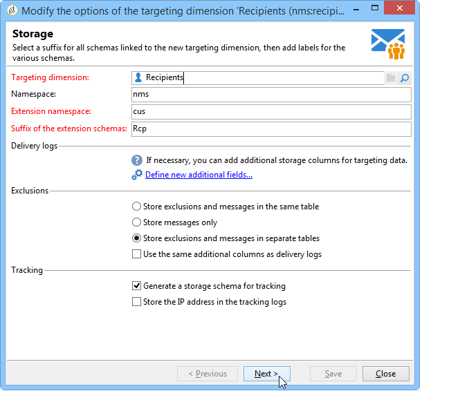

# 設定Campaign回應管理員{#configuration}


本節適用於負責設定回應管理的人員。 它假定您有一定的知識來擴充結構描述、定義工作流程和SQL程式設計。

這可讓您瞭解如何使用個人資料表，來調整標準資料模型，以符合Adobe Campaign外部交易表的特定性質。 此個人表格可與Adobe Campaign中的可用個人表格或其他表格保持一致

測量假設是由作業程式工作流程( **[!UICONTROL operationMgt]** )啟動。 每個假設代表一個以執行狀態（正在編輯、擱置中、已完成、失敗等）非同步執行的個別程式 由管理優先順序限制、同時處理序數限制、低活動頁面及頻率自動執行的排程器控制。

## 設定方案 {#configuring-schemas}

>[!CAUTION]
>
>請勿修改應用程式的內建方案，而是使用方案擴充機制。 否則，修改後的結構描述將不會在應用程式未來升級時更新。 這可能在使用Adobe Campaign時導致功能錯誤。

必須先整合應用程式，才能使用反應模組，定義要測量的各種表格（交易、交易詳細資訊），以及其與傳送、選件及個人的關係。

### 標準結構描述 {#standard-schemas}

現成可用的結構描述&#x200B;**[!UICONTROL nms:remaMatch]**&#x200B;包含反應記錄表，也就是個人、假設和交易表之間的關係。 此結構描述應作為反應記錄最終目的地表格的繼承結構描述。

**[!UICONTROL nms:remaMatchRcp]**&#x200B;結構描述也以標準形式提供，它包含Adobe Campaign收件者( **[!UICONTROL nms:recipient]** )的反應記錄檔儲存空間。 為了使用，需要將其擴充以對映至交易表（包含購買等）。

### 交易表格與交易詳細資訊 {#transaction-tables-and-transaction-details}

交易表必須包含指向個人的直接連結。

您也可以新增包含交易詳細資訊的表格。 此檔案不會直接連結至個人。

以收款為例，交易表格會連結至聯絡人（收款表格），而收款明細行表格只會連結至收款表格（明細表格）。 然後，您可以在收貨單明細表連結至收貨單表格的層次，直接設定假設。

>[!NOTE]
>
>如果要保留描述假設中預期行為的收款識別碼，可以擴充nms：remaMatchRcp表格範本，以新增該識別碼（在此情況下，ROI計算不會連結到這些欄位）。

我們強烈建議您新增事件日期。

組態完成後，下列綱要會顯示不同表格之間的聯結：


### 回應管理與收件者 {#response-management-with-adobe-campaign-recipients}

在此範例中，我們將使用Adobe Campaign內建的收件者表格&#x200B;**[!UICONTROL nms:recipient]**，在回應管理模組中整合購買表格。

**[!UICONTROL nms:remaMatchRcp]**&#x200B;收件者上的回應記錄表已延伸，以新增購買表格結構描述的連結。 在下列範例中，購買資料表名為&#x200B;**demo：purchase**。

1. 透過Adobe Campaign總管，選取&#x200B;**[!UICONTROL Administration]** > **[!UICONTROL Campaign management]** > **[!UICONTROL Target mappings]**。
1. 用滑鼠右鍵按一下&#x200B;**收件者**，然後選取&#x200B;**[!UICONTROL Actions]**&#x200B;和&#x200B;**[!UICONTROL Modify the options of the targeting dimensions]**。

   

1. 您可以在下一個視窗中個人化&#x200B;**[!UICONTROL Extension namespace]**，然後按一下&#x200B;**[!UICONTROL Next]**。

   

1. 在&#x200B;**[!UICONTROL Response management]**&#x200B;類別中，確定已核取&#x200B;**[!UICONTROL Generate a storage schema for reactions]**&#x200B;方塊。

   然後按一下&#x200B;**[!UICONTROL Define additional fields...]**&#x200B;以選取相關的交易表格，並將所需的欄位新增到nms：remaMatchRcp結構描述的延伸模組。

   

建立的結構描述如下所示：

```
<srcSchema _cs="Reactions (Recipients) (cus)" entitySchema="xtk:srcSchema" extendedSchema="nms:remaMatchRcp" 
img="nms:remaMatch.png" implements="xtk:persist" label="Reactions (Recipients)" mappingType="sql"
name="remaMatchRcp" namespace="cus">  
 <element label="Reactions (Recipients)" name="remaMatchRcp">    
  <key internal="true" name="match">      
   <keyfield xlink="hypothesis"/>      
   <keyfield xlink="broadLog"/>      
   <keyfield xlink="proposition"/>    
  </key>    
  <attribute label="Quantity" name="quantity" type="long"/>    
  <element name="purchase" target="demo:purchase" type="link"/>    
  <element name="hypothesis" revLabel="Reactions (Recipients)" revLink="remaMatchRcp"/>    
  <element applicableIf="HasPackage('nms:coreInteraction')" label="Proposition" name="proposition" target="nms:propositionRcp" type="link"/>   
  <element desc="Message (Delivery log)" label="Message" name="broadLog" target="nms:broadLogRcp" type="link"/>    
  <element label="Respondent" name="responder" target="nms:recipient" type="link"/>  
 </element>  
 <createdBy _cs="Administrator (admin)"/>  
 <modifiedBy _cs="Administrator (admin)"/>
</srcSchema>
```

### 使用個人化收件者表格的回應管理 {#response-management-with-a-personalized-recipient-table}

在此範例中，我們將使用Adobe Campaign中可用收件者表格以外的個人表格，將購買表格整合到回應管理模組中。

* 建立衍生自&#x200B;**[!UICONTROL nms:remaMatch]**&#x200B;結構描述的新回應記錄結構描述。

  由於個人表格與Adobe Campaign收件者表格不同，因此必須根據&#x200B;**[!UICONTROL nms:remaMatch]**&#x200B;結構描述建立回應記錄檔的新結構描述。 然後填寫傳送記錄和購買表格的連結。

  在下列範例中，我們將使用&#x200B;**demo：broadLogPers**&#x200B;結構描述和&#x200B;**demo：purchase**&#x200B;交易表：

  ```
  <srcSchema desc="Linking of a recipient transaction to a hypothesis"    
  img="nms:remaMatch.png" label="Responses on persons" labelSingular="Responses on a person" name="remaMatchPers" namespace="nms">
    <element name="remaMatchPers" template="nms:remaMatch">
      <key internal="true" name="match">
        <keyfield xlink="hypothesis"/>
       <keyfield xlink="purchase"/>
      </key>
  
      <element name="hypothesis" revLabel="Response logs for persons" revLink="remaMatchPers"/>
      <element applicableIf="HasPackage('nms:interaction')" label="Proposition" name="proposition"
               target="demo:propositionPers" type="link"/>
      <element label="Delivery log" name="broadLog" target="demo:broadLogPers" type="link"/>
    </element>
  </srcSchema>
  ```

* 修改&#x200B;**[!UICONTROL nms:remaHypothesis]**&#x200B;結構描述中的假設表單。

  依預設，回應記錄檔清單會顯示在收件者記錄檔中。 因此，您必須修改假設表單，以檢視在上一步建立的新回應記錄。

  例如：

  ```
   <container type="visibleGroup" visibleIf="[context/@remaMatchStorage]= 'demo:remaMatchPers'">
                <input hideEditButtons="true" img="nms:remaMatch.png" nolabel="true" refresh="true"
                 toolbarCaption="Responses generated by the hypothesis" type="linklist"
                 xpath="remaMatchPers">
            <input xpath="[.]"/>
            <input xpath="@controlGroup"/>
          </input>
     </container> 
  ```

## 管理指標 {#managing-indicators}

回應管理員模組隨附預先定義的指標清單。 不過，您可以新增其他個人化測量指標。

要執行此操作，您必須透過為每個新指標插入兩個欄位來擴充假設表格：

* 目標母體的第一個，
* 控制組的第二個。

例如：

```
<srcSchema entitySchema="xtk:srcSchema" extendedSchema="nms:remaHypothesis" label="Measurement hypothesis" 
md5="1D4DED54FF8EC2432AED6736EDE6F547" name="remaHypothesis" namespace="demo" xtkschema="xtk:srcSchema">  
    <element name="remaHypothesis">    
        <element name="indicators">      
            <!-- Quantity -->      
            <attribute label="Total contacted" name="contactReactedTotalQuantity" type="long"/>
            <attribute label="Total number of people in the control group" name="proofReactedTotalquantity" type="long"/> 
        </element> 
    </element>
</srcSchema>
```
