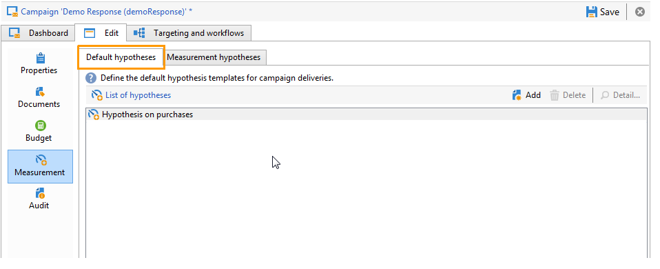
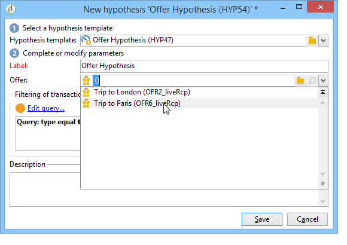

# 建立假設{#creating-hypotheses}

建立/連結行銷活動選件或傳送的假設有多種可能：

* 透過 **[!UICONTROL Measurement hypotheses]** 資料夾，方法是根據現有範本建立新假設，並將其連結至現有傳送。
* 透過 **[!UICONTROL Edit]** > **[!UICONTROL Measurement]** 標籤。
* 透過 **[!UICONTROL Measurement]** 從促銷活動建立的傳送選項。

只有在啟動行銷活動且收件者收到傳遞後，才能計算假設。 如果假設是以優惠方案主張為基礎，則後者至少需要呈現，且仍然有效。 選件和傳送假設是透過 **[!UICONTROL Measurement hypotheses]** 資料夾和以假設範本為基礎。 不過，您可以在行銷活動開始之前直接在傳送或行銷活動中參考假設。 在此情況下，假設會根據執行設定，在啟動行銷活動後自動計算。 [了解更多](hypothesis-templates.md#hypothesis-template-execution-settings)

## 在傳送時即時建立假設 {#creating-a-hypothesis-on-the-fly-on-a-delivery}

若要對現有傳送建立假設，請套用下列程式：

>[!NOTE]
>
>此操作僅可用於待定傳送。

1. 在Adobe Campaign樹中，前往 **[!UICONTROL Campaign management > Measurement hypotheses]**.
1. 按一下 **[!UICONTROL New]** 按鈕或按一下右鍵假設清單，然後選擇 **[!UICONTROL New]** 中。

   

1. 在假設視窗中，選取先前建立的範本。 [了解更多](hypothesis-templates.md)

   

   在所選模型中定義的假設上下文將顯示在窗口中。

   >[!NOTE]
   >
   >在範本中定義且在此步驟中不可見的設定也會保留在記憶體中，並重新指派至進行中的假設。

   

1. 選取您要建立假設的傳送。

   

1. 您可以編輯 **[!UICONTROL General]**, **[!UICONTROL Transactions]** 和 **[!UICONTROL Scope]** 標籤。 [了解更多](hypothesis-templates.md#creating-a-hypothesis-model)
1. 按一下「 」即可啟動假設 **[!UICONTROL Start]**.

   系統會自動建立工作流程以執行測量。 系統會根據假設設定自動定義名稱。

   >[!CAUTION]
   >
   >如果您已核取 **[!UICONTROL Keep execution workflow]** 框。\
   >如果執行假設時發生錯誤，則只能啟動此選項以進行除錯。 自動產生的工作流程會儲存在 **[!UICONTROL Administration]** > **[!UICONTROL Production]** > **[!UICONTROL Objects created automatically]** > **[!UICONTROL Campaign workflows]** 檔案夾中。
   > 
   >此外，自動產生的工作流程不得修改。 在以後的計算中，不會考慮任何最終修改。
   >
   >如果您已核取此選項，請在執行工作流程後將其刪除。

   

   計算完成後，測量指標會自動更新。

   

1. 如有必要，請變更設定並重新啟動假設。

## 在促銷活動傳送中參考假設 {#referencing-a-hypothesis-in-a-campaign-delivery}

您可以在行銷活動開始之前參考假設。 在此情況下，假設會根據假設範本中定義的執行設定，在傳送後自動啟動。 若要在傳送中建立假設，請套用下列程式：

1. 您可以視需要建立一或多個 **[!UICONTROL Delivery]** 類型模板，如 [本節](hypothesis-templates.md#creating-a-hypothesis-model)
1. 建立行銷活動和目標工作流程。
1. 在傳送視窗中，按一下 **[!UICONTROL Delivery measurement]** 表徵圖。
1. 選取假設範本（在模型中設定的查詢會顯示在假設視窗中）。

   促銷活動完成後，會根據模型中設定的日期自動計算假設。 [了解更多](hypothesis-templates.md#hypothesis-template-execution-settings)

   

## 將預設假設新增至促銷活動的傳送 {#adding-a-default-hypothesis-to-deliveries-for-a-campaign}

您可以直接在促銷活動層級參考假設。 在此情況下，假設會自動連結至促銷活動中建立的所有傳送。 操作步驟：

1. 前往 **[!UICONTROL Edit]** 標籤。
1. 在測量區段中，按一下 **[!UICONTROL Default hypotheses]** 標籤。

   

1. 按一下 **[!UICONTROL Add]** 並選取假設範本。

   

   根據此範本的假設，現在預設會在促銷活動的每個新傳送中參考。

   

假設結果可在 **[!UICONTROL General]** 和 **[!UICONTROL Reactions]** 假設的標籤。 [了解更多](hypothesis-tracking.md)

如需詳細資訊，您也可以參閱 [此範例](#example--creating-a-hypothesis-linked-to-a-delivery).

## 建立選件的假設 {#creating-a-hypothesis-on-an-offer}

對優惠方案主張建立假設類似於建立即時傳送假設。 只要選件處於作用中狀態，就可以執行假設。 計算期間以優惠方案主張日期為基礎。 當假設可讓您將收件者連結至購買時，可能接受的優惠方案主張的狀態會自動變更。 [了解更多](hypothesis-templates.md#transactions)

1. 建立一或多個 **[!UICONTROL Offer]** 類型模型，如 [本節](hypothesis-templates.md#creating-a-hypothesis-model).
1. 前往 **[!UICONTROL Campaign management > Measurement hypotheses]** 節點。
1. 建立 **[!UICONTROL Offers]** 選取先前建立的模型以輸入假設。

   

   在模型中建立的查詢將顯示在窗口中。

   

1. 選擇要建立假設的選件。

   

1. 視需要調整查詢。
1. 按一下 **[!UICONTROL Start]** 來解釋這個假設。
1. 可以透過其檢視假設結果 **[!UICONTROL General]** 和 **[!UICONTROL Reactions]** 標籤。 [了解更多](hypothesis-tracking.md)

   選件上提出的假設會參考於 **[!UICONTROL Measurement]** 標籤。

   

   若 **[!UICONTROL Update offer proposition status]** 假設範本中啟用「 」選項，則會自動變更優惠方案主張的狀態，從而就促銷活動的影響提供意見(如需詳細資訊，請參閱 [交易](hypothesis-templates.md#transactions))。

## 範例：建立連結至傳遞的假設 {#example--creating-a-hypothesis-linked-to-a-delivery}

在此範例中，我們想要建立連結至傳送的假設。 此假設將以先前建立的模型為基礎。 [了解更多](hypothesis-templates.md#example--creating-a-hypothesis-template-on-a-delivery)

然後，我們將調整從模型繼承的查詢，以對購買表格的特定項目進行假設。

1. 建立促銷活動和傳遞。 [了解更多](../../campaign/using/setting-up-marketing-campaigns.md#creating-a-campaign)

   在我們的範例中，我們將使用直接郵件類型傳送。

1. 配置種子地址：先前建立的假設範本已設定為在反應結果中考慮控制組。

   

   >[!NOTE]
   >
   >如需詳細資訊，請參閱[本區段](../../campaign/using/marketing-campaign-deliveries.md#defining-a-control-group)。

1. 開啟 **[!UICONTROL Direct mail delivery]** 並按一下 **[!UICONTROL Delivery measurement]** 圖示，然後按一下 **[!UICONTROL Add]**.

   

1. 從下拉式清單中選擇先前建立的假設範本。

   

   將顯示在模型中建立的查詢。

   

1. 按一下 **[!UICONTROL Edit query...]** 並輸入假設將關聯的產品來優化查詢。

   

   您可以檢查假設已連結至 **[!UICONTROL Edit]** > **[!UICONTROL Measurement]** 標籤。

   

1. 啟動您的目標定位工作流程並執行必要的檢查，直到促銷活動完成為止。 [了解更多](../../campaign/using/marketing-campaign-deliveries.md#starting-a-delivery)

   

1. 在Adobe Campaign樹中，前往 **[!UICONTROL Campaign management > Measurement hypotheses]** 來檢查假設所計算的指標。

   
