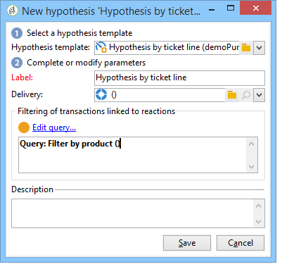

# 建立假設{#creating-hypotheses}

有多種可能性可以建立/將假設與活動提議或交付聯繫起來：

* 通過 **[!UICONTROL Measurement hypotheses]** 建立基於現有模板的新假設並將其連結到現有傳遞。
* 通過 **[!UICONTROL Edit]** > **[!UICONTROL Measurement]** 頁籤
* 通過 **[!UICONTROL Measurement]** 選項。

只有在營銷活動啟動和接收者已收到交付後，才能計算假設。 如果假設是基於一個報價命題，那麼後者至少需要被提出，並且仍然是活躍的。 提供和交付假設通過 **[!UICONTROL Measurement hypotheses]** 資料夾和基於假設模板。 但是，在市場活動開始之前，可以直接在交付或市場活動中引用假設。 在這種情況下，一旦基於執行設定的營銷活動啟動，就自動計算這些假設。 [了解更多](hypothesis-templates.md#hypothesis-template-execution-settings)

## 在送貨時即刻建立假設 {#creating-a-hypothesis-on-the-fly-on-a-delivery}

要對現有交貨建立假設，請應用以下流程：

>[!NOTE]
>
>此操作僅可用於掛起的交貨。

1. 在Adobe Campaign樹上， **[!UICONTROL Campaign management > Measurement hypotheses]**。
1. 按一下 **[!UICONTROL New]** 按鈕或按一下右鍵假設清單並選擇 **[!UICONTROL New]** 的下界。

   

1. 在假設窗口中，選擇以前建立的模板。 [了解更多](hypothesis-templates.md)

   

   在所選模型中定義的假設上下文將顯示在窗口中。

   >[!NOTE]
   >
   >在模板中定義且在此步驟中不可見的設定也保存在記憶體中，並重新分配給正在進行的假設。

   

1. 選擇要為其建立假設的交貨。

   

1. 通過編輯 **[!UICONTROL General]**。 **[!UICONTROL Transactions]** 和 **[!UICONTROL Scope]** 頁籤。 [了解更多](hypothesis-templates.md#creating-a-hypothesis-model)
1. 通過按一下 **[!UICONTROL Start]**。

   自動建立工作流以執行測量。 根據假設配置自動定義名稱。

   >[!CAUTION]
   >
   >如果您已檢查 **[!UICONTROL Keep execution workflow]** 框。\
   >只有在運行假設時出錯時，才能為調試目的激活此選項。 自動生成的工作流將保存在 **[!UICONTROL Administration]** > **[!UICONTROL Production]** > **[!UICONTROL Objects created automatically]** > **[!UICONTROL Campaign workflows]** 資料夾。
   > 
   >此外，不能修改自動生成的工作流。 任何最終的修改都不會在其他地方考慮，以供以後計算。
   >
   >如果已選中此選項，請在工作流執行後將其刪除。

   

   計算完成後，自動更新測量指標。

   

1. 如有必要，請更改設定並重新啟動假設。

## 在活動交付中引用假設 {#referencing-a-hypothesis-in-a-campaign-delivery}

您可以在市場營銷活動開始之前參考該假設。 在這種情況下，一旦發送遞送，基於在假設模板中定義的執行設定自動啟動假設。 要在交貨中建立假設，請應用以下流程：

1. 根據您的需要，您可以建立一個或多個 **[!UICONTROL Delivery]** 類型模板，如中所述 [此部分](hypothesis-templates.md#creating-a-hypothesis-model)
1. 建立市場營銷活動和目標工作流。
1. 在交貨窗口中，按一下 **[!UICONTROL Delivery measurement]** 表徵圖
1. 選擇假設模板（在模型中配置的查詢顯示在假設窗口中）。

   市場活動完成後，將根據模型中配置的日期自動計算假設。 [了解更多](hypothesis-templates.md#hypothesis-template-execution-settings)

   

## 將預設假設添加到市場活動的交貨 {#adding-a-default-hypothesis-to-deliveries-for-a-campaign}

您可以直接在市場活動級別引用假設。 在這種情況下，假設將自動連結到市場活動中建立的所有交貨。 操作步驟：

1. 轉到 **[!UICONTROL Edit]** 頁籤
1. 在測量部分，按一下 **[!UICONTROL Default hypotheses]** 頁籤。

   

1. 按一下 **[!UICONTROL Add]** 並選擇假設模板。

   

   現在，基於此模板的假設將在市場活動的每個新交貨中預設引用。

   

可以在 **[!UICONTROL General]** 和 **[!UICONTROL Reactions]** 假設的標籤。 [了解更多](hypothesis-tracking.md)

有關詳細資訊，您還可以參考 [這個樣本](#example--creating-a-hypothesis-linked-to-a-delivery)。

## 在報價上建立假設 {#creating-a-hypothesis-on-an-offer}

對報價提出假設，與建立即時交貨假設類似。 只要報價是活動的，就可以執行該假設。 計算期間基於要約提議日期。 當假設允許您將接受者與購買聯繫起來時，可能會被接受的要約狀態會自動更改。 [了解更多](hypothesis-templates.md#transactions)

1. 建立一個或多個 **[!UICONTROL Offer]** 類型模型，如所述 [此部分](hypothesis-templates.md#creating-a-hypothesis-model)。
1. 轉到 **[!UICONTROL Campaign management > Measurement hypotheses]** 的下界。
1. 建立 **[!UICONTROL Offers]** 通過選擇先前建立的模型來鍵入假設。

   

   在模型中建立的查詢將出現在窗口中。

   

1. 選擇要為其建立假設的優惠。

   

1. 如有必要，請細化查詢。
1. 按一下 **[!UICONTROL Start]** 來推理假設。
1. 假設結果可以用它來看 **[!UICONTROL General]** 和 **[!UICONTROL Reactions]** 頁籤。 [了解更多](hypothesis-tracking.md)

   對要約所作的假設參考於 **[!UICONTROL Measurement]** 頁籤。

   

   如果 **[!UICONTROL Update offer proposition status]** 在假設模板中啟用了選項，並自動更改了提供建議的狀態，從而提供了有關市場活動影響的反饋(有關詳細資訊，請參閱 [交易記錄](hypothesis-templates.md#transactions))。

## 示例：創造與交貨相關聯的假設 {#example--creating-a-hypothesis-linked-to-a-delivery}

在這個例子中，我們想建立一個與交貨相連結的假設。 這一假設將基於先前建立的模型。 [了解更多](hypothesis-templates.md#example--creating-a-hypothesis-template-on-a-delivery)

然後，我們將細化從模型繼承的查詢，以對採購表的特定項目進行假設。

1. 建立市場活動和交貨。 [了解更多](../../campaign/using/setting-up-marketing-campaigns.md#creating-a-campaign)

   在本例中，我們將使用直接郵件類型傳遞。

1. 配置種子地址：先前建立的假設模板被配置為在反應結果中考慮控制組。

   

   >[!NOTE]
   >
   >如需詳細資訊，請參閱[本區段](../../campaign/using/marketing-campaign-deliveries.md#defining-a-control-group)。

1. 開啟 **[!UICONTROL Direct mail delivery]** 並按一下 **[!UICONTROL Delivery measurement]** 表徵圖，然後按一下 **[!UICONTROL Add]**。

   

1. 從下拉清單中選擇以前建立的假設模板。

   

   將顯示在模型中建立的查詢。

   

1. 按一下 **[!UICONTROL Edit query...]** 並通過輸入假設所關心的產品來優化查詢。

   

   您可以檢查假設是否與 **[!UICONTROL Edit]** > **[!UICONTROL Measurement]** 頁籤

   

1. 啟動目標工作流並運行必要的檢查，直到市場活動完成。 [了解更多](../../campaign/using/marketing-campaign-deliveries.md#starting-a-delivery)

   

1. 在Adobe Campaign樹上， **[!UICONTROL Campaign management > Measurement hypotheses]** 節點檢查由假設計算的指標。

   
