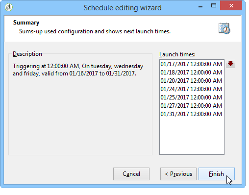
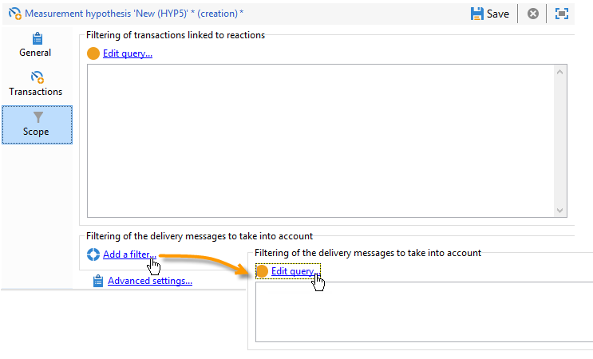
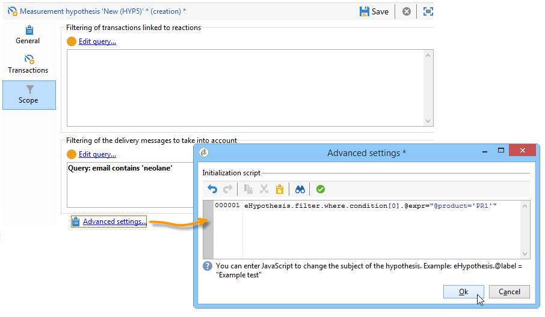
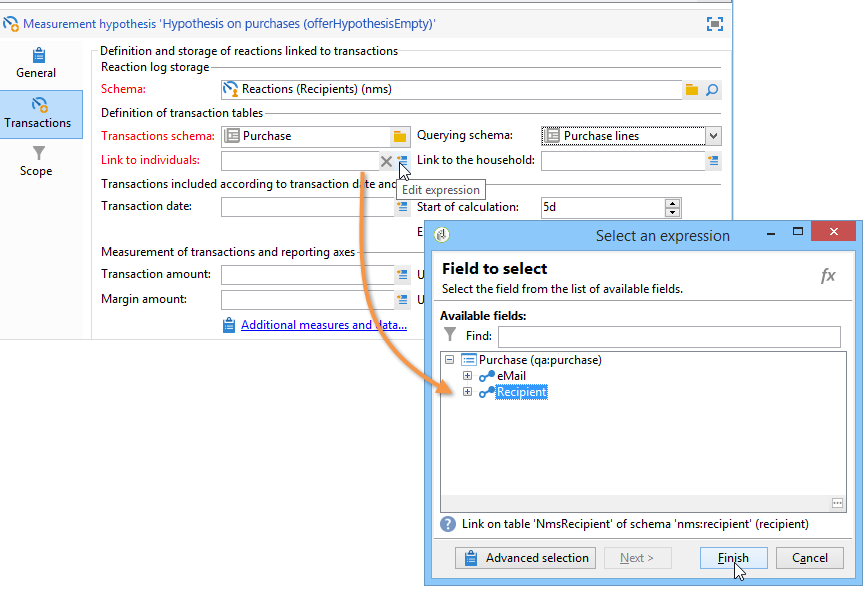

# 假設範本{#hypothesis-templates}

## 建立假設模型 {#creating-a-hypothesis-model}

通過配置假設模板，您可以定義用於測量反應的上下文，無論是用於交付還是用於提供。 這是引用各種測量表的地方，包括用於定義個體、假設和事務表之間關係的表。

要建立假設模板，請應用以下步驟：

1. 在Adobe Campaign探險家中，按一下 **[!UICONTROL Resources>Templates>Hypothesis templates]**。

   

1. 按一下 **[!UICONTROL New]** 或在模板清單中按一下右鍵，然後選擇 **[!UICONTROL New]** 的下界。
1. 輸入假設標籤。
1. 指定模板是否以通過 **[!UICONTROL Hypothesis type]**。
1. 對於 **[!UICONTROL Delivery]** 鍵入templates，指定應使用或不使用控制組執行測量。 [了解更多](#properties-of-a-hypothesis-template)
1. 對於 **[!UICONTROL Delivery]** 類型模板，您可以選擇特定的通道，或決定使用該模板將該模板應用於Adobe Campaign的所有可用通道 **[!UICONTROL Channel]** 的子菜單。 [了解更多](#properties-of-a-hypothesis-template)
1. 選擇 **[!UICONTROL Execution folder]** 要建立並自動執行將從此模板建立的假設。
1. 選擇執行設定。 [了解更多](#hypothesis-template-execution-settings)
1. 指定假設計算週期。 [了解更多](#hypothesis-template-execution-settings)

   >[!CAUTION]
   >
   >此期間由聯繫日期確定。

1. 在 **[!UICONTROL Transactions]** 頁籤，指定假設計算所需的表和欄位。 [了解更多](#transactions)
1. 如果您的模板已配置為 **[!UICONTROL Offer]** 類型假設，你可以 **[!UICONTROL Update offer proposition status]** 選項：在這種情況下，選擇要更改的優惠建議的狀態。
1. 指定假設應用的範圍。 [了解更多](#hypothesis-perimeter)
1. 如有必要，請使用指令碼完成篩選。 [了解更多](#hypothesis-perimeter)

### 假設模板的屬性 {#properties-of-a-hypothesis-template}

模板 **[!UICONTROL General]** 頁籤中。 可用欄位包括：

* **[!UICONTROL Hypothesis type]**:允許您確定模板是否應用於有關交貨或優惠的假設。

   您還可以選擇建立一個假設，該假設將同時適用於交貨和優惠。

   >[!NOTE]
   >
   >如果模板適用於聘用， **[!UICONTROL Update offer proposition status]** 的 **[!UICONTROL Transactions]** 頁籤。

* **[!UICONTROL Measurement with control group]**:用於說明是否已為交付或市場活動定義了控制組並將其納入度量指標。 控制組（它不接收交貨）允許您通過將市場活動與確實接收交貨的目標人口進行比較來衡量市場活動在交貨後的影響。

   >[!NOTE]
   >
   >如果將模板配置為考慮控制組，但在假設所涉及的傳遞中未定義組，則結果將僅基於目標接收者。

   有關定義和配置控制組的詳細資訊，請參閱 [此部分](../../campaign/using/marketing-campaign-deliveries.md#defining-a-control-group)。

* **[!UICONTROL Channel]**:通過選擇特定頻道或使假設模板可用於Adobe Campaign控制台中的所有頻道 **[!UICONTROL All channels]** 的下界。 如果為特定渠道配置模板，則在建立假設時，可以自動過濾每個渠道的交貨。 [了解更多](creating-hypotheses.md)

   

* **[!UICONTROL Execution folder]**:用於指定假設的執行資料夾。
* **[!UICONTROL Taken into account in campaign ROI calculation]**:在相關市場活動的ROI計算中考慮假設結果。

### 假設模板執行設定 {#hypothesis-template-execution-settings}

模板 **[!UICONTROL General]** 頁籤中，您可以指定假設執行參數。 可用選項如下：

* **[!UICONTROL Schedule execution for a time of low activity]**:讓你安排假設發佈，以優化Adobe Campaign的效能。 選中此選項後，市場活動的處理工作流會在停機期間執行假設計算。

   

* **[!UICONTROL Priority]**:在假設上應用層，在假設有同時執行時，將假設計算順序排除。

   

* **[!UICONTROL Automatic execution]**:如有必要，您可以計畫假設重新計算（例如，如果要定期更新指標，直至交貨結束）。

   

   要指定計畫，請應用以下流程：

   1. 按一下 **[!UICONTROL Frequency of execution...]** 連結，然後 **[!UICONTROL Change...]** 按鈕

      

   1. 配置頻率、相關事件和有效期。

      

   1. 按一下 **[!UICONTROL Finish]** 來修改標籤元素的屬性。

      

* **[!UICONTROL Log SQL queries in journal]**:此函式保留給專家用戶。 它允許您向測量假設審計添加一個頁籤以顯示SQL查詢。 這樣，在模擬完成時就能夠檢測可能的故障。
* **[!UICONTROL Keep execution workflow]**:允許您保留在假設計算開始時自動生成的工作流。 在從選中此選項的模板建立的假設中，生成的工作流可以跟隨該進程。

   >[!CAUTION]
   >
   >只有在運行假設時出錯時，才能為調試目的激活此選項。\
   >此外，不能修改自動生成的工作流。 任何最終的修改都不會在其他地方考慮，以供以後計算。\
   >如果已選中此選項，請在工作流執行後將其刪除。

### 交易記錄 {#transactions}

此頁籤包含各個欄位和表，這些欄位和表允許您保存事務處理中收件人反應的歷史記錄。 請參閱此 [節](../../configuration/using/about-schema-reference.md) 的子菜單。

* **[!UICONTROL Schema (reaction log storage)]**:選擇收件人反應表。 Adobe Campaign的現成桌 **NmsRemaMatchRcp**。
* **[!UICONTROL Transaction schema]**:選擇假設將涉及的表，即事務或採購表。
* **[!UICONTROL Querying schema]**:選擇過濾假設的標準。
* **[!UICONTROL Link to individuals]**:選擇個人與用作事務架構的表之間的連結。
* **[!UICONTROL Link to the household]**:如果希望將某個家庭的所有成員包括在假設中，請在交易模式中選擇指向該家庭的連結。 此欄位為可選欄位。
* **[!UICONTROL Transaction date]**:此欄位是可選欄位，但建議使用，因為它允許您定義假設計算的範圍。
* **[!UICONTROL Measurement period]**:允許您配置執行假設和恢復採購行的起始日期和終止日期。

   當假設連結到遞送時，在直接郵件遞送的聯繫日期之後幾天或電子郵件或簡訊遞送的遞送日期之後自動觸發測量。

   

   如果假設是在飛行中發起的，那麼如果想立即觸發假設，就可能被迫。 否則，基於基於假設建立日期的配置計算結束日期自動觸發該假設。 [了解更多](creating-hypotheses.md#creating-a-hypothesis-on-the-fly-on-a-delivery)).

* **[!UICONTROL Transaction/Margin amount]**:這些欄位是可選欄位，使您能夠自動計算週轉指標。 [了解更多](hypothesis-tracking.md#indicators)
* **[!UICONTROL Unit amount]**:允許您設定用於計算收入的金額。 [了解更多](hypothesis-tracking.md#indicators)

   

* **[!UICONTROL Additional measures and data]**:用於指定其它報表度量或不同表中欄位中的軸。
* **[!UICONTROL Update offer proposition status]**:允許您更改如果某個聘用接收人被該假設識別，則聘用建議的狀態。

   

### 假設周界 {#hypothesis-perimeter}

一旦定義了事務表和假設將涉及的欄位，您就可以通過使用篩選器指定目標事務處理和交貨來細化假設的範圍。 還可以使用JavaScript指令碼顯式指向事務表中引用的產品。

* **篩選事務**:的 **[!UICONTROL Scope]** 頁籤。 操作步驟：

   1. 按一下&#x200B;**[!UICONTROL Edit query]**&#x200B;連結。

      

   1. 指定篩選條件。

      

   1. 選擇假設將涉及的事務。

      

* **篩選收件人**:的 **[!UICONTROL Scope]** 頁籤，您可以將假設限制為與郵件連結的任何資訊（傳遞、收件人、電子郵件地址、服務等）:

   1. 按一下 **[!UICONTROL Add a filter]** 連結，然後 **[!UICONTROL Edit query]**。

      

   1. 指定篩選條件。

      

   1. 按一下 **[!UICONTROL Finish]** 的子菜單。

      

* **指令碼**:可以使用JavaScript指令碼在執行假設設定時動態重載假設設定。

   要執行此操作，請按一下 **[!UICONTROL Advanced settings]** 連結，然後輸入所需的指令碼。

   >[!NOTE]
   >
   >此選項適用於專家用戶。

   

## 示例：在交貨上建立假設模板 {#example--creating-a-hypothesis-template-on-a-delivery}

在此示例中，我們將建立直接郵件類型傳遞的假設模板。 事務表(**採購** 本例中)的假設將基於包含與物品或產品連結的購買線。 我們希望將模型配置成在購買表中對物品或產品做出假設。

1. 在Adobe Campaign探險家中， **[!UICONTROL Resources > Templates > Hypothesis templates]** 的下界。
1. 按一下 **[!UICONTROL New]** 的子菜單。

   

1. 更改模板標籤。

   

1. 選擇 **[!UICONTROL Deliveries]** 假設類型。
1. 通過選中相關框指定交貨可以包含控制組。
1. 選擇 **[!UICONTROL Direct mail]** 頻道。

   >[!NOTE]
   >
   >由於該模板專用於直郵遞送，因此使用此模型建立的假設可能不會連結到任何其他遞送類型。

1. 在 **[!UICONTROL Transactions]** 頁籤。

   

1. 在 **[!UICONTROL Transactions schema]** 的子菜單。

   

1. 在 **[!UICONTROL Querying schema]** 的子菜單。

   

1. 選擇連結到採購表的收件人。

   

1. 選擇連結到採購日期的欄位。

   這允許您定義假設的時間框架。 此階段不是強制的，但建議使用。

   

1. 配置計算期5至25天。

   

1. 在 **[!UICONTROL Scope]** 按鈕 **[!UICONTROL Edit query]** 來過濾假設。

   

   因此建立的模板使您能夠對採購表中的產品或物品運行假設。

1. 按一下 **[!UICONTROL Save]** 記錄模板。
