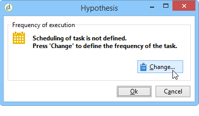
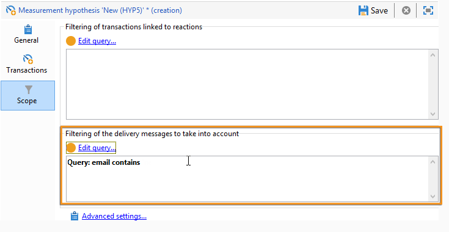
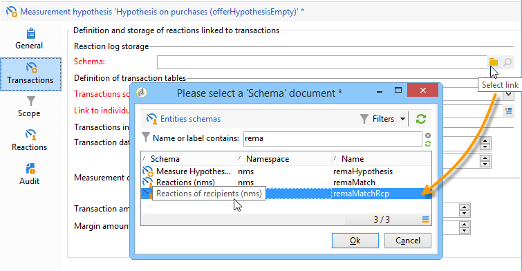

# 假設範本{#hypothesis-templates}

## 建立假設模型 {#creating-a-hypothesis-model}

設定假設範本可讓您定義測量回應的內容，無論是傳送還是選件。 這是參照各種測量表格的位置，包括用於定義個人、假設和交易表之間關係的測量表。

若要建立假設範本，請套用下列步驟：

1. 在Adobe Campaign Explorer中，按一下 **[!UICONTROL Resources>Templates>Hypothesis templates]**.

   

1. 按一下 **[!UICONTROL New]** 或在範本清單中按一下滑鼠右鍵，然後選擇 **[!UICONTROL New]** 下拉式清單中的。
1. 輸入假設標籤。
1. 指定範本是預期用於優惠或傳遞的假設，透過 **[!UICONTROL Hypothesis type]**.
1. 對象 **[!UICONTROL Delivery]** 型別範本，指定是否應在控制組的情況下進行測量。 [了解更多](#properties-of-a-hypothesis-template)
1. 對象 **[!UICONTROL Delivery]** 輸入範本，您可以選擇特定管道，或決定使用將範本套用至Adobe Campaign中的所有可用管道。 **[!UICONTROL Channel]** 下拉式清單。 [了解更多](#properties-of-a-hypothesis-template)
1. 選取 **[!UICONTROL Execution folder]** 您要在其中建立並自動執行從此範本建立的假設。
1. 選擇執行設定。 [了解更多](#hypothesis-template-execution-settings)
1. 指定假設計算期間。 [了解更多](#hypothesis-template-execution-settings)

   >[!CAUTION]
   >
   >此期間由聯絡日期決定。

1. 在 **[!UICONTROL Transactions]** 標籤，指定假設計算所需的表格和欄位。 [了解更多](#transactions)
1. 如果您的範本設定為 **[!UICONTROL Offer]** 輸入假設，您可以啟用 **[!UICONTROL Update offer proposition status]** 選項：在此情況下，請選取您要變更之優惠方案主張的狀態。
1. 指定假設應用程式的範圍。 [了解更多](#hypothesis-perimeter)
1. 如有必要，請使用指令碼完成篩選。 [了解更多](#hypothesis-perimeter)

### 假設範本的屬性 {#properties-of-a-hypothesis-template}

範本的 **[!UICONTROL General]** 索引標籤可讓您指定一般範本選項。 可用的欄位包括：

* **[!UICONTROL Hypothesis type]**：可讓您決定範本的目的地應為傳遞或優惠方案上的假設。

   您也可以選擇建立將同時套用至傳遞和優惠方案的假設。

   >[!NOTE]
   >
   >如果範本套用至優惠方案， **[!UICONTROL Update offer proposition status]** 選項位於 **[!UICONTROL Transactions]** 標籤。

* **[!UICONTROL Measurement with control group]**：可讓您指出是否已為傳送或行銷活動定義控制組，並將其納入測量指標中。 控制組不會接收傳遞，可讓您透過比較行銷活動與收到傳遞的目標母體，來測量傳遞後行銷活動的影響。

   >[!NOTE]
   >
   >如果範本設定為將控制組列入考量，但在假設關注的傳遞中未定義任何組，則結果將僅以目標收件者為基礎。

   有關定義和設定控制組的詳細資訊，請參閱 [本節](../../campaign/using/marketing-campaign-deliveries.md#defining-a-control-group).

* **[!UICONTROL Channel]**：您可以選取特定管道，或選取「 」，讓假設範本可用於Adobe Campaign主控台中的所有管道 **[!UICONTROL All channels]** 下拉式清單中的。 如果您為特定管道設定範本，這可讓您在建立假設時自動篩選每個管道的傳送。 [了解更多](creating-hypotheses.md)

   

* **[!UICONTROL Execution folder]**：可讓您指定假設的執行資料夾。
* **[!UICONTROL Taken into account in campaign ROI calculation]**：在計算相關促銷活動的ROI時，會將假設結果列入考量。

### 假設範本執行設定 {#hypothesis-template-execution-settings}

範本的 **[!UICONTROL General]** 索引標籤也可讓您指定假設執行引數。 可用的選項如下：

* **[!UICONTROL Schedule execution for a time of low activity]**：可讓您排程假設啟動，以最佳化Adobe Campaign效能。 核取此選項時，行銷活動的處理工作流程會在停機期間執行假設計算。

   

* **[!UICONTROL Priority]**：套用至假設的層級，以區分同時執行時的假設計算順序。

   

* **[!UICONTROL Automatic execution]**：如有必要，可讓您排程假設重新計算（例如，如果您想要定期更新指標直到傳送結束）。

   

   若要指定排程，請套用下列程式：

   1. 按一下 **[!UICONTROL Frequency of execution...]** 連結，然後 **[!UICONTROL Change...]** 按鈕。

      

   1. 設定頻率、相關事件和有效期。

      

   1. 按一下 **[!UICONTROL Finish]** 以儲存排程。

      

* **[!UICONTROL Log SQL queries in journal]**：此函式為專家使用者保留。 它可讓您在測量假設稽核中新增索引標籤，以顯示SQL查詢。 如此可讓您在模擬完成時發生錯誤時偵測可能發生的故障。
* **[!UICONTROL Keep execution workflow]**：可讓您保留在假設計算開始時自動產生的工作流程。 在從已核取此選項的範本建立的假設中，產生的工作流程可用於遵循該流程。

   >[!CAUTION]
   >
   >如果執行假設時發生錯誤，此選項必須僅出於偵錯目的啟動。\
   >此外，不得修改自動產生的工作流程。 任何最終修改都不會在其他地方被納入考量，以供日後計算。\
   >如果您已核取此選項，請在執行工作流程後將其刪除。

### 交易數 {#transactions}

此索引標籤包含各種欄位和表格，可讓您儲存收件者回應交易的相關歷史記錄。 請參閱此 [區段](../../configuration/using/about-schema-reference.md) 以取得回應管理專用表格的詳細資訊。

* **[!UICONTROL Schema (reaction log storage)]**：選取收件者反應表格。 Adobe Campaign中現成的表格為 **NmsRemaMatchRcp**.
* **[!UICONTROL Transaction schema]**：選擇假設將關注的表格，即交易或購買表格。
* **[!UICONTROL Querying schema]**：選擇篩選假設的條件。
* **[!UICONTROL Link to individuals]**：選擇個人與交易綱要所用表格之間的連結。
* **[!UICONTROL Link to the household]**：如果您想要在假設中納入某個家庭的所有成員，請選取交易結構描述中該家庭的連結。 此欄位為選用。
* **[!UICONTROL Transaction date]**：此欄位是選用欄位，但建議使用，因為它可讓您定義假設計算的範圍。
* **[!UICONTROL Measurement period]**：可讓您設定執行假設和復原購買明細行的開始和結束日期。

   當假設連結至傳遞時，測量會在直接郵件傳遞的聯絡日期後幾天，或電子郵件或簡訊傳遞的傳遞日期後自動觸發。

   

   如果立即啟動假設，而想要立即觸發它，則可強制執行。 否則，會根據設定的計算結束日期（以假設建立日期為基礎）自動觸發。 [了解更多](creating-hypotheses.md#creating-a-hypothesis-on-the-fly-on-a-delivery)).

* **[!UICONTROL Transaction/Margin amount]**：這些欄位是選用欄位，可讓您自動計算人員調整指標。 [了解更多](hypothesis-tracking.md#indicators)
* **[!UICONTROL Unit amount]**：可讓您設定計算收入的金額。 [了解更多](hypothesis-tracking.md#indicators)

   

* **[!UICONTROL Additional measures and data]**：可讓您指定其他報表測量或不同表格中欄位的座標軸。
* **[!UICONTROL Update offer proposition status]**：可讓您在假設識別優惠方案收件者時，變更優惠方案主張的狀態。

   

### 假設周長 {#hypothesis-perimeter}

定義交易表格和假設將關注的欄位後，您可以使用篩選器指定目標交易和傳送，以縮小假設的範圍。 您也可以使用JavaScript指令碼，明確指向交易表格中參照的產品。

* **篩選交易**：在 **[!UICONTROL Scope]** 索引標籤上，您可以設定假設的篩選器。 操作步驟：

   1. 按一下&#x200B;**[!UICONTROL Edit query]**&#x200B;連結。

      

   1. 指定篩選條件。

      

   1. 選取假設將涉及的交易。

      

* **依收件者篩選**：在 **[!UICONTROL Scope]** 標籤中，您可以將假設限製為連結至訊息的任何資訊（傳遞、收件者、電子郵件地址、服務等）：

   1. 按一下 **[!UICONTROL Add a filter]** 連結，然後 **[!UICONTROL Edit query]**.

      

   1. 指定篩選條件。

      

   1. 按一下 **[!UICONTROL Finish]** 以儲存查詢。

      

* **指令碼**：您可以使用JavaScript指令碼，在執行期間動態地讓假設設定過載。

   若要這麼做，請按一下 **[!UICONTROL Advanced settings]** 連結，然後輸入所需的指令碼。

   >[!NOTE]
   >
   >此選項適用於專家使用者。

   

## 範例：在傳遞上建立假設範本 {#example--creating-a-hypothesis-template-on-a-delivery}

在此範例中，我們將針對直接郵件型別傳遞建立假設範本。 交易表(**購買** 在我們的範例中)，這些假設將依據包含連結至文章或產品的購買行。 我們想要設定模型，以建立購買表格中文章或產品的假設。

1. 在Adobe Campaign Explorer中，前往 **[!UICONTROL Resources > Templates > Hypothesis templates]** 節點。
1. 按一下 **[!UICONTROL New]** 以建立範本。

   

1. 變更範本標籤。

   

1. 選取 **[!UICONTROL Deliveries]** 作為假設型別。
1. 核取相關方塊，指定傳遞可以包含控制組。
1. 選擇 **[!UICONTROL Direct mail]** 頻道。

   >[!NOTE]
   >
   >由於範本是直接郵件傳遞所專屬，因此使用此模型建立的假設可能不會連結至任何其他傳遞型別。

1. 在 **[!UICONTROL Transactions]** 索引標籤中，選取收件者回應表格。

   

1. 在 **[!UICONTROL Transactions schema]** 欄位，選擇您的購買表格。

   

1. 選取採購明細行 **[!UICONTROL Querying schema]** 欄位。

   

1. 選擇連結至購買表格的收件者。

   

1. 選取連結至購買日期的欄位。

   這可讓您定義假設的時間範圍。 此階段並非必要階段，但建議使用。

   

1. 設定計算期間5至25天。

   

1. 在 **[!UICONTROL Scope]** 標籤，按一下 **[!UICONTROL Edit query]** 在假設上建立篩選。

   

   因此建立的範本可讓您對購買表格中的產品或文章執行假設。

1. 按一下 **[!UICONTROL Save]** 以記錄您的範本。
