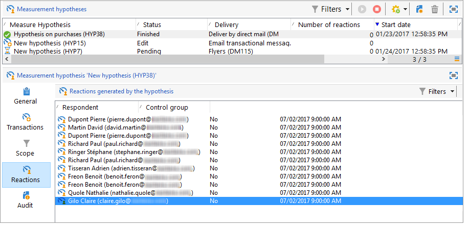

# 假設追蹤{#hypothesis-tracking}

假設計算的結果可在Adobe Campaign平台的各個層級取得：透過實際假設以及透過行銷活動和傳遞提供的假設報告中，可以看到由假設計算出的指標和目標母體反應。

## 假設結果 {#hypothesis-results}

### 指標 {#indicators}

計算假設後，會自動更新數個測量指標。 這些可在假設的&#x200B;**[!UICONTROL General]**&#x200B;標籤中使用。

這些指標包括：

* **回應聯絡人數目**：符合假設的聯絡個人數目。
* **連絡人回應率**：傳送期間連絡的回應連絡人數目/連絡人總數。
* **回應控制組聯絡人數目**：符合假設的控制組數目。
* **控制組的回應率**：回應控制組數目/傳遞控制組總數。
* **回應數**：資料表中包含個人、假設和交易資料表之間關係的記錄數。

如需完整的指標清單，請按一下&#x200B;**[!UICONTROL Display the list]**&#x200B;連結：

下列資訊由指標提供：

* **已聯絡母體的總收入**：總金額超過已聯絡的個人數量。
* **控制組的總收入**：總金額超過控制組的數目。
* **每個連絡人的平均收入**：總金額/連絡人。
* **控制組的平均收入**：總金額/控制組。
* **每個連絡人的總利潤**：總利潤超過連絡人。
* **控制組的總利潤**：控制組的總利潤。
* **每個連絡人的平均利潤**：總利潤/連絡人。
* **控制組的平均利潤**：總利潤/控制組。
* **額外收入**： （聯絡的平均收入 — 控制組的平均收入）&#42;聯絡的人數
* **額外利潤**： （連絡的平均利潤 — 控制組的平均利潤） /連絡數目
* **每個連絡人的平均成本**：計算的傳遞成本/連絡人數目。
* **ROI**：計算的傳遞成本/每個聯絡人的總利潤
* **有效ROI**：計算的傳遞成本/額外的利潤。
* **顯著性**：包含值0到3，視行銷活動顯著性而定。

### 回應 {#reactions}

您可以透過&#x200B;**[!UICONTROL Reactions]**&#x200B;索引標籤檢視收件者對假設的回應。

1. 假設計算完成後，前往Adobe Campaign樹狀結構的&#x200B;**[!UICONTROL Campaign management > Measurement hypotheses]**&#x200B;節點。
1. 選取所需的假設，然後按一下&#x200B;**[!UICONTROL Reactions]**&#x200B;索引標籤，以檢視行銷活動後可能購買的收件者清單。

   

## 報告 {#reports}

**[!UICONTROL Hypothesis report]**&#x200B;可讓您檢視對行銷活動和傳遞執行的假設的結果。 此報表包含假設所計算的指標（如需詳細資訊，請參閱[指標](#indicators)）。

* **在行銷活動層級**：按一下相關行銷活動的&#x200B;**[!UICONTROL Reports]**&#x200B;連結，然後選取&#x200B;**[!UICONTROL Hypothesis report]**。 此報表包含行銷活動傳遞清單，以及針對每個傳遞計算的假設。

  

* **在傳遞層級**：若要存取報告，請開啟相關的傳遞，按一下&#x200B;**[!UICONTROL Summary]**&#x200B;索引標籤中的&#x200B;**[!UICONTROL Reports]**&#x200B;並選取&#x200B;**[!UICONTROL Hypothesis report]**。 如果針對相同傳遞計算數個假設，報表將包含所有假設。

  
