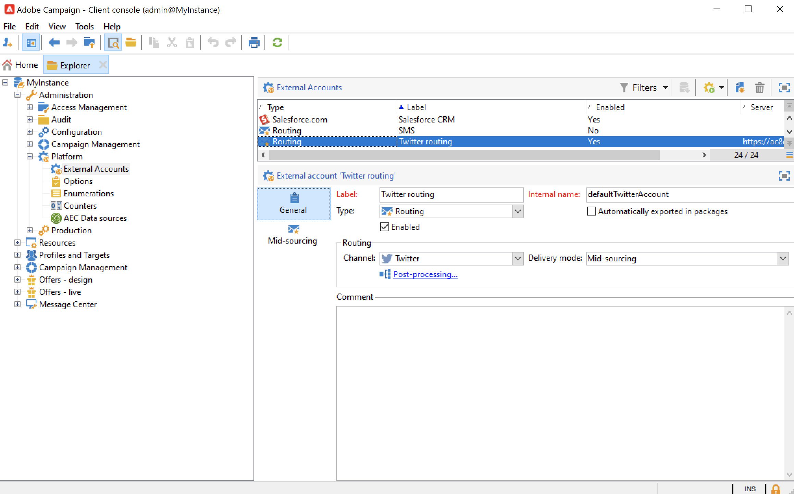

# 關於社交行銷{#about-social-marketing}

專為管理社交網路所設計的&#x200B;**管理社交網路** （社交行銷）應用程式可讓您透過X （先前稱為Twitter）與客戶和潛在客戶互動。

瞭解在[Campaign v8檔案](https://experienceleague.adobe.com/docs/campaign/campaign-v8/connect/ac-tw.html?lang=zh-Hant){target="_blank"}中整合Campaign和X的關鍵步驟。

作為內部部署或混合客戶，您的X外部帳戶必須設定並啟用。 對於混合組態，**中間來源**&#x200B;索引標籤也必須設定為與中間來源平台的有效連線。

