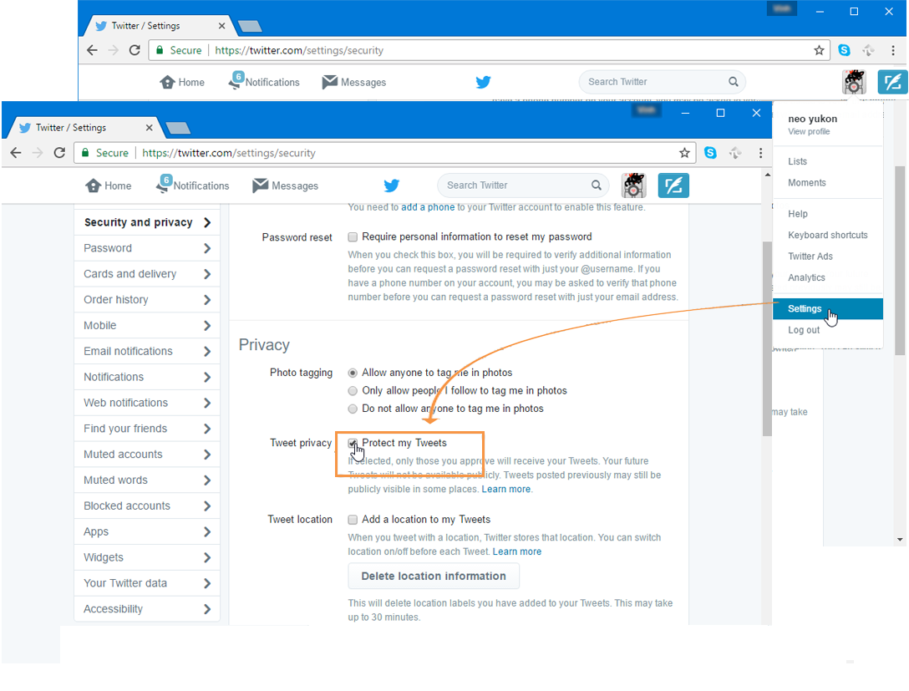
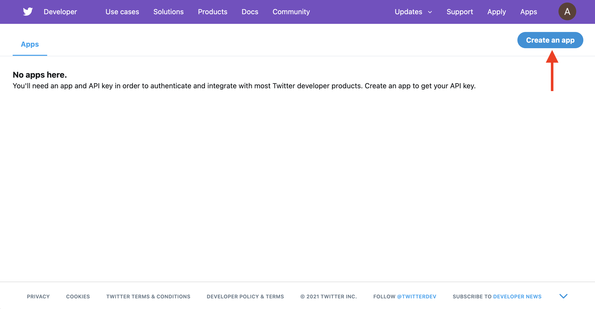
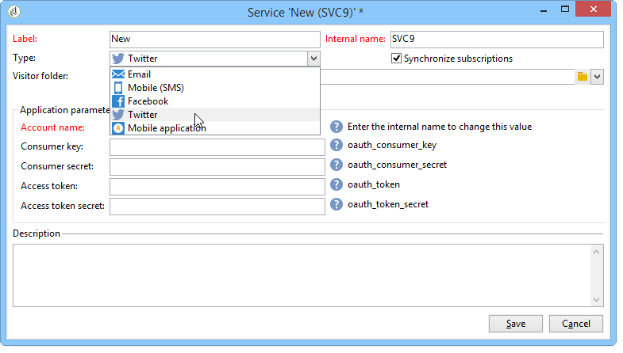
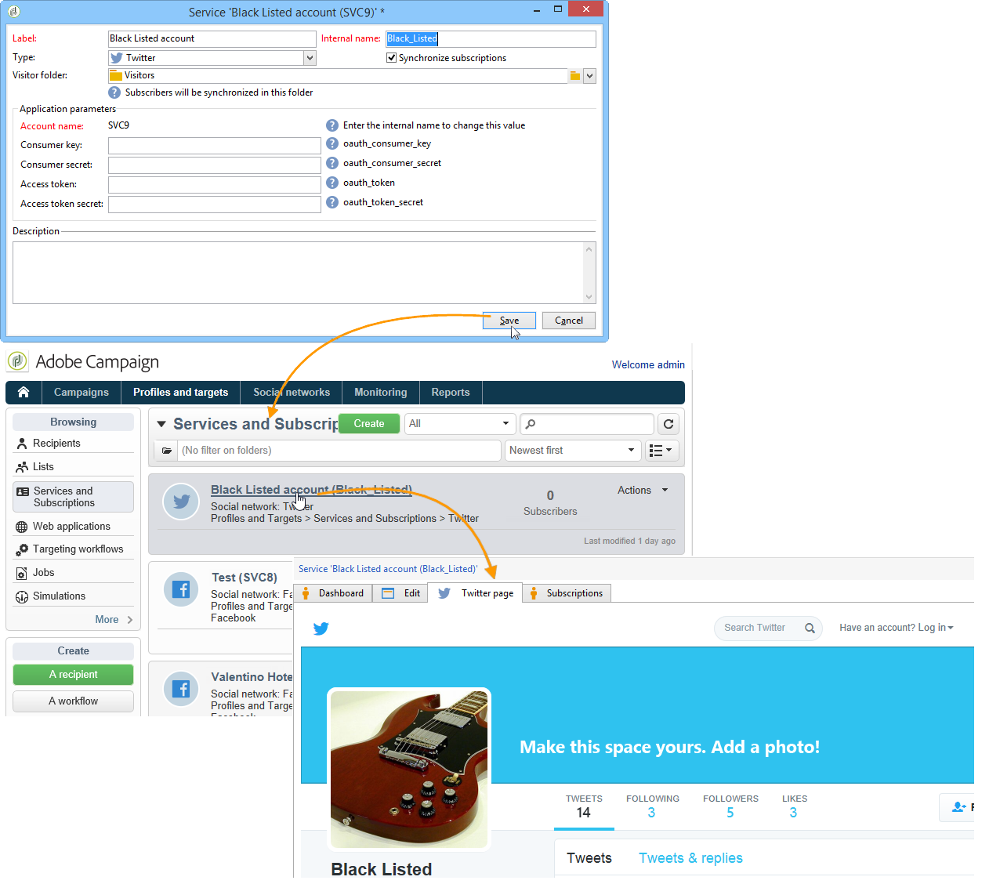
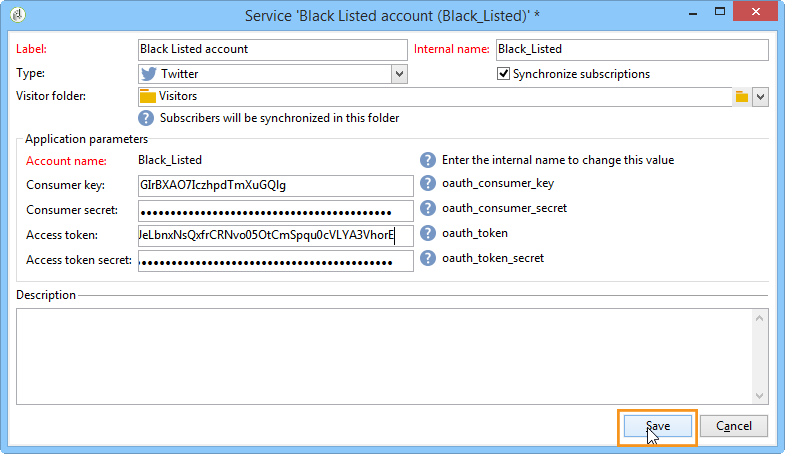

# 在 Twitter 上設定發佈{#configuring-publishing-on-twitter}

為了讓Adobe Campaign能夠傳送推文至您的Twitter帳戶，您需要為這些帳戶委派對Adobe Campaign的寫入存取權。 要執行此操作，請套用下列設定步驟：

* 建立Twitter帳戶。
* 建立用於傳送校樣的測試Twitter帳戶。
* 為每個Twitter帳戶建立一個Twitter應用程式。
* 對於每個Twitter應用程式，建立新的&#x200B;**[!UICONTROL Twitter]**&#x200B;類型服務。

## 先決條件 {#prerequisites}

首先，建立一或多個Twitter帳戶，將您的推文傳送至。

若要建立Twitter帳戶，請前往[https://twitter.com](https://twitter.com)。

## 在Twitter {#creating-a-test-account-on-twitter}上建立測試帳戶

我們也建議建立私人Twitter帳戶，以用於傳送推文校樣（如需詳細資訊，請參閱[傳送校樣](../../social/using/publishing-on-twitter.md#sending-the-proof)）:

* 建立新的Twitter帳戶。
* 按一下右上角的功能表，然後選取&#x200B;**[!UICONTROL Settings]**。
* 選擇&#x200B;**[!UICONTROL Security and privacy]**&#x200B;頁簽，並選中&#x200B;**[!UICONTROL Protect my Tweets]**&#x200B;框。
* 按一下頁面底部的&#x200B;**[!UICONTROL Save Changes]**&#x200B;按鈕。

## 在Twitter上建立應用程式{#creating-an-application-on-twitter}

為了讓Adobe Campaign能夠將推文傳送至您的Twitter帳戶，您需要為每個Twitter帳戶建立一個Twitter應用程式。 若要這麼做，請套用下列步驟：

1. 登入您的Twitter帳戶。
1. 在網際網路瀏覽器中輸入以下地址：[https://apps.twitter.com/](https://apps.twitter.com/)。
1. 然後按一下右側的&#x200B;**[!UICONTROL Create New App]**&#x200B;按鈕。

   

1. 讓精靈引導您完成此程式。

   若要讓此應用程式允許Adobe Campaign將推文傳送至您的帳戶，請前往應用程式的&#x200B;**[!UICONTROL Permissions]**&#x200B;標籤，並為&#x200B;**[!UICONTROL Access]**&#x200B;區段選取&#x200B;**[!UICONTROL Read and Write]**。 在&#x200B;**[!UICONTROL Settings]**&#x200B;索引標籤中，您也需要將&#x200B;**[!UICONTROL Callback URL]**&#x200B;欄位保留為空白。

   

## 委派對Adobe Campaign的寫入存取{#delegating-write-access-to-adobe-campaign}

對於每個Twitter應用程式，您需要建立不同的&#x200B;**[!UICONTROL Twitter]**&#x200B;類型服務，其中將包含應用程式設定。

此步驟需要同時存取您的Adobe Campaign主控台和登入您Twitter帳戶的網際網路瀏覽器：

* **Twitter**:選取先前建立的應用程式([https://dev.twitter.com/apps](https://dev.twitter.com/apps))，然後按一下索 **[!UICONTROL Keys and Access Tokens]** 引標籤。

   

* **Adobe Campaign**:前往標籤， **[!UICONTROL Profiles and targets]** 按一下連結 **[!UICONTROL Services and Subscriptions]** ，然後按一下 **[!UICONTROL Create]** 按鈕。

   

1. 選擇&#x200B;**[!UICONTROL Twitter]**&#x200B;類型。

   

   >[!NOTE]
   >
   >預設會啟用&#x200B;**[!UICONTROL Synchronize subscriptions]**&#x200B;選項。 核取方塊後，Twitter帳戶同步工作流程(請參閱[同步Twitter帳戶](#synchronizing-twitter-accounts))會復原Twitter追隨者清單，以便您可以傳送其直接訊息（請參閱[傳送直接訊息給訂閱者](../../social/using/publishing-on-twitter.md#sending-direct-messages-to-subscribers)）。 如果您不想恢復跟隨者清單，請取消選中此框。

1. 輸入服務的標籤和內部名稱。

   

   >[!IMPORTANT]
   >
   >服務的&#x200B;**[!UICONTROL Internal name]**&#x200B;必須與Twitter帳戶的名稱相同。 若要確定沒有登入錯誤，請套用下列步驟。

   * 按一下 **[!UICONTROL Save]** 按鈕。
   * 在服務概觀中，按一下您剛建立的Twitter類型服務。
   * 選取 **[!UICONTROL Twitter page]** 索引標籤。應顯示Twitter帳戶。

      

1. 在&#x200B;**[!UICONTROL Visitor folder]**&#x200B;欄位中，選取將建立追隨者的訪客資料夾。 有關詳細資訊，請參閱[操作原則](../../social/using/publishing-on-twitter.md#operating-principle)。 預設情況下，追隨者將建立在&#x200B;**[!UICONTROL Visitors]**&#x200B;資料夾的根目錄。

   

1. 在Twitter上，複製&#x200B;**[!UICONTROL Consumer Key (API Key)]**&#x200B;和&#x200B;**[!UICONTROL Consumer Secret (API Secret)]**&#x200B;欄位的內容，並貼到主控台的&#x200B;**[!UICONTROL Consumer key]**&#x200B;和&#x200B;**[!UICONTROL Consumer secret]**&#x200B;欄位中。

   

1. 在Twitter上，複製&#x200B;**[!UICONTROL Access Token]**&#x200B;和&#x200B;**[!UICONTROL Access Token Secret]**&#x200B;欄位的內容，並貼到主控台的&#x200B;**[!UICONTROL Access token]**&#x200B;和&#x200B;**[!UICONTROL Access token secret]**&#x200B;欄位中。

   

1. 在Adobe Campaign主控台中，按一下&#x200B;**[!UICONTROL Save]**。 Adobe Campaign的寫入存取權限委派現已完成。

   

>[!NOTE]
>
>您必須為每個Twitter應用程式建立一個&#x200B;**[!UICONTROL Twitter]**&#x200B;類型服務。

**[!UICONTROL Twitter account Synchronization]**&#x200B;工作流程會同步Adobe Campaign中的Twitter帳戶。 有關詳細資訊，請參閱[同步Facebook頁面](../../social/using/publishing-on-facebook-walls.md#synchronizing-facebook-pages)。

## 同步Twitter帳戶{#synchronizing-twitter-accounts}

>[!IMPORTANT]
>
>為了讓工作流程復原Twitter訂閱者清單，必須在連結至帳戶之服務的編輯區段中勾選&#x200B;**[!UICONTROL Twitter account synchronization]**&#x200B;方塊。 有關詳細資訊，請參閱[委派對Adobe Campaign](#delegating-write-access-to-adobe-campaign)的寫入存取權。

透過&#x200B;**[!UICONTROL Administration > Production > Technical workflows > Managing social networks]**&#x200B;節點存取的&#x200B;**[!UICONTROL Twitter account synchronization]**&#x200B;工作流程可讓您同步先前以Adobe Campaign設定的Twitter帳戶。 依預設，此工作流程會在每星期四早上7:30觸發。

>[!NOTE]
>
>您可以隨時執行預期的任務處理，以啟動工作流程。 您也可以編輯排程器以變更工作流程觸發頻率。 有關調度程式的詳細資訊，請參閱[此部分](../../workflow/using/scheduler.md)。

您現在可以傳送推文至您的Twitter帳戶，並將訊息導向至您的追隨者。 有關詳細資訊，請參閱：[在Twitter上發佈](../../social/using/publishing-on-twitter.md)。
