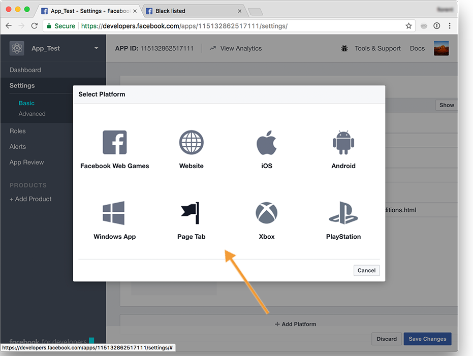

# 建立 Facebook 應用程式{#creating-a-facebook-application}

有了網路應用程式， Social Marketing可讓您在Facebook應用程式中顯示個人化內容，讓透過此社交網路取得潛在客戶變得更輕鬆。 如需Facebook類型Web應用程式的詳細範例，請參閱[Facebook應用程式範例](../../social/using/examples-of-facebook-apps.md)。

>[!NOTE]
>
>您也可以將Adobe Campaign與合作夥伴開發的Facebook應用程式整合。 在此情況下，不需要使用Adobe Campaign Web應用程式來取得Facebook設定檔。 有關詳細資訊，請參閱[設定外部帳戶](#configuring-external-accounts)。

套用下列設定步驟：

1. 建立一或多個Facebook應用程式。 有關詳細資訊，請參閱：[建立Facebook應用程式](../../social/using/publishing-on-facebook-walls.md#creating-a-facebook-application)。
1. 輸入要在Facebook權限請求畫面上顯示的&#x200B;**[!UICONTROL terms of service]**&#x200B;和&#x200B;**[!UICONTROL Privacy policy]**&#x200B;連結。 有關詳細資訊，請參閱：[輸入服務條款和隱私權政策連結](#entering-the-terms-of-service-and-privacy-policy-links)。
1. 對於每個Facebook應用程式，建立&#x200B;**[!UICONTROL Facebook Connect]**&#x200B;類型外部帳戶。 有關詳細資訊，請參閱：[配置外部帳戶](#configuring-external-accounts)。
1. 針對每個Facebook應用程式，在Adobe Campaign中建立Facebook類型的Web應用程式。 有關詳細資訊，請參閱：[建立Facebook類型web應用程式](#creating-a-facebook-type-web-application)。
1. 設定您的Facebook應用程式，使其在Facebook頁面上顯示為標籤。 有關詳細資訊，請參閱：[設定Facebook標籤](#configuring-facebook-tabs)。

## 設定外部帳戶 {#configuring-external-accounts}

對於每個Facebook應用程式，您需要建立&#x200B;**[!UICONTROL Facebook Connect]**&#x200B;類型外部帳戶。

此步驟需要同時存取您的Adobe Campaign主控台和登入Facebook帳戶（您用於頁面管理）的網際網路瀏覽器：

* **Facebook**:選取先前建立的應用程 [式(https://developers.facebook.com/apps](https://developers.facebook.com/apps))，然後選取「 >  **[!UICONTROL Settings]** 」索 **[!UICONTROL Basic]** 引標籤。

   

   >[!NOTE]
   >
   >如果未顯示&#x200B;**[!UICONTROL Facebook Web Games]**&#x200B;部分，請按一下位於頁面底部的&#x200B;**[!UICONTROL Add Platform]**&#x200B;按鈕，然後選擇&#x200B;**[!UICONTROL Facebook Web Games]**。

* **Adobe Campaign**:轉至樹 **[!UICONTROL Administration > Platform > External accounts]** 的節點，然後按一 **[!UICONTROL New]**&#x200B;下。

   

1. 輸入標籤和內部名稱，然後選擇&#x200B;**[!UICONTROL Facebook Connect]**&#x200B;類型。

   

1. 為應用程式選擇托管模式：**[!UICONTROL hosted by a partner]**&#x200B;或&#x200B;**[!UICONTROL hosted by this instance]**。

   

   **由合作夥伴托管的應用程式**

   您可將Adobe Campaign與合作夥伴開發的Facebook應用程式整合。 在此情況下，不需要使用Adobe Campaign Web應用程式來取得Facebook設定檔。 facebook使用者安裝應用程式時，會產生金鑰（存取權杖）。 合作夥伴會呼叫網站服務，將此存取權杖轉送至Adobe Campaign。 Adobe Campaign接著會使用此代號登入Facebook資料庫，並收集使用者透過應用程式共用的資料。

   >[!NOTE]
   >
   >此處提供的WSDL檔案中詳細說明了Web服務的參數：**`https://<Instance name>/nl/jsp/schemawsdl.jsp?schema=nms:visitor`**

   若要將協力廠商應用程式整合至Adobe Campaign，您需要複製&#x200B;**[!UICONTROL App ID]**&#x200B;和&#x200B;**[!UICONTROL App Secret]** Facebook欄位的內容，並貼到主控台的&#x200B;**[!UICONTROL Application ID]**&#x200B;和&#x200B;**[!UICONTROL Application secret]**&#x200B;欄位中。

   

   **由此實例托管的應用程式**

   如果您想要在此執行個體上托管應用程式（如果您沒有協力廠商應用程式），則需要使用Adobe Campaign Web應用程式來取得Facebook設定檔。 如需詳細資訊，請參閱[Facebook應用程式範例](../../social/using/examples-of-facebook-apps.md)。

   在Adobe Campaign主控台中，複製&#x200B;**[!UICONTROL Secure Canvas URL]**&#x200B;欄位中包含的位址，並貼到Facebook上的&#x200B;**[!UICONTROL Facebook Web games (https)]**&#x200B;欄位（位於&#x200B;**[!UICONTROL Facebook Web Games]**&#x200B;區段中）。

   

   >[!IMPORTANT]
   >
   >您在任何情況下都不得使用不安全的URL。

   在Facebook上，複製&#x200B;**[!UICONTROL App ID]**&#x200B;和&#x200B;**[!UICONTROL App Secret]**&#x200B;欄位的內容，並貼到主控台的&#x200B;**[!UICONTROL Application ID]**&#x200B;和&#x200B;**[!UICONTROL Application secret]**&#x200B;欄位中。

   

1. 在Facebook上，按一下頁面底部的&#x200B;**[!UICONTROL Save Changes]**&#x200B;按鈕。
1. 在Adobe Campaign主控台中，按一下&#x200B;**[!UICONTROL Subscribe]**&#x200B;按鈕，讓Adobe Campaign每次風扇透過此應用程式簽入時即時復原資料。 有關詳細資訊，請參閱：[Facebook應用程式範例](../../social/using/examples-of-facebook-apps.md)。

   

## 輸入服務條款和隱私策略連結{#entering-the-terms-of-service-and-privacy-policy-links}

強烈建議新增&#x200B;**[!UICONTROL Terms of service]**&#x200B;和&#x200B;**[!UICONTROL Privacy policy]**&#x200B;連結，以顯示在Facebook權限請求畫面上。

配置階段如下：

1. 輸入以下地址：[https://developers.facebook.com/apps](https://developers.facebook.com/apps)，然後選取Facebook應用程式。
1. 選擇&#x200B;**[!UICONTROL Settings > Basic]**&#x200B;頁簽並輸入&#x200B;**[!UICONTROL Privacy Policy URL]**&#x200B;和&#x200B;**[!UICONTROL Terms of Service URL]**&#x200B;欄位。

   

## 建立Facebook類型Web應用程式{#creating-a-facebook-type-web-application}

Adobe Campaign Facebook應用程式可讓您在Facebook應用程式中顯示個人化內容。 對於每個Facebook應用程式，您都需在Adobe Campaign中建立Web應用程式。 若要建立Facebook Web應用程式，請繼續如下：

1. 前往&#x200B;**[!UICONTROL Social networks]**&#x200B;標籤，按一下&#x200B;**[!UICONTROL Applications]**&#x200B;連結，然後按&#x200B;**[!UICONTROL Create]**&#x200B;按鈕。

   

1. 從清單中選取Facebook Web應用程式範本，然後輸入標籤。

   

   >[!NOTE]
   >
   >預設提供四個Facebook Web應用程式範本：
   >
   >* **[!UICONTROL New Facebook application]**:如果要從空白應用程式啟動，請選擇此模板。
   >* **[!UICONTROL Pre-entered form]**:Facebook應用程式（含表單）和「Facebook登入」按鈕，讓使用者能使用其設定檔的資料自動填寫表單欄位。這可讓使用者更快完成表單，讓品牌取得更優質的資訊。
   >* **[!UICONTROL "Canvas page" competition]**:Facebook應用程式，會顯示在畫面上，為使用者提供更理想的視覺體驗。
   >* **[!UICONTROL "Page Tab" competition]**:Facebook應用程式已完全整合至品牌頁面索引標籤。

1. 在&#x200B;**[!UICONTROL Application]**&#x200B;欄位中，輸入連結至Facebook應用程式的外部帳戶。 有關詳細資訊，請參閱：[配置外部帳戶](#configuring-external-accounts)。

   

1. 選擇&#x200B;**[!UICONTROL Edit]**&#x200B;頁簽，然後編輯Web應用程式。 有關詳細資訊，請參閱：[Facebook應用程式範例](../../social/using/examples-of-facebook-apps.md)。

   

1. 完成Web應用程式後，選擇&#x200B;**[!UICONTROL Dashboard]**&#x200B;頁簽，然後按一下&#x200B;**[!UICONTROL Publish]**&#x200B;以聯機發佈。

   

## 配置Facebook頁簽{#configuring-facebook-tabs}

您可以設定Facebook應用程式，使其在Facebook頁面上顯示為標籤。 若要這麼做，請套用下列步驟：

1. 選取Facebook應用程式([https://developers.facebook.com/apps](https://developers.facebook.com/apps))，然後選取&#x200B;**[!UICONTROL Settings > Basic]**&#x200B;標籤。

   

1. 在頁面底部，按一下&#x200B;**[!UICONTROL Add Platform]**&#x200B;按鈕，然後選擇&#x200B;**[!UICONTROL Page Tab]**。

   

1. 在&#x200B;**[!UICONTROL Page Tab]**&#x200B;區段的&#x200B;**[!UICONTROL Page Tab Name]**&#x200B;欄位中，輸入您要其顯示在Facebook頁面上的標籤。

   

1. 在&#x200B;**[!UICONTROL Secure Page Tab URL]**&#x200B;欄位中，輸入Web應用程式的公用URL，該URL可通過Web應用程式的&#x200B;**[!UICONTROL Dashboard]**&#x200B;頁簽訪問。 有關建立Facebook類型Web應用程式的詳細資訊，請參閱[建立Facebook類型Web應用程式](#creating-a-facebook-type-web-application)。

   

1. 在Web應用程式的&#x200B;**[!UICONTROL Dashboard]**&#x200B;上，按一下&#x200B;**[!UICONTROL Add a page tab]**&#x200B;連結。

   

1. 選取您要新增索引標籤的Facebook頁面，然後按一下&#x200B;**[!UICONTROL Add Page Tab]**。

   
