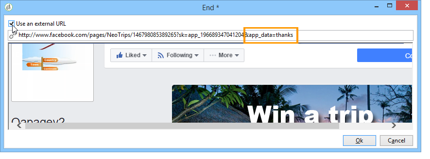
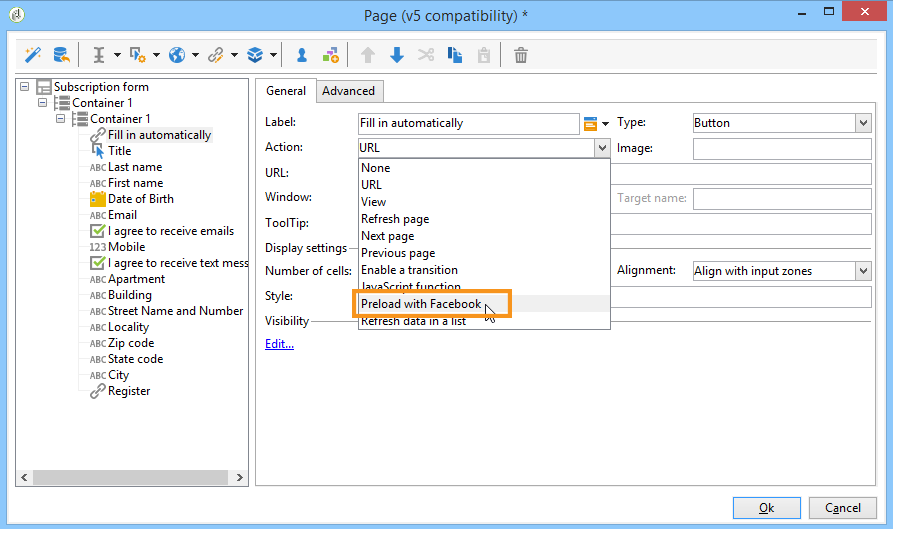

# Facebook 應用程式範例{#examples-of-facebook-apps}

當用戶按一下Facebook應用程式的頁籤時，該頁籤顯示在810像素寬的空間中。 Adobe Campaign使用Facebook類型的web應用程式來定義和個性化Facebook應用程式中顯示的內容，因此更容易獲取配置檔案。

>[!NOTE]
>
>還可以將Adobe Campaign與合作夥伴開發的Facebook應用程式相結合。 在這種情況下，不需要使用Adobe CampaignWeb應用程式來獲取Facebook配置檔案。 有關此內容的詳細資訊，請參閱 [配置外部帳戶](../../social/using/creating-a-facebook-application.md#configuring-external-accounts)。

>[!IMPORTANT]
>
>請遵守中介紹的配置步驟 [建立Facebook應用程式](../../social/using/creating-a-facebook-application.md)。

>[!NOTE]
>
>本節詳細介紹連結到Facebook類型Web應用程式的元素。 與標準Web應用程式共用的所有元素在 [此部分](../../web/using/about-web-applications.md)。

此處詳細介紹的Facebook類型Web應用程式示例包括：

* 如何按7個步驟建立Facebook應用程式。 請參閱 [快速啟動：按7個步驟建立Facebook應用程式](#quick-start--creating-a-facebook-application-in-7-steps)。
* 如何將設定轉發到Facebook應用程式。 請參閱 [如何將設定轉發到Facebook應用程式？](#how-to-forward-settings-to-a-facebook-application-)。
* 如何獲取風扇資料。 請參閱 [如何獲取風扇資料？](#how-to-acquire-fan-data-)。

>[!IMPORTANT]
>
>這些簡單的使用實例說明了Facebook型Web應用的功能。

## 建議 {#recommendations}

以下限制直接與Facebook有關：

* 必須使用HTTPS構建所有Web應用程式。
* 通過頁籤顯示的Facebook應用程式的寬度為810像素。

## 快速啟動：按7個步驟建立Facebook應用程式 {#quick-start--creating-a-facebook-application-in-7-steps}

此示例提供了如何在Facebook顯示Adobe Campaign構建的應用程式的逐步過程。 在這種情況下，我們要建立一個應用程式，它允許您 **歡迎** 當用戶按一下應用程式頁籤(**App01**)。

要建立此應用程式，請應用以下步驟：

1. 在Facebook建立應用程式( [https://developers.facebook.com/apps](https://developers.facebook.com/apps))。

   

1. 建立 **[!UICONTROL Facebook Connect]** 鍵入外部帳戶並輸入Facebook應用程式的參數。 有關詳細資訊，請參閱： [配置外部帳戶](../../social/using/creating-a-facebook-application.md#configuring-external-accounts)。

   

1. 輸入 **[!UICONTROL Terms of service]** 和 **[!UICONTROL Privacy policy]** 將在Facebook權限請求螢幕上顯示的連結。 有關詳細資訊，請參閱： [輸入服務條款和隱私策略連結](../../social/using/creating-a-facebook-application.md#entering-the-terms-of-service-and-privacy-policy-links)。

   

1. 在Adobe Campaign建立Facebook類型Web應用程式。 有關詳細資訊，請參閱： [建立Facebook類型Web應用程式](../../social/using/creating-a-facebook-application.md#creating-a-facebook-type-web-application)。

   

1. 編輯Web應用程式。 在此示例中，我們添加了 **[!UICONTROL Page]** 定義了一個標題。

   

1. 部署應用程式。

   

1. 配置您的Facebook應用程式，使其顯示為您的Facebook頁面上的頁籤。 有關詳細資訊，請參閱： [配置Facebook頁籤](../../social/using/creating-a-facebook-application.md#configuring-facebook-tabs)。

   

檢查 **App01** 應用程式顯示在您的Facebook頁面上。 按一下它應調用 **歡迎** 。

## 如何將設定轉發到Facebook應用程式？ {#how-to-forward-settings-to-a-facebook-application-}

>[!IMPORTANT]
>
>遵守中詳細介紹的配置步驟 [建立Facebook應用程式](../../social/using/creating-a-facebook-application.md)。

在示例1中，我們根據Facebook頁中的值對顯示進行個性化 **[!UICONTROL Fan of the page]** 的子菜單。 也可以處理 **[!UICONTROL Application settings]** 的子菜單。 此欄位允許您通過Facebook恢復由Adobe Campaign生成的連結中包含的資料。

讓我們舉一個公司決定發送電子郵件促銷活動的例子。 在交付中，指向Facebook應用程式的連結。 此連結因 **[!UICONTROL app_data]** 在URL末尾添加的參數。 此參數的值可以是反映客戶重要性的指標。 在我們的例子中， **[!UICONTROL app_data]** 參數 **[!UICONTROL big]** （主要客戶）及 **[!UICONTROL small]** （較不重要的客戶）。

一旦個性化，URL將如下所示：

* `http://<path of the Facebook application>&app_data=big` （就重要客戶而言）
* `http://<path of the Facebook application>&app_data=small` （對於不太重要的客戶）

在Facebook轉給Adobe Campaign的匿名資料中， **[!UICONTROL Application parameters]** 欄位被收集，從而使Adobe Campaign能夠基於此參數個性化應用程式顯示。

如果用戶是重要客戶( **[!UICONTROL app_data]** 參數 **[!UICONTROL big]**)，顯示以下影像：

如果用戶不是重要客戶( **[!UICONTROL app_data]** 參數 **[!UICONTROL small]**)，顯示以下影像：

要重新建立此使用情形，我們建立了由下列元素組成的Web應用程式：

* A **[!UICONTROL Test]** 基於 **[!UICONTROL Application parameter]** 的子菜單。
* 包含要根據 **[!UICONTROL Application parameter]** 的子菜單。

## 如何獲取風扇資料？ {#how-to-acquire-fan-data-}

>[!IMPORTANT]
>
>遵守中詳細介紹的配置步驟 [建立Facebook應用程式](../../social/using/creating-a-facebook-application.md)。

此示例說明如何與Facebook用戶聯繫，並為他們提供共用個人資料資訊的服務。 讓我們舉一個公司希望收購潛在客戶，並在其Facebook頁面上組織競爭來吸引他們的例子。

只要用戶按一下 **[!UICONTROL App03]** 頁籤，我們詢問他們是否想參加比賽。

如果他們決定參加競賽，我們會為他們提供共用個人資料的資訊。

如果他們同意共用其資訊，將顯示以下螢幕。

要構建此使用情形，我們建立了一個包含以下元素的Web應用程式：

* **[!UICONTROL Test]** 活動
* 三頁
* 一個 **[!UICONTROL Access control]** 活動
* **[!UICONTROL Pre-loading]** 活動
* **[!UICONTROL Save]** 活動
* 一個 **[!UICONTROL End]** 活動

### Test活動 {#test-activity}

的 **[!UICONTROL Test]** 活動基於 **[!UICONTROL ID]** 和 **[!UICONTROL Application parameters]** 的子菜單。

它由三個分支組成：

* **[!UICONTROL identifier (UID) is empty]** :僅當用戶已同意共用其資訊時，標識符才由Facebook轉發。 第一個分支 **[!UICONTROL Test]** 活動允許您僅對從未輸入過（即ID為空的用戶）的用戶提供競爭。
* **[!UICONTROL application parameter equals 'thanks']** :為避免連結到Facebook的顯示錯誤，Web應用程式結束頁指向Facebook應用程式的URL, **[!UICONTROL app_data]** 參數已添加到使用 **[!UICONTROL thanks]** 值(有關詳細資訊，請參閱： [結束活動](#end-activity))。 第二個分支允許您查找用戶是否來自 **[!UICONTROL End]** 第一個分支的活動（並且剛剛進入競爭對手）以顯示感謝信。 有關使用其他URL參數的詳細資訊，請參閱： [如何將設定轉發到Facebook應用程式？](#how-to-forward-settings-to-a-facebook-application-)。
* **[!UICONTROL Default branch]** :如果用戶已在上一日期(應用程式參數與 **[!UICONTROL thanks]**)，我們將顯示一個頁面，說明他們已經輸入。

### 競爭頁面 {#competition-page}

要避開連結到Facebook的顯示錯誤，還需要選擇 **[!UICONTROL Parent window]** 或 **[!UICONTROL In the top window]** 的 **[!UICONTROL Window]** 的子菜單。

### 訪問控制活動 {#access-control-activity}

的 **[!UICONTROL Access control]** 「活動」(Activity)，用於在用戶進入競爭時顯示「Facebook權限請求」頁。 如果他們同意共用其資訊，則在預載入期間將恢復該資訊。 有關詳細資訊，請參閱： [預載入活動](#pre-loading-activity)。

如果您以前在建立Web應用程式時輸入了外部帳戶(請參閱 [建立Facebook類型Web應用程式](../../social/using/creating-a-facebook-application.md#creating-a-facebook-type-web-application))，您無需編輯活動。 否則，轉到 **[!UICONTROL Application]** 欄位，然後選擇連結到Facebook應用程式的外部帳戶。

### 預載入活動 {#pre-loading-activity}

選擇要用於預載入的資料源：

* **[!UICONTROL Marketing database]** :此選項允許您通過Adobe Campaign資料庫預載入資料。
* **[!UICONTROL Facebook]** :此選項允許您使用Facebook預載入資料。

**營銷資料庫**

此選項允許您恢復訪問者表中存在的配置檔案的資料。 驗證基於用戶按一下「Facebook應用程式」頁籤時恢復的外部FacebookID執行。 如果在 **[!UICONTROL Pre-loading]** activity，預載入資料庫中包含資訊的欄位。

>[!NOTE]
>
>有關通過Adobe Campaign資料庫預載入資料的詳細資訊，請參閱 [此部分](../../web/using/publishing-a-web-form.md#pre-loading-the-form-data)。

**Facebook**

此選項允許您定義要收集的Facebook配置檔案資訊，其中用戶同意共用，以便保存它。

的 **[!UICONTROL Database information]** 選項，您可以收集以下資料：

* **[!UICONTROL External ID]**:用戶ID
* **[!UICONTROL Gender]**:用戶性別
* **[!UICONTROL Verified]** :此欄位指定用戶是否具有驗證的Facebook帳戶。
* **[!UICONTROL Full name]**:用戶的全名
* **[!UICONTROL First name]**:用戶名
* **[!UICONTROL Last name]**:用戶姓
* **[!UICONTROL Language]**:用戶語言

您還可以通過選中相應的框來決定收集個人資料照片、好友清單、電子郵件地址、出生日期、興趣和地點。

在按一下之前 **[!UICONTROL Ok]**，則選中 **[!UICONTROL I agree to comply with Facebook conditions of use]** 框。

>[!NOTE]
>
>如果選中 **[!UICONTROL Private information]** 部分，Facebook權限請求螢幕將自動顯示對此資料的訪問請求。
>
>要收集所選資訊，用戶必須同意共用它。
>
>如果要兩種預裝載類型(通過Adobe Campaign和Facebook)，則會先後添加兩個預裝載框。

### 保存活動 {#save-activity}

的 **[!UICONTROL Save]** 活動允許您在訪問者表中儲存在前幾個階段收集的資訊。

如果訪問者表中已存在配置檔案，則使用收集的新資料更新其資料。

如果資料庫中不存在配置檔案，並且已收集到Facebook用戶的電子郵件地址，則會在訪問者表中建立訪問者。

1. 在 **[!UICONTROL Visitor creation folder]** 欄位中，選擇將在中建立配置檔案的資料夾。 對於Facebook類型的Web應用程式，預設建立資料夾為 **[!UICONTROL Visitors]**。
1. 在 **[!UICONTROL Reconciliation mode]** 欄位中，選擇要使用的協調模式：

   * **[!UICONTROL Automatic]** :對帳是根據電子郵件、姓氏、名字和出生日期進行的。
   * **[!UICONTROL Manual]** :請選擇一個或多個協調密鑰。
   * **[!UICONTROL None]** :不會進行和解。

1. 在 **[!UICONTROL Mapping]** 欄位中，選擇要執行協調的方案。

   >[!IMPORTANT]
   >
   >確保 **[!UICONTROL Social networks]** 頁籤 通過 **[!UICONTROL Administration > Campaign management > Target mappings]** 的下界。

1. 您可以選擇用於協調的搜索資料夾和用於新配置檔案的建立資料夾。 如果欄位為空，則在映射架構的預設資料夾中搜索並建立配置檔案。

### 結束活動 {#end-activity}

要避開連結到Facebook的顯示錯誤，您需要檢查 **[!UICONTROL Use an external URL]** 框，然後輸入Facebook應用程式的URL, **[!UICONTROL app_data]** 參數和值。 此值將用於 **[!UICONTROL Test]** 活動：檢測用戶是否剛進入競爭對手，並顯示感謝消息（如果適用）。 有關詳細資訊，請參閱： [Test活動](#test-activity)。

在本例中，所用值 **謝謝**。

### 訪問者的詳細資訊螢幕 {#details-screen-of-a-visitor}

就像Twitter的追隨者一樣(請參閱： [工作原理](../../social/using/publishing-on-twitter.md#operating-principle))，恢復的Facebook配置檔案儲存在訪客表中。 要顯示訪問者清單，請轉到 **[!UICONTROL Profiles and Targets > Visitors]** 的下界。

每個同意分享個人資料資訊的Facebook潛在客戶都會被添加到訪問者名單中。 如果 **[!UICONTROL Friends]** 的子菜單。 **[!UICONTROL Pre-load]** 活動(請參閱： [預載入活動](#pre-loading-activity))，也添加朋友。

在 **[!UICONTROL Summary]** 訪問者詳細資訊窗口部分，有兩種可能的狀態 **[!UICONTROL New Contact]** 指標：

如果顯示綠色複選標籤，則表示訪問者未與任何收件人協調。 在這種情況下，將在收件人清單中建立新的配置檔案。

紅十字表示訪客與接受者和解。 可按一下右側的放大鏡 **[!UICONTROL Recipient]** 欄位以顯示匹配的收件人。

轉至收件人的詳細資訊窗口以顯示匹配的訪問者（如果適用）。 選擇 **[!UICONTROL Others]** ，然後按兩下 **[!UICONTROL Web identities]** 的子菜單。

的 **[!UICONTROL Activities]** 訪問者詳細資訊頁面的螢幕包含以下資訊：

* 「開啟圖形」類型風扇活動：播放的音樂、觀看的視頻、閱讀的文章和推測安裝的應用程式（Deezer、Spotify、Dailymotion、Yahoo News等）

   

* 「贊」和風扇在Adobe Campaign發送後添加的評論
* 風扇喜歡的頁面
* 風扇的登記

   

   >[!NOTE]
   >
   >為了讓Adobe Campaign收集風扇的簽入，您需要按一下 **[!UICONTROL Subscribe]** 按鈕。 有關此內容的詳細資訊，請參閱 [配置外部帳戶](../../social/using/creating-a-facebook-application.md#configuring-external-accounts)。

## 如何使用Facebook配置檔案資料預載入表單 {#how-to-pre-load-the-fields-of-a-form-using-facebook-profile-data}

的 **[!UICONTROL Social Marketing]** 應用程式還允許您向表單中添加按鈕，以使用Facebook配置檔案資訊預載入欄位。 此選項可用於所有Web應用程式模板(**[!UICONTROL Page]** 類型活動)的詳細資訊 [此部分](../../web/using/static-elements-in-a-web-form.md#inserting-html-content)。

>[!NOTE]
>
>在開始使用此函式之前，您需要建立一個Facebook應用程式和 **[!UICONTROL Facebook Connect]** 鍵入外部帳戶。 有關此內容的詳細資訊，請參閱 [配置外部帳戶](../../social/using/creating-a-facebook-application.md#configuring-external-accounts)。

**用從Facebook剖面中獲取的資料預載入表單域**

建立一個Web表單，並在表單的頁面中包含用戶沒有交互的元素；這些是靜態元素，如影像、HTML內容、水準條或超文本連結。 瞭解有關Web窗體中靜態元素的詳細資訊 [此頁](../../web/using/static-elements-in-a-web-form.md)。

插入靜態元素時， **[!UICONTROL Preload with Facebook]** 選項，可以在窗體中插入按鈕，以使用Facebook配置檔案資訊預載入欄位。

當用戶按一下 **[!UICONTROL Fill in automatically]** 按鈕。

>[!NOTE]
>
>配置外部帳戶時，可以更改擴展權限清單。 如果未配置擴展權限，則預設情況下，Facebook轉發基本配置檔案資訊。\
>要查看擴展權限清單及其語法， [參閱Facebook文檔](https://developers.facebook.com/docs/reference/api/permissions)。

如果用戶同意共用其資訊，則預載表單的欄位。

對於此用例，我們建立了由下列元素組成的Web應用程式：

* 包含表單的頁
* **[!UICONTROL Record]** 活動
* 一個 **[!UICONTROL End]** 活動

要添加預載入按鈕，請應用以下步驟：

1. 建立窗體。

   

1. 轉到與表單中的欄位相同的級別並添加連結。

   

1. 輸入標籤並選擇 **[!UICONTROL Button]** 的雙曲餘切值。

   

1. 轉到 **[!UICONTROL Action]** 選擇 **[!UICONTROL Preload with Facebook]**。

   

1. 轉到 **[!UICONTROL Application]** ，然後選擇 **[!UICONTROL Facebook Connect]** 鍵入以前建立的外部帳戶。 如需詳細資訊，請參閱[此頁面](../../social/using/creating-a-facebook-application.md#configuring-external-accounts)。

   

